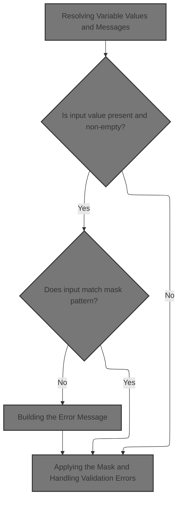
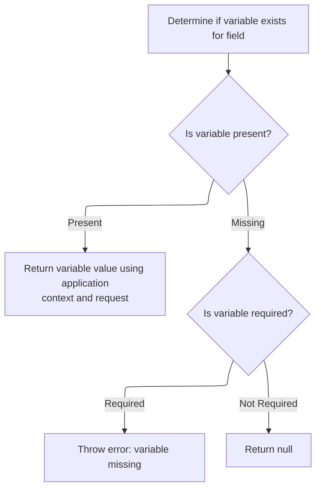
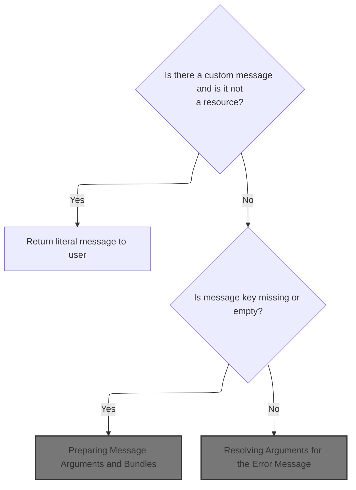
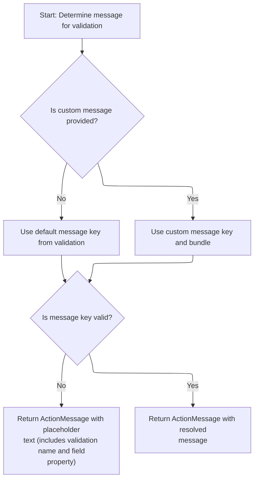
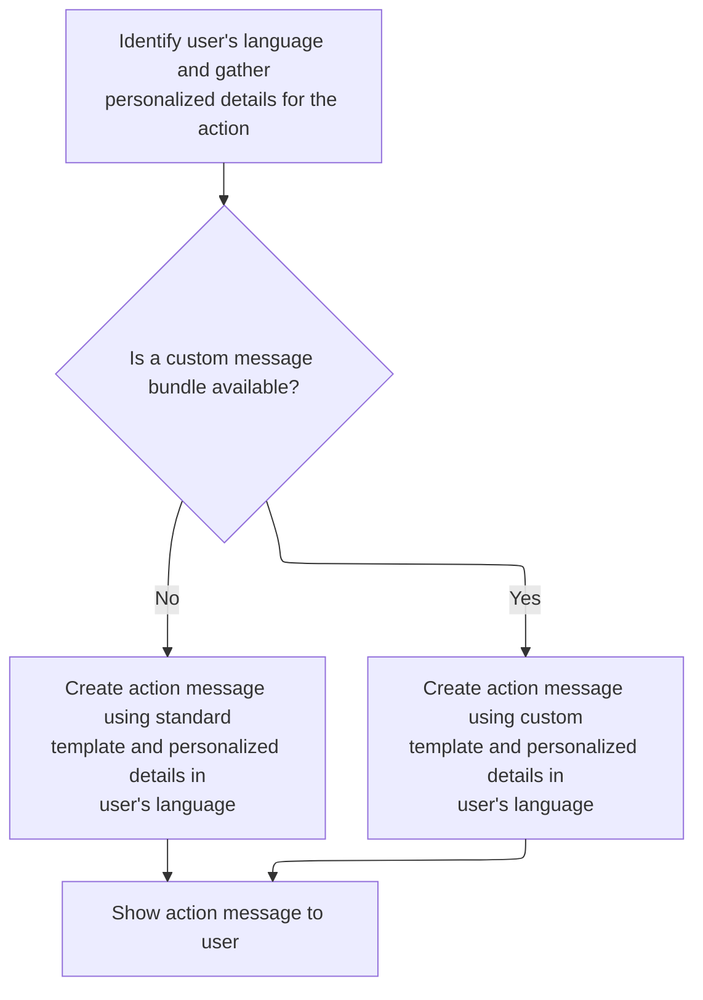

This document describes how user input is validated against a configurable mask pattern as part of the input validation system. The process ensures that values entered by users, such as phone numbers or postal codes, match expected formats. If validation fails, a localized error message is generated to guide the user.

# Validating Input Against a Mask



<SwmSnippet path="/core/src/main/java/org/apache/struts/validator/FieldChecks.java" line="270">

---

In <SwmToken path="core/src/main/java/org/apache/struts/validator/FieldChecks.java" pos="270:7:7" line-data="    public static boolean validateMask(Object bean, ValidatorAction va,">`validateMask`</SwmToken>, we're grabbing the value to validate and then fetching the mask pattern using <SwmToken path="core/src/main/java/org/apache/struts/validator/FieldChecks.java" pos="279:1:3" line-data="                Resources.getVarValue(&quot;mask&quot;, field, validator, request, true);">`Resources.getVarValue`</SwmToken>. This lets us use a configurable mask for validation, so the logic isn't tied to a single pattern. Next, we call Resources to resolve the mask, which could depend on field settings, validator config, or even locale.

```java
    public static boolean validateMask(Object bean, ValidatorAction va,
        Field field, ActionMessages errors, Validator validator,
        HttpServletRequest request) {
        String value = null;

        try {
            value = evaluateBean(bean, field);

            String mask =
                Resources.getVarValue("mask", field, validator, request, true);

```

---

</SwmSnippet>

## Resolving Variable Values and Messages



<SwmSnippet path="/core/src/main/java/org/apache/struts/validator/Resources.java" line="157">

---

In <SwmToken path="core/src/main/java/org/apache/struts/validator/Resources.java" pos="157:7:7" line-data="    public static String getVarValue(String varName, Field field,">`getVarValue`</SwmToken>, we check if the variable exists in the field. If it's missing, we use <SwmToken path="core/src/main/java/org/apache/struts/util/PropertyMessageResources.java" pos="82:8:8" line-data=" * Configure &lt;code&gt;PropertyMessageResources&lt;/code&gt; to operate in this mode by">`PropertyMessageResources`</SwmToken> to fetch a formatted error message, which handles localization and fallback logic. This ensures error reporting is consistent and localized.

```java
    public static String getVarValue(String varName, Field field,
        Validator validator, HttpServletRequest request, boolean required) {
        Var var = field.getVar(varName);

        if (var == null) {
            String msg = sysmsgs.getMessage("variable.missing", varName);

```

---

</SwmSnippet>

<SwmSnippet path="/core/src/main/java/org/apache/struts/util/PropertyMessageResources.java" line="227">

---

<SwmToken path="core/src/main/java/org/apache/struts/util/PropertyMessageResources.java" pos="227:5:5" line-data="    public String getMessage(Locale locale, String key) {">`getMessage`</SwmToken> handles message lookup with fallback logic based on the mode. It tries the requested locale, then falls back to default locale or properties file depending on mode. This lets the app support JSTL, resource bundle hierarchies, and legacy behavior, so messages are resolved flexibly.

```java
    public String getMessage(Locale locale, String key) {
        if (log.isDebugEnabled()) {
            log.debug("getMessage(" + locale + "," + key + ")");
        }

        // Initialize variables we will require
        String localeKey = localeKey(locale);
        String originalKey = messageKey(localeKey, key);
        String message = null;

        // Search the specified Locale
        message = findMessage(locale, key, originalKey);
        if (message != null) {
            return message;
        }

        // JSTL Compatibility - JSTL doesn't use the default locale
        if (mode == MODE_JSTL) {

           // do nothing (i.e. don't use default Locale)

        // PropertyResourcesBundle - searches through the hierarchy
        // for the default Locale (e.g. first en_US then en)
        } else if (mode == MODE_RESOURCE_BUNDLE) {

            if (!defaultLocale.equals(locale)) {
                message = findMessage(defaultLocale, key, originalKey);
            }

        // Default (backwards) Compatibility - just searches the
        // specified Locale (e.g. just en_US)
        } else {

            if (!defaultLocale.equals(locale)) {
                localeKey = localeKey(defaultLocale);
                message = findMessage(localeKey, key, originalKey);
            }

        }
        if (message != null) {
            return message;
        }

        // Find the message in the default properties file
        message = findMessage("", key, originalKey);
        if (message != null) {
            return message;
        }

        // Return an appropriate error indication
        if (returnNull) {
            return (null);
        } else {
            return ("???" + messageKey(locale, key) + "???");
        }
    }
```

---

</SwmSnippet>

<SwmSnippet path="/core/src/main/java/org/apache/struts/validator/Resources.java" line="164">

---

Back in <SwmToken path="core/src/main/java/org/apache/struts/validator/Resources.java" pos="178:3:3" line-data="        return getVarValue(var, application, request, required);">`getVarValue`</SwmToken>, after fetching the error message from <SwmToken path="core/src/main/java/org/apache/struts/util/PropertyMessageResources.java" pos="82:8:8" line-data=" * Configure &lt;code&gt;PropertyMessageResources&lt;/code&gt; to operate in this mode by">`PropertyMessageResources`</SwmToken>, we either throw an exception or log and return null if the variable is missing. This lets the caller handle missing variables based on context.

```java
            if (required) {
                throw new IllegalArgumentException(msg);
            }

            if (log.isDebugEnabled()) {
                log.debug(field.getProperty() + ": " + msg);
            }

            return null;
        }

        ServletContext application =
            (ServletContext) validator.getParameterValue(SERVLET_CONTEXT_PARAM);

        return getVarValue(var, application, request, required);
    }
```

---

</SwmSnippet>

## Applying the Mask and Handling Validation Errors

<SwmSnippet path="/core/src/main/java/org/apache/struts/validator/FieldChecks.java" line="281">

---

Back in <SwmToken path="core/src/main/java/org/apache/struts/validator/FieldChecks.java" pos="270:7:7" line-data="    public static boolean validateMask(Object bean, ValidatorAction va,">`validateMask`</SwmToken>, after getting the mask from Resources, we check if the value matches the mask. If not, we add a localized error message using <SwmToken path="core/src/main/java/org/apache/struts/validator/FieldChecks.java" pos="284:1:3" line-data="                    Resources.getActionMessage(validator, request, va, field));">`Resources.getActionMessage`</SwmToken>, so users see a relevant error.

```java
            if (value != null && value.length()>0
                && !GenericValidator.matchRegexp(value, mask)) {
                errors.add(field.getKey(),
                    Resources.getActionMessage(validator, request, va, field));

                return false;
            } else {
                return true;
            }
```

---

</SwmSnippet>

## Building the Error Message



<SwmSnippet path="/core/src/main/java/org/apache/struts/validator/Resources.java" line="365">

---

In <SwmToken path="core/src/main/java/org/apache/struts/validator/Resources.java" pos="365:7:7" line-data="    public static ActionMessage getActionMessage(Validator validator,">`getActionMessage`</SwmToken>, we check if the message is a resource. If it is, we call <SwmToken path="core/src/main/java/org/apache/struts/config/ConfigHelper.java" pos="56:4:4" line-data="public class ConfigHelper implements ConfigHelperInterface {">`ConfigHelper`</SwmToken> to resolve it, which handles localization and bundle lookup. This ensures the error message is user-friendly and context-aware.

```java
    public static ActionMessage getActionMessage(Validator validator,
        HttpServletRequest request, ValidatorAction va, Field field) {
        Msg msg = field.getMessage(va.getName());

        if ((msg != null) && !msg.isResource()) {
            return new ActionMessage(msg.getKey(), false);
        }

```

---

</SwmSnippet>

### Fetching Localized Messages

<SwmSnippet path="/core/src/main/java/org/apache/struts/config/ConfigHelper.java" line="496">

---

In <SwmToken path="core/src/main/java/org/apache/struts/config/ConfigHelper.java" pos="496:5:5" line-data="    public String getMessage(String key) {">`getMessage`</SwmToken>, we grab <SwmToken path="core/src/main/java/org/apache/struts/config/ConfigHelper.java" pos="497:1:1" line-data="        MessageResources resources = getMessageResources();">`MessageResources`</SwmToken> and then use <SwmToken path="core/src/main/java/org/apache/struts/config/ConfigHelper.java" pos="503:7:9" line-data="        return resources.getMessage(RequestUtils.getUserLocale(request, null),">`RequestUtils.getUserLocale`</SwmToken> to figure out which locale to use for message lookup. This makes sure the message is localized for the user.

```java
    public String getMessage(String key) {
        MessageResources resources = getMessageResources();

        if (resources == null) {
            return null;
        }

        return resources.getMessage(RequestUtils.getUserLocale(request, null),
```

---

</SwmSnippet>

<SwmSnippet path="/core/src/main/java/org/apache/struts/util/RequestUtils.java" line="299">

---

<SwmToken path="core/src/main/java/org/apache/struts/util/RequestUtils.java" pos="299:7:7" line-data="    public static Locale getUserLocale(HttpServletRequest request, String locale) {">`getUserLocale`</SwmToken> checks the session for a locale using a key, defaults to <SwmToken path="core/src/main/java/org/apache/struts/util/RequestUtils.java" pos="304:5:7" line-data="            locale = Globals.LOCALE_KEY;">`Globals.LOCALE_KEY`</SwmToken> if none is given, and falls back to <SwmToken path="core/src/main/java/org/apache/struts/util/RequestUtils.java" pos="314:5:7" line-data="            userLocale = request.getLocale();">`request.getLocale`</SwmToken> if nothing is found. This covers both user-specific and browser-based locale settings.

```java
    public static Locale getUserLocale(HttpServletRequest request, String locale) {
        Locale userLocale = null;
        HttpSession session = request.getSession(false);

        if (locale == null) {
            locale = Globals.LOCALE_KEY;
        }

        // Only check session if sessions are enabled
        if (session != null) {
            userLocale = (Locale) session.getAttribute(locale);
        }

        if (userLocale == null) {
            // Returns Locale based on Accept-Language header or the server default
            userLocale = request.getLocale();
        }

        return userLocale;
    }
```

---

</SwmSnippet>

<SwmSnippet path="/core/src/main/java/org/apache/struts/config/ConfigHelper.java" line="503">

---

Back in <SwmToken path="core/src/main/java/org/apache/struts/config/ConfigHelper.java" pos="503:5:5" line-data="        return resources.getMessage(RequestUtils.getUserLocale(request, null),">`getMessage`</SwmToken> (<SwmToken path="core/src/main/java/org/apache/struts/config/ConfigHelper.java" pos="56:4:4" line-data="public class ConfigHelper implements ConfigHelperInterface {">`ConfigHelper`</SwmToken>), after getting the user's locale, we fetch the message from <SwmToken path="core/src/main/java/org/apache/struts/validator/Resources.java" pos="117:5:5" line-data="    public static MessageResources getMessageResources(">`MessageResources`</SwmToken>. If it's not found, we return null. Next, we call Resources to handle message formatting and argument substitution.

```java
        return resources.getMessage(RequestUtils.getUserLocale(request, null),
            key);
    }
```

---

</SwmSnippet>

<SwmSnippet path="/core/src/main/java/org/apache/struts/validator/Resources.java" line="249">

---

<SwmToken path="core/src/main/java/org/apache/struts/validator/Resources.java" pos="249:7:7" line-data="    public static String getMessage(HttpServletRequest request, String key) {">`getMessage`</SwmToken> grabs <SwmToken path="core/src/main/java/org/apache/struts/validator/Resources.java" pos="250:1:1" line-data="        MessageResources messages = getMessageResources(request);">`MessageResources`</SwmToken> from the request and uses <SwmToken path="core/src/main/java/org/apache/struts/validator/Resources.java" pos="252:8:10" line-data="        return getMessage(messages, RequestUtils.getUserLocale(request, null),">`RequestUtils.getUserLocale`</SwmToken> to get the user's locale. This makes sure the message is localized for whoever's using the app.

```java
    public static String getMessage(HttpServletRequest request, String key) {
        MessageResources messages = getMessageResources(request);

        return getMessage(messages, RequestUtils.getUserLocale(request, null),
            key);
    }
```

---

</SwmSnippet>

### Preparing Message Arguments and Bundles



<SwmSnippet path="/core/src/main/java/org/apache/struts/validator/Resources.java" line="373">

---

Back in <SwmToken path="core/src/main/java/org/apache/struts/validator/FieldChecks.java" pos="284:3:3" line-data="                    Resources.getActionMessage(validator, request, va, field));">`getActionMessage`</SwmToken>, after resolving the message key and bundle, we fetch <SwmToken path="core/src/main/java/org/apache/struts/validator/Resources.java" pos="390:1:1" line-data="        MessageResources messages =">`MessageResources`</SwmToken> using the bundle. If <SwmToken path="core/src/main/java/org/apache/struts/validator/Resources.java" pos="373:3:3" line-data="        String msgKey = null;">`msgKey`</SwmToken> is missing, we return a formatted error message. Next, we need <SwmToken path="core/src/main/java/org/apache/struts/validator/Resources.java" pos="390:1:1" line-data="        MessageResources messages =">`MessageResources`</SwmToken> for argument substitution and localization.

```java
        String msgKey = null;
        String msgBundle = null;

        if (msg == null) {
            msgKey = va.getMsg();
        } else {
            msgKey = msg.getKey();
            msgBundle = msg.getBundle();
        }

        if ((msgKey == null) || (msgKey.length() == 0)) {
            return new ActionMessage("??? " + va.getName() + "."
                + field.getProperty() + " ???", false);
        }

        ServletContext application =
            (ServletContext) validator.getParameterValue(SERVLET_CONTEXT_PARAM);
        MessageResources messages =
            getMessageResources(application, request, msgBundle);
```

---

</SwmSnippet>

### Locating the Correct Message Bundle

```mermaid
%%{init: {"flowchart": {"defaultRenderer": "elk"}} }%%
flowchart TD
    node1["Start: Retrieve message resources for
bundle"] --> node2["Set bundle (provided or default)"]
    click node1 openCode "core/src/main/java/org/apache/struts/validator/Resources.java:117:118"
    click node2 openCode "core/src/main/java/org/apache/struts/validator/Resources.java:119:121"
    node2 --> node3["Check request for resources"]
    click node3 openCode "core/src/main/java/org/apache/struts/validator/Resources.java:123:124"
    node3 --> node4{"Resources found in request?"}
    click node4 openCode "core/src/main/java/org/apache/struts/validator/Resources.java:124:125"
    node4 -->|"Yes"| node8["Return resources"]
    click node8 openCode "core/src/main/java/org/apache/struts/validator/Resources.java:144:145"
    node4 -->|"No"| node5["Check application context for resources
with module prefix"]
    click node5 openCode "core/src/main/java/org/apache/struts/validator/Resources.java:127:132"
    node5 --> node6{"Resources found in application context?"}
    click node6 openCode "core/src/main/java/org/apache/struts/validator/Resources.java:130:133"
    node6 -->|"Yes"| node8
    node6 -->|"No"| node7["Check application context for resources
with default bundle"]
    click node7 openCode "core/src/main/java/org/apache/struts/validator/Resources.java:135:136"
    node7 --> node9{"Resources found in application context?"}
    click node9 openCode "core/src/main/java/org/apache/struts/validator/Resources.java:139:142"
    node9 -->|"Yes"| node8
    node9 -->|"No"| node10["Throw error: No message resources found"]
    click node10 openCode "core/src/main/java/org/apache/struts/validator/Resources.java:140:142"
classDef HeadingStyle fill:#777777,stroke:#333,stroke-width:2px;

%% Swimm:
%% %%{init: {"flowchart": {"defaultRenderer": "elk"}} }%%
%% flowchart TD
%%     node1["Start: Retrieve message resources for
%% bundle"] --> node2["Set bundle (provided or default)"]
%%     click node1 openCode "<SwmPath>[core/…/validator/Resources.java](core/src/main/java/org/apache/struts/validator/Resources.java)</SwmPath>:117:118"
%%     click node2 openCode "<SwmPath>[core/…/validator/Resources.java](core/src/main/java/org/apache/struts/validator/Resources.java)</SwmPath>:119:121"
%%     node2 --> node3["Check request for resources"]
%%     click node3 openCode "<SwmPath>[core/…/validator/Resources.java](core/src/main/java/org/apache/struts/validator/Resources.java)</SwmPath>:123:124"
%%     node3 --> node4{"Resources found in request?"}
%%     click node4 openCode "<SwmPath>[core/…/validator/Resources.java](core/src/main/java/org/apache/struts/validator/Resources.java)</SwmPath>:124:125"
%%     node4 -->|"Yes"| node8["Return resources"]
%%     click node8 openCode "<SwmPath>[core/…/validator/Resources.java](core/src/main/java/org/apache/struts/validator/Resources.java)</SwmPath>:144:145"
%%     node4 -->|"No"| node5["Check application context for resources
%% with module prefix"]
%%     click node5 openCode "<SwmPath>[core/…/validator/Resources.java](core/src/main/java/org/apache/struts/validator/Resources.java)</SwmPath>:127:132"
%%     node5 --> node6{"Resources found in application context?"}
%%     click node6 openCode "<SwmPath>[core/…/validator/Resources.java](core/src/main/java/org/apache/struts/validator/Resources.java)</SwmPath>:130:133"
%%     node6 -->|"Yes"| node8
%%     node6 -->|"No"| node7["Check application context for resources
%% with default bundle"]
%%     click node7 openCode "<SwmPath>[core/…/validator/Resources.java](core/src/main/java/org/apache/struts/validator/Resources.java)</SwmPath>:135:136"
%%     node7 --> node9{"Resources found in application context?"}
%%     click node9 openCode "<SwmPath>[core/…/validator/Resources.java](core/src/main/java/org/apache/struts/validator/Resources.java)</SwmPath>:139:142"
%%     node9 -->|"Yes"| node8
%%     node9 -->|"No"| node10["Throw error: No message resources found"]
%%     click node10 openCode "<SwmPath>[core/…/validator/Resources.java](core/src/main/java/org/apache/struts/validator/Resources.java)</SwmPath>:140:142"
%% classDef HeadingStyle fill:#777777,stroke:#333,stroke-width:2px;
```



<SwmSnippet path="/core/src/main/java/org/apache/struts/validator/Resources.java" line="117">

---

<SwmToken path="core/src/main/java/org/apache/struts/validator/Resources.java" pos="117:7:7" line-data="    public static MessageResources getMessageResources(">`getMessageResources`</SwmToken> tries to fetch the bundle from the request, then from the application using a module prefix, then just the bundle name. If none are found, it throws. We call <SwmToken path="core/src/main/java/org/apache/struts/validator/Resources.java" pos="128:1:1" line-data="                ModuleUtils.getInstance().getModuleConfig(request, application);">`ModuleUtils`</SwmToken> to get the module config and prefix, which is needed for modular setups.

```java
    public static MessageResources getMessageResources(
        ServletContext application, HttpServletRequest request, String bundle) {
        if (bundle == null) {
            bundle = Globals.MESSAGES_KEY;
        }

        MessageResources resources =
            (MessageResources) request.getAttribute(bundle);

        if (resources == null) {
            ModuleConfig moduleConfig =
                ModuleUtils.getInstance().getModuleConfig(request, application);

            resources =
                (MessageResources) application.getAttribute(bundle
                    + moduleConfig.getPrefix());
        }

```

---

</SwmSnippet>

<SwmSnippet path="/core/src/main/java/org/apache/struts/util/ModuleUtils.java" line="130">

---

<SwmToken path="core/src/main/java/org/apache/struts/util/ModuleUtils.java" pos="130:5:5" line-data="    public ModuleConfig getModuleConfig(HttpServletRequest request,">`getModuleConfig`</SwmToken> first checks the request for a <SwmToken path="core/src/main/java/org/apache/struts/util/ModuleUtils.java" pos="130:3:3" line-data="    public ModuleConfig getModuleConfig(HttpServletRequest request,">`ModuleConfig`</SwmToken>. If it's not there, it grabs the default from the context and sets it in the request. The empty string means default module, which is a repo-specific thing.

```java
    public ModuleConfig getModuleConfig(HttpServletRequest request,
        ServletContext context) {
        ModuleConfig moduleConfig = this.getModuleConfig(request);

        if (moduleConfig == null) {
            moduleConfig = this.getModuleConfig("", context);
            request.setAttribute(Globals.MODULE_KEY, moduleConfig);
        }

        return moduleConfig;
    }
```

---

</SwmSnippet>

<SwmSnippet path="/core/src/main/java/org/apache/struts/validator/Resources.java" line="135">

---

Back in <SwmToken path="core/src/main/java/org/apache/struts/validator/Resources.java" pos="117:7:7" line-data="    public static MessageResources getMessageResources(">`getMessageResources`</SwmToken>, after calling <SwmToken path="core/src/main/java/org/apache/struts/validator/Resources.java" pos="128:1:1" line-data="                ModuleUtils.getInstance().getModuleConfig(request, application);">`ModuleUtils`</SwmToken>, we try the bundle in the application context. If it's still not found, we throw. This fallback logic ensures we always try the most specific context first, then default.

```java
        if (resources == null) {
            resources = (MessageResources) application.getAttribute(bundle);
        }

        if (resources == null) {
            throw new NullPointerException(
                "No message resources found for bundle: " + bundle);
        }

        return resources;
    }
```

---

</SwmSnippet>

### Resolving Arguments for the Error Message



<SwmSnippet path="/core/src/main/java/org/apache/struts/validator/Resources.java" line="392">

---

Back in <SwmToken path="core/src/main/java/org/apache/struts/validator/FieldChecks.java" pos="284:3:3" line-data="                    Resources.getActionMessage(validator, request, va, field));">`getActionMessage`</SwmToken>, we grab the user's locale using <SwmToken path="core/src/main/java/org/apache/struts/validator/Resources.java" pos="392:7:7" line-data="        Locale locale = RequestUtils.getUserLocale(request, null);">`RequestUtils`</SwmToken>. This is needed to localize the arguments for the error message.

```java
        Locale locale = RequestUtils.getUserLocale(request, null);

```

---

</SwmSnippet>

<SwmSnippet path="/core/src/main/java/org/apache/struts/validator/Resources.java" line="394">

---

Back in <SwmToken path="core/src/main/java/org/apache/struts/validator/FieldChecks.java" pos="284:3:3" line-data="                    Resources.getActionMessage(validator, request, va, field));">`getActionMessage`</SwmToken>, after getting the locale, we fetch arguments from the field for the validator action. These are used to build a detailed error message.

```java
        Arg[] args = field.getArgs(va.getName());
```

---

</SwmSnippet>

<SwmSnippet path="/core/src/main/java/org/apache/struts/validator/Resources.java" line="420">

---

<SwmToken path="core/src/main/java/org/apache/struts/validator/Resources.java" pos="420:9:9" line-data="    public static String[] getArgs(String actionName,">`getArgs`</SwmToken> grabs up to four arguments from the field, checks if each is a resource, and fetches localized messages or uses the key directly. The fixed size and indexing are repo-specific quirks.

```java
    public static String[] getArgs(String actionName,
        MessageResources messages, Locale locale, Field field) {
        String[] argMessages = new String[4];

        Arg[] args =
            new Arg[] {
                field.getArg(actionName, 0), field.getArg(actionName, 1),
                field.getArg(actionName, 2), field.getArg(actionName, 3)
            };

        for (int i = 0; i < args.length; i++) {
            if (args[i] == null) {
                continue;
            }

            if (args[i].isResource()) {
                argMessages[i] = getMessage(messages, locale, args[i].getKey());
            } else {
                argMessages[i] = args[i].getKey();
            }
        }
```

---

</SwmSnippet>

<SwmSnippet path="/core/src/main/java/org/apache/struts/validator/Resources.java" line="395">

---

Back in <SwmToken path="core/src/main/java/org/apache/struts/validator/FieldChecks.java" pos="284:3:3" line-data="                    Resources.getActionMessage(validator, request, va, field));">`getActionMessage`</SwmToken>, after getting argument keys, we call <SwmToken path="core/src/main/java/org/apache/struts/validator/Resources.java" pos="396:1:1" line-data="            getArgValues(application, request, messages, locale, args);">`getArgValues`</SwmToken> to resolve their actual values, handling localization and bundle lookup if needed.

```java
        String[] argValues =
            getArgValues(application, request, messages, locale, args);

```

---

</SwmSnippet>

<SwmSnippet path="/core/src/main/java/org/apache/struts/validator/Resources.java" line="455">

---

<SwmToken path="core/src/main/java/org/apache/struts/validator/Resources.java" pos="455:9:9" line-data="    private static String[] getArgValues(ServletContext application,">`getArgValues`</SwmToken> loops through the arguments, checks if each is a resource, and fetches <SwmToken path="core/src/main/java/org/apache/struts/validator/Resources.java" pos="456:6:6" line-data="        HttpServletRequest request, MessageResources defaultMessages,">`MessageResources`</SwmToken> for the bundle if needed. Otherwise, it just uses the key. This handles localization for each argument.

```java
    private static String[] getArgValues(ServletContext application,
        HttpServletRequest request, MessageResources defaultMessages,
        Locale locale, Arg[] args) {
        if ((args == null) || (args.length == 0)) {
            return null;
        }

        String[] values = new String[args.length];

        for (int i = 0; i < args.length; i++) {
            if (args[i] != null) {
                if (args[i].isResource()) {
                    MessageResources messages = defaultMessages;

                    if (args[i].getBundle() != null) {
                        messages =
                            getMessageResources(application, request,
                                args[i].getBundle());
                    }

                    values[i] = messages.getMessage(locale, args[i].getKey());
                } else {
                    values[i] = args[i].getKey();
                }
            }
        }

        return values;
    }
```

---

</SwmSnippet>

<SwmSnippet path="/core/src/main/java/org/apache/struts/validator/Resources.java" line="398">

---

Back in <SwmToken path="core/src/main/java/org/apache/struts/validator/FieldChecks.java" pos="284:3:3" line-data="                    Resources.getActionMessage(validator, request, va, field));">`getActionMessage`</SwmToken>, after resolving argument values, we build the <SwmToken path="core/src/main/java/org/apache/struts/validator/Resources.java" pos="398:1:1" line-data="        ActionMessage actionMessage = null;">`ActionMessage`</SwmToken>. If <SwmToken path="core/src/main/java/org/apache/struts/validator/Resources.java" pos="400:4:4" line-data="        if (msgBundle == null) {">`msgBundle`</SwmToken> is null, we use the key and args; if not, we fetch the formatted message from the bundle. This covers both default and custom error messages.

```java
        ActionMessage actionMessage = null;

        if (msgBundle == null) {
            actionMessage = new ActionMessage(msgKey, argValues);
        } else {
            String message = messages.getMessage(locale, msgKey, argValues);

            actionMessage = new ActionMessage(message, false);
        }

        return actionMessage;
    }
```

---

</SwmSnippet>

## Handling Validation Failures

<SwmSnippet path="/core/src/main/java/org/apache/struts/validator/FieldChecks.java" line="290">

---

Back in <SwmToken path="core/src/main/java/org/apache/struts/validator/FieldChecks.java" pos="270:7:7" line-data="    public static boolean validateMask(Object bean, ValidatorAction va,">`validateMask`</SwmToken>, after calling Resources for error messages, we catch any exceptions and call <SwmToken path="core/src/main/java/org/apache/struts/validator/FieldChecks.java" pos="291:1:1" line-data="            processFailure(errors, field, validator.getFormName(), &quot;mask&quot;, e);">`processFailure`</SwmToken> to log and report the error. This ensures users get feedback even if something goes wrong.

```java
        } catch (Exception e) {
            processFailure(errors, field, validator.getFormName(), "mask", e);

            return false;
        }
    }
```

---

</SwmSnippet>

&nbsp;

*This is an auto-generated document by Swimm 🌊 and has not yet been verified by a human*

<SwmMeta version="3.0.0" repo-id="Z2l0aHViJTNBJTNBc3RydXRzMSUzQSUzQVN3aW1tLURlbW8=" repo-name="struts1"><sup>Powered by [Swimm](https://app.swimm.io/)</sup></SwmMeta>
