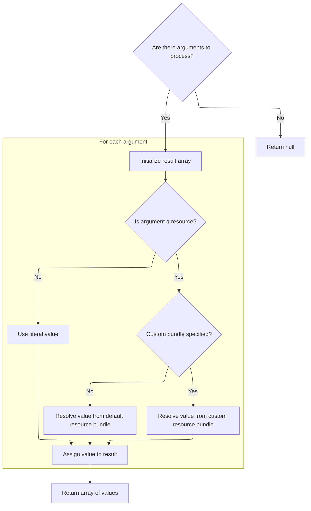

This document outlines how user input is checked against a configurable mask pattern. If the input does not match, a localized error message is generated to guide the user.

# Validating Input Against a Mask

<SwmSnippet path="/core/src/main/java/org/apache/struts/validator/FieldChecks.java" line="270">

---

In <SwmToken path="core/src/main/java/org/apache/struts/validator/FieldChecks.java" pos="270:7:7" line-data="    public static boolean validateMask(Object bean, ValidatorAction va,">`validateMask`</SwmToken>, we start by evaluating the bean and grabbing the mask pattern using <SwmToken path="core/src/main/java/org/apache/struts/validator/FieldChecks.java" pos="279:1:3" line-data="                Resources.getVarValue(&quot;mask&quot;, field, validator, request, true);">`Resources.getVarValue`</SwmToken>. This lets us use configurable masks for validation, so the logic isn't tied to a specific pattern. If the value doesn't match the mask, we prep for an error message, which is why we need to call <SwmToken path="core/src/main/java/org/apache/struts/validator/FieldChecks.java" pos="284:1:3" line-data="                    Resources.getActionMessage(validator, request, va, field));">`Resources.getActionMessage`</SwmToken> next—to generate the right feedback for the client.

```java
    public static boolean validateMask(Object bean, ValidatorAction va,
        Field field, ActionMessages errors, Validator validator,
        HttpServletRequest request) {
        String value = null;

        try {
            value = evaluateBean(bean, field);

            String mask =
                Resources.getVarValue("mask", field, validator, request, true);

            if (value != null && value.length()>0
                && !GenericValidator.matchRegexp(value, mask)) {
                errors.add(field.getKey(),
                    Resources.getActionMessage(validator, request, va, field));

                return false;
            } else {
                return true;
            }
```

---

</SwmSnippet>

## Building the Error Message

<SwmSnippet path="/core/src/main/java/org/apache/struts/validator/Resources.java" line="365">

---

In <SwmToken path="core/src/main/java/org/apache/struts/validator/Resources.java" pos="365:7:7" line-data="    public static ActionMessage getActionMessage(Validator validator,">`getActionMessage`</SwmToken>, we figure out which message key and bundle to use for the error, based on the validator action and field config. If a custom message is set, we use it; otherwise, we fall back to defaults. We then prep the arguments for the message, which is why we call <SwmToken path="core/src/main/java/org/apache/struts/validator/Resources.java" pos="396:1:1" line-data="            getArgValues(application, request, messages, locale, args);">`getArgValues`</SwmToken> next—to fill in any placeholders in the error message.

```java
    public static ActionMessage getActionMessage(Validator validator,
        HttpServletRequest request, ValidatorAction va, Field field) {
        Msg msg = field.getMessage(va.getName());

        if ((msg != null) && !msg.isResource()) {
            return new ActionMessage(msg.getKey(), false);
        }

        String msgKey = null;
        String msgBundle = null;

        if (msg == null) {
            msgKey = va.getMsg();
        } else {
            msgKey = msg.getKey();
            msgBundle = msg.getBundle();
        }

        if ((msgKey == null) || (msgKey.length() == 0)) {
            return new ActionMessage("??? " + va.getName() + "."
                + field.getProperty() + " ???", false);
        }

        ServletContext application =
            (ServletContext) validator.getParameterValue(SERVLET_CONTEXT_PARAM);
        MessageResources messages =
            getMessageResources(application, request, msgBundle);
        Locale locale = RequestUtils.getUserLocale(request, null);

        Arg[] args = field.getArgs(va.getName());
        String[] argValues =
            getArgValues(application, request, messages, locale, args);

```

---

</SwmSnippet>

### Resolving Message Arguments and Resource Bundles



<SwmSnippet path="/core/src/main/java/org/apache/struts/validator/Resources.java" line="455">

---

<SwmToken path="core/src/main/java/org/apache/struts/validator/Resources.java" pos="455:9:9" line-data="    private static String[] getArgValues(ServletContext application,">`getArgValues`</SwmToken> loops through the message arguments, resolving each from the right resource bundle. If an argument is a resource, it checks for a custom bundle and falls back through request and application scopes, using module prefixes if needed. If no bundle is specified, it defaults to <SwmToken path="core/src/main/java/org/apache/struts/validator/Resources.java" pos="120:5:7" line-data="            bundle = Globals.MESSAGES_KEY;">`Globals.MESSAGES_KEY`</SwmToken>. This ensures all arguments are filled in, so the error message is complete.

```java
    private static String[] getArgValues(ServletContext application,
        HttpServletRequest request, MessageResources defaultMessages,
        Locale locale, Arg[] args) {
        if ((args == null) || (args.length == 0)) {
            return null;
        }

        String[] values = new String[args.length];

        for (int i = 0; i < args.length; i++) {
            if (args[i] != null) {
                if (args[i].isResource()) {
                    MessageResources messages = defaultMessages;

                    if (args[i].getBundle() != null) {
                        messages =
                            getMessageResources(application, request,
                                args[i].getBundle());
                    }

                    values[i] = messages.getMessage(locale, args[i].getKey());
                } else {
                    values[i] = args[i].getKey();
                }
            }
        }

        return values;
    }
```

---

</SwmSnippet>

<SwmSnippet path="/core/src/main/java/org/apache/struts/validator/Resources.java" line="117">

---

<SwmToken path="core/src/main/java/org/apache/struts/validator/Resources.java" pos="117:7:7" line-data="    public static MessageResources getMessageResources(">`getMessageResources`</SwmToken> grabs the resource bundle by checking request and application scopes, using the bundle name, then bundle plus module prefix, then just the bundle. If nothing is found, it throws. Using <SwmToken path="core/src/main/java/org/apache/struts/validator/Resources.java" pos="128:1:1" line-data="                ModuleUtils.getInstance().getModuleConfig(request, application);">`ModuleUtils`</SwmToken> and <SwmToken path="core/src/main/java/org/apache/struts/validator/Resources.java" pos="127:1:1" line-data="            ModuleConfig moduleConfig =">`ModuleConfig`</SwmToken> lets it handle modular setups, and defaulting to <SwmToken path="core/src/main/java/org/apache/struts/validator/Resources.java" pos="120:5:7" line-data="            bundle = Globals.MESSAGES_KEY;">`Globals.MESSAGES_KEY`</SwmToken> avoids nulls early.

```java
    public static MessageResources getMessageResources(
        ServletContext application, HttpServletRequest request, String bundle) {
        if (bundle == null) {
            bundle = Globals.MESSAGES_KEY;
        }

        MessageResources resources =
            (MessageResources) request.getAttribute(bundle);

        if (resources == null) {
            ModuleConfig moduleConfig =
                ModuleUtils.getInstance().getModuleConfig(request, application);

            resources =
                (MessageResources) application.getAttribute(bundle
                    + moduleConfig.getPrefix());
        }

        if (resources == null) {
            resources = (MessageResources) application.getAttribute(bundle);
        }

        if (resources == null) {
            throw new NullPointerException(
                "No message resources found for bundle: " + bundle);
        }

        return resources;
    }
```

---

</SwmSnippet>

### Finalizing the Error Message

<SwmSnippet path="/core/src/main/java/org/apache/struts/validator/Resources.java" line="398">

---

Back in <SwmToken path="core/src/main/java/org/apache/struts/validator/FieldChecks.java" pos="284:3:3" line-data="                    Resources.getActionMessage(validator, request, va, field));">`getActionMessage`</SwmToken>, after getting <SwmToken path="core/src/main/java/org/apache/struts/validator/Resources.java" pos="401:12:12" line-data="            actionMessage = new ActionMessage(msgKey, argValues);">`argValues`</SwmToken>, we build the <SwmToken path="core/src/main/java/org/apache/struts/validator/Resources.java" pos="398:1:1" line-data="        ActionMessage actionMessage = null;">`ActionMessage`</SwmToken>. If there's a bundle, we resolve the full message text; if not, we just use the key and args. This lets us support both localized and static error messages before returning.

```java
        ActionMessage actionMessage = null;

        if (msgBundle == null) {
            actionMessage = new ActionMessage(msgKey, argValues);
        } else {
            String message = messages.getMessage(locale, msgKey, argValues);

            actionMessage = new ActionMessage(message, false);
        }

        return actionMessage;
    }
```

---

</SwmSnippet>

## Handling Validation Failures

<SwmSnippet path="/core/src/main/java/org/apache/struts/validator/FieldChecks.java" line="290">

---

After coming back from <SwmToken path="core/src/main/java/org/apache/struts/validator/FieldChecks.java" pos="284:1:3" line-data="                    Resources.getActionMessage(validator, request, va, field));">`Resources.getActionMessage`</SwmToken>, if something blows up in <SwmToken path="core/src/main/java/org/apache/struts/validator/FieldChecks.java" pos="270:7:7" line-data="    public static boolean validateMask(Object bean, ValidatorAction va,">`validateMask`</SwmToken>, we call <SwmToken path="core/src/main/java/org/apache/struts/validator/FieldChecks.java" pos="291:1:1" line-data="            processFailure(errors, field, validator.getFormName(), &quot;mask&quot;, e);">`processFailure`</SwmToken> to log and add a generic error, then return false so the caller knows validation didn't pass.

```java
        } catch (Exception e) {
            processFailure(errors, field, validator.getFormName(), "mask", e);

            return false;
        }
    }
```

---

</SwmSnippet>

&nbsp;

*This is an auto-generated document by Swimm 🌊 and has not yet been verified by a human*

<SwmMeta version="3.0.0" repo-id="Z2l0aHViJTNBJTNBc3RydXRzMSUzQSUzQVN3aW1tLURlbW8=" repo-name="struts1"><sup>Powered by [Swimm](https://app.swimm.io/)</sup></SwmMeta>
