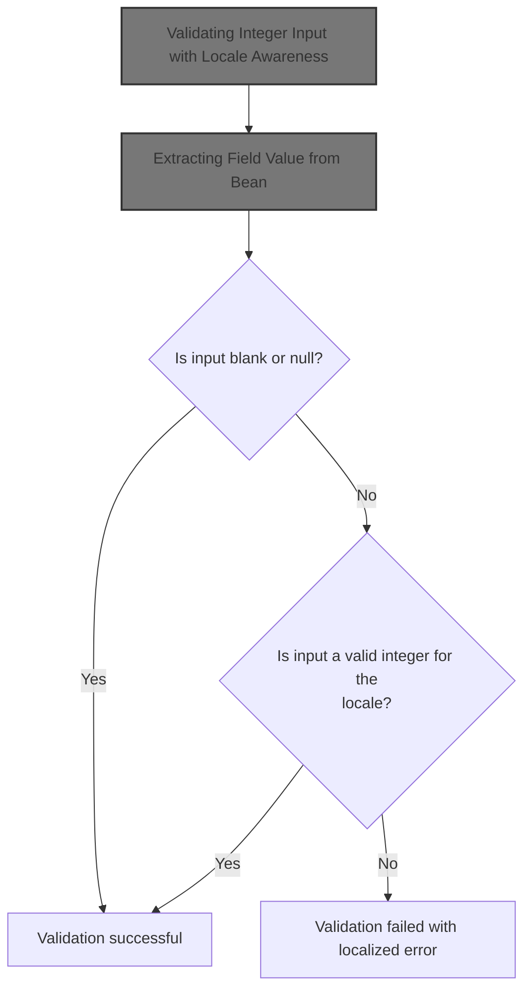
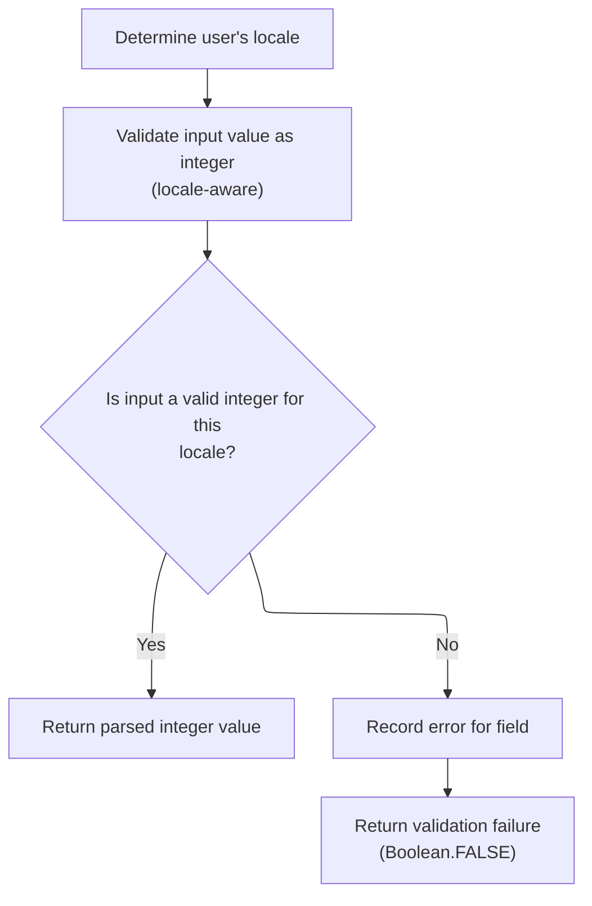
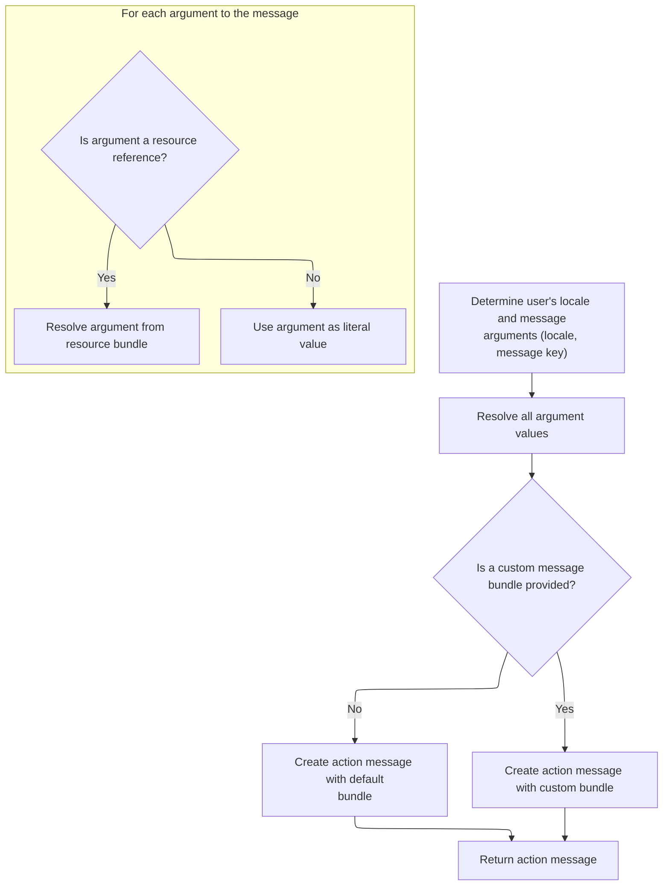

This document outlines how user input is validated as an integer, respecting locale-specific number formats. The process extracts the value from a form or data bean, checks its validity as an integer for the user's locale, and, if validation fails, generates a localized error message for the field.



# Validating Integer Input with Locale Awareness

<SwmSnippet path="/core/src/main/java/org/apache/struts/validator/FieldChecks.java" line="544">

---

In <SwmToken path="core/src/main/java/org/apache/struts/validator/FieldChecks.java" pos="544:7:7" line-data="    public static Object validateIntegerLocale(Object bean, ValidatorAction va,">`validateIntegerLocale`</SwmToken>, we're pulling out the value to validate from the bean using <SwmToken path="core/src/main/java/org/apache/struts/validator/FieldChecks.java" pos="551:5:5" line-data="            value = evaluateBean(bean, field);">`evaluateBean`</SwmToken>. This is necessary because the bean could be a String, a POJO, or something else, and we need a consistent way to get the value as a string. If extraction fails, we log the error and bail out early. If the value is blank or null, we skip further checks and return success. Next, we call <SwmToken path="core/src/main/java/org/apache/struts/validator/FieldChecks.java" pos="551:5:5" line-data="            value = evaluateBean(bean, field);">`evaluateBean`</SwmToken> to handle all the possible bean types and get the value we actually want to validate.

```java
    public static Object validateIntegerLocale(Object bean, ValidatorAction va,
        Field field, ActionMessages errors, Validator validator,
        HttpServletRequest request) {
        Object result = null;
        String value = null;

        try {
            value = evaluateBean(bean, field);
        } catch (Exception e) {
            processFailure(errors, field, validator.getFormName(), "integerLocale", e);
            return Boolean.FALSE;
        }

        if (GenericValidator.isBlankOrNull(value)) {
            return Boolean.TRUE;
        }

```

---

</SwmSnippet>

## Extracting Field Value from Bean

<SwmSnippet path="/core/src/main/java/org/apache/struts/validator/FieldChecks.java" line="389">

---

<SwmToken path="core/src/main/java/org/apache/struts/validator/FieldChecks.java" pos="389:7:7" line-data="    private static String evaluateBean(Object bean, Field field) throws Exception {">`evaluateBean`</SwmToken> checks if the bean is already a String and returns it if so. Otherwise, it calls <SwmToken path="core/src/main/java/org/apache/struts/validator/FieldChecks.java" pos="395:5:5" line-data="            value = getValueAsString(bean, field.getProperty());">`getValueAsString`</SwmToken> to extract the property value from the bean, handling cases where the bean is a POJO or some other object. This lets us support both direct String values and more complex beans.

```java
    private static String evaluateBean(Object bean, Field field) throws Exception {
        String value;

        if (isString(bean)) {
            value = (String) bean;
        } else {
            value = getValueAsString(bean, field.getProperty());
        }

        return value;
    }
```

---

</SwmSnippet>

<SwmSnippet path="/core/src/main/java/org/apache/struts/validator/FieldChecks.java" line="87">

---

<SwmToken path="core/src/main/java/org/apache/struts/validator/FieldChecks.java" pos="87:7:7" line-data="    private static String getValueAsString(Object bean, String property) ">`getValueAsString`</SwmToken> pulls the property value from the bean using <SwmToken path="core/src/main/java/org/apache/struts/validator/FieldChecks.java" pos="90:7:7" line-data="        Object value = PropertyUtils.getProperty(bean, property);">`PropertyUtils`</SwmToken>, then normalizes it: if it's a String array or Collection, it returns an empty string if they're empty (avoiding weird representations like '\[\]'), otherwise it just calls <SwmToken path="core/src/main/java/org/apache/struts/validator/FieldChecks.java" pos="96:23:25" line-data="            return ((String[]) value).length &gt; 0 ? value.toString() : &quot;&quot;;">`toString()`</SwmToken>. If the value is null, it returns null. This keeps the value extraction consistent for validation.

```java
    private static String getValueAsString(Object bean, String property) 
            throws Exception {
        
        Object value = PropertyUtils.getProperty(bean, property);
        if (value == null) {
            return null;
        }

        if (value instanceof String[]) {
            return ((String[]) value).length > 0 ? value.toString() : "";

        } else if (value instanceof Collection) {
            return ((Collection) value).isEmpty() ? "" : value.toString();

        } else {
            return value.toString();
        }
    }
```

---

</SwmSnippet>

## Parsing and Error Handling for Integer Validation



<SwmSnippet path="/core/src/main/java/org/apache/struts/validator/FieldChecks.java" line="561">

---

Back in <SwmToken path="core/src/main/java/org/apache/struts/validator/FieldChecks.java" pos="544:7:7" line-data="    public static Object validateIntegerLocale(Object bean, ValidatorAction va,">`validateIntegerLocale`</SwmToken>, after getting the value from <SwmToken path="core/src/main/java/org/apache/struts/validator/FieldChecks.java" pos="389:7:7" line-data="    private static String evaluateBean(Object bean, Field field) throws Exception {">`evaluateBean`</SwmToken>, we parse it as an integer using the user's locale. If parsing fails, we add an error message using <SwmToken path="core/src/main/java/org/apache/struts/validator/FieldChecks.java" pos="567:1:3" line-data="                Resources.getActionMessage(validator, request, va, field));">`Resources.getActionMessage`</SwmToken> to report the validation issue. The function returns FALSE if parsing failed, or the parsed integer if it worked.

```java
        Locale locale = RequestUtils.getUserLocale(request, null);

        result = GenericTypeValidator.formatInt(value, locale);

        if (result == null) {
            errors.add(field.getKey(),
                Resources.getActionMessage(validator, request, va, field));
        }

        return (result == null) ? Boolean.FALSE : result;
    }
```

---

</SwmSnippet>

# Building the Validation Error Message

<SwmSnippet path="/core/src/main/java/org/apache/struts/validator/Resources.java" line="365">

---

In <SwmToken path="core/src/main/java/org/apache/struts/validator/Resources.java" pos="365:7:7" line-data="    public static ActionMessage getActionMessage(Validator validator,">`getActionMessage`</SwmToken>, we figure out which message key and bundle to use for the error, handling both resource-based and direct messages. If the message is a resource, we need to fetch the right <SwmToken path="core/src/main/java/org/apache/struts/validator/Resources.java" pos="390:1:1" line-data="        MessageResources messages =">`MessageResources`</SwmToken> for localization, which means calling <SwmToken path="core/src/main/java/org/apache/struts/validator/Resources.java" pos="391:1:1" line-data="            getMessageResources(application, request, msgBundle);">`getMessageResources`</SwmToken> next.

```java
    public static ActionMessage getActionMessage(Validator validator,
        HttpServletRequest request, ValidatorAction va, Field field) {
        Msg msg = field.getMessage(va.getName());

        if ((msg != null) && !msg.isResource()) {
            return new ActionMessage(msg.getKey(), false);
        }

        String msgKey = null;
        String msgBundle = null;

        if (msg == null) {
            msgKey = va.getMsg();
        } else {
            msgKey = msg.getKey();
            msgBundle = msg.getBundle();
        }

        if ((msgKey == null) || (msgKey.length() == 0)) {
            return new ActionMessage("??? " + va.getName() + "."
                + field.getProperty() + " ???", false);
        }

        ServletContext application =
            (ServletContext) validator.getParameterValue(SERVLET_CONTEXT_PARAM);
        MessageResources messages =
            getMessageResources(application, request, msgBundle);
```

---

</SwmSnippet>

## Resolving the Correct Message Resource Bundle

```mermaid
%%{init: {"flowchart": {"defaultRenderer": "elk"}} }%%
flowchart TD
    node1["Start: Need message resources for
request"] --> node2{"Bundle specified?"}
    click node1 openCode "core/src/main/java/org/apache/struts/validator/Resources.java:117:119"
    node2 -->|"No"| node3["Use default bundle"]
    click node2 openCode "core/src/main/java/org/apache/struts/validator/Resources.java:119:121"
    node2 -->|"Yes"| node4{"Resources in request?"}
    node3 --> node4
    click node3 openCode "core/src/main/java/org/apache/struts/validator/Resources.java:120:121"
    node4 -->|"Yes"| node8["Return message resources"]
    click node4 openCode "core/src/main/java/org/apache/struts/validator/Resources.java:124:125"
    node4 -->|"No"| node5["Get module config and check application
for resources with module prefix"]
    click node5 openCode "core/src/main/java/org/apache/struts/validator/Resources.java:127:133"
    node5 --> node6{"Resources found for module?"}
    node6 -->|"Yes"| node8
    node6 -->|"No"| node7{"Resources found for default bundle?"}
    click node6 openCode "core/src/main/java/org/apache/struts/validator/Resources.java:135:137"
    node7 -->|"Yes"| node8
    node7 -->|"No"| node9["Throw error: No message resources found"]
    click node7 openCode "core/src/main/java/org/apache/struts/validator/Resources.java:139:142"
    click node8 openCode "core/src/main/java/org/apache/struts/validator/Resources.java:144:145"
    click node9 openCode "core/src/main/java/org/apache/struts/validator/Resources.java:140:142"
classDef HeadingStyle fill:#777777,stroke:#333,stroke-width:2px;

%% Swimm:
%% %%{init: {"flowchart": {"defaultRenderer": "elk"}} }%%
%% flowchart TD
%%     node1["Start: Need message resources for
%% request"] --> node2{"Bundle specified?"}
%%     click node1 openCode "<SwmPath>[core/…/validator/Resources.java](core/src/main/java/org/apache/struts/validator/Resources.java)</SwmPath>:117:119"
%%     node2 -->|"No"| node3["Use default bundle"]
%%     click node2 openCode "<SwmPath>[core/…/validator/Resources.java](core/src/main/java/org/apache/struts/validator/Resources.java)</SwmPath>:119:121"
%%     node2 -->|"Yes"| node4{"Resources in request?"}
%%     node3 --> node4
%%     click node3 openCode "<SwmPath>[core/…/validator/Resources.java](core/src/main/java/org/apache/struts/validator/Resources.java)</SwmPath>:120:121"
%%     node4 -->|"Yes"| node8["Return message resources"]
%%     click node4 openCode "<SwmPath>[core/…/validator/Resources.java](core/src/main/java/org/apache/struts/validator/Resources.java)</SwmPath>:124:125"
%%     node4 -->|"No"| node5["Get module config and check application
%% for resources with module prefix"]
%%     click node5 openCode "<SwmPath>[core/…/validator/Resources.java](core/src/main/java/org/apache/struts/validator/Resources.java)</SwmPath>:127:133"
%%     node5 --> node6{"Resources found for module?"}
%%     node6 -->|"Yes"| node8
%%     node6 -->|"No"| node7{"Resources found for default bundle?"}
%%     click node6 openCode "<SwmPath>[core/…/validator/Resources.java](core/src/main/java/org/apache/struts/validator/Resources.java)</SwmPath>:135:137"
%%     node7 -->|"Yes"| node8
%%     node7 -->|"No"| node9["Throw error: No message resources found"]
%%     click node7 openCode "<SwmPath>[core/…/validator/Resources.java](core/src/main/java/org/apache/struts/validator/Resources.java)</SwmPath>:139:142"
%%     click node8 openCode "<SwmPath>[core/…/validator/Resources.java](core/src/main/java/org/apache/struts/validator/Resources.java)</SwmPath>:144:145"
%%     click node9 openCode "<SwmPath>[core/…/validator/Resources.java](core/src/main/java/org/apache/struts/validator/Resources.java)</SwmPath>:140:142"
%% classDef HeadingStyle fill:#777777,stroke:#333,stroke-width:2px;
```



<SwmSnippet path="/core/src/main/java/org/apache/struts/validator/Resources.java" line="117">

---

In <SwmToken path="core/src/main/java/org/apache/struts/validator/Resources.java" pos="117:7:7" line-data="    public static MessageResources getMessageResources(">`getMessageResources`</SwmToken>, we try to find the right <SwmToken path="core/src/main/java/org/apache/struts/validator/Resources.java" pos="117:5:5" line-data="    public static MessageResources getMessageResources(">`MessageResources`</SwmToken> for the bundle, first in the request, then in the application with the module prefix, and finally just by bundle name. If we can't find it, we need to get the <SwmToken path="core/src/main/java/org/apache/struts/validator/Resources.java" pos="127:1:1" line-data="            ModuleConfig moduleConfig =">`ModuleConfig`</SwmToken> using <SwmToken path="core/src/main/java/org/apache/struts/validator/Resources.java" pos="128:1:1" line-data="                ModuleUtils.getInstance().getModuleConfig(request, application);">`ModuleUtils`</SwmToken> to check the module-specific resources.

```java
    public static MessageResources getMessageResources(
        ServletContext application, HttpServletRequest request, String bundle) {
        if (bundle == null) {
            bundle = Globals.MESSAGES_KEY;
        }

        MessageResources resources =
            (MessageResources) request.getAttribute(bundle);

        if (resources == null) {
            ModuleConfig moduleConfig =
                ModuleUtils.getInstance().getModuleConfig(request, application);

            resources =
                (MessageResources) application.getAttribute(bundle
                    + moduleConfig.getPrefix());
        }

```

---

</SwmSnippet>

<SwmSnippet path="/core/src/main/java/org/apache/struts/util/ModuleUtils.java" line="130">

---

<SwmToken path="core/src/main/java/org/apache/struts/util/ModuleUtils.java" pos="130:5:5" line-data="    public ModuleConfig getModuleConfig(HttpServletRequest request,">`getModuleConfig`</SwmToken> first tries to get the config from the request. If it's not there, it falls back to the context using an empty string as the key, then stores it in the request for later use. This makes sure the module config is always available for resource lookups.

```java
    public ModuleConfig getModuleConfig(HttpServletRequest request,
        ServletContext context) {
        ModuleConfig moduleConfig = this.getModuleConfig(request);

        if (moduleConfig == null) {
            moduleConfig = this.getModuleConfig("", context);
            request.setAttribute(Globals.MODULE_KEY, moduleConfig);
        }

        return moduleConfig;
    }
```

---

</SwmSnippet>

<SwmSnippet path="/core/src/main/java/org/apache/struts/validator/Resources.java" line="135">

---

After coming back from <SwmToken path="core/src/main/java/org/apache/struts/validator/Resources.java" pos="128:1:1" line-data="                ModuleUtils.getInstance().getModuleConfig(request, application);">`ModuleUtils`</SwmToken>, <SwmToken path="core/src/main/java/org/apache/struts/validator/Resources.java" pos="117:7:7" line-data="    public static MessageResources getMessageResources(">`getMessageResources`</SwmToken> does a final check for <SwmToken path="core/src/main/java/org/apache/struts/validator/Resources.java" pos="136:6:6" line-data="            resources = (MessageResources) application.getAttribute(bundle);">`MessageResources`</SwmToken> in the application scope without the module prefix. If it's still not found, it throws an exception. This fallback chain ensures we always try all possible places for resources, but if none are found, things break.

```java
        if (resources == null) {
            resources = (MessageResources) application.getAttribute(bundle);
        }

        if (resources == null) {
            throw new NullPointerException(
                "No message resources found for bundle: " + bundle);
        }

        return resources;
    }
```

---

</SwmSnippet>

## Preparing Arguments for the Error Message



<SwmSnippet path="/core/src/main/java/org/apache/struts/validator/Resources.java" line="392">

---

After getting the <SwmToken path="core/src/main/java/org/apache/struts/validator/Resources.java" pos="117:5:5" line-data="    public static MessageResources getMessageResources(">`MessageResources`</SwmToken>, <SwmToken path="core/src/main/java/org/apache/struts/validator/FieldChecks.java" pos="567:3:3" line-data="                Resources.getActionMessage(validator, request, va, field));">`getActionMessage`</SwmToken> grabs the user's locale and fetches up to four argument definitions for the error message. These arguments might be used as placeholders in the message, so we need to resolve their values next by calling <SwmToken path="core/src/main/java/org/apache/struts/validator/Resources.java" pos="396:1:1" line-data="            getArgValues(application, request, messages, locale, args);">`getArgValues`</SwmToken>.

```java
        Locale locale = RequestUtils.getUserLocale(request, null);

        Arg[] args = field.getArgs(va.getName());
```

---

</SwmSnippet>

<SwmSnippet path="/core/src/main/java/org/apache/struts/validator/Resources.java" line="420">

---

<SwmToken path="core/src/main/java/org/apache/struts/validator/Resources.java" pos="420:9:9" line-data="    public static String[] getArgs(String actionName,">`getArgs`</SwmToken> builds an array of up to four argument messages for the error, pulling Arg objects from the field. For each, if it's a resource, we resolve it to a localized string; otherwise, we use the key directly. Only four arguments are supported, which is a hard limit here.

```java
    public static String[] getArgs(String actionName,
        MessageResources messages, Locale locale, Field field) {
        String[] argMessages = new String[4];

        Arg[] args =
            new Arg[] {
                field.getArg(actionName, 0), field.getArg(actionName, 1),
                field.getArg(actionName, 2), field.getArg(actionName, 3)
            };

        for (int i = 0; i < args.length; i++) {
            if (args[i] == null) {
                continue;
            }

            if (args[i].isResource()) {
                argMessages[i] = getMessage(messages, locale, args[i].getKey());
            } else {
                argMessages[i] = args[i].getKey();
            }
        }
```

---

</SwmSnippet>

<SwmSnippet path="/core/src/main/java/org/apache/struts/validator/Resources.java" line="395">

---

After building the argument definitions, <SwmToken path="core/src/main/java/org/apache/struts/validator/FieldChecks.java" pos="567:3:3" line-data="                Resources.getActionMessage(validator, request, va, field));">`getActionMessage`</SwmToken> calls <SwmToken path="core/src/main/java/org/apache/struts/validator/Resources.java" pos="396:1:1" line-data="            getArgValues(application, request, messages, locale, args);">`getArgValues`</SwmToken> to resolve the actual strings to use in the message, handling localization and bundle overrides as needed.

```java
        String[] argValues =
            getArgValues(application, request, messages, locale, args);

```

---

</SwmSnippet>

<SwmSnippet path="/core/src/main/java/org/apache/struts/validator/Resources.java" line="455">

---

<SwmToken path="core/src/main/java/org/apache/struts/validator/Resources.java" pos="455:9:9" line-data="    private static String[] getArgValues(ServletContext application,">`getArgValues`</SwmToken> loops through the Arg array, resolving each one to a string. If an Arg is a resource and specifies a bundle, we fetch the message from that bundle; otherwise, we use the default messages or the key directly. This ensures all argument values are localized and accurate before building the final message.

```java
    private static String[] getArgValues(ServletContext application,
        HttpServletRequest request, MessageResources defaultMessages,
        Locale locale, Arg[] args) {
        if ((args == null) || (args.length == 0)) {
            return null;
        }

        String[] values = new String[args.length];

        for (int i = 0; i < args.length; i++) {
            if (args[i] != null) {
                if (args[i].isResource()) {
                    MessageResources messages = defaultMessages;

                    if (args[i].getBundle() != null) {
                        messages =
                            getMessageResources(application, request,
                                args[i].getBundle());
                    }

                    values[i] = messages.getMessage(locale, args[i].getKey());
                } else {
                    values[i] = args[i].getKey();
                }
            }
        }

        return values;
    }
```

---

</SwmSnippet>

<SwmSnippet path="/core/src/main/java/org/apache/struts/validator/Resources.java" line="398">

---

After resolving argument values, <SwmToken path="core/src/main/java/org/apache/struts/validator/FieldChecks.java" pos="567:3:3" line-data="                Resources.getActionMessage(validator, request, va, field));">`getActionMessage`</SwmToken> either creates an <SwmToken path="core/src/main/java/org/apache/struts/validator/Resources.java" pos="398:1:1" line-data="        ActionMessage actionMessage = null;">`ActionMessage`</SwmToken> with the key and arguments (if no bundle is set), or resolves the message string first and then wraps it. This covers both resource-based and direct messages before returning the result.

```java
        ActionMessage actionMessage = null;

        if (msgBundle == null) {
            actionMessage = new ActionMessage(msgKey, argValues);
        } else {
            String message = messages.getMessage(locale, msgKey, argValues);

            actionMessage = new ActionMessage(message, false);
        }

        return actionMessage;
    }
```

---

</SwmSnippet>

&nbsp;

*This is an auto-generated document by Swimm 🌊 and has not yet been verified by a human*

<SwmMeta version="3.0.0" repo-id="Z2l0aHViJTNBJTNBc3RydXRzMSUzQSUzQVN3aW1tLURlbW8=" repo-name="struts1"><sup>Powered by [Swimm](https://app.swimm.io/)</sup></SwmMeta>
