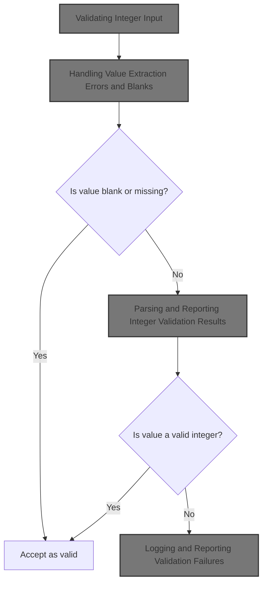
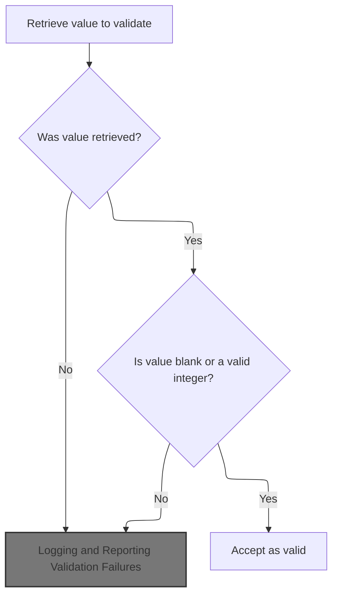
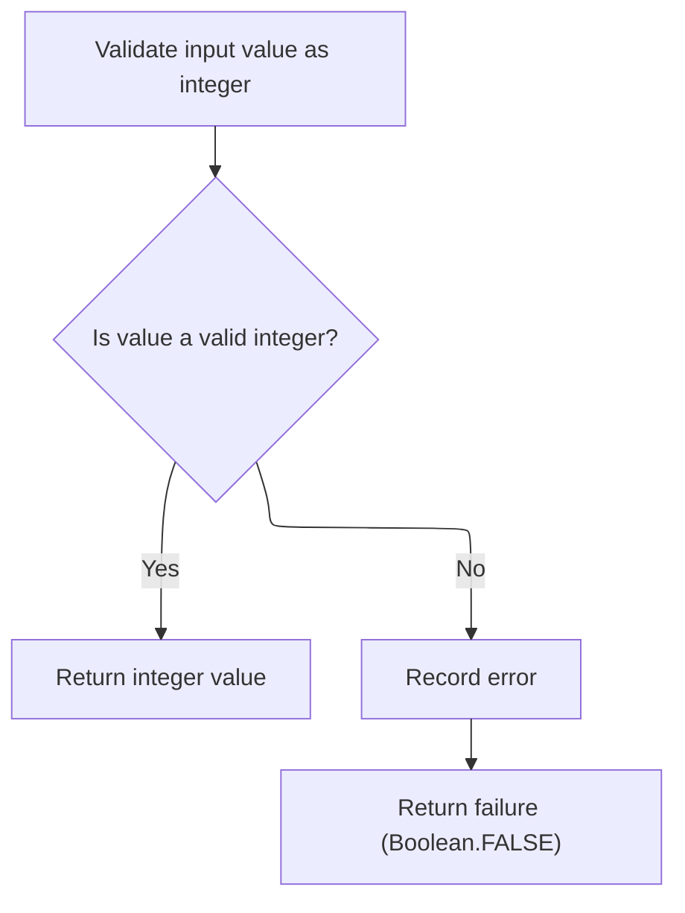
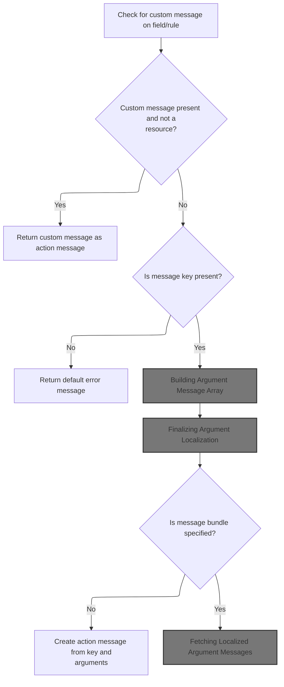
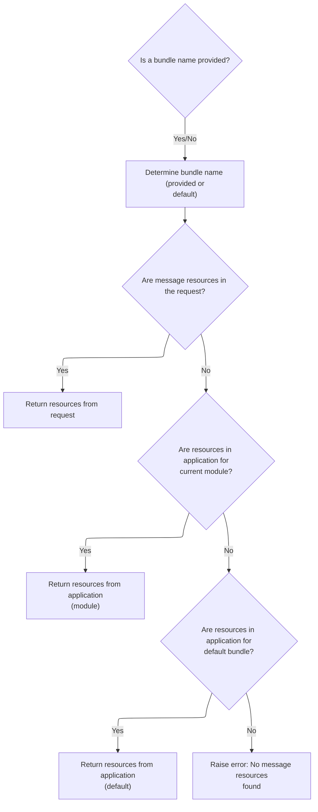
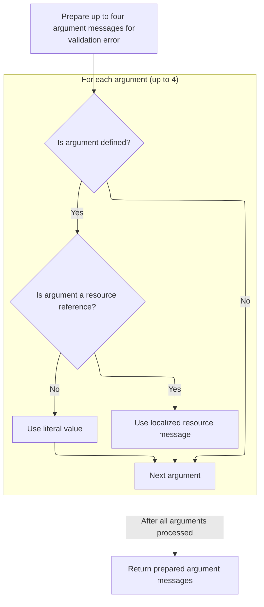
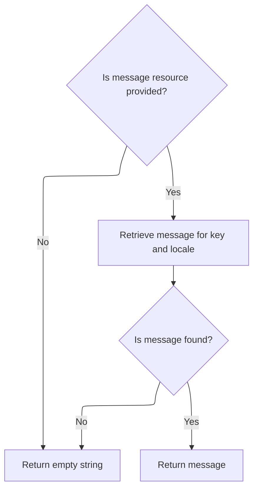
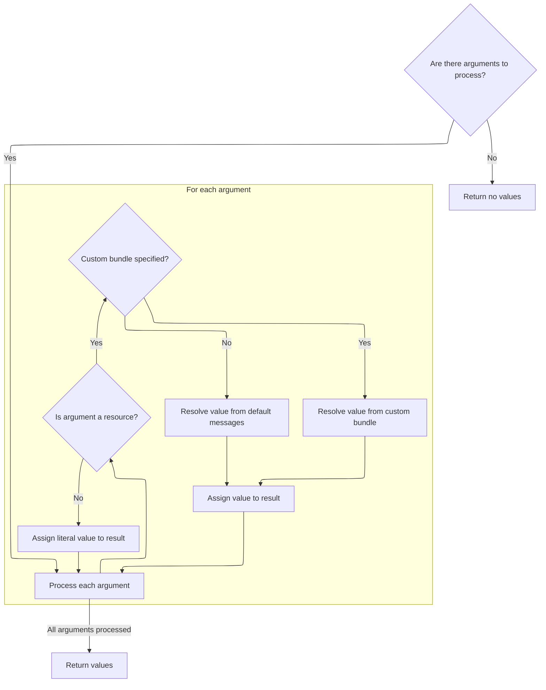
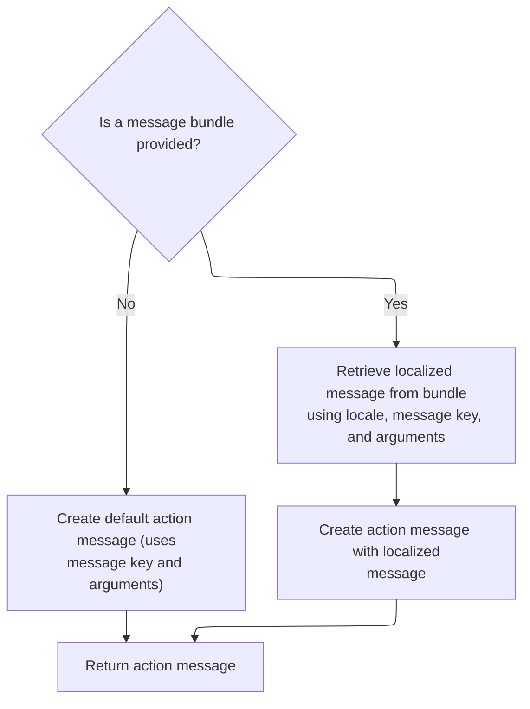

This document describes how the system validates that a provided value is an integer when processing user input. If the value is missing or blank, it is accepted as valid. If the value is present but not a valid integer, a user-friendly error message is generated and returned.



# Validating Integer Input



<SwmSnippet path="/core/src/main/java/org/apache/struts/validator/FieldChecks.java" line="502">

---

In <SwmToken path="core/src/main/java/org/apache/struts/validator/FieldChecks.java" pos="502:7:7" line-data="    public static Object validateInteger(Object bean, ValidatorAction va,">`validateInteger`</SwmToken>, we're prepping to validate an integer by extracting the relevant value from the bean. We call <SwmToken path="core/src/main/java/org/apache/struts/validator/FieldChecks.java" pos="509:5:5" line-data="            value = evaluateBean(bean, field);">`evaluateBean`</SwmToken> next to handle both String and non-String beans, so we always get a String value to work with.

```java
    public static Object validateInteger(Object bean, ValidatorAction va,
        Field field, ActionMessages errors, Validator validator,
        HttpServletRequest request) {
        Object result = null;
        String value = null;

        try {
            value = evaluateBean(bean, field);
```

---

</SwmSnippet>

## Extracting Field Value as String

<SwmSnippet path="/core/src/main/java/org/apache/struts/validator/FieldChecks.java" line="389">

---

<SwmToken path="core/src/main/java/org/apache/struts/validator/FieldChecks.java" pos="389:7:7" line-data="    private static String evaluateBean(Object bean, Field field) throws Exception {">`evaluateBean`</SwmToken> checks if the bean is a String and returns it, otherwise it pulls the property value using <SwmToken path="core/src/main/java/org/apache/struts/validator/FieldChecks.java" pos="395:5:5" line-data="            value = getValueAsString(bean, field.getProperty());">`getValueAsString`</SwmToken>. This handles cases where the bean is a complex object, not just a String.

```java
    private static String evaluateBean(Object bean, Field field) throws Exception {
        String value;

        if (isString(bean)) {
            value = (String) bean;
        } else {
            value = getValueAsString(bean, field.getProperty());
        }

        return value;
    }
```

---

</SwmSnippet>

<SwmSnippet path="/core/src/main/java/org/apache/struts/validator/FieldChecks.java" line="87">

---

<SwmToken path="core/src/main/java/org/apache/struts/validator/FieldChecks.java" pos="87:7:7" line-data="    private static String getValueAsString(Object bean, String property) ">`getValueAsString`</SwmToken> fetches the property value from the bean and normalizes it: null stays null, empty arrays/collections become empty strings, and everything else is converted to a string. This keeps downstream validation logic simple.

```java
    private static String getValueAsString(Object bean, String property) 
            throws Exception {
        
        Object value = PropertyUtils.getProperty(bean, property);
        if (value == null) {
            return null;
        }

        if (value instanceof String[]) {
            return ((String[]) value).length > 0 ? value.toString() : "";

        } else if (value instanceof Collection) {
            return ((Collection) value).isEmpty() ? "" : value.toString();

        } else {
            return value.toString();
        }
    }
```

---

</SwmSnippet>

## Handling Value Extraction Errors and Blanks

<SwmSnippet path="/core/src/main/java/org/apache/struts/validator/FieldChecks.java" line="510">

---

Back in <SwmToken path="core/src/main/java/org/apache/struts/validator/FieldChecks.java" pos="502:7:7" line-data="    public static Object validateInteger(Object bean, ValidatorAction va,">`validateInteger`</SwmToken>, after getting the value from <SwmToken path="core/src/main/java/org/apache/struts/validator/FieldChecks.java" pos="389:7:7" line-data="    private static String evaluateBean(Object bean, Field field) throws Exception {">`evaluateBean`</SwmToken>, if an exception happens, we call <SwmToken path="core/src/main/java/org/apache/struts/validator/FieldChecks.java" pos="511:1:1" line-data="            processFailure(errors, field, validator.getFormName(), &quot;integer&quot;, e);">`processFailure`</SwmToken> to log and report the error. If the value is blank or null, we skip further checks and return success.

```java
        } catch (Exception e) {
            processFailure(errors, field, validator.getFormName(), "integer", e);
            return Boolean.FALSE;
        }

        if (GenericValidator.isBlankOrNull(value)) {
            return Boolean.TRUE;
        }

```

---

</SwmSnippet>

## Logging and Reporting Validation Failures

<SwmSnippet path="/core/src/main/java/org/apache/struts/validator/FieldChecks.java" line="1434">

---

In <SwmToken path="core/src/main/java/org/apache/struts/validator/FieldChecks.java" pos="1434:7:7" line-data="    private static void processFailure(ActionMessages errors, Field field,">`processFailure`</SwmToken>, we build a formatted log message using <SwmToken path="core/src/main/java/org/apache/struts/validator/Resources.java" pos="117:5:5" line-data="    public static MessageResources getMessageResources(">`MessageResources`</SwmToken>, including details like validator name, field, form, and the exception. This keeps logs structured and localizable.

```java
    private static void processFailure(ActionMessages errors, Field field,
        String formName, String validatorName, Throwable t) {
        // Log the error
        String logErrorMsg =
            sysmsgs.getMessage("validation.failed", validatorName,
                field.getProperty(), formName, t.toString());

        log.error(logErrorMsg, t);

```

---

</SwmSnippet>

### Formatting Log Messages

<SwmSnippet path="/core/src/main/java/org/apache/struts/util/MessageResources.java" line="355">

---

<SwmToken path="core/src/main/java/org/apache/struts/util/MessageResources.java" pos="355:5:5" line-data="    public String getMessage(Locale locale, String key, Object arg0,">`getMessage`</SwmToken> here just wraps up to three arguments into an array and passes them to the main message formatting logic.

```java
    public String getMessage(Locale locale, String key, Object arg0,
        Object arg1, Object arg2) {
        return this.getMessage(locale, key, new Object[] { arg0, arg1, arg2 });
    }
```

---

</SwmSnippet>

### Formatting Messages with One Argument

```mermaid
%%{init: {"flowchart": {"defaultRenderer": "elk"}} }%%
flowchart TD
    node1["Receive request for message (locale,
key, argument)"] --> node2["Convert argument to array"]
    click node1 openCode "core/src/main/java/org/apache/struts/util/MessageResources.java:324:326"
    click node2 openCode "core/src/main/java/org/apache/struts/util/MessageResources.java:324:326"
    node2 --> node3{"Is locale provided?"}
    click node3 openCode "core/src/main/java/org/apache/struts/util/MessageResources.java:288:290"
    node3 -->|"Yes"| node4["Use provided locale"]
    node3 -->|"No"| node5["Use default locale"]
    click node4 openCode "core/src/main/java/org/apache/struts/util/MessageResources.java:288:290"
    click node5 openCode "core/src/main/java/org/apache/struts/util/MessageResources.java:288:290"
    node4 --> node6{"Is message format available for locale
and key?"}
    node5 --> node6
    click node6 openCode "core/src/main/java/org/apache/struts/util/MessageResources.java:295:308"
    node6 -->|"Yes"| node9["Format and return message with argument"]
    click node9 openCode "core/src/main/java/org/apache/struts/util/MessageResources.java:311:312"
    node6 -->|"No"| node7{"Does message exist for locale and key?"}
    click node7 openCode "core/src/main/java/org/apache/struts/util/MessageResources.java:299:303"
    node7 -->|"Yes"| node8["Create and store message format"]
    click node8 openCode "core/src/main/java/org/apache/struts/util/MessageResources.java:305:308"
    node8 --> node9
    node7 -->|"No"| node10{"Should return null?"}
    click node10 openCode "core/src/main/java/org/apache/struts/util/MessageResources.java:302:303"
    node10 -->|"Yes"| node11["Return null"]
    click node11 openCode "core/src/main/java/org/apache/struts/util/MessageResources.java:302:303"
    node10 -->|"No"| node12["Return placeholder message"]
    click node12 openCode "core/src/main/java/org/apache/struts/util/MessageResources.java:302:303"

classDef HeadingStyle fill:#777777,stroke:#333,stroke-width:2px;

%% Swimm:
%% %%{init: {"flowchart": {"defaultRenderer": "elk"}} }%%
%% flowchart TD
%%     node1["Receive request for message (locale,
%% key, argument)"] --> node2["Convert argument to array"]
%%     click node1 openCode "<SwmPath>[core/…/util/MessageResources.java](core/src/main/java/org/apache/struts/util/MessageResources.java)</SwmPath>:324:326"
%%     click node2 openCode "<SwmPath>[core/…/util/MessageResources.java](core/src/main/java/org/apache/struts/util/MessageResources.java)</SwmPath>:324:326"
%%     node2 --> node3{"Is locale provided?"}
%%     click node3 openCode "<SwmPath>[core/…/util/MessageResources.java](core/src/main/java/org/apache/struts/util/MessageResources.java)</SwmPath>:288:290"
%%     node3 -->|"Yes"| node4["Use provided locale"]
%%     node3 -->|"No"| node5["Use default locale"]
%%     click node4 openCode "<SwmPath>[core/…/util/MessageResources.java](core/src/main/java/org/apache/struts/util/MessageResources.java)</SwmPath>:288:290"
%%     click node5 openCode "<SwmPath>[core/…/util/MessageResources.java](core/src/main/java/org/apache/struts/util/MessageResources.java)</SwmPath>:288:290"
%%     node4 --> node6{"Is message format available for locale
%% and key?"}
%%     node5 --> node6
%%     click node6 openCode "<SwmPath>[core/…/util/MessageResources.java](core/src/main/java/org/apache/struts/util/MessageResources.java)</SwmPath>:295:308"
%%     node6 -->|"Yes"| node9["Format and return message with argument"]
%%     click node9 openCode "<SwmPath>[core/…/util/MessageResources.java](core/src/main/java/org/apache/struts/util/MessageResources.java)</SwmPath>:311:312"
%%     node6 -->|"No"| node7{"Does message exist for locale and key?"}
%%     click node7 openCode "<SwmPath>[core/…/util/MessageResources.java](core/src/main/java/org/apache/struts/util/MessageResources.java)</SwmPath>:299:303"
%%     node7 -->|"Yes"| node8["Create and store message format"]
%%     click node8 openCode "<SwmPath>[core/…/util/MessageResources.java](core/src/main/java/org/apache/struts/util/MessageResources.java)</SwmPath>:305:308"
%%     node8 --> node9
%%     node7 -->|"No"| node10{"Should return null?"}
%%     click node10 openCode "<SwmPath>[core/…/util/MessageResources.java](core/src/main/java/org/apache/struts/util/MessageResources.java)</SwmPath>:302:303"
%%     node10 -->|"Yes"| node11["Return null"]
%%     click node11 openCode "<SwmPath>[core/…/util/MessageResources.java](core/src/main/java/org/apache/struts/util/MessageResources.java)</SwmPath>:302:303"
%%     node10 -->|"No"| node12["Return placeholder message"]
%%     click node12 openCode "<SwmPath>[core/…/util/MessageResources.java](core/src/main/java/org/apache/struts/util/MessageResources.java)</SwmPath>:302:303"
%% 
%% classDef HeadingStyle fill:#777777,stroke:#333,stroke-width:2px;
```



<SwmSnippet path="/core/src/main/java/org/apache/struts/util/MessageResources.java" line="324">

---

<SwmToken path="core/src/main/java/org/apache/struts/util/MessageResources.java" pos="324:5:5" line-data="    public String getMessage(Locale locale, String key, Object arg0) {">`getMessage`</SwmToken> here is just a shortcut for formatting messages with one argument, passing it as an array to the main formatter.

```java
    public String getMessage(Locale locale, String key, Object arg0) {
        return this.getMessage(locale, key, new Object[] { arg0 });
    }
```

---

</SwmSnippet>

<SwmSnippet path="/core/src/main/java/org/apache/struts/util/MessageResources.java" line="286">

---

<SwmToken path="core/src/main/java/org/apache/struts/util/MessageResources.java" pos="286:5:5" line-data="    public String getMessage(Locale locale, String key, Object[] args) {">`getMessage`</SwmToken> here does the heavy lifting: it caches <SwmToken path="core/src/main/java/org/apache/struts/util/MessageResources.java" pos="287:5:5" line-data="        // Cache MessageFormat instances as they are accessed">`MessageFormat`</SwmToken> instances per locale and key, handles missing locales and messages, escapes format strings, and finally formats the message with the given arguments.

```java
    public String getMessage(Locale locale, String key, Object[] args) {
        // Cache MessageFormat instances as they are accessed
        if (locale == null) {
            locale = defaultLocale;
        }

        MessageFormat format = null;
        String formatKey = messageKey(locale, key);

        synchronized (formats) {
            format = (MessageFormat) formats.get(formatKey);

            if (format == null) {
                String formatString = getMessage(locale, key);

                if (formatString == null) {
                    return returnNull ? null : ("???" + formatKey + "???");
                }

                format = new MessageFormat(escape(formatString));
                format.setLocale(locale);
                formats.put(formatKey, format);
            }
        }

        return format.format(args);
    }
```

---

</SwmSnippet>

### Adding User-Facing Error Messages

<SwmSnippet path="/core/src/main/java/org/apache/struts/validator/FieldChecks.java" line="1443">

---

Back in <SwmToken path="core/src/main/java/org/apache/struts/validator/FieldChecks.java" pos="511:1:1" line-data="            processFailure(errors, field, validator.getFormName(), &quot;integer&quot;, e);">`processFailure`</SwmToken>, after logging, we fetch a generic system error message from <SwmToken path="core/src/main/java/org/apache/struts/validator/Resources.java" pos="117:5:5" line-data="    public static MessageResources getMessageResources(">`MessageResources`</SwmToken> and add it to the errors for the user. This keeps user-facing messages clean and non-technical.

```java
        // Add general "system error" message to show to the user
        String userErrorMsg = sysmsgs.getMessage("system.error");

        errors.add(field.getKey(), new ActionMessage(userErrorMsg, false));
    }
```

---

</SwmSnippet>

<SwmSnippet path="/core/src/main/java/org/apache/struts/util/MessageResources.java" line="196">

---

<SwmToken path="core/src/main/java/org/apache/struts/util/MessageResources.java" pos="196:5:5" line-data="    public String getMessage(String key) {">`getMessage`</SwmToken> here is just a shortcut for fetching a message string with no arguments and default locale.

```java
    public String getMessage(String key) {
        return this.getMessage((Locale) null, key, null);
    }
```

---

</SwmSnippet>

## Parsing and Reporting Integer Validation Results



<SwmSnippet path="/core/src/main/java/org/apache/struts/validator/FieldChecks.java" line="519">

---

Back in <SwmToken path="core/src/main/java/org/apache/struts/validator/FieldChecks.java" pos="502:7:7" line-data="    public static Object validateInteger(Object bean, ValidatorAction va,">`validateInteger`</SwmToken>, after <SwmToken path="core/src/main/java/org/apache/struts/validator/FieldChecks.java" pos="511:1:1" line-data="            processFailure(errors, field, validator.getFormName(), &quot;integer&quot;, e);">`processFailure`</SwmToken>, we try to parse the value as an integer. If parsing fails, we add a validation error message using <SwmToken path="core/src/main/java/org/apache/struts/validator/FieldChecks.java" pos="523:1:3" line-data="                Resources.getActionMessage(validator, request, va, field));">`Resources.getActionMessage`</SwmToken> and return <SwmToken path="core/src/main/java/org/apache/struts/validator/FieldChecks.java" pos="526:13:15" line-data="        return (result == null) ? Boolean.FALSE : result;">`Boolean.FALSE`</SwmToken>.

```java
        result = GenericTypeValidator.formatInt(value);

        if (result == null) {
            errors.add(field.getKey(),
                Resources.getActionMessage(validator, request, va, field));
        }

        return (result == null) ? Boolean.FALSE : result;
    }
```

---

</SwmSnippet>

# Building Validation Error Messages



<SwmSnippet path="/core/src/main/java/org/apache/struts/validator/Resources.java" line="365">

---

In <SwmToken path="core/src/main/java/org/apache/struts/validator/Resources.java" pos="365:7:7" line-data="    public static ActionMessage getActionMessage(Validator validator,">`getActionMessage`</SwmToken>, we figure out if the message is a resource or a literal, pick the right key and bundle, and fetch <SwmToken path="core/src/main/java/org/apache/struts/validator/Resources.java" pos="390:1:1" line-data="        MessageResources messages =">`MessageResources`</SwmToken> from the application context if needed.

```java
    public static ActionMessage getActionMessage(Validator validator,
        HttpServletRequest request, ValidatorAction va, Field field) {
        Msg msg = field.getMessage(va.getName());

        if ((msg != null) && !msg.isResource()) {
            return new ActionMessage(msg.getKey(), false);
        }

        String msgKey = null;
        String msgBundle = null;

        if (msg == null) {
            msgKey = va.getMsg();
        } else {
            msgKey = msg.getKey();
            msgBundle = msg.getBundle();
        }

        if ((msgKey == null) || (msgKey.length() == 0)) {
            return new ActionMessage("??? " + va.getName() + "."
                + field.getProperty() + " ???", false);
        }

        ServletContext application =
            (ServletContext) validator.getParameterValue(SERVLET_CONTEXT_PARAM);
        MessageResources messages =
            getMessageResources(application, request, msgBundle);
```

---

</SwmSnippet>

## Resolving Message Resource Bundles



<SwmSnippet path="/core/src/main/java/org/apache/struts/validator/Resources.java" line="117">

---

In <SwmToken path="core/src/main/java/org/apache/struts/validator/Resources.java" pos="117:7:7" line-data="    public static MessageResources getMessageResources(">`getMessageResources`</SwmToken>, we try to get the message bundle from the request, then fall back to the application context using the module prefix, and finally just the bundle name. This covers all the ways resources might be scoped in a modular app.

```java
    public static MessageResources getMessageResources(
        ServletContext application, HttpServletRequest request, String bundle) {
        if (bundle == null) {
            bundle = Globals.MESSAGES_KEY;
        }

        MessageResources resources =
            (MessageResources) request.getAttribute(bundle);

        if (resources == null) {
            ModuleConfig moduleConfig =
                ModuleUtils.getInstance().getModuleConfig(request, application);

            resources =
                (MessageResources) application.getAttribute(bundle
                    + moduleConfig.getPrefix());
        }

```

---

</SwmSnippet>

<SwmSnippet path="/core/src/main/java/org/apache/struts/util/ModuleUtils.java" line="130">

---

<SwmToken path="core/src/main/java/org/apache/struts/util/ModuleUtils.java" pos="130:5:5" line-data="    public ModuleConfig getModuleConfig(HttpServletRequest request,">`getModuleConfig`</SwmToken> first tries to get the config from the request, and if that's missing, it pulls the default from the context and attaches it to the request for later use.

```java
    public ModuleConfig getModuleConfig(HttpServletRequest request,
        ServletContext context) {
        ModuleConfig moduleConfig = this.getModuleConfig(request);

        if (moduleConfig == null) {
            moduleConfig = this.getModuleConfig("", context);
            request.setAttribute(Globals.MODULE_KEY, moduleConfig);
        }

        return moduleConfig;
    }
```

---

</SwmSnippet>

<SwmSnippet path="/core/src/main/java/org/apache/struts/validator/Resources.java" line="135">

---

Back in <SwmToken path="core/src/main/java/org/apache/struts/validator/Resources.java" pos="117:7:7" line-data="    public static MessageResources getMessageResources(">`getMessageResources`</SwmToken>, after trying all the fallback options, if we still can't find the resources, we throw a <SwmToken path="core/src/main/java/org/apache/struts/validator/Resources.java" pos="140:5:5" line-data="            throw new NullPointerException(">`NullPointerException`</SwmToken>. This makes missing resource bundles obvious during development or deployment.

```java
        if (resources == null) {
            resources = (MessageResources) application.getAttribute(bundle);
        }

        if (resources == null) {
            throw new NullPointerException(
                "No message resources found for bundle: " + bundle);
        }

        return resources;
    }
```

---

</SwmSnippet>

## Preparing Message Arguments

<SwmSnippet path="/core/src/main/java/org/apache/struts/validator/Resources.java" line="392">

---

Back in <SwmToken path="core/src/main/java/org/apache/struts/validator/FieldChecks.java" pos="523:3:3" line-data="                Resources.getActionMessage(validator, request, va, field));">`getActionMessage`</SwmToken>, after getting the resources, we grab the user's locale and fetch any arguments from the field for message formatting.

```java
        Locale locale = RequestUtils.getUserLocale(request, null);

        Arg[] args = field.getArgs(va.getName());
```

---

</SwmSnippet>

## Building Argument Message Array



<SwmSnippet path="/core/src/main/java/org/apache/struts/validator/Resources.java" line="420">

---

<SwmToken path="core/src/main/java/org/apache/struts/validator/Resources.java" pos="420:9:9" line-data="    public static String[] getArgs(String actionName,">`getArgs`</SwmToken> builds an array of up to four argument messages, localizing each if it's a resource, or just using the key if not. This is all based on the field's argument definitions.

```java
    public static String[] getArgs(String actionName,
        MessageResources messages, Locale locale, Field field) {
        String[] argMessages = new String[4];

        Arg[] args =
            new Arg[] {
                field.getArg(actionName, 0), field.getArg(actionName, 1),
                field.getArg(actionName, 2), field.getArg(actionName, 3)
            };

        for (int i = 0; i < args.length; i++) {
            if (args[i] == null) {
                continue;
            }

            if (args[i].isResource()) {
                argMessages[i] = getMessage(messages, locale, args[i].getKey());
            } else {
                argMessages[i] = args[i].getKey();
            }
        }

        return argMessages;
    }
```

---

</SwmSnippet>

## Fetching Localized Argument Messages



<SwmSnippet path="/core/src/main/java/org/apache/struts/validator/Resources.java" line="231">

---

<SwmToken path="core/src/main/java/org/apache/struts/validator/Resources.java" pos="231:7:7" line-data="    public static String getMessage(MessageResources messages, Locale locale,">`getMessage`</SwmToken> here fetches a localized message for a given key from <SwmToken path="core/src/main/java/org/apache/struts/validator/Resources.java" pos="231:9:9" line-data="    public static String getMessage(MessageResources messages, Locale locale,">`MessageResources`</SwmToken>, returning an empty string if the key isn't found.

```java
    public static String getMessage(MessageResources messages, Locale locale,
        String key) {
        String message = null;

        if (messages != null) {
            message = messages.getMessage(locale, key);
        }

        return (message == null) ? "" : message;
    }
```

---

</SwmSnippet>

<SwmSnippet path="/core/src/main/java/org/apache/struts/util/MessageResources.java" line="218">

---

<SwmToken path="core/src/main/java/org/apache/struts/util/MessageResources.java" pos="218:5:5" line-data="    public String getMessage(String key, Object arg0) {">`getMessage`</SwmToken> here is just a shortcut for fetching a message with one argument and default locale.

```java
    public String getMessage(String key, Object arg0) {
        return this.getMessage((Locale) null, key, arg0);
    }
```

---

</SwmSnippet>

## Resolving Argument Values

<SwmSnippet path="/core/src/main/java/org/apache/struts/validator/Resources.java" line="395">

---

Back in <SwmToken path="core/src/main/java/org/apache/struts/validator/FieldChecks.java" pos="523:3:3" line-data="                Resources.getActionMessage(validator, request, va, field));">`getActionMessage`</SwmToken>, after building the argument array, we call <SwmToken path="core/src/main/java/org/apache/struts/validator/Resources.java" pos="396:1:1" line-data="            getArgValues(application, request, messages, locale, args);">`getArgValues`</SwmToken> to resolve any resource-based arguments, possibly using different bundles or more localization.

```java
        String[] argValues =
            getArgValues(application, request, messages, locale, args);

```

---

</SwmSnippet>

## Finalizing Argument Localization



<SwmSnippet path="/core/src/main/java/org/apache/struts/validator/Resources.java" line="455">

---

In <SwmToken path="core/src/main/java/org/apache/struts/validator/Resources.java" pos="455:9:9" line-data="    private static String[] getArgValues(ServletContext application,">`getArgValues`</SwmToken>, we loop through each argument, and if it's a resource, we resolve it using the right bundle and locale. Otherwise, we just use the key. This lets us mix and match resource bundles for arguments.

```java
    private static String[] getArgValues(ServletContext application,
        HttpServletRequest request, MessageResources defaultMessages,
        Locale locale, Arg[] args) {
        if ((args == null) || (args.length == 0)) {
            return null;
        }

        String[] values = new String[args.length];

        for (int i = 0; i < args.length; i++) {
            if (args[i] != null) {
                if (args[i].isResource()) {
                    MessageResources messages = defaultMessages;

                    if (args[i].getBundle() != null) {
                        messages =
                            getMessageResources(application, request,
                                args[i].getBundle());
                    }

```

---

</SwmSnippet>

<SwmSnippet path="/core/src/main/java/org/apache/struts/validator/Resources.java" line="475">

---

Back in <SwmToken path="core/src/main/java/org/apache/struts/validator/Resources.java" pos="396:1:1" line-data="            getArgValues(application, request, messages, locale, args);">`getArgValues`</SwmToken>, for each resource argument, we fetch the localized message using the right bundle and locale. <SwmToken path="core/src/main/java/org/apache/struts/validator/Resources.java" pos="195:3:5" line-data="        // Non-resource variable">`Non-resource`</SwmToken> arguments just use their key.

```java
                    values[i] = messages.getMessage(locale, args[i].getKey());
                } else {
                    values[i] = args[i].getKey();
                }
            }
        }

        return values;
    }
```

---

</SwmSnippet>

## Constructing the Final <SwmToken path="core/src/main/java/org/apache/struts/validator/FieldChecks.java" pos="1446:14:14" line-data="        errors.add(field.getKey(), new ActionMessage(userErrorMsg, false));">`ActionMessage`</SwmToken>



<SwmSnippet path="/core/src/main/java/org/apache/struts/validator/Resources.java" line="398">

---

Back in <SwmToken path="core/src/main/java/org/apache/struts/validator/FieldChecks.java" pos="523:3:3" line-data="                Resources.getActionMessage(validator, request, va, field));">`getActionMessage`</SwmToken>, after resolving argument values, we either build the <SwmToken path="core/src/main/java/org/apache/struts/validator/Resources.java" pos="398:1:1" line-data="        ActionMessage actionMessage = null;">`ActionMessage`</SwmToken> with the key and arguments (if no bundle), or with the fully resolved message string (if a bundle is specified).

```java
        ActionMessage actionMessage = null;

        if (msgBundle == null) {
            actionMessage = new ActionMessage(msgKey, argValues);
        } else {
            String message = messages.getMessage(locale, msgKey, argValues);

            actionMessage = new ActionMessage(message, false);
        }

        return actionMessage;
    }
```

---

</SwmSnippet>

&nbsp;

*This is an auto-generated document by Swimm 🌊 and has not yet been verified by a human*

<SwmMeta version="3.0.0" repo-id="Z2l0aHViJTNBJTNBc3RydXRzMSUzQSUzQVN3aW1tLURlbW8=" repo-name="struts1"><sup>Powered by [Swimm](https://app.swimm.io/)</sup></SwmMeta>
