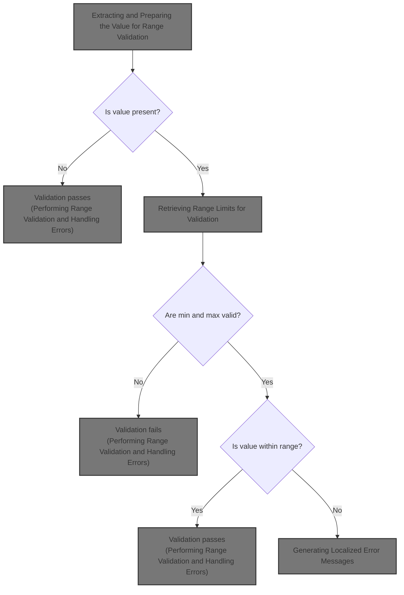
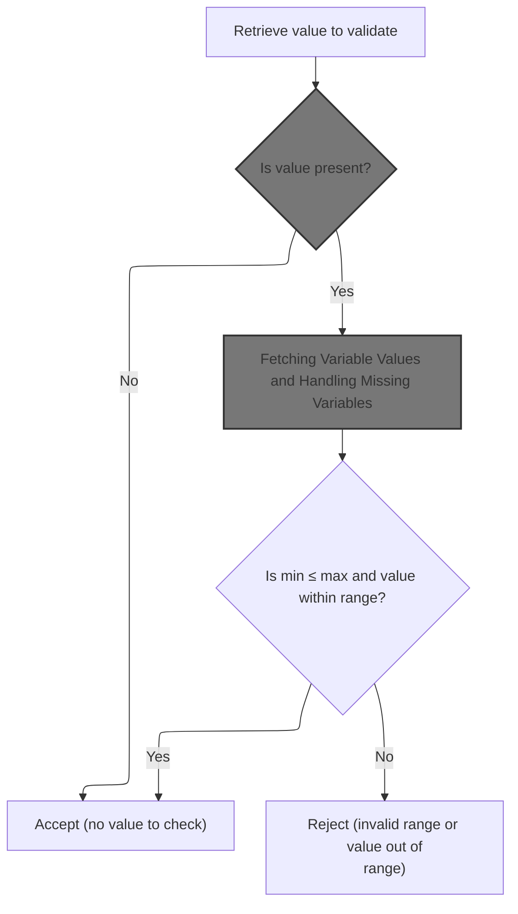
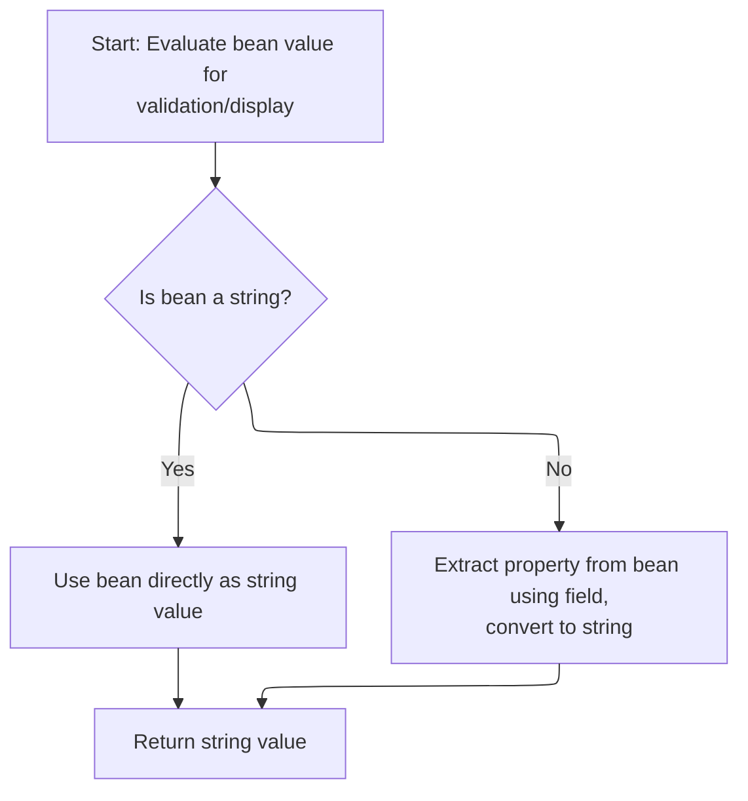
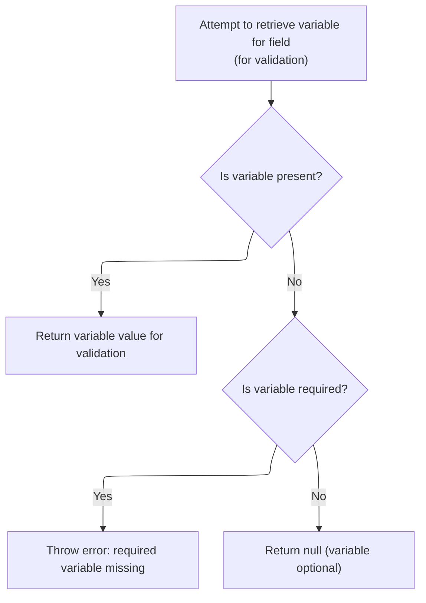
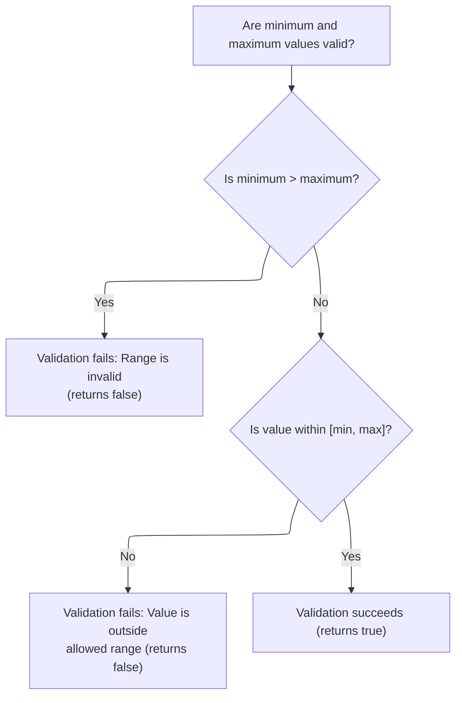
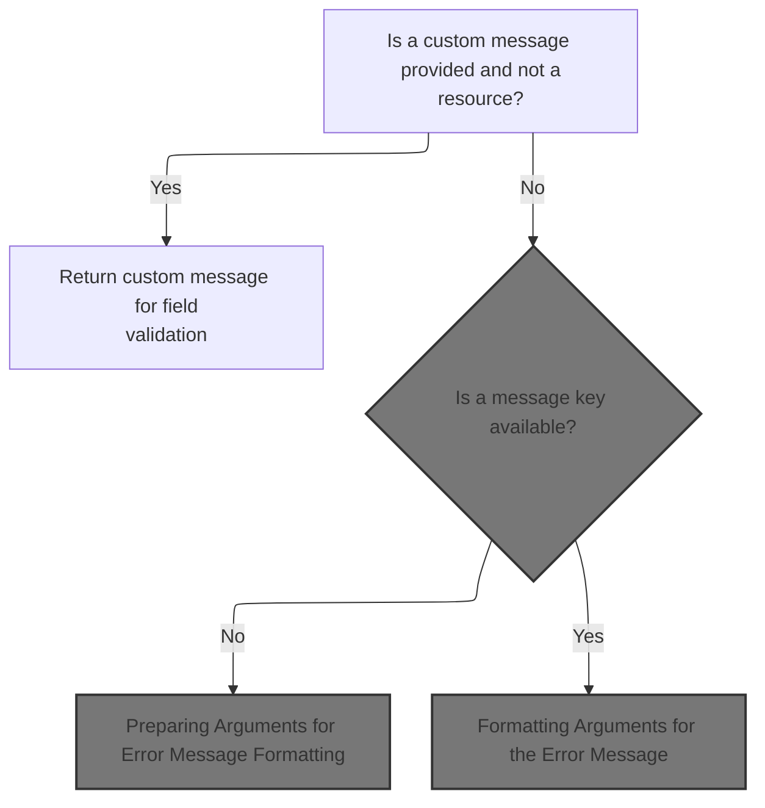
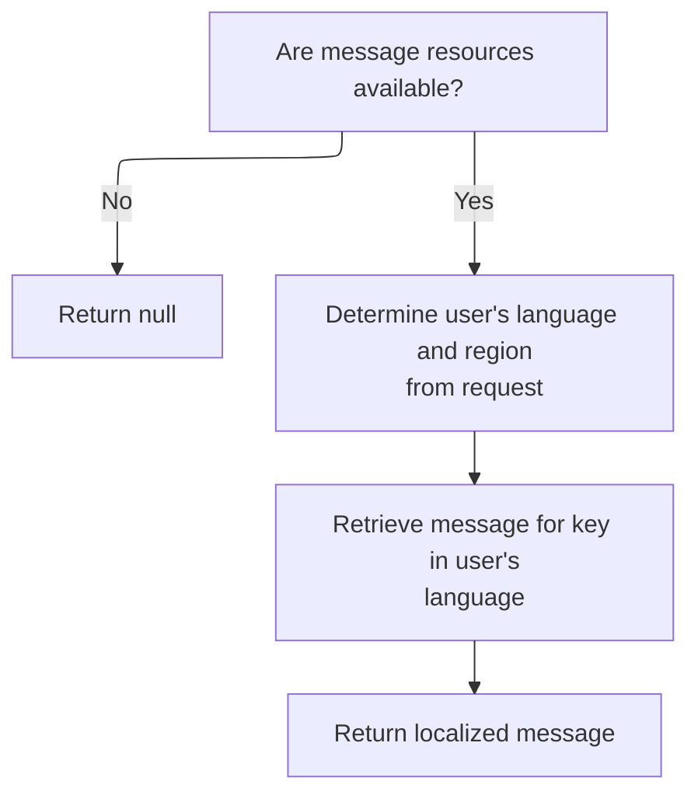
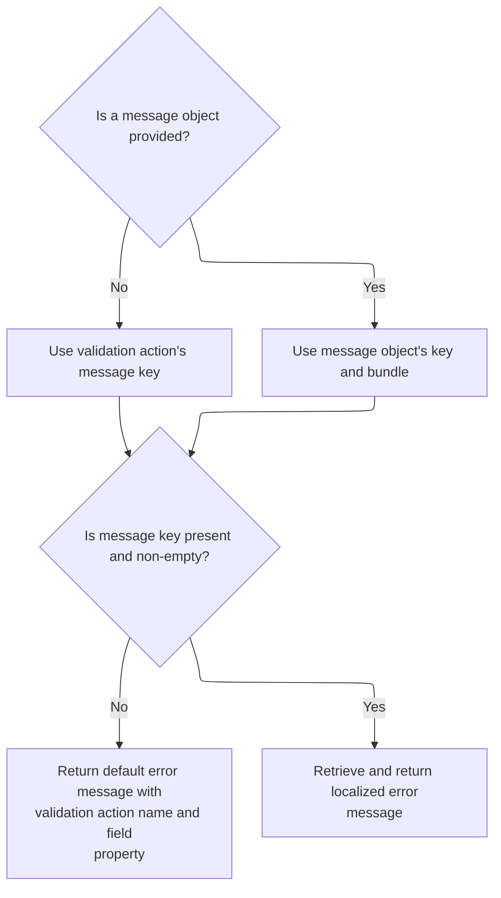
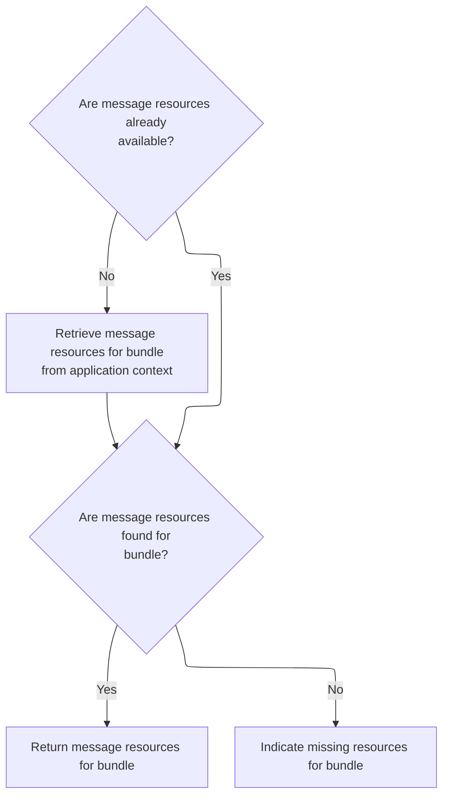
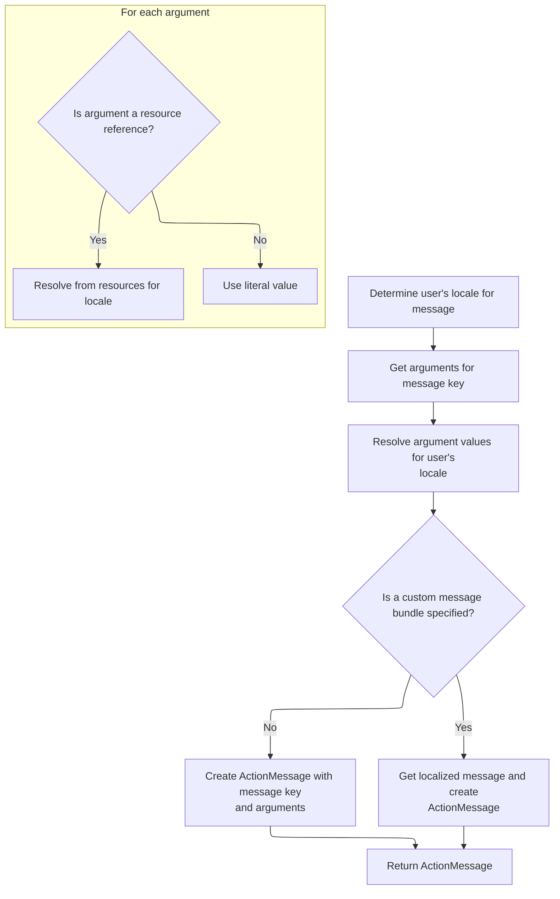

This document describes the process of validating user input against a configured integer range as part of form validation. The flow checks whether the input value is within the allowed range and provides localized feedback if it is not.



# Extracting and Preparing the Value for Range Validation



<SwmSnippet path="/core/src/main/java/org/apache/struts/validator/FieldChecks.java" line="976">

---

In <SwmToken path="core/src/main/java/org/apache/struts/validator/FieldChecks.java" pos="976:7:7" line-data="    public static boolean validateIntRange(Object bean, ValidatorAction va,">`validateIntRange`</SwmToken>, we grab the value from the bean using <SwmToken path="core/src/main/java/org/apache/struts/validator/FieldChecks.java" pos="982:5:5" line-data="            value = evaluateBean(bean, field);">`evaluateBean`</SwmToken>. This step ensures we get a string representation of the property, regardless of whether the bean is a string or a <SwmToken path="core/src/main/java/org/apache/struts/util/RequestUtils.java" pos="321:18:18" line-data="     * &lt;p&gt;Populate the properties of the specified JavaBean from the specified">`JavaBean`</SwmToken>. We need to call <SwmToken path="core/src/main/java/org/apache/struts/validator/FieldChecks.java" pos="982:5:5" line-data="            value = evaluateBean(bean, field);">`evaluateBean`</SwmToken> next because it handles the conversion and extraction logic, so we always end up with a string to validate against the integer range.

```java
    public static boolean validateIntRange(Object bean, ValidatorAction va,
        Field field, ActionMessages errors, Validator validator,
        HttpServletRequest request) {
        String value = null;

        try {
            value = evaluateBean(bean, field);
```

---

</SwmSnippet>

## Converting Bean Properties to String Values



<SwmSnippet path="/core/src/main/java/org/apache/struts/validator/FieldChecks.java" line="389">

---

<SwmToken path="core/src/main/java/org/apache/struts/validator/FieldChecks.java" pos="389:7:7" line-data="    private static String evaluateBean(Object bean, Field field) throws Exception {">`evaluateBean`</SwmToken> checks if the bean is already a string; if not, it calls <SwmToken path="core/src/main/java/org/apache/struts/validator/FieldChecks.java" pos="395:5:5" line-data="            value = getValueAsString(bean, field.getProperty());">`getValueAsString`</SwmToken> to convert the property value to a string. This lets us handle different bean types and ensures the value is ready for validation.

```java
    private static String evaluateBean(Object bean, Field field) throws Exception {
        String value;

        if (isString(bean)) {
            value = (String) bean;
        } else {
            value = getValueAsString(bean, field.getProperty());
        }

        return value;
    }
```

---

</SwmSnippet>

<SwmSnippet path="/core/src/main/java/org/apache/struts/validator/FieldChecks.java" line="87">

---

<SwmToken path="core/src/main/java/org/apache/struts/validator/FieldChecks.java" pos="87:7:7" line-data="    private static String getValueAsString(Object bean, String property) ">`getValueAsString`</SwmToken> pulls the property value from the bean and converts it to a string. It handles empty arrays and collections by returning an empty string, so we don't get weird outputs like '\[Ljava.lang.String;@hashcode' or '\[\]'. For other types, it just uses <SwmToken path="core/src/main/java/org/apache/struts/validator/FieldChecks.java" pos="96:23:23" line-data="            return ((String[]) value).length &gt; 0 ? value.toString() : &quot;&quot;;">`toString`</SwmToken>. If the property isn't accessible, it'll throw.

```java
    private static String getValueAsString(Object bean, String property) 
            throws Exception {
        
        Object value = PropertyUtils.getProperty(bean, property);
        if (value == null) {
            return null;
        }

        if (value instanceof String[]) {
            return ((String[]) value).length > 0 ? value.toString() : "";

        } else if (value instanceof Collection) {
            return ((Collection) value).isEmpty() ? "" : value.toString();

        } else {
            return value.toString();
        }
    }
```

---

</SwmSnippet>

## Retrieving Range Limits for Validation

<SwmSnippet path="/core/src/main/java/org/apache/struts/validator/FieldChecks.java" line="983">

---

Back in <SwmToken path="core/src/main/java/org/apache/struts/validator/FieldChecks.java" pos="976:7:7" line-data="    public static boolean validateIntRange(Object bean, ValidatorAction va,">`validateIntRange`</SwmToken>, after getting the value from <SwmToken path="core/src/main/java/org/apache/struts/validator/FieldChecks.java" pos="389:7:7" line-data="    private static String evaluateBean(Object bean, Field field) throws Exception {">`evaluateBean`</SwmToken>, we grab the min and max range limits using <SwmToken path="core/src/main/java/org/apache/struts/validator/FieldChecks.java" pos="985:1:3" line-data="                    Resources.getVarValue(&quot;min&quot;, field, validator, request, true);">`Resources.getVarValue`</SwmToken>. This lets us pull configurable values for validation, assuming they're valid integers. If they're missing or invalid, things break, but that's expected in this setup.

```java
            if (!GenericValidator.isBlankOrNull(value)) {
                String minVar =
                    Resources.getVarValue("min", field, validator, request, true);
                String maxVar =
                    Resources.getVarValue("max", field, validator, request, true);
```

---

</SwmSnippet>

## Fetching Variable Values and Handling Missing Variables



<SwmSnippet path="/core/src/main/java/org/apache/struts/validator/Resources.java" line="157">

---

In <SwmToken path="core/src/main/java/org/apache/struts/validator/Resources.java" pos="157:7:7" line-data="    public static String getVarValue(String varName, Field field,">`getVarValue`</SwmToken>, we check if the variable exists in the field. If it's missing, we use <SwmToken path="core/src/main/java/org/apache/struts/validator/Resources.java" pos="162:7:9" line-data="            String msg = sysmsgs.getMessage(&quot;variable.missing&quot;, varName);">`sysmsgs.getMessage`</SwmToken> to fetch a localized error message. This step ensures any missing variable is reported properly, and if required, we throw an exception. Next, we call PropertyMessageResources.getMessage to handle the localization.

```java
    public static String getVarValue(String varName, Field field,
        Validator validator, HttpServletRequest request, boolean required) {
        Var var = field.getVar(varName);

        if (var == null) {
            String msg = sysmsgs.getMessage("variable.missing", varName);

```

---

</SwmSnippet>

<SwmSnippet path="/core/src/main/java/org/apache/struts/util/PropertyMessageResources.java" line="227">

---

<SwmToken path="core/src/main/java/org/apache/struts/util/PropertyMessageResources.java" pos="227:5:5" line-data="    public String getMessage(Locale locale, String key) {">`getMessage`</SwmToken> tries to find a localized message for the given key and locale. If not found, it falls back depending on the mode (JSTL, resource bundle, or default), then checks the default properties file. Keys are constructed using <SwmToken path="core/src/main/java/org/apache/struts/util/PropertyMessageResources.java" pos="233:3:3" line-data="        String localeKey = localeKey(locale);">`localeKey`</SwmToken> and <SwmToken path="core/src/main/java/org/apache/struts/util/PropertyMessageResources.java" pos="234:7:7" line-data="        String originalKey = messageKey(localeKey, key);">`messageKey`</SwmToken> helpers. If nothing is found, it returns null or an error string.

```java
    public String getMessage(Locale locale, String key) {
        if (log.isDebugEnabled()) {
            log.debug("getMessage(" + locale + "," + key + ")");
        }

        // Initialize variables we will require
        String localeKey = localeKey(locale);
        String originalKey = messageKey(localeKey, key);
        String message = null;

        // Search the specified Locale
        message = findMessage(locale, key, originalKey);
        if (message != null) {
            return message;
        }

        // JSTL Compatibility - JSTL doesn't use the default locale
        if (mode == MODE_JSTL) {

           // do nothing (i.e. don't use default Locale)

        // PropertyResourcesBundle - searches through the hierarchy
        // for the default Locale (e.g. first en_US then en)
        } else if (mode == MODE_RESOURCE_BUNDLE) {

            if (!defaultLocale.equals(locale)) {
                message = findMessage(defaultLocale, key, originalKey);
            }

        // Default (backwards) Compatibility - just searches the
        // specified Locale (e.g. just en_US)
        } else {

            if (!defaultLocale.equals(locale)) {
                localeKey = localeKey(defaultLocale);
                message = findMessage(localeKey, key, originalKey);
            }

        }
        if (message != null) {
            return message;
        }

        // Find the message in the default properties file
        message = findMessage("", key, originalKey);
        if (message != null) {
            return message;
        }

        // Return an appropriate error indication
        if (returnNull) {
            return (null);
        } else {
            return ("???" + messageKey(locale, key) + "???");
        }
    }
```

---

</SwmSnippet>

<SwmSnippet path="/core/src/main/java/org/apache/struts/validator/Resources.java" line="164">

---

After getting the error message from <SwmToken path="core/src/main/java/org/apache/struts/util/PropertyMessageResources.java" pos="82:8:8" line-data=" * Configure &lt;code&gt;PropertyMessageResources&lt;/code&gt; to operate in this mode by">`PropertyMessageResources`</SwmToken>, <SwmToken path="core/src/main/java/org/apache/struts/validator/Resources.java" pos="178:3:3" line-data="        return getVarValue(var, application, request, required);">`getVarValue`</SwmToken> throws an exception if required is true. If not, it logs the issue and returns null. This controls whether missing variables halt validation or just get logged.

```java
            if (required) {
                throw new IllegalArgumentException(msg);
            }

            if (log.isDebugEnabled()) {
                log.debug(field.getProperty() + ": " + msg);
            }

            return null;
        }

        ServletContext application =
            (ServletContext) validator.getParameterValue(SERVLET_CONTEXT_PARAM);

        return getVarValue(var, application, request, required);
    }
```

---

</SwmSnippet>

## Performing Range Validation and Handling Errors



<SwmSnippet path="/core/src/main/java/org/apache/struts/validator/FieldChecks.java" line="988">

---

After returning from <SwmToken path="core/src/main/java/org/apache/struts/validator/FieldChecks.java" pos="985:1:3" line-data="                    Resources.getVarValue(&quot;min&quot;, field, validator, request, true);">`Resources.getVarValue`</SwmToken> in <SwmToken path="core/src/main/java/org/apache/struts/validator/FieldChecks.java" pos="976:7:7" line-data="    public static boolean validateIntRange(Object bean, ValidatorAction va,">`validateIntRange`</SwmToken>, we parse min, max, and the value as integers, check the range, and handle errors. If validation fails, we call <SwmToken path="core/src/main/java/org/apache/struts/validator/FieldChecks.java" pos="999:1:3" line-data="                        Resources.getActionMessage(validator, request, va, field));">`Resources.getActionMessage`</SwmToken> to create a localized error message and add it to the errors. This step assumes all values are valid integers.

```java
                int min = Integer.parseInt(minVar);
                int max = Integer.parseInt(maxVar);
                int intValue = Integer.parseInt(value);

                if (min > max) {
                    throw new IllegalArgumentException(sysmsgs.getMessage(
                            "invalid.range", minVar, maxVar));
                }

                if (!GenericValidator.isInRange(intValue, min, max)) {
                    errors.add(field.getKey(),
                        Resources.getActionMessage(validator, request, va, field));

                    return false;
                }
            }
        } catch (Exception e) {
            processFailure(errors, field, validator.getFormName(), "intRange", e);

            return false;
        }

        return true;
    }
```

---

</SwmSnippet>

# Generating Localized Error Messages



<SwmSnippet path="/core/src/main/java/org/apache/struts/validator/Resources.java" line="365">

---

In <SwmToken path="core/src/main/java/org/apache/struts/validator/Resources.java" pos="365:7:7" line-data="    public static ActionMessage getActionMessage(Validator validator,">`getActionMessage`</SwmToken>, we check if the message is a resource. If it is, we need to fetch the actual localized string, so we call ConfigHelper.getMessage next. If not, we just use the key directly.

```java
    public static ActionMessage getActionMessage(Validator validator,
        HttpServletRequest request, ValidatorAction va, Field field) {
        Msg msg = field.getMessage(va.getName());

        if ((msg != null) && !msg.isResource()) {
            return new ActionMessage(msg.getKey(), false);
        }

```

---

</SwmSnippet>

## Resolving Message Keys to Localized Strings



<SwmSnippet path="/core/src/main/java/org/apache/struts/config/ConfigHelper.java" line="496">

---

In <SwmToken path="core/src/main/java/org/apache/struts/config/ConfigHelper.java" pos="496:5:5" line-data="    public String getMessage(String key) {">`getMessage`</SwmToken>, we grab the <SwmToken path="core/src/main/java/org/apache/struts/config/ConfigHelper.java" pos="497:1:1" line-data="        MessageResources resources = getMessageResources();">`MessageResources`</SwmToken> and check for null. To get the right localized string, we call <SwmToken path="core/src/main/java/org/apache/struts/config/ConfigHelper.java" pos="503:7:9" line-data="        return resources.getMessage(RequestUtils.getUserLocale(request, null),">`RequestUtils.getUserLocale`</SwmToken> to figure out which locale to use for message retrieval.

```java
    public String getMessage(String key) {
        MessageResources resources = getMessageResources();

        if (resources == null) {
            return null;
        }

        return resources.getMessage(RequestUtils.getUserLocale(request, null),
```

---

</SwmSnippet>

<SwmSnippet path="/core/src/main/java/org/apache/struts/util/RequestUtils.java" line="299">

---

<SwmToken path="core/src/main/java/org/apache/struts/util/RequestUtils.java" pos="299:7:7" line-data="    public static Locale getUserLocale(HttpServletRequest request, String locale) {">`getUserLocale`</SwmToken> checks the session for a Locale object using the locale parameter as a key. If nothing's found, it falls back to the request's locale, so we always get a valid Locale for message lookup.

```java
    public static Locale getUserLocale(HttpServletRequest request, String locale) {
        Locale userLocale = null;
        HttpSession session = request.getSession(false);

        if (locale == null) {
            locale = Globals.LOCALE_KEY;
        }

        // Only check session if sessions are enabled
        if (session != null) {
            userLocale = (Locale) session.getAttribute(locale);
        }

        if (userLocale == null) {
            // Returns Locale based on Accept-Language header or the server default
            userLocale = request.getLocale();
        }

        return userLocale;
    }
```

---

</SwmSnippet>

<SwmSnippet path="/core/src/main/java/org/apache/struts/config/ConfigHelper.java" line="503">

---

After getting the locale from <SwmToken path="core/src/main/java/org/apache/struts/config/ConfigHelper.java" pos="503:7:7" line-data="        return resources.getMessage(RequestUtils.getUserLocale(request, null),">`RequestUtils`</SwmToken> in `ConfigHelper.getMessage`, we use it to fetch the localized message from <SwmToken path="core/src/main/java/org/apache/struts/validator/Resources.java" pos="117:5:5" line-data="    public static MessageResources getMessageResources(">`MessageResources`</SwmToken>. This ensures the error message matches the user's language.

```java
        return resources.getMessage(RequestUtils.getUserLocale(request, null),
            key);
    }
```

---

</SwmSnippet>

<SwmSnippet path="/core/src/main/java/org/apache/struts/validator/Resources.java" line="249">

---

<SwmToken path="core/src/main/java/org/apache/struts/validator/Resources.java" pos="249:7:7" line-data="    public static String getMessage(HttpServletRequest request, String key) {">`getMessage`</SwmToken> grabs the <SwmToken path="core/src/main/java/org/apache/struts/validator/Resources.java" pos="250:1:1" line-data="        MessageResources messages = getMessageResources(request);">`MessageResources`</SwmToken> and then calls <SwmToken path="core/src/main/java/org/apache/struts/validator/Resources.java" pos="252:8:10" line-data="        return getMessage(messages, RequestUtils.getUserLocale(request, null),">`RequestUtils.getUserLocale`</SwmToken> to get the user's locale. This step is needed to fetch the right localized message for the given key.

```java
    public static String getMessage(HttpServletRequest request, String key) {
        MessageResources messages = getMessageResources(request);

        return getMessage(messages, RequestUtils.getUserLocale(request, null),
            key);
    }
```

---

</SwmSnippet>

## Preparing Arguments for Error Message Formatting



<SwmSnippet path="/core/src/main/java/org/apache/struts/validator/Resources.java" line="373">

---

After returning from ConfigHelper.getMessage in <SwmToken path="core/src/main/java/org/apache/struts/validator/FieldChecks.java" pos="999:1:3" line-data="                        Resources.getActionMessage(validator, request, va, field));">`Resources.getActionMessage`</SwmToken>, we figure out the message key and bundle, then call <SwmToken path="core/src/main/java/org/apache/struts/validator/Resources.java" pos="391:1:1" line-data="            getMessageResources(application, request, msgBundle);">`getMessageResources`</SwmToken> to get the right resources for formatting the error message.

```java
        String msgKey = null;
        String msgBundle = null;

        if (msg == null) {
            msgKey = va.getMsg();
        } else {
            msgKey = msg.getKey();
            msgBundle = msg.getBundle();
        }

        if ((msgKey == null) || (msgKey.length() == 0)) {
            return new ActionMessage("??? " + va.getName() + "."
                + field.getProperty() + " ???", false);
        }

        ServletContext application =
            (ServletContext) validator.getParameterValue(SERVLET_CONTEXT_PARAM);
        MessageResources messages =
            getMessageResources(application, request, msgBundle);
```

---

</SwmSnippet>

## Locating the Correct Message Resource Bundle

<SwmSnippet path="/core/src/main/java/org/apache/struts/validator/Resources.java" line="117">

---

In <SwmToken path="core/src/main/java/org/apache/struts/validator/Resources.java" pos="117:7:7" line-data="    public static MessageResources getMessageResources(">`getMessageResources`</SwmToken>, we first check the request for <SwmToken path="core/src/main/java/org/apache/struts/validator/Resources.java" pos="117:5:5" line-data="    public static MessageResources getMessageResources(">`MessageResources`</SwmToken> using the bundle key. If not found, we grab the module prefix using ModuleUtils.getModuleConfig and try again in the application scope with the bundle plus prefix. If still not found, we fallback to just the bundle key.

```java
    public static MessageResources getMessageResources(
        ServletContext application, HttpServletRequest request, String bundle) {
        if (bundle == null) {
            bundle = Globals.MESSAGES_KEY;
        }

        MessageResources resources =
            (MessageResources) request.getAttribute(bundle);

        if (resources == null) {
            ModuleConfig moduleConfig =
                ModuleUtils.getInstance().getModuleConfig(request, application);

            resources =
                (MessageResources) application.getAttribute(bundle
                    + moduleConfig.getPrefix());
        }

```

---

</SwmSnippet>

### Determining the Module Configuration

<SwmSnippet path="/core/src/main/java/org/apache/struts/util/ModuleUtils.java" line="130">

---

<SwmToken path="core/src/main/java/org/apache/struts/util/ModuleUtils.java" pos="130:5:5" line-data="    public ModuleConfig getModuleConfig(HttpServletRequest request,">`getModuleConfig`</SwmToken> checks the request for a <SwmToken path="core/src/main/java/org/apache/struts/util/ModuleUtils.java" pos="130:3:3" line-data="    public ModuleConfig getModuleConfig(HttpServletRequest request,">`ModuleConfig`</SwmToken>. If not found, it falls back to the context with an empty prefix, making sure we always get a valid module configuration.

```java
    public ModuleConfig getModuleConfig(HttpServletRequest request,
        ServletContext context) {
        ModuleConfig moduleConfig = this.getModuleConfig(request);

        if (moduleConfig == null) {
            moduleConfig = this.getModuleConfig("", context);
            request.setAttribute(Globals.MODULE_KEY, moduleConfig);
        }

        return moduleConfig;
    }
```

---

</SwmSnippet>

<SwmSnippet path="/core/src/main/java/org/apache/struts/util/ModuleUtils.java" line="89">

---

<SwmToken path="core/src/main/java/org/apache/struts/util/ModuleUtils.java" pos="89:5:5" line-data="    public ModuleConfig getModuleConfig(String prefix, ServletContext context) {">`getModuleConfig`</SwmToken> with prefix checks if the prefix is null or '/'. If so, it grabs the default module config from the context using <SwmToken path="core/src/main/java/org/apache/struts/util/ModuleUtils.java" pos="91:11:13" line-data="            return (ModuleConfig) context.getAttribute(Globals.MODULE_KEY);">`Globals.MODULE_KEY`</SwmToken>. Otherwise, it looks up the config using <SwmToken path="core/src/main/java/org/apache/struts/util/ModuleUtils.java" pos="91:11:13" line-data="            return (ModuleConfig) context.getAttribute(Globals.MODULE_KEY);">`Globals.MODULE_KEY`</SwmToken> plus the prefix.

```java
    public ModuleConfig getModuleConfig(String prefix, ServletContext context) {
        if ((prefix == null) || "/".equals(prefix)) {
            return (ModuleConfig) context.getAttribute(Globals.MODULE_KEY);
        } else {
            return (ModuleConfig) context.getAttribute(Globals.MODULE_KEY
                + prefix);
        }
    }
```

---

</SwmSnippet>

### Finalizing Message Resource Retrieval



<SwmSnippet path="/core/src/main/java/org/apache/struts/validator/Resources.java" line="135">

---

After returning from <SwmToken path="core/src/main/java/org/apache/struts/validator/Resources.java" pos="128:1:1" line-data="                ModuleUtils.getInstance().getModuleConfig(request, application);">`ModuleUtils`</SwmToken> in <SwmToken path="core/src/main/java/org/apache/struts/validator/Resources.java" pos="117:7:7" line-data="    public static MessageResources getMessageResources(">`getMessageResources`</SwmToken>, if we still can't find <SwmToken path="core/src/main/java/org/apache/struts/validator/Resources.java" pos="136:6:6" line-data="            resources = (MessageResources) application.getAttribute(bundle);">`MessageResources`</SwmToken>, we fallback to just the bundle key in the application. If nothing's found, we throw a <SwmToken path="core/src/main/java/org/apache/struts/validator/Resources.java" pos="140:5:5" line-data="            throw new NullPointerException(">`NullPointerException`</SwmToken>. This ensures we always have resources or fail fast.

```java
        if (resources == null) {
            resources = (MessageResources) application.getAttribute(bundle);
        }

        if (resources == null) {
            throw new NullPointerException(
                "No message resources found for bundle: " + bundle);
        }

        return resources;
    }
```

---

</SwmSnippet>

## Formatting Arguments for the Error Message



<SwmSnippet path="/core/src/main/java/org/apache/struts/validator/Resources.java" line="392">

---

After getting <SwmToken path="core/src/main/java/org/apache/struts/validator/Resources.java" pos="117:5:5" line-data="    public static MessageResources getMessageResources(">`MessageResources`</SwmToken> in <SwmToken path="core/src/main/java/org/apache/struts/validator/FieldChecks.java" pos="999:1:3" line-data="                        Resources.getActionMessage(validator, request, va, field));">`Resources.getActionMessage`</SwmToken>, we call <SwmToken path="core/src/main/java/org/apache/struts/validator/Resources.java" pos="392:7:9" line-data="        Locale locale = RequestUtils.getUserLocale(request, null);">`RequestUtils.getUserLocale`</SwmToken> to get the user's locale. This is needed to format the error message arguments in the right language.

```java
        Locale locale = RequestUtils.getUserLocale(request, null);

```

---

</SwmSnippet>

<SwmSnippet path="/core/src/main/java/org/apache/struts/validator/Resources.java" line="394">

---

After getting the locale in <SwmToken path="core/src/main/java/org/apache/struts/validator/FieldChecks.java" pos="999:1:3" line-data="                        Resources.getActionMessage(validator, request, va, field));">`Resources.getActionMessage`</SwmToken>, we call <SwmToken path="core/src/main/java/org/apache/struts/validator/Resources.java" pos="394:11:11" line-data="        Arg[] args = field.getArgs(va.getName());">`getArgs`</SwmToken> to pull and localize the arguments from the field. This step ensures the error message is formatted with the right values.

```java
        Arg[] args = field.getArgs(va.getName());
```

---

</SwmSnippet>

<SwmSnippet path="/core/src/main/java/org/apache/struts/validator/Resources.java" line="420">

---

<SwmToken path="core/src/main/java/org/apache/struts/validator/Resources.java" pos="420:9:9" line-data="    public static String[] getArgs(String actionName,">`getArgs`</SwmToken> grabs up to four arguments from the field for the action name. For each, if it's a resource, it fetches the localized message; otherwise, it uses the key directly. This setup is hardcoded to four, which is a repo-specific convention.

```java
    public static String[] getArgs(String actionName,
        MessageResources messages, Locale locale, Field field) {
        String[] argMessages = new String[4];

        Arg[] args =
            new Arg[] {
                field.getArg(actionName, 0), field.getArg(actionName, 1),
                field.getArg(actionName, 2), field.getArg(actionName, 3)
            };

        for (int i = 0; i < args.length; i++) {
            if (args[i] == null) {
                continue;
            }

            if (args[i].isResource()) {
                argMessages[i] = getMessage(messages, locale, args[i].getKey());
            } else {
                argMessages[i] = args[i].getKey();
            }
        }
```

---

</SwmSnippet>

<SwmSnippet path="/core/src/main/java/org/apache/struts/validator/Resources.java" line="395">

---

After getting the argument keys in <SwmToken path="core/src/main/java/org/apache/struts/validator/FieldChecks.java" pos="999:1:3" line-data="                        Resources.getActionMessage(validator, request, va, field));">`Resources.getActionMessage`</SwmToken>, we call <SwmToken path="core/src/main/java/org/apache/struts/validator/Resources.java" pos="396:1:1" line-data="            getArgValues(application, request, messages, locale, args);">`getArgValues`</SwmToken> to resolve their actual values, handling localization and bundle-specific lookups. This step finalizes the argument values for the error message.

```java
        String[] argValues =
            getArgValues(application, request, messages, locale, args);

```

---

</SwmSnippet>

<SwmSnippet path="/core/src/main/java/org/apache/struts/validator/Resources.java" line="455">

---

<SwmToken path="core/src/main/java/org/apache/struts/validator/Resources.java" pos="455:9:9" line-data="    private static String[] getArgValues(ServletContext application,">`getArgValues`</SwmToken> loops through the arguments, checking if each is a resource. If so, it fetches the localized value, using a bundle if specified. Otherwise, it just uses the key. This step ensures argument values are properly localized and bundled.

```java
    private static String[] getArgValues(ServletContext application,
        HttpServletRequest request, MessageResources defaultMessages,
        Locale locale, Arg[] args) {
        if ((args == null) || (args.length == 0)) {
            return null;
        }

        String[] values = new String[args.length];

        for (int i = 0; i < args.length; i++) {
            if (args[i] != null) {
                if (args[i].isResource()) {
                    MessageResources messages = defaultMessages;

                    if (args[i].getBundle() != null) {
                        messages =
                            getMessageResources(application, request,
                                args[i].getBundle());
                    }

                    values[i] = messages.getMessage(locale, args[i].getKey());
                } else {
                    values[i] = args[i].getKey();
                }
            }
        }

        return values;
    }
```

---

</SwmSnippet>

<SwmSnippet path="/core/src/main/java/org/apache/struts/validator/Resources.java" line="398">

---

After resolving argument values in <SwmToken path="core/src/main/java/org/apache/struts/validator/FieldChecks.java" pos="999:1:3" line-data="                        Resources.getActionMessage(validator, request, va, field));">`Resources.getActionMessage`</SwmToken>, we build the <SwmToken path="core/src/main/java/org/apache/struts/validator/Resources.java" pos="398:1:1" line-data="        ActionMessage actionMessage = null;">`ActionMessage`</SwmToken>. If <SwmToken path="core/src/main/java/org/apache/struts/validator/Resources.java" pos="400:4:4" line-data="        if (msgBundle == null) {">`msgBundle`</SwmToken> is null, we use the <SwmToken path="core/src/main/java/org/apache/struts/validator/Resources.java" pos="401:9:9" line-data="            actionMessage = new ActionMessage(msgKey, argValues);">`msgKey`</SwmToken> and <SwmToken path="core/src/main/java/org/apache/struts/validator/Resources.java" pos="401:12:12" line-data="            actionMessage = new ActionMessage(msgKey, argValues);">`argValues`</SwmToken>; if not, we fetch the localized message and use that. This wraps up error message creation.

```java
        ActionMessage actionMessage = null;

        if (msgBundle == null) {
            actionMessage = new ActionMessage(msgKey, argValues);
        } else {
            String message = messages.getMessage(locale, msgKey, argValues);

            actionMessage = new ActionMessage(message, false);
        }

        return actionMessage;
    }
```

---

</SwmSnippet>

&nbsp;

*This is an auto-generated document by Swimm 🌊 and has not yet been verified by a human*

<SwmMeta version="3.0.0" repo-id="Z2l0aHViJTNBJTNBc3RydXRzMSUzQSUzQVN3aW1tLURlbW8=" repo-name="struts1"><sup>Powered by [Swimm](https://app.swimm.io/)</sup></SwmMeta>
