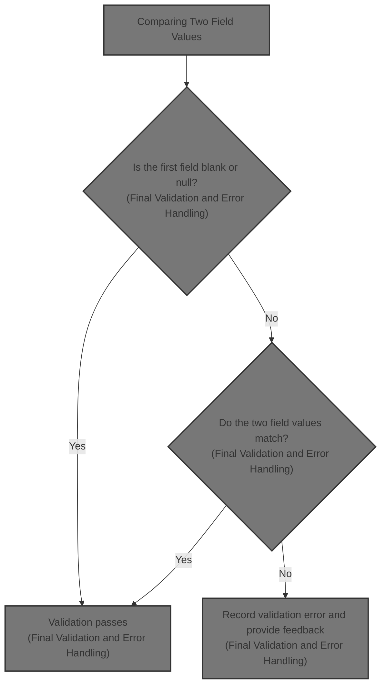
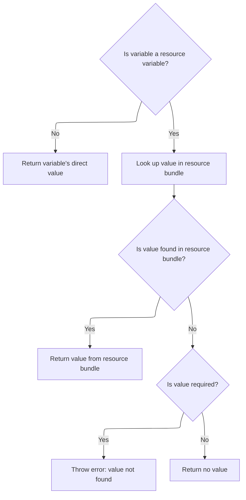
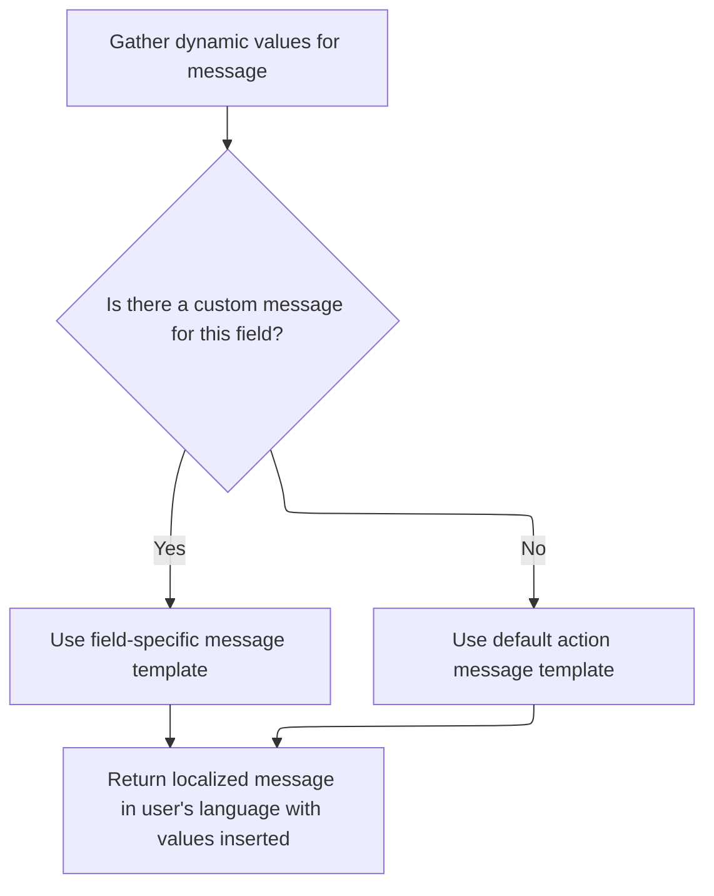
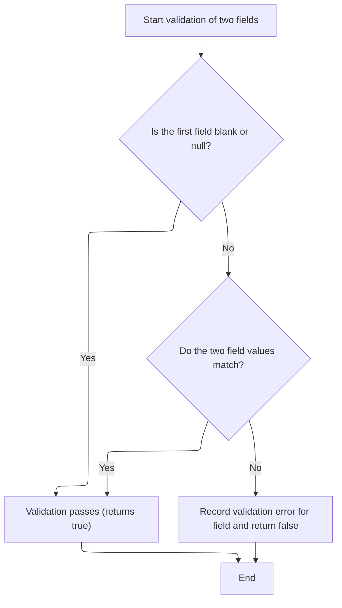
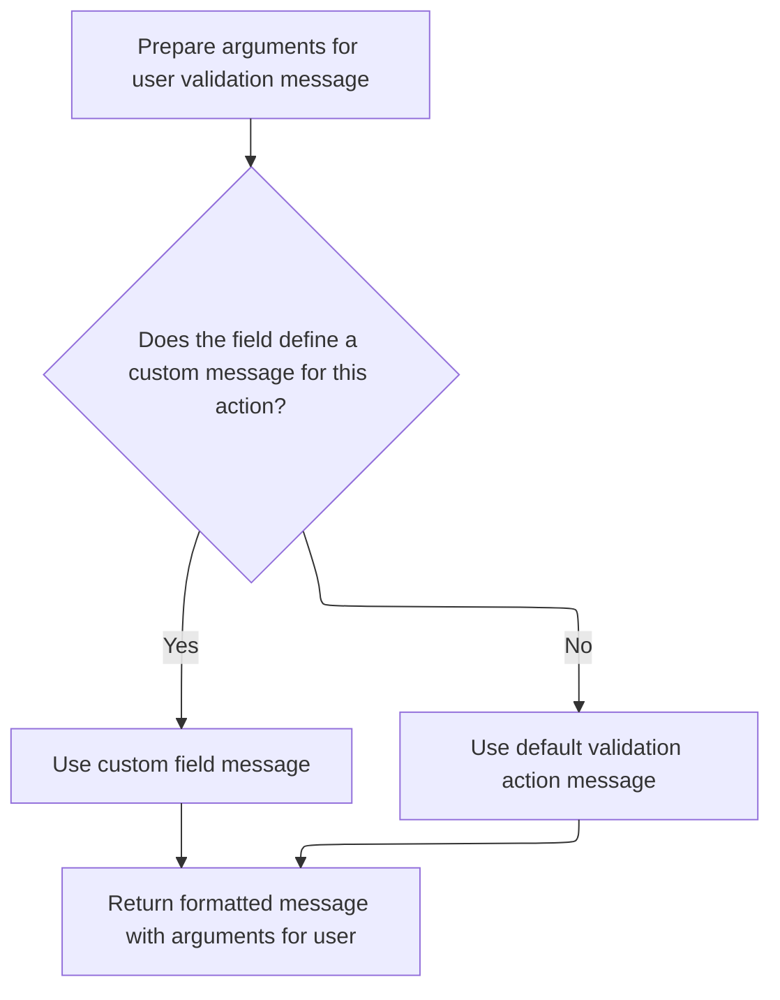

This document outlines the process for ensuring that two related fields in a form contain matching values. When a user submits a form, the system checks these fields and, if they do not match, provides a localized error message to guide the user.



# Comparing Two Field Values

<SwmSnippet path="/apps/cookbook/src/main/java/examples/validator/CustomValidator.java" line="57">

---

In <SwmToken path="apps/cookbook/src/main/java/examples/validator/CustomValidator.java" pos="57:7:7" line-data="    public static boolean validateTwoFields(">`validateTwoFields`</SwmToken>, we grab the values of two properties from the bean using <SwmToken path="apps/cookbook/src/main/java/examples/validator/CustomValidator.java" pos="65:1:1" line-data="            ValidatorUtils.getValueAsString(bean, field.getProperty());">`ValidatorUtils`</SwmToken>. The function expects the Field object to have a <SwmToken path="apps/cookbook/src/main/java/examples/validator/CustomValidator.java" pos="66:12:12" line-data="        String property2 = field.getVarValue(&quot;secondProperty&quot;);">`secondProperty`</SwmToken> variable, which isn't obvious from the signature. We need to call Resources next to handle error messaging if the validation fails.

```java
    public static boolean validateTwoFields(
        Object bean,
        ValidatorAction va,
        Field field,
        ActionMessages errors,
        HttpServletRequest request) {

        String value =
            ValidatorUtils.getValueAsString(bean, field.getProperty());
        String property2 = field.getVarValue("secondProperty");
```

---

</SwmSnippet>

## Resolving Variable Values from Resources



<SwmSnippet path="/core/src/main/java/org/apache/struts/validator/Resources.java" line="190">

---

In <SwmToken path="core/src/main/java/org/apache/struts/validator/Resources.java" pos="190:7:7" line-data="    public static String getVarValue(Var var, ServletContext application,">`getVarValue`</SwmToken>, we check if the variable is a resource. If it is, we fetch message resources using the bundle key, which might be module-specific. This sets up the context for retrieving localized or dynamic values.

```java
    public static String getVarValue(Var var, ServletContext application,
        HttpServletRequest request, boolean required) {
        String varName = var.getName();
        String varValue = var.getValue();

        // Non-resource variable
        if (!var.isResource()) {
            return varValue;
        }

        // Get the message resources
        String bundle = var.getBundle();
        MessageResources messages =
            getMessageResources(application, request, bundle);

```

---

</SwmSnippet>

<SwmSnippet path="/core/src/main/java/org/apache/struts/validator/Resources.java" line="117">

---

<SwmToken path="core/src/main/java/org/apache/struts/validator/Resources.java" pos="117:7:7" line-data="    public static MessageResources getMessageResources(">`getMessageResources`</SwmToken> tries to find message resources in the request, then falls back to the application context with module-specific prefixes, and finally checks the global key. This covers different scopes and modular setups.

```java
    public static MessageResources getMessageResources(
        ServletContext application, HttpServletRequest request, String bundle) {
        if (bundle == null) {
            bundle = Globals.MESSAGES_KEY;
        }

        MessageResources resources =
            (MessageResources) request.getAttribute(bundle);

        if (resources == null) {
            ModuleConfig moduleConfig =
                ModuleUtils.getInstance().getModuleConfig(request, application);

            resources =
                (MessageResources) application.getAttribute(bundle
                    + moduleConfig.getPrefix());
        }

        if (resources == null) {
            resources = (MessageResources) application.getAttribute(bundle);
        }

        if (resources == null) {
            throw new NullPointerException(
                "No message resources found for bundle: " + bundle);
        }

        return resources;
    }
```

---

</SwmSnippet>

<SwmSnippet path="/core/src/main/java/org/apache/struts/validator/Resources.java" line="205">

---

After returning from <SwmToken path="core/src/main/java/org/apache/struts/validator/Resources.java" pos="117:7:7" line-data="    public static MessageResources getMessageResources(">`getMessageResources`</SwmToken>, we use the locale to fetch the variable's value from message resources. If it's missing and required, we throw an exception. This step ensures we have the right localized value before continuing.

```java
        // Retrieve variable's value from message resources
        Locale locale = RequestUtils.getUserLocale(request, null);
        String value = messages.getMessage(locale, varValue, null);

        // Not found in message resources
        if ((value == null) && required) {
            throw new IllegalArgumentException(sysmsgs.getMessage(
                    "variable.resource.notfound", varName, varValue, bundle));
        }

        if (log.isDebugEnabled()) {
            log.debug("Var=[" + varName + "], " + "bundle=[" + bundle + "], "
                + "key=[" + varValue + "], " + "value=[" + value + "]");
        }

        return value;
    }
```

---

</SwmSnippet>

## Building Localized Error Messages



<SwmSnippet path="/core/src/main/java/org/apache/struts/validator/Resources.java" line="265">

---

In <SwmToken path="core/src/main/java/org/apache/struts/validator/Resources.java" pos="265:7:7" line-data="    public static String getMessage(MessageResources messages, Locale locale,">`getMessage`</SwmToken>, we call <SwmToken path="core/src/main/java/org/apache/struts/validator/Resources.java" pos="267:9:9" line-data="        String[] args = getArgs(va.getName(), messages, locale, field);">`getArgs`</SwmToken> to assemble arguments for the error message. These arguments are pulled from the field object and are used to fill placeholders in the localized message.

```java
    public static String getMessage(MessageResources messages, Locale locale,
        ValidatorAction va, Field field) {
        String[] args = getArgs(va.getName(), messages, locale, field);
```

---

</SwmSnippet>

<SwmSnippet path="/core/src/main/java/org/apache/struts/validator/Resources.java" line="420">

---

<SwmToken path="core/src/main/java/org/apache/struts/validator/Resources.java" pos="420:9:9" line-data="    public static String[] getArgs(String actionName,">`getArgs`</SwmToken> grabs up to four arguments from the field, checks if each is a resource, and fetches their localized values if needed. Anything beyond four is ignored, so error messages can't have more than four dynamic arguments.

```java
    public static String[] getArgs(String actionName,
        MessageResources messages, Locale locale, Field field) {
        String[] argMessages = new String[4];

        Arg[] args =
            new Arg[] {
                field.getArg(actionName, 0), field.getArg(actionName, 1),
                field.getArg(actionName, 2), field.getArg(actionName, 3)
            };

        for (int i = 0; i < args.length; i++) {
            if (args[i] == null) {
                continue;
            }

            if (args[i].isResource()) {
                argMessages[i] = getMessage(messages, locale, args[i].getKey());
            } else {
                argMessages[i] = args[i].getKey();
            }
        }
```

---

</SwmSnippet>

<SwmSnippet path="/core/src/main/java/org/apache/struts/validator/Resources.java" line="268">

---

After returning from <SwmToken path="core/src/main/java/org/apache/struts/validator/Resources.java" pos="267:9:9" line-data="        String[] args = getArgs(va.getName(), messages, locale, field);">`getArgs`</SwmToken>, we pick the error message from the field if it's set, otherwise use the action's default. The arguments are injected into the message for localization and customization.

```java
        String msg =
            (field.getMsg(va.getName()) != null) ? field.getMsg(va.getName())
                                                 : va.getMsg();

        return messages.getMessage(locale, msg, args);
    }
```

---

</SwmSnippet>

## Final Validation and Error Handling



<SwmSnippet path="/apps/cookbook/src/main/java/examples/validator/CustomValidator.java" line="67">

---

Back in <SwmToken path="apps/cookbook/src/main/java/examples/validator/CustomValidator.java" pos="57:7:7" line-data="    public static boolean validateTwoFields(">`validateTwoFields`</SwmToken>, we compare the two values only if the first isn't blank or null. If they don't match, we add an error message using <SwmToken path="apps/cookbook/src/main/java/examples/validator/CustomValidator.java" pos="74:1:3" line-data="                        Resources.getActionMessage(request, va, field));">`Resources.getActionMessage`</SwmToken> and return false. Otherwise, validation passes.

```java
        String value2 = ValidatorUtils.getValueAsString(bean, property2);

        if (!GenericValidator.isBlankOrNull(value)) {
            try {
                if (!value.equals(value2)) {
                    errors.add(
                        field.getKey(),
                        Resources.getActionMessage(request, va, field));

                    return false;
                }
            } catch (Exception e) {
                errors.add(
                    field.getKey(),
                    Resources.getActionMessage(request, va, field));
                return false;
            }
        }
        return true;
    }
```

---

</SwmSnippet>

# Creating Action Messages for Validation Errors



<SwmSnippet path="/core/src/main/java/org/apache/struts/validator/Resources.java" line="342">

---

In <SwmToken path="core/src/main/java/org/apache/struts/validator/Resources.java" pos="342:7:7" line-data="    public static ActionMessage getActionMessage(HttpServletRequest request,">`getActionMessage`</SwmToken>, we assemble arguments for the error message using <SwmToken path="core/src/main/java/org/apache/struts/validator/Resources.java" pos="345:1:1" line-data="            getArgs(va.getName(), getMessageResources(request),">`getArgs`</SwmToken> and <SwmToken path="core/src/main/java/org/apache/struts/validator/Resources.java" pos="345:10:10" line-data="            getArgs(va.getName(), getMessageResources(request),">`getMessageResources`</SwmToken>. This sets up the localized and context-aware error message before it's created.

```java
    public static ActionMessage getActionMessage(HttpServletRequest request,
        ValidatorAction va, Field field) {
        String[] args =
            getArgs(va.getName(), getMessageResources(request),
                RequestUtils.getUserLocale(request, null), field);

```

---

</SwmSnippet>

<SwmSnippet path="/core/src/main/java/org/apache/struts/validator/Resources.java" line="348">

---

After returning from <SwmToken path="apps/cookbook/src/main/java/examples/validator/CustomValidator.java" pos="74:3:3" line-data="                        Resources.getActionMessage(request, va, field));">`getActionMessage`</SwmToken>, we create the <SwmToken path="core/src/main/java/org/apache/struts/validator/Resources.java" pos="352:5:5" line-data="        return new ActionMessage(msg, args);">`ActionMessage`</SwmToken> with the chosen message and arguments. This makes the error message dynamic and ready for localization.

```java
        String msg =
            (field.getMsg(va.getName()) != null) ? field.getMsg(va.getName())
                                                 : va.getMsg();

        return new ActionMessage(msg, args);
    }
```

---

</SwmSnippet>

&nbsp;

*This is an auto-generated document by Swimm 🌊 and has not yet been verified by a human*

<SwmMeta version="3.0.0" repo-id="Z2l0aHViJTNBJTNBc3RydXRzMSUzQSUzQVN3aW1tLURlbW8=" repo-name="struts1"><sup>Powered by [Swimm](https://app.swimm.io/)</sup></SwmMeta>
