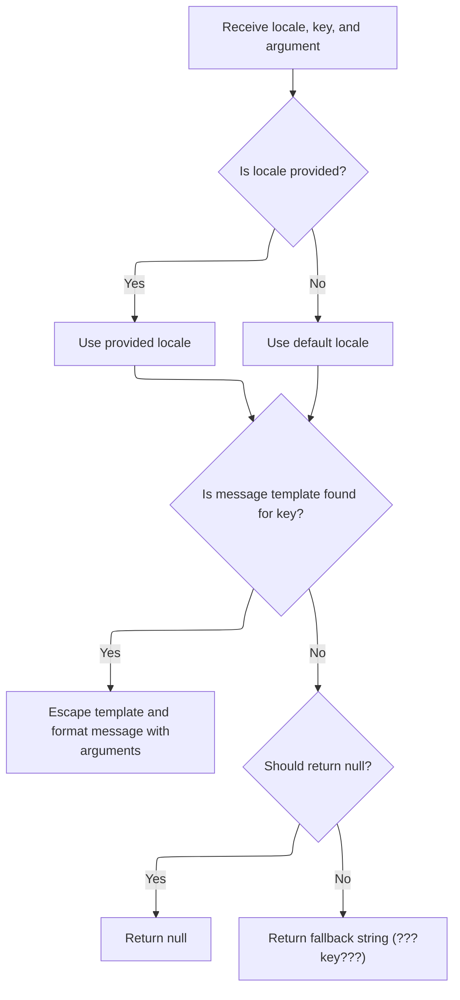
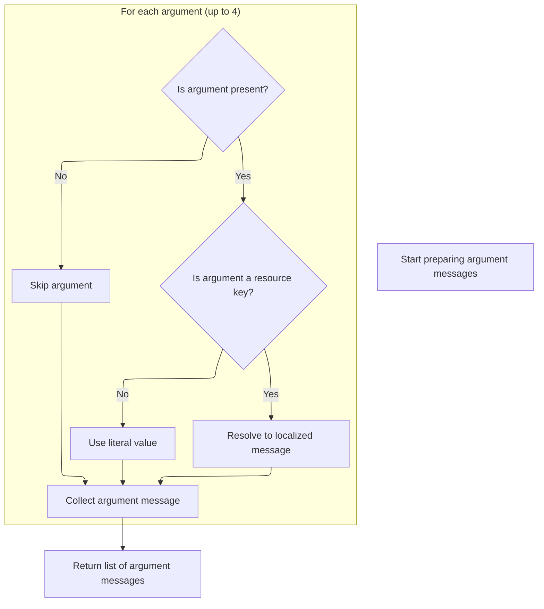
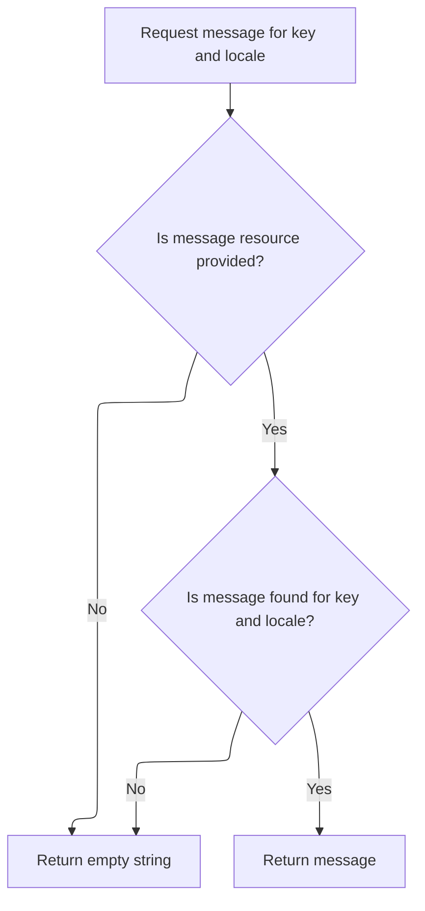

This document describes how the system checks that two related fields in a user-submitted form have matching values. The process supports localization for both field names and error messages, ensuring users receive feedback in their preferred language if the values do not match.

# Comparing Two Field Values

<SwmSnippet path="/apps/cookbook/src/main/java/examples/validator/CustomValidator.java" line="57">

---

In <SwmToken path="apps/cookbook/src/main/java/examples/validator/CustomValidator.java" pos="57:7:7" line-data="    public static boolean validateTwoFields(">`validateTwoFields`</SwmToken>, we're grabbing the value of the main field and then pulling the name of the second property to compare from the field's variables (using <SwmToken path="apps/cookbook/src/main/java/examples/validator/CustomValidator.java" pos="66:12:12" line-data="        String property2 = field.getVarValue(&quot;secondProperty&quot;);">`secondProperty`</SwmToken>). This is a hidden contract: if <SwmToken path="apps/cookbook/src/main/java/examples/validator/CustomValidator.java" pos="66:12:12" line-data="        String property2 = field.getVarValue(&quot;secondProperty&quot;);">`secondProperty`</SwmToken> isn't set up in the Field, the logic won't work. We need to call into <SwmPath>[core/…/validator/Resources.java](core/src/main/java/org/apache/struts/validator/Resources.java)</SwmPath> next because <SwmToken path="apps/cookbook/src/main/java/examples/validator/CustomValidator.java" pos="66:7:9" line-data="        String property2 = field.getVarValue(&quot;secondProperty&quot;);">`field.getVarValue`</SwmToken> might resolve the property name using resource bundles, not just a plain string, so it handles localization or indirection if configured that way.

```java
    public static boolean validateTwoFields(
        Object bean,
        ValidatorAction va,
        Field field,
        ActionMessages errors,
        HttpServletRequest request) {

        String value =
            ValidatorUtils.getValueAsString(bean, field.getProperty());
        String property2 = field.getVarValue("secondProperty");
```

---

</SwmSnippet>

## Resolving Field Variable Values

<SwmSnippet path="/core/src/main/java/org/apache/struts/validator/Resources.java" line="190">

---

In <SwmToken path="core/src/main/java/org/apache/struts/validator/Resources.java" pos="190:7:7" line-data="    public static String getVarValue(Var var, ServletContext application,">`getVarValue`</SwmToken>, we check if the variable is a resource. If not, we just return its value. If it is, we need to fetch the right <SwmToken path="core/src/main/java/org/apache/struts/validator/Resources.java" pos="202:1:1" line-data="        MessageResources messages =">`MessageResources`</SwmToken> instance (possibly localized or module-specific), so we call <SwmToken path="core/src/main/java/org/apache/struts/validator/Resources.java" pos="203:1:1" line-data="            getMessageResources(application, request, bundle);">`getMessageResources`</SwmToken> to get the right bundle for looking up the variable's value.

```java
    public static String getVarValue(Var var, ServletContext application,
        HttpServletRequest request, boolean required) {
        String varName = var.getName();
        String varValue = var.getValue();

        // Non-resource variable
        if (!var.isResource()) {
            return varValue;
        }

        // Get the message resources
        String bundle = var.getBundle();
        MessageResources messages =
            getMessageResources(application, request, bundle);

```

---

</SwmSnippet>

<SwmSnippet path="/core/src/main/java/org/apache/struts/validator/Resources.java" line="117">

---

<SwmToken path="core/src/main/java/org/apache/struts/validator/Resources.java" pos="117:7:7" line-data="    public static MessageResources getMessageResources(">`getMessageResources`</SwmToken> tries to find the right <SwmToken path="core/src/main/java/org/apache/struts/validator/Resources.java" pos="117:5:5" line-data="    public static MessageResources getMessageResources(">`MessageResources`</SwmToken> instance by first checking the request, then the application with a module prefix, and finally the application without a prefix. This fallback lets us support both module-specific and global resource bundles, and always falls back to a default if nothing is found.

```java
    public static MessageResources getMessageResources(
        ServletContext application, HttpServletRequest request, String bundle) {
        if (bundle == null) {
            bundle = Globals.MESSAGES_KEY;
        }

        MessageResources resources =
            (MessageResources) request.getAttribute(bundle);

        if (resources == null) {
            ModuleConfig moduleConfig =
                ModuleUtils.getInstance().getModuleConfig(request, application);

            resources =
                (MessageResources) application.getAttribute(bundle
                    + moduleConfig.getPrefix());
        }

        if (resources == null) {
            resources = (MessageResources) application.getAttribute(bundle);
        }

        if (resources == null) {
            throw new NullPointerException(
                "No message resources found for bundle: " + bundle);
        }

        return resources;
    }
```

---

</SwmSnippet>

<SwmSnippet path="/core/src/main/java/org/apache/struts/validator/Resources.java" line="205">

---

Back from <SwmToken path="core/src/main/java/org/apache/struts/validator/Resources.java" pos="117:7:7" line-data="    public static MessageResources getMessageResources(">`getMessageResources`</SwmToken>, we use the resolved <SwmToken path="core/src/main/java/org/apache/struts/validator/Resources.java" pos="117:5:5" line-data="    public static MessageResources getMessageResources(">`MessageResources`</SwmToken> to actually fetch the variable's value for the current locale. We call MessageResources.getMessage next to do the resource lookup, which handles localization and formatting if needed.

```java
        // Retrieve variable's value from message resources
        Locale locale = RequestUtils.getUserLocale(request, null);
        String value = messages.getMessage(locale, varValue, null);

```

---

</SwmSnippet>

### Fetching Localized Messages



<SwmSnippet path="/core/src/main/java/org/apache/struts/util/MessageResources.java" line="324">

---

<SwmToken path="core/src/main/java/org/apache/struts/util/MessageResources.java" pos="324:5:5" line-data="    public String getMessage(Locale locale, String key, Object arg0) {">`getMessage`</SwmToken> here just wraps the single argument in an array and passes it to the main message formatting logic. This keeps all the formatting logic in one place, no matter how many arguments you have.

```java
    public String getMessage(Locale locale, String key, Object arg0) {
        return this.getMessage(locale, key, new Object[] { arg0 });
    }
```

---

</SwmSnippet>

<SwmSnippet path="/core/src/main/java/org/apache/struts/util/MessageResources.java" line="286">

---

<SwmToken path="core/src/main/java/org/apache/struts/util/MessageResources.java" pos="286:5:5" line-data="    public String getMessage(Locale locale, String key, Object[] args) {">`getMessage`</SwmToken> (the main one) handles message formatting and caching. It checks if a <SwmToken path="core/src/main/java/org/apache/struts/util/MessageResources.java" pos="287:5:5" line-data="        // Cache MessageFormat instances as they are accessed">`MessageFormat`</SwmToken> for this locale/key combo is already cached; if not, it creates and caches one. If the message isn't found, you get a placeholder string so missing messages are obvious. The escape step is there to avoid format string issues.

```java
    public String getMessage(Locale locale, String key, Object[] args) {
        // Cache MessageFormat instances as they are accessed
        if (locale == null) {
            locale = defaultLocale;
        }

        MessageFormat format = null;
        String formatKey = messageKey(locale, key);

        synchronized (formats) {
            format = (MessageFormat) formats.get(formatKey);

            if (format == null) {
                String formatString = getMessage(locale, key);

                if (formatString == null) {
                    return returnNull ? null : ("???" + formatKey + "???");
                }

                format = new MessageFormat(escape(formatString));
                format.setLocale(locale);
                formats.put(formatKey, format);
            }
        }

        return format.format(args);
    }
```

---

</SwmSnippet>

### Returning the Resolved Variable Value

<SwmSnippet path="/core/src/main/java/org/apache/struts/validator/Resources.java" line="209">

---

Just back from `MessageResources.getMessage`, <SwmToken path="apps/cookbook/src/main/java/examples/validator/CustomValidator.java" pos="66:9:9" line-data="        String property2 = field.getVarValue(&quot;secondProperty&quot;);">`getVarValue`</SwmToken> checks if the value was found. If not and it's required, it throws an error with a formatted message (which means another call to MessageResources.getMessage for the error text). Otherwise, it logs the result and returns the value.

```java
        // Not found in message resources
        if ((value == null) && required) {
            throw new IllegalArgumentException(sysmsgs.getMessage(
                    "variable.resource.notfound", varName, varValue, bundle));
        }

        if (log.isDebugEnabled()) {
            log.debug("Var=[" + varName + "], " + "bundle=[" + bundle + "], "
                + "key=[" + varValue + "], " + "value=[" + value + "]");
        }

        return value;
    }
```

---

</SwmSnippet>

<SwmSnippet path="/core/src/main/java/org/apache/struts/util/MessageResources.java" line="339">

---

<SwmToken path="core/src/main/java/org/apache/struts/util/MessageResources.java" pos="339:5:5" line-data="    public String getMessage(Locale locale, String key, Object arg0, Object arg1) {">`getMessage`</SwmToken> here is just a convenience overload for passing two arguments to the main formatting logic. It wraps them in an array and delegates, so you don't have to do it yourself.

```java
    public String getMessage(Locale locale, String key, Object arg0, Object arg1) {
        return this.getMessage(locale, key, new Object[] { arg0, arg1 });
    }
```

---

</SwmSnippet>

## Comparing and Handling Validation Results

<SwmSnippet path="/apps/cookbook/src/main/java/examples/validator/CustomValidator.java" line="67">

---

Just back from `Resources.getVarValue`, we grab the value of the second property and do the actual comparison. If the values don't match (or if there's an exception), we add an error message using <SwmToken path="apps/cookbook/src/main/java/examples/validator/CustomValidator.java" pos="74:1:3" line-data="                        Resources.getActionMessage(request, va, field));">`Resources.getActionMessage`</SwmToken> and bail out. Otherwise, we return true. The function still assumes <SwmToken path="apps/cookbook/src/main/java/examples/validator/CustomValidator.java" pos="66:12:12" line-data="        String property2 = field.getVarValue(&quot;secondProperty&quot;);">`secondProperty`</SwmToken> is set up correctly in the Field.

```java
        String value2 = ValidatorUtils.getValueAsString(bean, property2);

        if (!GenericValidator.isBlankOrNull(value)) {
            try {
                if (!value.equals(value2)) {
                    errors.add(
                        field.getKey(),
                        Resources.getActionMessage(request, va, field));

                    return false;
                }
            } catch (Exception e) {
                errors.add(
                    field.getKey(),
                    Resources.getActionMessage(request, va, field));
                return false;
            }
        }
        return true;
    }
```

---

</SwmSnippet>

# Building the Error Message

<SwmSnippet path="/core/src/main/java/org/apache/struts/validator/Resources.java" line="342">

---

In <SwmToken path="core/src/main/java/org/apache/struts/validator/Resources.java" pos="342:7:7" line-data="    public static ActionMessage getActionMessage(HttpServletRequest request,">`getActionMessage`</SwmToken>, we start by building the argument array for the error message. We call <SwmToken path="core/src/main/java/org/apache/struts/validator/Resources.java" pos="345:1:1" line-data="            getArgs(va.getName(), getMessageResources(request),">`getArgs`</SwmToken> to resolve any dynamic values that need to go into the message template, using the right resources and locale.

```java
    public static ActionMessage getActionMessage(HttpServletRequest request,
        ValidatorAction va, Field field) {
        String[] args =
            getArgs(va.getName(), getMessageResources(request),
                RequestUtils.getUserLocale(request, null), field);

```

---

</SwmSnippet>

## Resolving Error Message Arguments



<SwmSnippet path="/core/src/main/java/org/apache/struts/validator/Resources.java" line="420">

---

<SwmToken path="core/src/main/java/org/apache/struts/validator/Resources.java" pos="420:9:9" line-data="    public static String[] getArgs(String actionName,">`getArgs`</SwmToken> grabs up to four arguments from the field for the error message. For each, if it's a resource, we resolve it to a localized string; otherwise, we just use the raw value. This means error messages can be dynamic and localized, but only up to four arguments.

```java
    public static String[] getArgs(String actionName,
        MessageResources messages, Locale locale, Field field) {
        String[] argMessages = new String[4];

        Arg[] args =
            new Arg[] {
                field.getArg(actionName, 0), field.getArg(actionName, 1),
                field.getArg(actionName, 2), field.getArg(actionName, 3)
            };

        for (int i = 0; i < args.length; i++) {
            if (args[i] == null) {
                continue;
            }

            if (args[i].isResource()) {
                argMessages[i] = getMessage(messages, locale, args[i].getKey());
            } else {
                argMessages[i] = args[i].getKey();
            }
        }

        return argMessages;
    }
```

---

</SwmSnippet>

## Resolving Argument Message Strings



<SwmSnippet path="/core/src/main/java/org/apache/struts/validator/Resources.java" line="231">

---

<SwmToken path="core/src/main/java/org/apache/struts/validator/Resources.java" pos="231:7:7" line-data="    public static String getMessage(MessageResources messages, Locale locale,">`getMessage`</SwmToken> here just fetches the localized string for a key from the resources. If the key isn't found, it returns an empty string so the rest of the error message can still be built without blowing up.

```java
    public static String getMessage(MessageResources messages, Locale locale,
        String key) {
        String message = null;

        if (messages != null) {
            message = messages.getMessage(locale, key);
        }

        return (message == null) ? "" : message;
    }
```

---

</SwmSnippet>

<SwmSnippet path="/core/src/main/java/org/apache/struts/util/MessageResources.java" line="218">

---

<SwmToken path="core/src/main/java/org/apache/struts/util/MessageResources.java" pos="218:5:5" line-data="    public String getMessage(String key, Object arg0) {">`getMessage`</SwmToken> here is just a shortcut for calling the main <SwmToken path="core/src/main/java/org/apache/struts/util/MessageResources.java" pos="218:5:5" line-data="    public String getMessage(String key, Object arg0) {">`getMessage`</SwmToken> logic with a single argument and no locale. It keeps the API simple for common cases.

```java
    public String getMessage(String key, Object arg0) {
        return this.getMessage((Locale) null, key, arg0);
    }
```

---

</SwmSnippet>

## Constructing the <SwmToken path="core/src/main/java/org/apache/struts/validator/Resources.java" pos="342:5:5" line-data="    public static ActionMessage getActionMessage(HttpServletRequest request,">`ActionMessage`</SwmToken>

<SwmSnippet path="/core/src/main/java/org/apache/struts/validator/Resources.java" line="348">

---

Just back from <SwmToken path="core/src/main/java/org/apache/struts/validator/Resources.java" pos="345:1:1" line-data="            getArgs(va.getName(), getMessageResources(request),">`getArgs`</SwmToken>, we pick the message key from the field or the action, then build the <SwmToken path="core/src/main/java/org/apache/struts/validator/Resources.java" pos="352:5:5" line-data="        return new ActionMessage(msg, args);">`ActionMessage`</SwmToken> with the resolved arguments. This is what gets added to the errors collection for display.

```java
        String msg =
            (field.getMsg(va.getName()) != null) ? field.getMsg(va.getName())
                                                 : va.getMsg();

        return new ActionMessage(msg, args);
    }
```

---

</SwmSnippet>

&nbsp;

*This is an auto-generated document by Swimm 🌊 and has not yet been verified by a human*

<SwmMeta version="3.0.0" repo-id="Z2l0aHViJTNBJTNBc3RydXRzMSUzQSUzQVN3aW1tLURlbW8=" repo-name="struts1"><sup>Powered by [Swimm](https://app.swimm.io/)</sup></SwmMeta>
