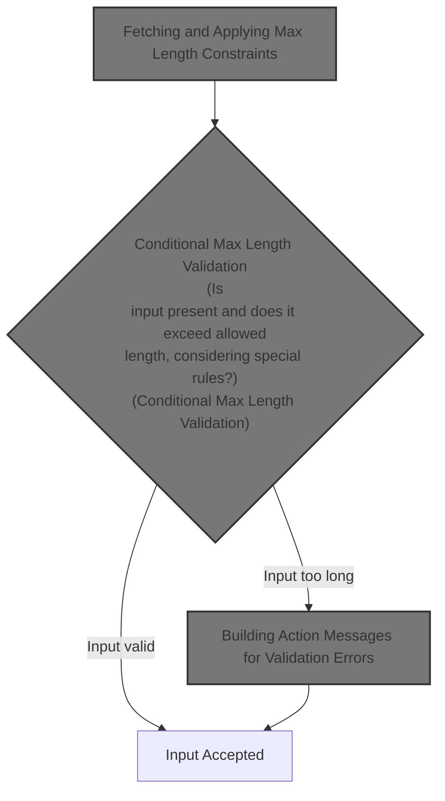
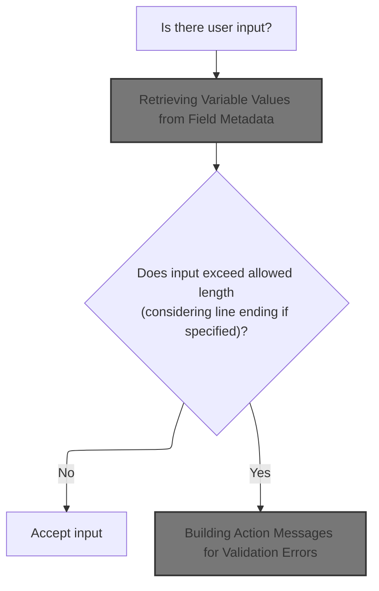
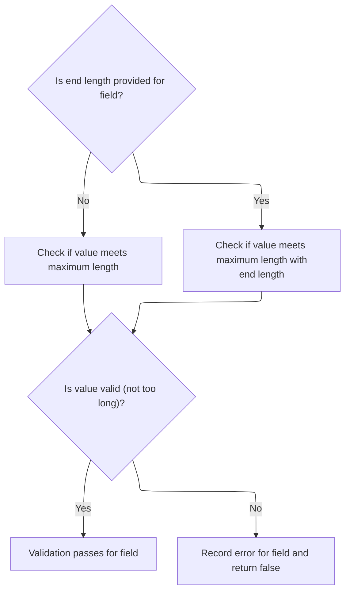
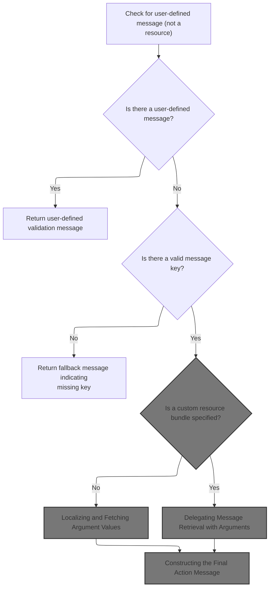
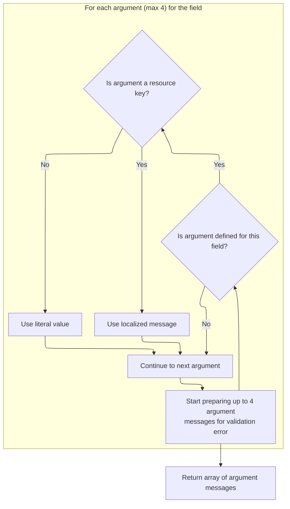
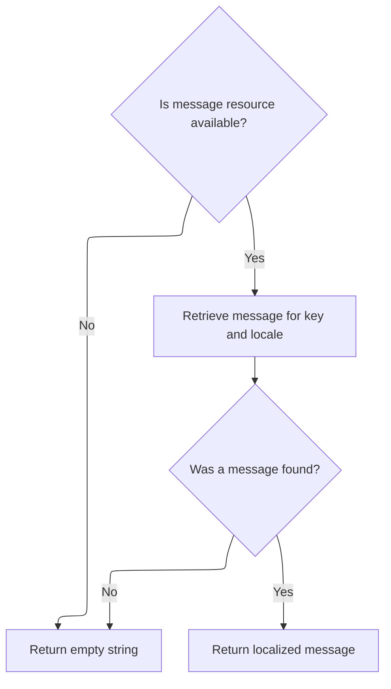
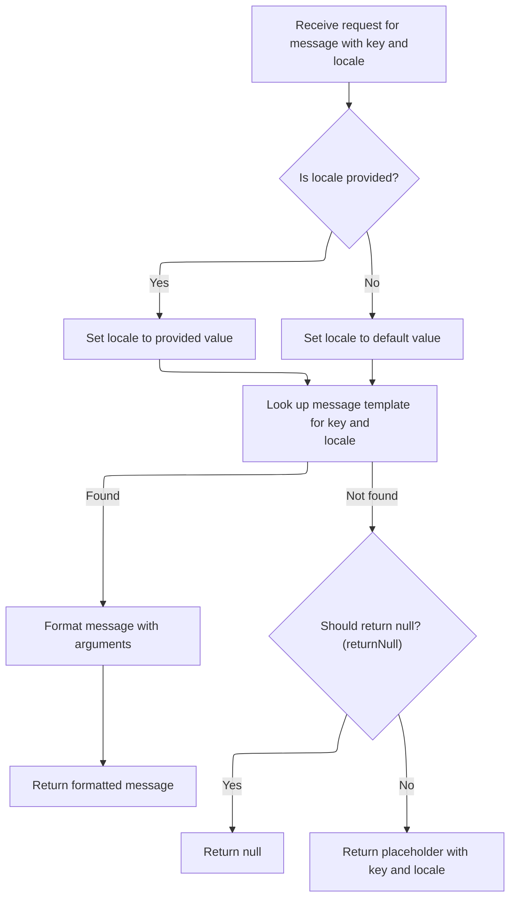
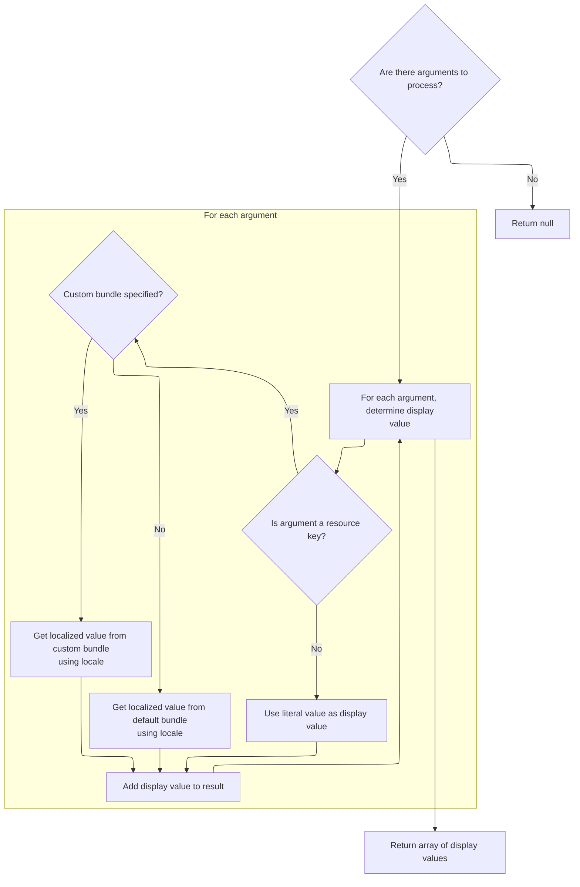

This document outlines how user input for form fields is validated against configurable maximum length constraints. The process dynamically retrieves validation rules, checks the input, and, if needed, generates a localized error message to inform the user when their input exceeds allowed limits.



# Fetching and Applying Max Length Constraints



<SwmSnippet path="/core/src/main/java/org/apache/struts/validator/FieldChecks.java" line="1215">

---

In <SwmToken path="core/src/main/java/org/apache/struts/validator/FieldChecks.java" pos="1215:7:7" line-data="    public static boolean validateMaxLength(Object bean, ValidatorAction va,">`validateMaxLength`</SwmToken>, we grab the value to validate from the bean and field, then pull 'maxlength' and <SwmToken path="core/src/main/java/org/apache/struts/validator/FieldChecks.java" pos="1229:12:12" line-data="                String endLth = Resources.getVarValue(&quot;lineEndLength&quot;, field,">`lineEndLength`</SwmToken> from external resources using <SwmToken path="core/src/main/java/org/apache/struts/validator/FieldChecks.java" pos="1224:1:3" line-data="                    Resources.getVarValue(&quot;maxlength&quot;, field, validator,">`Resources.getVarValue`</SwmToken>. This lets us adjust validation rules without touching code, and supports localization. Next, we call Resources to fetch these parameters so the validation logic can use them.

```java
    public static boolean validateMaxLength(Object bean, ValidatorAction va,
        Field field, ActionMessages errors, Validator validator,
        HttpServletRequest request) {
        String value = null;

        try {
            value = evaluateBean(bean, field);
            if (value != null) {
                String maxVar =
                    Resources.getVarValue("maxlength", field, validator,
                        request, true);
                int max = Integer.parseInt(maxVar);

                boolean isValid = false;
                String endLth = Resources.getVarValue("lineEndLength", field,
                    validator, request, false);
```

---

</SwmSnippet>

## Retrieving Variable Values from Field Metadata

<SwmSnippet path="/core/src/main/java/org/apache/struts/validator/Resources.java" line="157">

---

In <SwmToken path="core/src/main/java/org/apache/struts/validator/Resources.java" pos="157:7:7" line-data="    public static String getVarValue(String varName, Field field,">`getVarValue`</SwmToken>, we check if the field contains the requested variable. If not, we use <SwmToken path="core/src/main/java/org/apache/struts/util/PropertyMessageResources.java" pos="82:8:8" line-data=" * Configure &lt;code&gt;PropertyMessageResources&lt;/code&gt; to operate in this mode by">`PropertyMessageResources`</SwmToken> to generate an error message about the missing variable. This step ensures we have proper error handling and messaging before proceeding.

```java
    public static String getVarValue(String varName, Field field,
        Validator validator, HttpServletRequest request, boolean required) {
        Var var = field.getVar(varName);

        if (var == null) {
            String msg = sysmsgs.getMessage("variable.missing", varName);

```

---

</SwmSnippet>

### Locale-Aware Message Lookup and Fallback

```mermaid
%%{init: {"flowchart": {"defaultRenderer": "elk"}} }%%
flowchart TD
  node1["Search for message using requested
locale (locale, key)"]
  click node1 openCode "core/src/main/java/org/apache/struts/util/PropertyMessageResources.java:238:241"
  node1 --> node2{"Message found?"}
  click node2 openCode "core/src/main/java/org/apache/struts/util/PropertyMessageResources.java:239:241"
  node2 -->|"Yes"| node3["Return message"]
  click node3 openCode "core/src/main/java/org/apache/struts/util/PropertyMessageResources.java:240:241"
  node2 -->|"No"| node4{"mode? (JSTL, ResourceBundle, Default)"}
  click node4 openCode "core/src/main/java/org/apache/struts/util/PropertyMessageResources.java:244:265"
  node4 -->|"JSTL"| node10["Skip default locale"]
  click node10 openCode "core/src/main/java/org/apache/struts/util/PropertyMessageResources.java:246:247"
  node10 --> node7["Search in application defaults (base
properties)"]
  node4 -->|"ResourceBundle or Default"| node5{"Is locale different from
defaultLocale?"}
  click node5 openCode "core/src/main/java/org/apache/struts/util/PropertyMessageResources.java:252:263"
  node5 -->|"Yes"| node6["Search for message using default
locale"]
  click node6 openCode "core/src/main/java/org/apache/struts/util/PropertyMessageResources.java:253:254"
  node6 --> node8{"Message found?"}
  click node8 openCode "core/src/main/java/org/apache/struts/util/PropertyMessageResources.java:266:268"
  node8 -->|"Yes"| node3
  node8 -->|"No"| node7["Search in application defaults (base
properties)"]
  node5 -->|"No"| node7
  node7 --> node9{"Message found?"}
  click node9 openCode "core/src/main/java/org/apache/struts/util/PropertyMessageResources.java:272:273"
  node9 -->|"Yes"| node3
  node9 -->|"No"| node11{"Return null? (returnNull)"}
  click node11 openCode "core/src/main/java/org/apache/struts/util/PropertyMessageResources.java:277:281"
  node11 -->|"Yes"| node12["Return null"]
  click node12 openCode "core/src/main/java/org/apache/struts/util/PropertyMessageResources.java:278:279"
  node11 -->|"No"| node13["Return ???key???"]
  click node13 openCode "core/src/main/java/org/apache/struts/util/PropertyMessageResources.java:280:281"
classDef HeadingStyle fill:#777777,stroke:#333,stroke-width:2px;

%% Swimm:
%% %%{init: {"flowchart": {"defaultRenderer": "elk"}} }%%
%% flowchart TD
%%   node1["Search for message using requested
%% locale (locale, key)"]
%%   click node1 openCode "<SwmPath>[core/…/util/PropertyMessageResources.java](core/src/main/java/org/apache/struts/util/PropertyMessageResources.java)</SwmPath>:238:241"
%%   node1 --> node2{"Message found?"}
%%   click node2 openCode "<SwmPath>[core/…/util/PropertyMessageResources.java](core/src/main/java/org/apache/struts/util/PropertyMessageResources.java)</SwmPath>:239:241"
%%   node2 -->|"Yes"| node3["Return message"]
%%   click node3 openCode "<SwmPath>[core/…/util/PropertyMessageResources.java](core/src/main/java/org/apache/struts/util/PropertyMessageResources.java)</SwmPath>:240:241"
%%   node2 -->|"No"| node4{"mode? (JSTL, ResourceBundle, Default)"}
%%   click node4 openCode "<SwmPath>[core/…/util/PropertyMessageResources.java](core/src/main/java/org/apache/struts/util/PropertyMessageResources.java)</SwmPath>:244:265"
%%   node4 -->|"JSTL"| node10["Skip default locale"]
%%   click node10 openCode "<SwmPath>[core/…/util/PropertyMessageResources.java](core/src/main/java/org/apache/struts/util/PropertyMessageResources.java)</SwmPath>:246:247"
%%   node10 --> node7["Search in application defaults (base
%% properties)"]
%%   node4 -->|"ResourceBundle or Default"| node5{"Is locale different from
%% <SwmToken path="core/src/main/java/org/apache/struts/util/PropertyMessageResources.java" pos="252:5:5" line-data="            if (!defaultLocale.equals(locale)) {">`defaultLocale`</SwmToken>?"}
%%   click node5 openCode "<SwmPath>[core/…/util/PropertyMessageResources.java](core/src/main/java/org/apache/struts/util/PropertyMessageResources.java)</SwmPath>:252:263"
%%   node5 -->|"Yes"| node6["Search for message using default
%% locale"]
%%   click node6 openCode "<SwmPath>[core/…/util/PropertyMessageResources.java](core/src/main/java/org/apache/struts/util/PropertyMessageResources.java)</SwmPath>:253:254"
%%   node6 --> node8{"Message found?"}
%%   click node8 openCode "<SwmPath>[core/…/util/PropertyMessageResources.java](core/src/main/java/org/apache/struts/util/PropertyMessageResources.java)</SwmPath>:266:268"
%%   node8 -->|"Yes"| node3
%%   node8 -->|"No"| node7["Search in application defaults (base
%% properties)"]
%%   node5 -->|"No"| node7
%%   node7 --> node9{"Message found?"}
%%   click node9 openCode "<SwmPath>[core/…/util/PropertyMessageResources.java](core/src/main/java/org/apache/struts/util/PropertyMessageResources.java)</SwmPath>:272:273"
%%   node9 -->|"Yes"| node3
%%   node9 -->|"No"| node11{"Return null? (<SwmToken path="core/src/main/java/org/apache/struts/util/PropertyMessageResources.java" pos="277:4:4" line-data="        if (returnNull) {">`returnNull`</SwmToken>)"}
%%   click node11 openCode "<SwmPath>[core/…/util/PropertyMessageResources.java](core/src/main/java/org/apache/struts/util/PropertyMessageResources.java)</SwmPath>:277:281"
%%   node11 -->|"Yes"| node12["Return null"]
%%   click node12 openCode "<SwmPath>[core/…/util/PropertyMessageResources.java](core/src/main/java/org/apache/struts/util/PropertyMessageResources.java)</SwmPath>:278:279"
%%   node11 -->|"No"| node13["Return ???key???"]
%%   click node13 openCode "<SwmPath>[core/…/util/PropertyMessageResources.java](core/src/main/java/org/apache/struts/util/PropertyMessageResources.java)</SwmPath>:280:281"
%% classDef HeadingStyle fill:#777777,stroke:#333,stroke-width:2px;
```



<SwmSnippet path="/core/src/main/java/org/apache/struts/util/PropertyMessageResources.java" line="227">

---

<SwmToken path="core/src/main/java/org/apache/struts/util/PropertyMessageResources.java" pos="227:5:5" line-data="    public String getMessage(Locale locale, String key) {">`getMessage`</SwmToken> handles locale-specific message lookup, using mode to decide fallback behavior. It builds keys for lookup, tries to find the message in the requested locale, then falls back according to mode. If nothing is found, it returns a placeholder or null. Next, we call <SwmToken path="core/src/main/java/org/apache/struts/util/PropertyMessageResources.java" pos="238:5:5" line-data="        message = findMessage(locale, key, originalKey);">`findMessage`</SwmToken> to search for the message in more general locales.

```java
    public String getMessage(Locale locale, String key) {
        if (log.isDebugEnabled()) {
            log.debug("getMessage(" + locale + "," + key + ")");
        }

        // Initialize variables we will require
        String localeKey = localeKey(locale);
        String originalKey = messageKey(localeKey, key);
        String message = null;

        // Search the specified Locale
        message = findMessage(locale, key, originalKey);
        if (message != null) {
            return message;
        }

        // JSTL Compatibility - JSTL doesn't use the default locale
        if (mode == MODE_JSTL) {

           // do nothing (i.e. don't use default Locale)

        // PropertyResourcesBundle - searches through the hierarchy
        // for the default Locale (e.g. first en_US then en)
        } else if (mode == MODE_RESOURCE_BUNDLE) {

            if (!defaultLocale.equals(locale)) {
                message = findMessage(defaultLocale, key, originalKey);
            }

        // Default (backwards) Compatibility - just searches the
        // specified Locale (e.g. just en_US)
        } else {

            if (!defaultLocale.equals(locale)) {
                localeKey = localeKey(defaultLocale);
                message = findMessage(localeKey, key, originalKey);
            }

        }
        if (message != null) {
            return message;
        }

        // Find the message in the default properties file
        message = findMessage("", key, originalKey);
        if (message != null) {
            return message;
        }

        // Return an appropriate error indication
        if (returnNull) {
            return (null);
        } else {
            return ("???" + messageKey(locale, key) + "???");
        }
    }
```

---

</SwmSnippet>

<SwmSnippet path="/core/src/main/java/org/apache/struts/util/PropertyMessageResources.java" line="393">

---

<SwmToken path="core/src/main/java/org/apache/struts/util/PropertyMessageResources.java" pos="393:5:5" line-data="    private String findMessage(Locale locale, String key, String originalKey) {">`findMessage`</SwmToken> loops through locale keys, starting from the most specific, stripping modifiers to try more general keys until a message is found or no more generalization is possible. This increases the chance of finding a usable message.

```java
    private String findMessage(Locale locale, String key, String originalKey) {

        // Initialize variables we will require
        String localeKey = localeKey(locale);
        String messageKey = null;
        String message = null;
        int underscore = 0;

        // Loop from specific to general Locales looking for this message
        while (true) {
            message = findMessage(localeKey, key, originalKey);
            if (message != null) {
                break;
            }

            // Strip trailing modifiers to try a more general locale key
            underscore = localeKey.lastIndexOf("_");

            if (underscore < 0) {
                break;
            }

            localeKey = localeKey.substring(0, underscore);
        }
```

---

</SwmSnippet>

### Handling Missing Variables and Fallbacks

<SwmSnippet path="/core/src/main/java/org/apache/struts/validator/Resources.java" line="164">

---

We just got back from <SwmToken path="core/src/main/java/org/apache/struts/util/PropertyMessageResources.java" pos="82:8:8" line-data=" * Configure &lt;code&gt;PropertyMessageResources&lt;/code&gt; to operate in this mode by">`PropertyMessageResources`</SwmToken>, so if the variable was missing, we either throw or log the error and return null. Otherwise, we use <SwmToken path="core/src/main/java/org/apache/struts/validator/Resources.java" pos="178:3:3" line-data="        return getVarValue(var, application, request, required);">`getVarValue`</SwmToken>(var, ...) to fetch the actual value for further processing in <SwmToken path="core/src/main/java/org/apache/struts/validator/FieldChecks.java" pos="1224:1:3" line-data="                    Resources.getVarValue(&quot;maxlength&quot;, field, validator,">`Resources.getVarValue`</SwmToken>.

```java
            if (required) {
                throw new IllegalArgumentException(msg);
            }

            if (log.isDebugEnabled()) {
                log.debug(field.getProperty() + ": " + msg);
            }

            return null;
        }

        ServletContext application =
            (ServletContext) validator.getParameterValue(SERVLET_CONTEXT_PARAM);

        return getVarValue(var, application, request, required);
    }
```

---

</SwmSnippet>

## Conditional Max Length Validation



<SwmSnippet path="/core/src/main/java/org/apache/struts/validator/FieldChecks.java" line="1231">

---

After coming back from Resources, FieldChecks.validateMaxLength checks if <SwmToken path="core/src/main/java/org/apache/struts/validator/FieldChecks.java" pos="1229:12:12" line-data="                String endLth = Resources.getVarValue(&quot;lineEndLength&quot;, field,">`lineEndLength`</SwmToken> is blank. If so, it uses the basic max length check; otherwise, it uses the version that considers line endings. If validation fails, it adds an error message using <SwmToken path="core/src/main/java/org/apache/struts/validator/FieldChecks.java" pos="1240:1:3" line-data="                        Resources.getActionMessage(validator, request, va, field));">`Resources.getActionMessage`</SwmToken>.

```java
                if (GenericValidator.isBlankOrNull(endLth)) {
                    isValid = GenericValidator.maxLength(value, max);
                } else {
                    isValid = GenericValidator.maxLength(value, max,
                        Integer.parseInt(endLth));
                }

                if (!isValid) {
                    errors.add(field.getKey(),
                        Resources.getActionMessage(validator, request, va, field));

                    return false;
                }
            }
```

---

</SwmSnippet>

## Building Action Messages for Validation Errors



<SwmSnippet path="/core/src/main/java/org/apache/struts/validator/Resources.java" line="365">

---

In <SwmToken path="core/src/main/java/org/apache/struts/validator/Resources.java" pos="365:7:7" line-data="    public static ActionMessage getActionMessage(Validator validator,">`getActionMessage`</SwmToken>, we figure out which message key to use for the error, check if it's a resource, and then fetch <SwmToken path="core/src/main/java/org/apache/struts/validator/Resources.java" pos="390:1:1" line-data="        MessageResources messages =">`MessageResources`</SwmToken> for the right bundle. This sets up the context for building the actual error message.

```java
    public static ActionMessage getActionMessage(Validator validator,
        HttpServletRequest request, ValidatorAction va, Field field) {
        Msg msg = field.getMessage(va.getName());

        if ((msg != null) && !msg.isResource()) {
            return new ActionMessage(msg.getKey(), false);
        }

        String msgKey = null;
        String msgBundle = null;

        if (msg == null) {
            msgKey = va.getMsg();
        } else {
            msgKey = msg.getKey();
            msgBundle = msg.getBundle();
        }

        if ((msgKey == null) || (msgKey.length() == 0)) {
            return new ActionMessage("??? " + va.getName() + "."
                + field.getProperty() + " ???", false);
        }

        ServletContext application =
            (ServletContext) validator.getParameterValue(SERVLET_CONTEXT_PARAM);
        MessageResources messages =
            getMessageResources(application, request, msgBundle);
```

---

</SwmSnippet>

<SwmSnippet path="/core/src/main/java/org/apache/struts/validator/Resources.java" line="117">

---

<SwmToken path="core/src/main/java/org/apache/struts/validator/Resources.java" pos="117:7:7" line-data="    public static MessageResources getMessageResources(">`getMessageResources`</SwmToken> tries to find <SwmToken path="core/src/main/java/org/apache/struts/validator/Resources.java" pos="117:5:5" line-data="    public static MessageResources getMessageResources(">`MessageResources`</SwmToken> in the request, then in the application with module prefix, then just the bundle key. If none are found, it throws. This fallback ensures we always get the right resource context for error messages.

```java
    public static MessageResources getMessageResources(
        ServletContext application, HttpServletRequest request, String bundle) {
        if (bundle == null) {
            bundle = Globals.MESSAGES_KEY;
        }

        MessageResources resources =
            (MessageResources) request.getAttribute(bundle);

        if (resources == null) {
            ModuleConfig moduleConfig =
                ModuleUtils.getInstance().getModuleConfig(request, application);

            resources =
                (MessageResources) application.getAttribute(bundle
                    + moduleConfig.getPrefix());
        }

        if (resources == null) {
            resources = (MessageResources) application.getAttribute(bundle);
        }

        if (resources == null) {
            throw new NullPointerException(
                "No message resources found for bundle: " + bundle);
        }

        return resources;
    }
```

---

</SwmSnippet>

<SwmSnippet path="/core/src/main/java/org/apache/struts/validator/Resources.java" line="392">

---

After getting <SwmToken path="core/src/main/java/org/apache/struts/validator/Resources.java" pos="117:5:5" line-data="    public static MessageResources getMessageResources(">`MessageResources`</SwmToken> in Resources, we grab the user's locale so we can fetch the right localized error message. Next, we need to get argument values for message formatting.

```java
        Locale locale = RequestUtils.getUserLocale(request, null);

        Arg[] args = field.getArgs(va.getName());
```

---

</SwmSnippet>

### Preparing Arguments for Message Formatting



<SwmSnippet path="/core/src/main/java/org/apache/struts/validator/Resources.java" line="420">

---

<SwmToken path="core/src/main/java/org/apache/struts/validator/Resources.java" pos="420:9:9" line-data="    public static String[] getArgs(String actionName,">`getArgs`</SwmToken> builds a fixed-size array of 4 arguments, checking each for localization. If an argument is a resource, it fetches the localized message; otherwise, it uses the key directly. Next, we call <SwmToken path="core/src/main/java/org/apache/struts/validator/Resources.java" pos="396:1:1" line-data="            getArgValues(application, request, messages, locale, args);">`getArgValues`</SwmToken> to resolve these arguments for message formatting.

```java
    public static String[] getArgs(String actionName,
        MessageResources messages, Locale locale, Field field) {
        String[] argMessages = new String[4];

        Arg[] args =
            new Arg[] {
                field.getArg(actionName, 0), field.getArg(actionName, 1),
                field.getArg(actionName, 2), field.getArg(actionName, 3)
            };

        for (int i = 0; i < args.length; i++) {
            if (args[i] == null) {
                continue;
            }

            if (args[i].isResource()) {
                argMessages[i] = getMessage(messages, locale, args[i].getKey());
            } else {
                argMessages[i] = args[i].getKey();
            }
        }

        return argMessages;
    }
```

---

</SwmSnippet>

### Fetching Localized Message Strings



<SwmSnippet path="/core/src/main/java/org/apache/struts/validator/Resources.java" line="231">

---

<SwmToken path="core/src/main/java/org/apache/struts/validator/Resources.java" pos="231:7:7" line-data="    public static String getMessage(MessageResources messages, Locale locale,">`getMessage`</SwmToken> checks if messages is available, then calls MessageResources.getMessage to fetch the localized string. If not found, it returns an empty string. Next, we call MessageResources.getMessage to actually retrieve the message.

```java
    public static String getMessage(MessageResources messages, Locale locale,
        String key) {
        String message = null;

        if (messages != null) {
            message = messages.getMessage(locale, key);
        }

        return (message == null) ? "" : message;
    }
```

---

</SwmSnippet>

### Delegating Message Retrieval with Arguments

<SwmSnippet path="/core/src/main/java/org/apache/struts/util/MessageResources.java" line="218">

---

<SwmToken path="core/src/main/java/org/apache/struts/util/MessageResources.java" pos="218:5:5" line-data="    public String getMessage(String key, Object arg0) {">`getMessage`</SwmToken> just wraps <SwmToken path="core/src/main/java/org/apache/struts/util/MessageResources.java" pos="218:14:14" line-data="    public String getMessage(String key, Object arg0) {">`arg0`</SwmToken> in an array and delegates to the main message formatting function. Next, we call the overload that handles arrays of arguments.

```java
    public String getMessage(String key, Object arg0) {
        return this.getMessage((Locale) null, key, arg0);
    }
```

---

</SwmSnippet>

### Formatting Messages with Argument Arrays



<SwmSnippet path="/core/src/main/java/org/apache/struts/util/MessageResources.java" line="324">

---

<SwmToken path="core/src/main/java/org/apache/struts/util/MessageResources.java" pos="324:5:5" line-data="    public String getMessage(Locale locale, String key, Object arg0) {">`getMessage`</SwmToken> (with argument array) checks the cache for a <SwmToken path="core/src/main/java/org/apache/struts/util/MessageResources.java" pos="287:5:5" line-data="        // Cache MessageFormat instances as they are accessed">`MessageFormat`</SwmToken>, creates one if needed, and formats the message. If the message is missing, it returns a placeholder. Next, we use the formatted message for display or error reporting.

```java
    public String getMessage(Locale locale, String key, Object arg0) {
        return this.getMessage(locale, key, new Object[] { arg0 });
    }
```

---

</SwmSnippet>

<SwmSnippet path="/core/src/main/java/org/apache/struts/util/MessageResources.java" line="286">

---

<SwmToken path="core/src/main/java/org/apache/struts/util/MessageResources.java" pos="286:5:5" line-data="    public String getMessage(Locale locale, String key, Object[] args) {">`getMessage`</SwmToken> (with argument array) uses a synchronized cache for <SwmToken path="core/src/main/java/org/apache/struts/util/MessageResources.java" pos="287:5:5" line-data="        // Cache MessageFormat instances as they are accessed">`MessageFormat`</SwmToken> instances, defaults locale if needed, and returns a formatted message. If the message is missing, it returns a '???' placeholder with the format key.

```java
    public String getMessage(Locale locale, String key, Object[] args) {
        // Cache MessageFormat instances as they are accessed
        if (locale == null) {
            locale = defaultLocale;
        }

        MessageFormat format = null;
        String formatKey = messageKey(locale, key);

        synchronized (formats) {
            format = (MessageFormat) formats.get(formatKey);

            if (format == null) {
                String formatString = getMessage(locale, key);

                if (formatString == null) {
                    return returnNull ? null : ("???" + formatKey + "???");
                }

                format = new MessageFormat(escape(formatString));
                format.setLocale(locale);
                formats.put(formatKey, format);
            }
        }

        return format.format(args);
    }
```

---

</SwmSnippet>

### Resolving Argument Values for Action Messages

<SwmSnippet path="/core/src/main/java/org/apache/struts/validator/Resources.java" line="395">

---

After getting args in Resources, we resolve their values using <SwmToken path="core/src/main/java/org/apache/struts/validator/Resources.java" pos="396:1:1" line-data="            getArgValues(application, request, messages, locale, args);">`getArgValues`</SwmToken>. This step ensures all arguments are localized and ready for message formatting.

```java
        String[] argValues =
            getArgValues(application, request, messages, locale, args);

```

---

</SwmSnippet>

### Localizing and Fetching Argument Values



<SwmSnippet path="/core/src/main/java/org/apache/struts/validator/Resources.java" line="455">

---

In <SwmToken path="core/src/main/java/org/apache/struts/validator/Resources.java" pos="455:9:9" line-data="    private static String[] getArgValues(ServletContext application,">`getArgValues`</SwmToken>, we loop through arguments, resolving resource arguments using <SwmToken path="core/src/main/java/org/apache/struts/validator/Resources.java" pos="456:6:6" line-data="        HttpServletRequest request, MessageResources defaultMessages,">`MessageResources`</SwmToken> and locale, and using the key directly for plain arguments. If a bundle is specified, we fetch <SwmToken path="core/src/main/java/org/apache/struts/validator/Resources.java" pos="456:6:6" line-data="        HttpServletRequest request, MessageResources defaultMessages,">`MessageResources`</SwmToken> for that bundle. Next, we use these values for message formatting.

```java
    private static String[] getArgValues(ServletContext application,
        HttpServletRequest request, MessageResources defaultMessages,
        Locale locale, Arg[] args) {
        if ((args == null) || (args.length == 0)) {
            return null;
        }

        String[] values = new String[args.length];

        for (int i = 0; i < args.length; i++) {
            if (args[i] != null) {
                if (args[i].isResource()) {
                    MessageResources messages = defaultMessages;

                    if (args[i].getBundle() != null) {
                        messages =
                            getMessageResources(application, request,
                                args[i].getBundle());
                    }

```

---

</SwmSnippet>

<SwmSnippet path="/core/src/main/java/org/apache/struts/validator/Resources.java" line="475">

---

After resolving bundles, we use MessageResources.getMessage for each resource argument to get the localized value. Plain arguments just use their key. This finalizes the argument values for message formatting in Resources.

```java
                    values[i] = messages.getMessage(locale, args[i].getKey());
                } else {
                    values[i] = args[i].getKey();
                }
            }
        }

        return values;
    }
```

---

</SwmSnippet>

### Constructing the Final Action Message

<SwmSnippet path="/core/src/main/java/org/apache/struts/validator/Resources.java" line="398">

---

After getting argument values in Resources, we construct the <SwmToken path="core/src/main/java/org/apache/struts/validator/Resources.java" pos="398:1:1" line-data="        ActionMessage actionMessage = null;">`ActionMessage`</SwmToken>. If there's a bundle, we use <SwmToken path="core/src/main/java/org/apache/struts/validator/Resources.java" pos="117:5:5" line-data="    public static MessageResources getMessageResources(">`MessageResources`</SwmToken> to format the message; otherwise, we build it directly with the key and arguments. This prepares the error message for display.

```java
        ActionMessage actionMessage = null;

        if (msgBundle == null) {
            actionMessage = new ActionMessage(msgKey, argValues);
        } else {
            String message = messages.getMessage(locale, msgKey, argValues);

            actionMessage = new ActionMessage(message, false);
        }

        return actionMessage;
    }
```

---

</SwmSnippet>

## Finalizing Validation and Handling Failures

<SwmSnippet path="/core/src/main/java/org/apache/struts/validator/FieldChecks.java" line="1245">

---

After returning from Resources in FieldChecks.validateMaxLength, if an exception occurs, we call <SwmToken path="core/src/main/java/org/apache/struts/validator/FieldChecks.java" pos="1246:1:1" line-data="            processFailure(errors, field, validator.getFormName(), &quot;maxlength&quot;, e);">`processFailure`</SwmToken> to log the error and add a generic error message. This wraps up the validation flow and ensures the user gets feedback.

```java
        } catch (Exception e) {
            processFailure(errors, field, validator.getFormName(), "maxlength", e);

            return false;
        }

        return true;
    }
```

---

</SwmSnippet>

# Logging and Reporting Validation Failures

<SwmSnippet path="/core/src/main/java/org/apache/struts/validator/FieldChecks.java" line="1434">

---

In <SwmToken path="core/src/main/java/org/apache/struts/validator/FieldChecks.java" pos="1434:7:7" line-data="    private static void processFailure(ActionMessages errors, Field field,">`processFailure`</SwmToken>, we build a log message using <SwmToken path="core/src/main/java/org/apache/struts/validator/Resources.java" pos="117:5:5" line-data="    public static MessageResources getMessageResources(">`MessageResources`</SwmToken>, including validator name, field property, form name, and exception info. Next, we call MessageResources.getMessage to format the log entry.

```java
    private static void processFailure(ActionMessages errors, Field field,
        String formName, String validatorName, Throwable t) {
        // Log the error
        String logErrorMsg =
            sysmsgs.getMessage("validation.failed", validatorName,
                field.getProperty(), formName, t.toString());

        log.error(logErrorMsg, t);

```

---

</SwmSnippet>

<SwmSnippet path="/core/src/main/java/org/apache/struts/util/MessageResources.java" line="355">

---

<SwmToken path="core/src/main/java/org/apache/struts/util/MessageResources.java" pos="355:5:5" line-data="    public String getMessage(Locale locale, String key, Object arg0,">`getMessage`</SwmToken> takes multiple arguments to format the log message with all relevant details. Next, we use this formatted message for logging or user feedback.

```java
    public String getMessage(Locale locale, String key, Object arg0,
        Object arg1, Object arg2) {
        return this.getMessage(locale, key, new Object[] { arg0, arg1, arg2 });
    }
```

---

</SwmSnippet>

<SwmSnippet path="/core/src/main/java/org/apache/struts/validator/FieldChecks.java" line="1443">

---

After logging the error in FieldChecks.processFailure, we add a general system error message for the user using <SwmToken path="core/src/main/java/org/apache/struts/validator/Resources.java" pos="117:5:5" line-data="    public static MessageResources getMessageResources(">`MessageResources`</SwmToken>. This keeps the user informed without exposing technical details.

```java
        // Add general "system error" message to show to the user
        String userErrorMsg = sysmsgs.getMessage("system.error");

        errors.add(field.getKey(), new ActionMessage(userErrorMsg, false));
    }
```

---

</SwmSnippet>

<SwmSnippet path="/core/src/main/java/org/apache/struts/util/MessageResources.java" line="196">

---

<SwmToken path="core/src/main/java/org/apache/struts/util/MessageResources.java" pos="196:5:5" line-data="    public String getMessage(String key) {">`getMessage`</SwmToken> (with just the key) fetches a generic message, defaulting locale and arguments. This is typically used for system error messages shown to the user.

```java
    public String getMessage(String key) {
        return this.getMessage((Locale) null, key, null);
    }
```

---

</SwmSnippet>

&nbsp;

*This is an auto-generated document by Swimm 🌊 and has not yet been verified by a human*

<SwmMeta version="3.0.0" repo-id="Z2l0aHViJTNBJTNBc3RydXRzMSUzQSUzQVN3aW1tLURlbW8=" repo-name="struts1"><sup>Powered by [Swimm](https://app.swimm.io/)</sup></SwmMeta>
