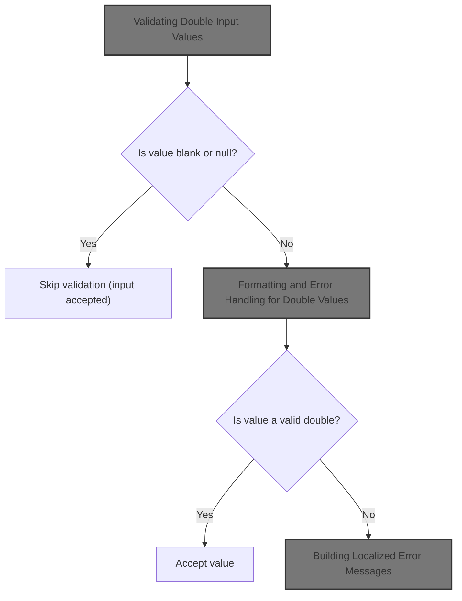
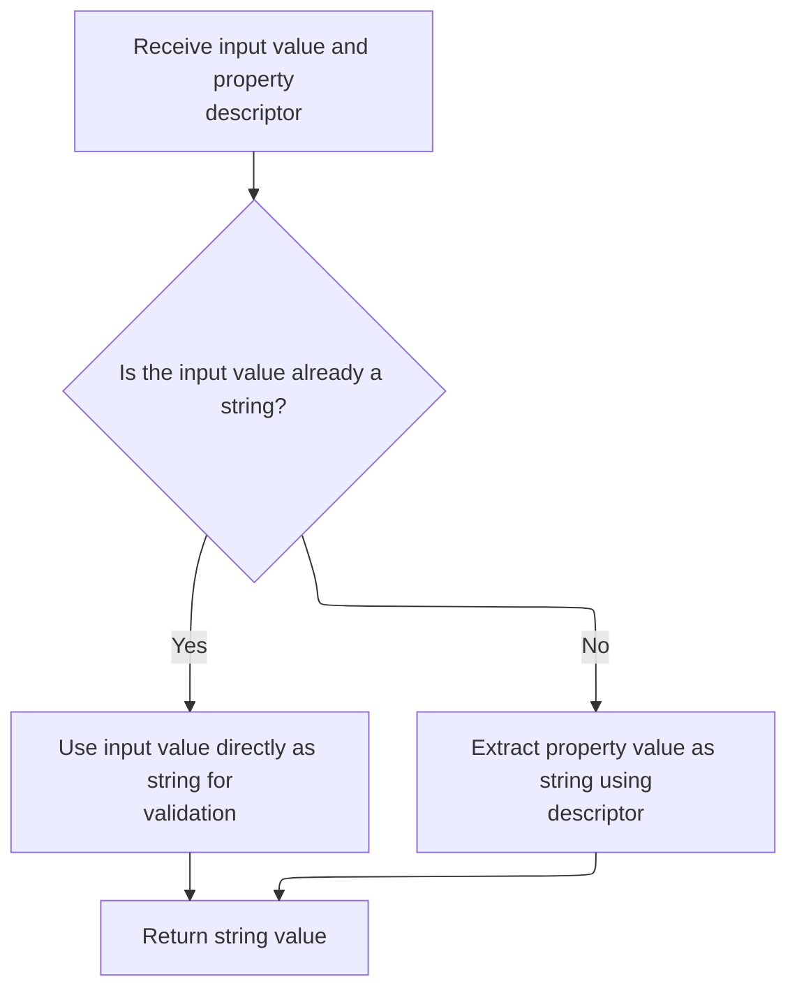
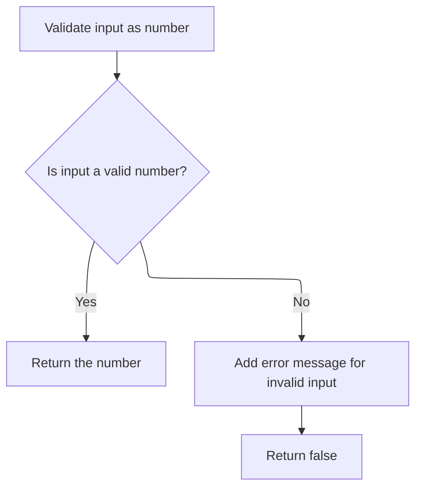
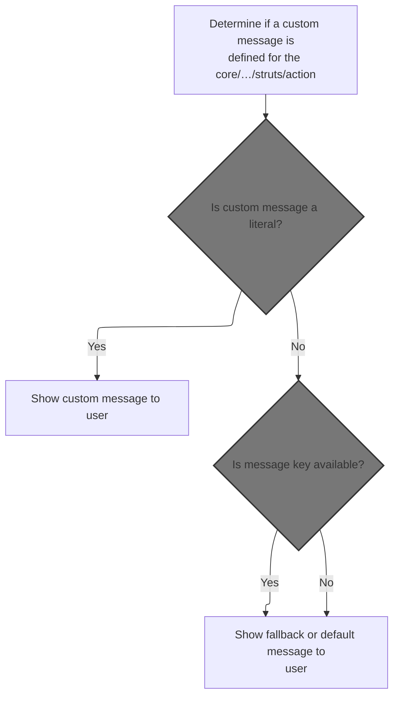
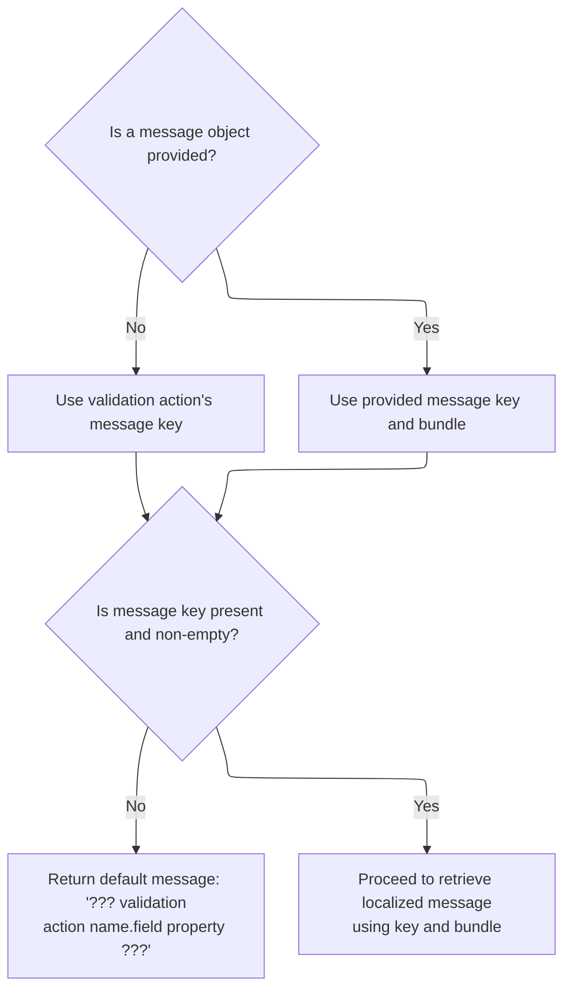
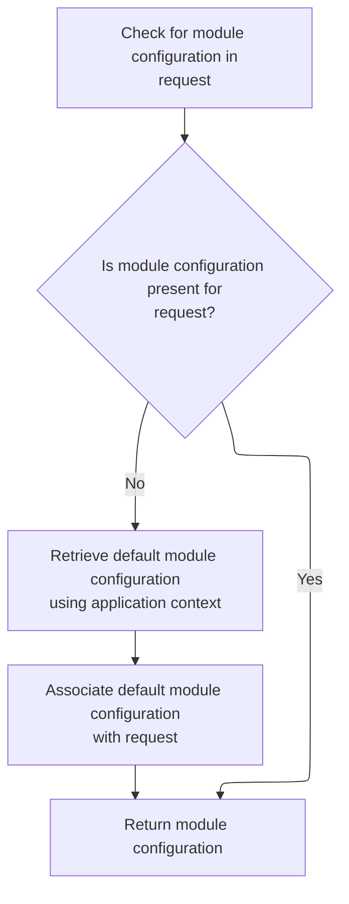
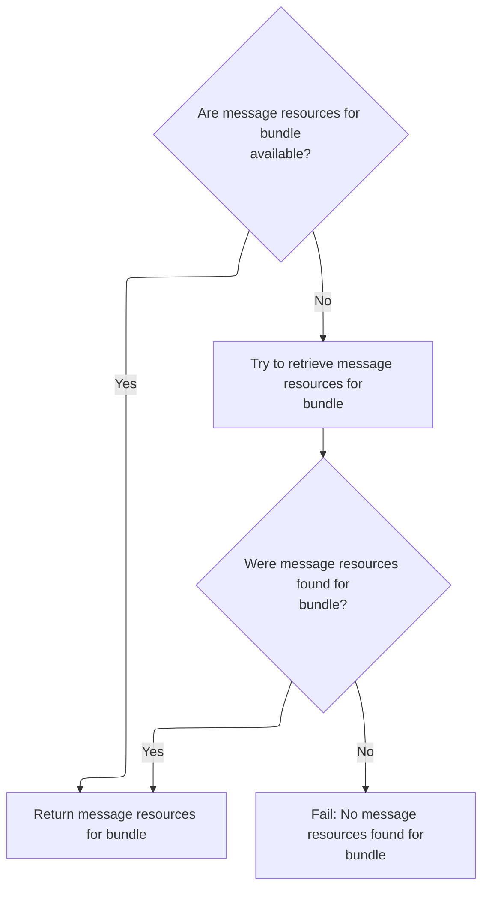

This document outlines the validation of user input to ensure it is a valid double value. The process extracts the value from a bean, checks for blank or null input, validates the format, and generates a localized error message if needed.



# Validating Double Input Values

<SwmSnippet path="/core/src/main/java/org/apache/struts/validator/FieldChecks.java" line="760">

---

In <SwmToken path="core/src/main/java/org/apache/struts/validator/FieldChecks.java" pos="760:7:7" line-data="    public static Object validateDouble(Object bean, ValidatorAction va,">`validateDouble`</SwmToken>, we grab the value from the bean using <SwmToken path="core/src/main/java/org/apache/struts/validator/FieldChecks.java" pos="767:5:5" line-data="            value = evaluateBean(bean, field);">`evaluateBean`</SwmToken>. This step is needed because the bean could be any object, and we want the actual property value to check if it's a valid double. If <SwmToken path="core/src/main/java/org/apache/struts/validator/FieldChecks.java" pos="767:5:5" line-data="            value = evaluateBean(bean, field);">`evaluateBean`</SwmToken> fails, we log the error and bail out early. If the value is blank or null, we skip further checks.

```java
    public static Object validateDouble(Object bean, ValidatorAction va,
        Field field, ActionMessages errors, Validator validator,
        HttpServletRequest request) {
        Object result = null;
        String value = null;

        try {
            value = evaluateBean(bean, field);
        } catch (Exception e) {
            processFailure(errors, field, validator.getFormName(), "double", e);
            return Boolean.FALSE;
        }

        if (GenericValidator.isBlankOrNull(value)) {
            return Boolean.TRUE;
        }

```

---

</SwmSnippet>

## Extracting Property Values from Beans



<SwmSnippet path="/core/src/main/java/org/apache/struts/validator/FieldChecks.java" line="389">

---

<SwmToken path="core/src/main/java/org/apache/struts/validator/FieldChecks.java" pos="389:7:7" line-data="    private static String evaluateBean(Object bean, Field field) throws Exception {">`evaluateBean`</SwmToken> checks if the bean is a String and returns it directly. Otherwise, it calls <SwmToken path="core/src/main/java/org/apache/struts/validator/FieldChecks.java" pos="395:5:5" line-data="            value = getValueAsString(bean, field.getProperty());">`getValueAsString`</SwmToken> to handle property extraction for beans that aren't plain Strings. This lets us deal with different bean types and property formats.

```java
    private static String evaluateBean(Object bean, Field field) throws Exception {
        String value;

        if (isString(bean)) {
            value = (String) bean;
        } else {
            value = getValueAsString(bean, field.getProperty());
        }

        return value;
    }
```

---

</SwmSnippet>

<SwmSnippet path="/core/src/main/java/org/apache/struts/validator/FieldChecks.java" line="87">

---

<SwmToken path="core/src/main/java/org/apache/struts/validator/FieldChecks.java" pos="87:7:7" line-data="    private static String getValueAsString(Object bean, String property) ">`getValueAsString`</SwmToken> pulls the property value from the bean, returns null if it's missing, handles String arrays and Collections by checking if they're empty, and falls back to <SwmToken path="core/src/main/java/org/apache/struts/validator/FieldChecks.java" pos="96:23:23" line-data="            return ((String[]) value).length &gt; 0 ? value.toString() : &quot;&quot;;">`toString`</SwmToken> for everything else. This avoids nulls and makes sure the value is always a string.

```java
    private static String getValueAsString(Object bean, String property) 
            throws Exception {
        
        Object value = PropertyUtils.getProperty(bean, property);
        if (value == null) {
            return null;
        }

        if (value instanceof String[]) {
            return ((String[]) value).length > 0 ? value.toString() : "";

        } else if (value instanceof Collection) {
            return ((Collection) value).isEmpty() ? "" : value.toString();

        } else {
            return value.toString();
        }
    }
```

---

</SwmSnippet>

## Formatting and Error Handling for Double Values



<SwmSnippet path="/core/src/main/java/org/apache/struts/validator/FieldChecks.java" line="777">

---

Back in <SwmToken path="core/src/main/java/org/apache/struts/validator/FieldChecks.java" pos="760:7:7" line-data="    public static Object validateDouble(Object bean, ValidatorAction va,">`validateDouble`</SwmToken>, after getting the value from <SwmToken path="core/src/main/java/org/apache/struts/validator/FieldChecks.java" pos="389:7:7" line-data="    private static String evaluateBean(Object bean, Field field) throws Exception {">`evaluateBean`</SwmToken>, we try to format it as a double. If that fails, we add an error message using <SwmToken path="core/src/main/java/org/apache/struts/validator/FieldChecks.java" pos="781:1:3" line-data="                Resources.getActionMessage(validator, request, va, field));">`Resources.getActionMessage`</SwmToken>, which builds a user-friendly error for invalid input.

```java
        result = GenericTypeValidator.formatDouble(value);

        if (result == null) {
            errors.add(field.getKey(),
                Resources.getActionMessage(validator, request, va, field));
        }

        return (result == null) ? Boolean.FALSE : result;
    }
```

---

</SwmSnippet>

# Building Localized Error Messages



<SwmSnippet path="/core/src/main/java/org/apache/struts/validator/Resources.java" line="365">

---

In <SwmToken path="core/src/main/java/org/apache/struts/validator/Resources.java" pos="365:7:7" line-data="    public static ActionMessage getActionMessage(Validator validator,">`getActionMessage`</SwmToken>, we check if the field message is a resource. If it is, we need to fetch the localized text from <SwmToken path="core/src/main/java/org/apache/struts/config/ConfigHelper.java" pos="56:4:4" line-data="public class ConfigHelper implements ConfigHelperInterface {">`ConfigHelper`</SwmToken>, since the key by itself isn't user-friendly.

```java
    public static ActionMessage getActionMessage(Validator validator,
        HttpServletRequest request, ValidatorAction va, Field field) {
        Msg msg = field.getMessage(va.getName());

        if ((msg != null) && !msg.isResource()) {
            return new ActionMessage(msg.getKey(), false);
        }

```

---

</SwmSnippet>

## Fetching Localized Message Text

<SwmSnippet path="/core/src/main/java/org/apache/struts/config/ConfigHelper.java" line="496">

---

In <SwmToken path="core/src/main/java/org/apache/struts/config/ConfigHelper.java" pos="496:5:5" line-data="    public String getMessage(String key) {">`getMessage`</SwmToken>, we grab the <SwmToken path="core/src/main/java/org/apache/struts/config/ConfigHelper.java" pos="497:1:1" line-data="        MessageResources resources = getMessageResources();">`MessageResources`</SwmToken> and use <SwmToken path="core/src/main/java/org/apache/struts/config/ConfigHelper.java" pos="503:7:9" line-data="        return resources.getMessage(RequestUtils.getUserLocale(request, null),">`RequestUtils.getUserLocale`</SwmToken> to pick the right language for the message. This makes sure the error text matches the user's locale.

```java
    public String getMessage(String key) {
        MessageResources resources = getMessageResources();

        if (resources == null) {
            return null;
        }

        return resources.getMessage(RequestUtils.getUserLocale(request, null),
```

---

</SwmSnippet>

<SwmSnippet path="/core/src/main/java/org/apache/struts/util/RequestUtils.java" line="299">

---

<SwmToken path="core/src/main/java/org/apache/struts/util/RequestUtils.java" pos="299:7:7" line-data="    public static Locale getUserLocale(HttpServletRequest request, String locale) {">`getUserLocale`</SwmToken> checks the session for a locale using <SwmToken path="core/src/main/java/org/apache/struts/util/RequestUtils.java" pos="304:5:7" line-data="            locale = Globals.LOCALE_KEY;">`Globals.LOCALE_KEY`</SwmToken> if none is specified. If it's not found, it falls back to <SwmToken path="core/src/main/java/org/apache/struts/util/RequestUtils.java" pos="314:5:7" line-data="            userLocale = request.getLocale();">`request.getLocale`</SwmToken>, so we always get a locale for message translation.

```java
    public static Locale getUserLocale(HttpServletRequest request, String locale) {
        Locale userLocale = null;
        HttpSession session = request.getSession(false);

        if (locale == null) {
            locale = Globals.LOCALE_KEY;
        }

        // Only check session if sessions are enabled
        if (session != null) {
            userLocale = (Locale) session.getAttribute(locale);
        }

        if (userLocale == null) {
            // Returns Locale based on Accept-Language header or the server default
            userLocale = request.getLocale();
        }

        return userLocale;
    }
```

---

</SwmSnippet>

<SwmSnippet path="/core/src/main/java/org/apache/struts/config/ConfigHelper.java" line="503">

---

Just returned from <SwmToken path="core/src/main/java/org/apache/struts/config/ConfigHelper.java" pos="503:7:9" line-data="        return resources.getMessage(RequestUtils.getUserLocale(request, null),">`RequestUtils.getUserLocale`</SwmToken>, now ConfigHelper.getMessage uses the locale and key to fetch the right localized message. Next, we call Resources to keep building the error message.

```java
        return resources.getMessage(RequestUtils.getUserLocale(request, null),
            key);
    }
```

---

</SwmSnippet>

<SwmSnippet path="/core/src/main/java/org/apache/struts/validator/Resources.java" line="249">

---

<SwmToken path="core/src/main/java/org/apache/struts/validator/Resources.java" pos="249:7:7" line-data="    public static String getMessage(HttpServletRequest request, String key) {">`getMessage`</SwmToken> grabs the <SwmToken path="core/src/main/java/org/apache/struts/validator/Resources.java" pos="250:1:1" line-data="        MessageResources messages = getMessageResources(request);">`MessageResources`</SwmToken> for the request and uses <SwmToken path="core/src/main/java/org/apache/struts/validator/Resources.java" pos="252:10:10" line-data="        return getMessage(messages, RequestUtils.getUserLocale(request, null),">`getUserLocale`</SwmToken> to make sure the message is localized. This keeps error messages user-friendly.

```java
    public static String getMessage(HttpServletRequest request, String key) {
        MessageResources messages = getMessageResources(request);

        return getMessage(messages, RequestUtils.getUserLocale(request, null),
            key);
    }
```

---

</SwmSnippet>

## Resolving Message Keys and Bundles



<SwmSnippet path="/core/src/main/java/org/apache/struts/validator/Resources.java" line="373">

---

Just returned from ConfigHelper.getMessage, now <SwmToken path="core/src/main/java/org/apache/struts/validator/FieldChecks.java" pos="781:1:3" line-data="                Resources.getActionMessage(validator, request, va, field));">`Resources.getActionMessage`</SwmToken> checks the message key and bundle, then grabs <SwmToken path="core/src/main/java/org/apache/struts/validator/Resources.java" pos="390:1:1" line-data="        MessageResources messages =">`MessageResources`</SwmToken> for the right context. This lets us resolve the actual error message.

```java
        String msgKey = null;
        String msgBundle = null;

        if (msg == null) {
            msgKey = va.getMsg();
        } else {
            msgKey = msg.getKey();
            msgBundle = msg.getBundle();
        }

        if ((msgKey == null) || (msgKey.length() == 0)) {
            return new ActionMessage("??? " + va.getName() + "."
                + field.getProperty() + " ???", false);
        }

        ServletContext application =
            (ServletContext) validator.getParameterValue(SERVLET_CONTEXT_PARAM);
        MessageResources messages =
            getMessageResources(application, request, msgBundle);
```

---

</SwmSnippet>

## Locating Message Resource Bundles

<SwmSnippet path="/core/src/main/java/org/apache/struts/validator/Resources.java" line="117">

---

In <SwmToken path="core/src/main/java/org/apache/struts/validator/Resources.java" pos="117:7:7" line-data="    public static MessageResources getMessageResources(">`getMessageResources`</SwmToken>, we try to find the bundle in the request, then use <SwmToken path="core/src/main/java/org/apache/struts/validator/Resources.java" pos="128:1:1" line-data="                ModuleUtils.getInstance().getModuleConfig(request, application);">`ModuleUtils`</SwmToken> to get the module prefix and look in the application scope. If all else fails, we use the default bundle key. This covers all possible places the resource might be.

```java
    public static MessageResources getMessageResources(
        ServletContext application, HttpServletRequest request, String bundle) {
        if (bundle == null) {
            bundle = Globals.MESSAGES_KEY;
        }

        MessageResources resources =
            (MessageResources) request.getAttribute(bundle);

        if (resources == null) {
            ModuleConfig moduleConfig =
                ModuleUtils.getInstance().getModuleConfig(request, application);

            resources =
                (MessageResources) application.getAttribute(bundle
                    + moduleConfig.getPrefix());
        }

```

---

</SwmSnippet>

### Retrieving Module Configuration



<SwmSnippet path="/core/src/main/java/org/apache/struts/util/ModuleUtils.java" line="130">

---

<SwmToken path="core/src/main/java/org/apache/struts/util/ModuleUtils.java" pos="130:5:5" line-data="    public ModuleConfig getModuleConfig(HttpServletRequest request,">`getModuleConfig`</SwmToken> first tries to get the config from the request. If that's missing, it grabs the default from the context and sets it in the request for later use. This guarantees we always have a module config.

```java
    public ModuleConfig getModuleConfig(HttpServletRequest request,
        ServletContext context) {
        ModuleConfig moduleConfig = this.getModuleConfig(request);

        if (moduleConfig == null) {
            moduleConfig = this.getModuleConfig("", context);
            request.setAttribute(Globals.MODULE_KEY, moduleConfig);
        }

        return moduleConfig;
    }
```

---

</SwmSnippet>

<SwmSnippet path="/core/src/main/java/org/apache/struts/util/ModuleUtils.java" line="89">

---

<SwmToken path="core/src/main/java/org/apache/struts/util/ModuleUtils.java" pos="89:5:5" line-data="    public ModuleConfig getModuleConfig(String prefix, ServletContext context) {">`getModuleConfig`</SwmToken> uses <SwmToken path="core/src/main/java/org/apache/struts/util/ModuleUtils.java" pos="91:11:13" line-data="            return (ModuleConfig) context.getAttribute(Globals.MODULE_KEY);">`Globals.MODULE_KEY`</SwmToken> as the base key, and adds the prefix if needed. If the prefix is null or '/', we grab the default config; otherwise, we get the module-specific config. This lets us handle multiple modules cleanly.

```java
    public ModuleConfig getModuleConfig(String prefix, ServletContext context) {
        if ((prefix == null) || "/".equals(prefix)) {
            return (ModuleConfig) context.getAttribute(Globals.MODULE_KEY);
        } else {
            return (ModuleConfig) context.getAttribute(Globals.MODULE_KEY
                + prefix);
        }
    }
```

---

</SwmSnippet>

### Finalizing Resource Bundle Lookup



<SwmSnippet path="/core/src/main/java/org/apache/struts/validator/Resources.java" line="135">

---

Just returned from ModuleUtils.getModuleConfig, now Resources.getMessageResources checks the application scope for the bundle, and throws if nothing is found. This makes sure we don't silently miss resource bundles.

```java
        if (resources == null) {
            resources = (MessageResources) application.getAttribute(bundle);
        }

        if (resources == null) {
            throw new NullPointerException(
                "No message resources found for bundle: " + bundle);
        }

        return resources;
    }
```

---

</SwmSnippet>

## Preparing Arguments for Error Messages

```mermaid
%%{init: {"flowchart": {"defaultRenderer": "elk"}} }%%
flowchart TD
    node1["Determine user language and region
(locale)"] --> node2["Get message arguments for action"]
    click node1 openCode "core/src/main/java/org/apache/struts/validator/Resources.java:392:392"
    click node2 openCode "core/src/main/java/org/apache/struts/validator/Resources.java:394:394"
    node2 --> node3["Resolve argument values"]
    click node3 openCode "core/src/main/java/org/apache/struts/validator/Resources.java:395:396"
    subgraph loop1["For each argument"]
        node3 --> node4{"Is argument a localized resource?"}
        click node4 openCode "core/src/main/java/org/apache/struts/validator/Resources.java:465:466"
        node4 -->|"Yes"| node5["Localize argument value"]
        click node5 openCode "core/src/main/java/org/apache/struts/validator/Resources.java:467:475"
        node4 -->|"No"| node6["Use argument as-is"]
        click node6 openCode "core/src/main/java/org/apache/struts/validator/Resources.java:477:478"
    end
    node3 --> node7{"Is a custom message bundle provided?"}
    click node7 openCode "core/src/main/java/org/apache/struts/validator/Resources.java:400:400"
    node7 -->|"No"| node8["Create message using template and
arguments"]
    click node8 openCode "core/src/main/java/org/apache/struts/validator/Resources.java:401:401"
    node7 -->|"Yes"| node9["Retrieve fully formatted message from
bundle"]
    click node9 openCode "core/src/main/java/org/apache/struts/validator/Resources.java:403:403"
    node9 --> node10["Create message with formatted string"]
    click node10 openCode "core/src/main/java/org/apache/struts/validator/Resources.java:405:405"
    node8 --> node11["Return action message"]
    click node11 openCode "core/src/main/java/org/apache/struts/validator/Resources.java:408:409"
    node10 --> node11
classDef HeadingStyle fill:#777777,stroke:#333,stroke-width:2px;

%% Swimm:
%% %%{init: {"flowchart": {"defaultRenderer": "elk"}} }%%
%% flowchart TD
%%     node1["Determine user language and region
%% (locale)"] --> node2["Get message arguments for action"]
%%     click node1 openCode "<SwmPath>[core/…/validator/Resources.java](core/src/main/java/org/apache/struts/validator/Resources.java)</SwmPath>:392:392"
%%     click node2 openCode "<SwmPath>[core/…/validator/Resources.java](core/src/main/java/org/apache/struts/validator/Resources.java)</SwmPath>:394:394"
%%     node2 --> node3["Resolve argument values"]
%%     click node3 openCode "<SwmPath>[core/…/validator/Resources.java](core/src/main/java/org/apache/struts/validator/Resources.java)</SwmPath>:395:396"
%%     subgraph loop1["For each argument"]
%%         node3 --> node4{"Is argument a localized resource?"}
%%         click node4 openCode "<SwmPath>[core/…/validator/Resources.java](core/src/main/java/org/apache/struts/validator/Resources.java)</SwmPath>:465:466"
%%         node4 -->|"Yes"| node5["Localize argument value"]
%%         click node5 openCode "<SwmPath>[core/…/validator/Resources.java](core/src/main/java/org/apache/struts/validator/Resources.java)</SwmPath>:467:475"
%%         node4 -->|"No"| node6["Use argument as-is"]
%%         click node6 openCode "<SwmPath>[core/…/validator/Resources.java](core/src/main/java/org/apache/struts/validator/Resources.java)</SwmPath>:477:478"
%%     end
%%     node3 --> node7{"Is a custom message bundle provided?"}
%%     click node7 openCode "<SwmPath>[core/…/validator/Resources.java](core/src/main/java/org/apache/struts/validator/Resources.java)</SwmPath>:400:400"
%%     node7 -->|"No"| node8["Create message using template and
%% arguments"]
%%     click node8 openCode "<SwmPath>[core/…/validator/Resources.java](core/src/main/java/org/apache/struts/validator/Resources.java)</SwmPath>:401:401"
%%     node7 -->|"Yes"| node9["Retrieve fully formatted message from
%% bundle"]
%%     click node9 openCode "<SwmPath>[core/…/validator/Resources.java](core/src/main/java/org/apache/struts/validator/Resources.java)</SwmPath>:403:403"
%%     node9 --> node10["Create message with formatted string"]
%%     click node10 openCode "<SwmPath>[core/…/validator/Resources.java](core/src/main/java/org/apache/struts/validator/Resources.java)</SwmPath>:405:405"
%%     node8 --> node11["Return action message"]
%%     click node11 openCode "<SwmPath>[core/…/validator/Resources.java](core/src/main/java/org/apache/struts/validator/Resources.java)</SwmPath>:408:409"
%%     node10 --> node11
%% classDef HeadingStyle fill:#777777,stroke:#333,stroke-width:2px;
```



<SwmSnippet path="/core/src/main/java/org/apache/struts/validator/Resources.java" line="392">

---

Just returned from Resources.getMessageResources, now <SwmToken path="core/src/main/java/org/apache/struts/validator/FieldChecks.java" pos="781:1:3" line-data="                Resources.getActionMessage(validator, request, va, field));">`Resources.getActionMessage`</SwmToken> grabs the user's locale using <SwmToken path="core/src/main/java/org/apache/struts/validator/Resources.java" pos="392:7:7" line-data="        Locale locale = RequestUtils.getUserLocale(request, null);">`RequestUtils`</SwmToken> so argument values can be localized too.

```java
        Locale locale = RequestUtils.getUserLocale(request, null);

```

---

</SwmSnippet>

<SwmSnippet path="/core/src/main/java/org/apache/struts/validator/Resources.java" line="394">

---

Just returned from <SwmToken path="core/src/main/java/org/apache/struts/validator/Resources.java" pos="252:8:10" line-data="        return getMessage(messages, RequestUtils.getUserLocale(request, null),">`RequestUtils.getUserLocale`</SwmToken>, now <SwmToken path="core/src/main/java/org/apache/struts/validator/FieldChecks.java" pos="781:1:3" line-data="                Resources.getActionMessage(validator, request, va, field));">`Resources.getActionMessage`</SwmToken> pulls up to four arguments from the field for the action name, so we can localize them next.

```java
        Arg[] args = field.getArgs(va.getName());
```

---

</SwmSnippet>

<SwmSnippet path="/core/src/main/java/org/apache/struts/validator/Resources.java" line="420">

---

<SwmToken path="core/src/main/java/org/apache/struts/validator/Resources.java" pos="420:9:9" line-data="    public static String[] getArgs(String actionName,">`getArgs`</SwmToken> grabs up to four arguments from the field, checks if each is a resource, and localizes them if needed. If not, it just uses the key. Only four arguments are considered, so anything extra is ignored.

```java
    public static String[] getArgs(String actionName,
        MessageResources messages, Locale locale, Field field) {
        String[] argMessages = new String[4];

        Arg[] args =
            new Arg[] {
                field.getArg(actionName, 0), field.getArg(actionName, 1),
                field.getArg(actionName, 2), field.getArg(actionName, 3)
            };

        for (int i = 0; i < args.length; i++) {
            if (args[i] == null) {
                continue;
            }

            if (args[i].isResource()) {
                argMessages[i] = getMessage(messages, locale, args[i].getKey());
            } else {
                argMessages[i] = args[i].getKey();
            }
        }
```

---

</SwmSnippet>

<SwmSnippet path="/core/src/main/java/org/apache/struts/validator/Resources.java" line="395">

---

Just returned from <SwmToken path="core/src/main/java/org/apache/struts/validator/Resources.java" pos="394:11:11" line-data="        Arg[] args = field.getArgs(va.getName());">`getArgs`</SwmToken>, now <SwmToken path="core/src/main/java/org/apache/struts/validator/FieldChecks.java" pos="781:1:3" line-data="                Resources.getActionMessage(validator, request, va, field));">`Resources.getActionMessage`</SwmToken> calls <SwmToken path="core/src/main/java/org/apache/struts/validator/Resources.java" pos="396:1:1" line-data="            getArgValues(application, request, messages, locale, args);">`getArgValues`</SwmToken> to localize each argument, checking for custom bundles if specified.

```java
        String[] argValues =
            getArgValues(application, request, messages, locale, args);

```

---

</SwmSnippet>

<SwmSnippet path="/core/src/main/java/org/apache/struts/validator/Resources.java" line="455">

---

<SwmToken path="core/src/main/java/org/apache/struts/validator/Resources.java" pos="455:9:9" line-data="    private static String[] getArgValues(ServletContext application,">`getArgValues`</SwmToken> loops through the arguments, checks if each is a resource, and grabs the localized value from the right bundle. If no bundle is set, it uses the default. <SwmToken path="core/src/main/java/org/apache/struts/validator/Resources.java" pos="195:3:5" line-data="        // Non-resource variable">`Non-resource`</SwmToken> arguments just use their key.

```java
    private static String[] getArgValues(ServletContext application,
        HttpServletRequest request, MessageResources defaultMessages,
        Locale locale, Arg[] args) {
        if ((args == null) || (args.length == 0)) {
            return null;
        }

        String[] values = new String[args.length];

        for (int i = 0; i < args.length; i++) {
            if (args[i] != null) {
                if (args[i].isResource()) {
                    MessageResources messages = defaultMessages;

                    if (args[i].getBundle() != null) {
                        messages =
                            getMessageResources(application, request,
                                args[i].getBundle());
                    }

                    values[i] = messages.getMessage(locale, args[i].getKey());
                } else {
                    values[i] = args[i].getKey();
                }
            }
        }

        return values;
    }
```

---

</SwmSnippet>

<SwmSnippet path="/core/src/main/java/org/apache/struts/validator/Resources.java" line="398">

---

Just returned from <SwmToken path="core/src/main/java/org/apache/struts/validator/Resources.java" pos="396:1:1" line-data="            getArgValues(application, request, messages, locale, args);">`getArgValues`</SwmToken>, now <SwmToken path="core/src/main/java/org/apache/struts/validator/FieldChecks.java" pos="781:1:3" line-data="                Resources.getActionMessage(validator, request, va, field));">`Resources.getActionMessage`</SwmToken> builds the <SwmToken path="core/src/main/java/org/apache/struts/validator/Resources.java" pos="398:1:1" line-data="        ActionMessage actionMessage = null;">`ActionMessage`</SwmToken> using either the key and <SwmToken path="core/src/main/java/org/apache/struts/validator/Resources.java" pos="401:12:12" line-data="            actionMessage = new ActionMessage(msgKey, argValues);">`argValues`</SwmToken> or a custom bundle message. This wraps up the error message for the validator.

```java
        ActionMessage actionMessage = null;

        if (msgBundle == null) {
            actionMessage = new ActionMessage(msgKey, argValues);
        } else {
            String message = messages.getMessage(locale, msgKey, argValues);

            actionMessage = new ActionMessage(message, false);
        }

        return actionMessage;
    }
```

---

</SwmSnippet>

&nbsp;

*This is an auto-generated document by Swimm 🌊 and has not yet been verified by a human*

<SwmMeta version="3.0.0" repo-id="Z2l0aHViJTNBJTNBc3RydXRzMSUzQSUzQVN3aW1tLURlbW8=" repo-name="struts1"><sup>Powered by [Swimm](https://app.swimm.io/)</sup></SwmMeta>
