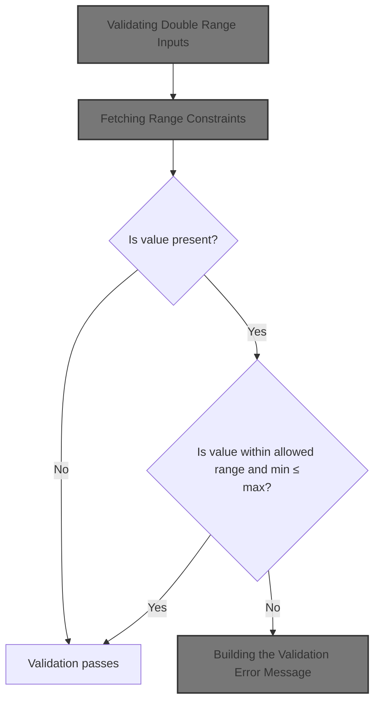
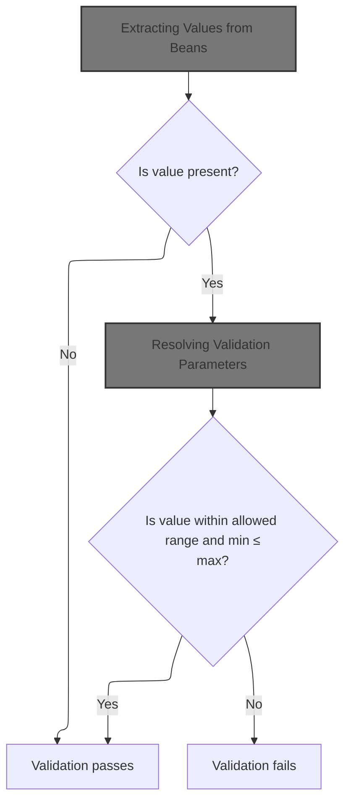
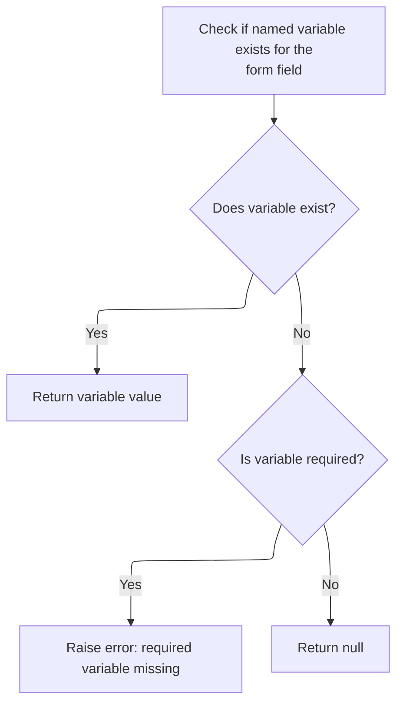
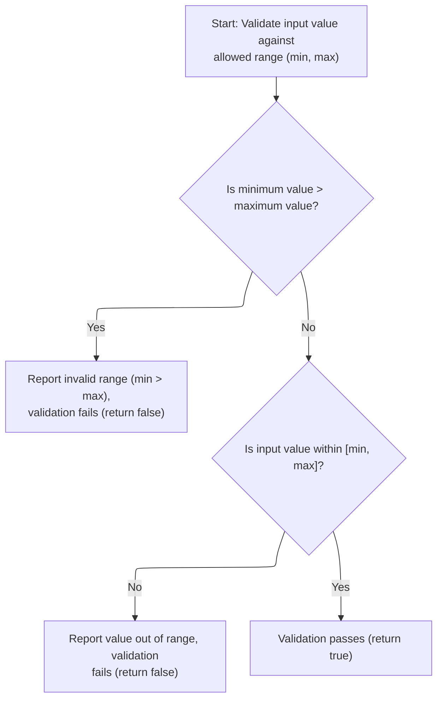
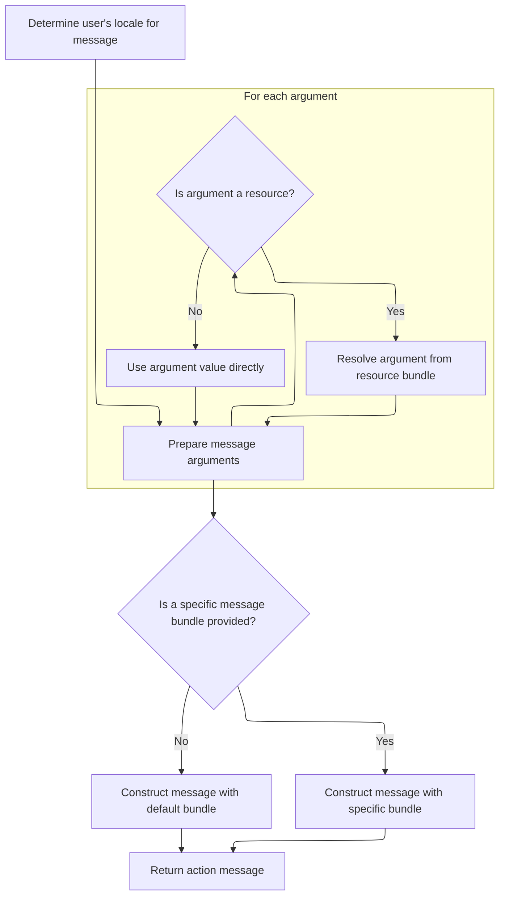

This document outlines the process for validating numeric input fields to ensure values fall within a configurable double range. The validation checks if the input is present, retrieves the allowed minimum and maximum values from configuration, and determines if the input is within these limits. If the input is not valid, a localized error message is generated for the user.



# Validating Double Range Inputs



<SwmSnippet path="/core/src/main/java/org/apache/struts/validator/FieldChecks.java" line="1029">

---

In <SwmToken path="core/src/main/java/org/apache/struts/validator/FieldChecks.java" pos="1029:7:7" line-data="    public static boolean validateDoubleRange(Object bean, ValidatorAction va,">`validateDoubleRange`</SwmToken>, we're starting by extracting the value to validate from the bean using <SwmToken path="core/src/main/java/org/apache/struts/validator/FieldChecks.java" pos="1035:5:5" line-data="            value = evaluateBean(bean, field);">`evaluateBean`</SwmToken>. This lets us handle both plain String beans and beans with properties, so the validation logic isn't tied to a specific bean structure. We need to call <SwmToken path="core/src/main/java/org/apache/struts/validator/FieldChecks.java" pos="1035:5:5" line-data="            value = evaluateBean(bean, field);">`evaluateBean`</SwmToken> next to get the actual value to check against the min and max range, which we'll fetch from resources right after.

```java
    public static boolean validateDoubleRange(Object bean, ValidatorAction va,
        Field field, ActionMessages errors, Validator validator,
        HttpServletRequest request) {
        String value = null;

        try {
            value = evaluateBean(bean, field);
```

---

</SwmSnippet>

## Extracting Values from Beans

<SwmSnippet path="/core/src/main/java/org/apache/struts/validator/FieldChecks.java" line="389">

---

<SwmToken path="core/src/main/java/org/apache/struts/validator/FieldChecks.java" pos="389:7:7" line-data="    private static String evaluateBean(Object bean, Field field) throws Exception {">`evaluateBean`</SwmToken> figures out if the bean is a plain String or a regular bean with properties. If it's not a String, we call <SwmToken path="core/src/main/java/org/apache/struts/validator/FieldChecks.java" pos="395:5:5" line-data="            value = getValueAsString(bean, field.getProperty());">`getValueAsString`</SwmToken> to pull out the property value as a String, so the rest of the validation can work with a consistent type.

```java
    private static String evaluateBean(Object bean, Field field) throws Exception {
        String value;

        if (isString(bean)) {
            value = (String) bean;
        } else {
            value = getValueAsString(bean, field.getProperty());
        }

        return value;
    }
```

---

</SwmSnippet>

<SwmSnippet path="/core/src/main/java/org/apache/struts/validator/FieldChecks.java" line="87">

---

<SwmToken path="core/src/main/java/org/apache/struts/validator/FieldChecks.java" pos="87:7:7" line-data="    private static String getValueAsString(Object bean, String property) ">`getValueAsString`</SwmToken> handles pulling out the property value from the bean and normalizes it: null stays null, empty arrays or collections become empty strings, and everything else is just converted to a string. This keeps downstream validation logic simple.

```java
    private static String getValueAsString(Object bean, String property) 
            throws Exception {
        
        Object value = PropertyUtils.getProperty(bean, property);
        if (value == null) {
            return null;
        }

        if (value instanceof String[]) {
            return ((String[]) value).length > 0 ? value.toString() : "";

        } else if (value instanceof Collection) {
            return ((Collection) value).isEmpty() ? "" : value.toString();

        } else {
            return value.toString();
        }
    }
```

---

</SwmSnippet>

## Fetching Range Constraints

<SwmSnippet path="/core/src/main/java/org/apache/struts/validator/FieldChecks.java" line="1036">

---

Back in <SwmToken path="core/src/main/java/org/apache/struts/validator/FieldChecks.java" pos="1029:7:7" line-data="    public static boolean validateDoubleRange(Object bean, ValidatorAction va,">`validateDoubleRange`</SwmToken>, after getting the value from <SwmToken path="core/src/main/java/org/apache/struts/validator/FieldChecks.java" pos="389:7:7" line-data="    private static String evaluateBean(Object bean, Field field) throws Exception {">`evaluateBean`</SwmToken>, we check if it's blank or null. If not, we pull the min and max values using <SwmToken path="core/src/main/java/org/apache/struts/validator/FieldChecks.java" pos="1038:1:3" line-data="                    Resources.getVarValue(&quot;min&quot;, field, validator, request, true);">`Resources.getVarValue`</SwmToken>. These are set up in the validation config, not hardcoded, so the same logic works for different fields.

```java
            if (!GenericValidator.isBlankOrNull(value)) {
                String minVar =
                    Resources.getVarValue("min", field, validator, request, true);
                String maxVar =
                    Resources.getVarValue("max", field, validator, request, true);
```

---

</SwmSnippet>

## Resolving Validation Parameters



<SwmSnippet path="/core/src/main/java/org/apache/struts/validator/Resources.java" line="157">

---

In <SwmToken path="core/src/main/java/org/apache/struts/validator/Resources.java" pos="157:7:7" line-data="    public static String getVarValue(String varName, Field field,">`getVarValue`</SwmToken>, we grab the Var object for the given name from the Field. If it's missing and required, we throw an exception with a localized message (fetched from PropertyMessageResources.getMessage). If it's not required, we just log and return null. Next, we need to resolve the message string for the exception, so we call into <SwmToken path="core/src/main/java/org/apache/struts/util/PropertyMessageResources.java" pos="82:8:8" line-data=" * Configure &lt;code&gt;PropertyMessageResources&lt;/code&gt; to operate in this mode by">`PropertyMessageResources`</SwmToken>.

```java
    public static String getVarValue(String varName, Field field,
        Validator validator, HttpServletRequest request, boolean required) {
        Var var = field.getVar(varName);

        if (var == null) {
            String msg = sysmsgs.getMessage("variable.missing", varName);

```

---

</SwmSnippet>

<SwmSnippet path="/core/src/main/java/org/apache/struts/util/PropertyMessageResources.java" line="227">

---

<SwmToken path="core/src/main/java/org/apache/struts/util/PropertyMessageResources.java" pos="227:5:5" line-data="    public String getMessage(Locale locale, String key) {">`getMessage`</SwmToken> looks up the message string for a key and locale, using different strategies depending on the mode (JSTL, resource bundle, or default). It builds a key, tries to find the message for the locale, and falls back to default locales or properties if needed. If nothing is found, it either returns null or a placeholder string.

```java
    public String getMessage(Locale locale, String key) {
        if (log.isDebugEnabled()) {
            log.debug("getMessage(" + locale + "," + key + ")");
        }

        // Initialize variables we will require
        String localeKey = localeKey(locale);
        String originalKey = messageKey(localeKey, key);
        String message = null;

        // Search the specified Locale
        message = findMessage(locale, key, originalKey);
        if (message != null) {
            return message;
        }

        // JSTL Compatibility - JSTL doesn't use the default locale
        if (mode == MODE_JSTL) {

           // do nothing (i.e. don't use default Locale)

        // PropertyResourcesBundle - searches through the hierarchy
        // for the default Locale (e.g. first en_US then en)
        } else if (mode == MODE_RESOURCE_BUNDLE) {

            if (!defaultLocale.equals(locale)) {
                message = findMessage(defaultLocale, key, originalKey);
            }

        // Default (backwards) Compatibility - just searches the
        // specified Locale (e.g. just en_US)
        } else {

            if (!defaultLocale.equals(locale)) {
                localeKey = localeKey(defaultLocale);
                message = findMessage(localeKey, key, originalKey);
            }

        }
        if (message != null) {
            return message;
        }

        // Find the message in the default properties file
        message = findMessage("", key, originalKey);
        if (message != null) {
            return message;
        }

        // Return an appropriate error indication
        if (returnNull) {
            return (null);
        } else {
            return ("???" + messageKey(locale, key) + "???");
        }
    }
```

---

</SwmSnippet>

<SwmSnippet path="/core/src/main/java/org/apache/struts/validator/Resources.java" line="164">

---

After getting the message string from <SwmToken path="core/src/main/java/org/apache/struts/util/PropertyMessageResources.java" pos="82:8:8" line-data=" * Configure &lt;code&gt;PropertyMessageResources&lt;/code&gt; to operate in this mode by">`PropertyMessageResources`</SwmToken>, <SwmToken path="core/src/main/java/org/apache/struts/validator/Resources.java" pos="178:3:3" line-data="        return getVarValue(var, application, request, required);">`getVarValue`</SwmToken> in Resources either throws/logs if the Var is missing, or grabs the <SwmToken path="core/src/main/java/org/apache/struts/validator/Resources.java" pos="175:1:1" line-data="        ServletContext application =">`ServletContext`</SwmToken> from the validator and passes everything to another <SwmToken path="core/src/main/java/org/apache/struts/validator/Resources.java" pos="178:3:3" line-data="        return getVarValue(var, application, request, required);">`getVarValue`</SwmToken> overload. This lets the framework resolve the variable value using both the field and the application context.

```java
            if (required) {
                throw new IllegalArgumentException(msg);
            }

            if (log.isDebugEnabled()) {
                log.debug(field.getProperty() + ": " + msg);
            }

            return null;
        }

        ServletContext application =
            (ServletContext) validator.getParameterValue(SERVLET_CONTEXT_PARAM);

        return getVarValue(var, application, request, required);
    }
```

---

</SwmSnippet>

## Range Checking and Error Handling



<SwmSnippet path="/core/src/main/java/org/apache/struts/validator/FieldChecks.java" line="1041">

---

After getting min and max from Resources, <SwmToken path="core/src/main/java/org/apache/struts/validator/FieldChecks.java" pos="1029:7:7" line-data="    public static boolean validateDoubleRange(Object bean, ValidatorAction va,">`validateDoubleRange`</SwmToken> parses them and the value as doubles, checks if min > max (throws if so), and then checks if the value is in range. If not, it adds a localized error message using <SwmToken path="core/src/main/java/org/apache/struts/validator/FieldChecks.java" pos="1052:1:3" line-data="                        Resources.getActionMessage(validator, request, va, field));">`Resources.getActionMessage`</SwmToken> and returns false. If everything is fine, it returns true.

```java
                double doubleValue = Double.parseDouble(value);
                double min = Double.parseDouble(minVar);
                double max = Double.parseDouble(maxVar);

                if (min > max) {
                    throw new IllegalArgumentException(sysmsgs.getMessage(
                            "invalid.range", minVar, maxVar));
                }

                if (!GenericValidator.isInRange(doubleValue, min, max)) {
                    errors.add(field.getKey(),
                        Resources.getActionMessage(validator, request, va, field));

                    return false;
                }
            }
        } catch (Exception e) {
            processFailure(errors, field, validator.getFormName(), "doubleRange", e);

            return false;
        }

        return true;
    }
```

---

</SwmSnippet>

# Building the Validation Error Message

<SwmSnippet path="/core/src/main/java/org/apache/struts/validator/Resources.java" line="365">

---

In <SwmToken path="core/src/main/java/org/apache/struts/validator/Resources.java" pos="365:7:7" line-data="    public static ActionMessage getActionMessage(Validator validator,">`getActionMessage`</SwmToken>, we grab the message for the <SwmPath>[core/…/struts/action/](core/src/main/java/org/apache/struts/action/)</SwmPath> combo. If it's not a resource, we just use it. Otherwise, we figure out the message key and bundle, get the <SwmToken path="core/src/main/java/org/apache/struts/validator/Resources.java" pos="388:1:1" line-data="        ServletContext application =">`ServletContext`</SwmToken>, and fetch the right <SwmToken path="core/src/main/java/org/apache/struts/validator/Resources.java" pos="390:1:1" line-data="        MessageResources messages =">`MessageResources`</SwmToken> for localization. Next, we need to resolve the user's locale and the message arguments, so we call more helper methods.

```java
    public static ActionMessage getActionMessage(Validator validator,
        HttpServletRequest request, ValidatorAction va, Field field) {
        Msg msg = field.getMessage(va.getName());

        if ((msg != null) && !msg.isResource()) {
            return new ActionMessage(msg.getKey(), false);
        }

        String msgKey = null;
        String msgBundle = null;

        if (msg == null) {
            msgKey = va.getMsg();
        } else {
            msgKey = msg.getKey();
            msgBundle = msg.getBundle();
        }

        if ((msgKey == null) || (msgKey.length() == 0)) {
            return new ActionMessage("??? " + va.getName() + "."
                + field.getProperty() + " ???", false);
        }

        ServletContext application =
            (ServletContext) validator.getParameterValue(SERVLET_CONTEXT_PARAM);
        MessageResources messages =
            getMessageResources(application, request, msgBundle);
```

---

</SwmSnippet>

## Locating Message Resources

```mermaid
%%{init: {"flowchart": {"defaultRenderer": "elk"}} }%%
flowchart TD
    node1{"Is a bundle name provided?"}
    click node1 openCode "core/src/main/java/org/apache/struts/validator/Resources.java:119:121"
    node1 -->|"Yes"| node2["Use provided bundle name"]
    click node2 openCode "core/src/main/java/org/apache/struts/validator/Resources.java:119:121"
    node1 -->|"No"| node3["Use default bundle name"]
    click node3 openCode "core/src/main/java/org/apache/struts/validator/Resources.java:120:121"
    node2 --> node4{"Are message resources in request?"}
    node3 --> node4
    click node4 openCode "core/src/main/java/org/apache/struts/validator/Resources.java:123:124"
    node4 -->|"Yes"| node8["Return message resources for UI"]
    click node8 openCode "core/src/main/java/org/apache/struts/validator/Resources.java:144:145"
    node4 -->|"No"| node5["Try to find resources for this module"]
    click node5 openCode "core/src/main/java/org/apache/struts/validator/Resources.java:127:132"
    node5 --> node6{"Are resources found for module?"}
    click node6 openCode "core/src/main/java/org/apache/struts/validator/Resources.java:130:132"
    node6 -->|"Yes"| node8
    node6 -->|"No"| node7["Try to find resources for bundle only"]
    click node7 openCode "core/src/main/java/org/apache/struts/validator/Resources.java:135:136"
    node7 --> node9{"Are resources found for bundle?"}
    click node9 openCode "core/src/main/java/org/apache/struts/validator/Resources.java:136:137"
    node9 -->|"Yes"| node8
    node9 -->|"No"| node10["Error: No message resources found"]
    click node10 openCode "core/src/main/java/org/apache/struts/validator/Resources.java:140:142"
classDef HeadingStyle fill:#777777,stroke:#333,stroke-width:2px;

%% Swimm:
%% %%{init: {"flowchart": {"defaultRenderer": "elk"}} }%%
%% flowchart TD
%%     node1{"Is a bundle name provided?"}
%%     click node1 openCode "<SwmPath>[core/…/validator/Resources.java](core/src/main/java/org/apache/struts/validator/Resources.java)</SwmPath>:119:121"
%%     node1 -->|"Yes"| node2["Use provided bundle name"]
%%     click node2 openCode "<SwmPath>[core/…/validator/Resources.java](core/src/main/java/org/apache/struts/validator/Resources.java)</SwmPath>:119:121"
%%     node1 -->|"No"| node3["Use default bundle name"]
%%     click node3 openCode "<SwmPath>[core/…/validator/Resources.java](core/src/main/java/org/apache/struts/validator/Resources.java)</SwmPath>:120:121"
%%     node2 --> node4{"Are message resources in request?"}
%%     node3 --> node4
%%     click node4 openCode "<SwmPath>[core/…/validator/Resources.java](core/src/main/java/org/apache/struts/validator/Resources.java)</SwmPath>:123:124"
%%     node4 -->|"Yes"| node8["Return message resources for UI"]
%%     click node8 openCode "<SwmPath>[core/…/validator/Resources.java](core/src/main/java/org/apache/struts/validator/Resources.java)</SwmPath>:144:145"
%%     node4 -->|"No"| node5["Try to find resources for this module"]
%%     click node5 openCode "<SwmPath>[core/…/validator/Resources.java](core/src/main/java/org/apache/struts/validator/Resources.java)</SwmPath>:127:132"
%%     node5 --> node6{"Are resources found for module?"}
%%     click node6 openCode "<SwmPath>[core/…/validator/Resources.java](core/src/main/java/org/apache/struts/validator/Resources.java)</SwmPath>:130:132"
%%     node6 -->|"Yes"| node8
%%     node6 -->|"No"| node7["Try to find resources for bundle only"]
%%     click node7 openCode "<SwmPath>[core/…/validator/Resources.java](core/src/main/java/org/apache/struts/validator/Resources.java)</SwmPath>:135:136"
%%     node7 --> node9{"Are resources found for bundle?"}
%%     click node9 openCode "<SwmPath>[core/…/validator/Resources.java](core/src/main/java/org/apache/struts/validator/Resources.java)</SwmPath>:136:137"
%%     node9 -->|"Yes"| node8
%%     node9 -->|"No"| node10["Error: No message resources found"]
%%     click node10 openCode "<SwmPath>[core/…/validator/Resources.java](core/src/main/java/org/apache/struts/validator/Resources.java)</SwmPath>:140:142"
%% classDef HeadingStyle fill:#777777,stroke:#333,stroke-width:2px;
```



<SwmSnippet path="/core/src/main/java/org/apache/struts/validator/Resources.java" line="117">

---

In <SwmToken path="core/src/main/java/org/apache/struts/validator/Resources.java" pos="117:7:7" line-data="    public static MessageResources getMessageResources(">`getMessageResources`</SwmToken>, we try to find the <SwmToken path="core/src/main/java/org/apache/struts/validator/Resources.java" pos="117:5:5" line-data="    public static MessageResources getMessageResources(">`MessageResources`</SwmToken> for the bundle in the request, then in the application with a module prefix, and finally just in the application. If we need the module prefix, we call ModuleUtils.getModuleConfig to get it. If nothing is found, we throw.

```java
    public static MessageResources getMessageResources(
        ServletContext application, HttpServletRequest request, String bundle) {
        if (bundle == null) {
            bundle = Globals.MESSAGES_KEY;
        }

        MessageResources resources =
            (MessageResources) request.getAttribute(bundle);

        if (resources == null) {
            ModuleConfig moduleConfig =
                ModuleUtils.getInstance().getModuleConfig(request, application);

            resources =
                (MessageResources) application.getAttribute(bundle
                    + moduleConfig.getPrefix());
        }

```

---

</SwmSnippet>

<SwmSnippet path="/core/src/main/java/org/apache/struts/util/ModuleUtils.java" line="130">

---

<SwmToken path="core/src/main/java/org/apache/struts/util/ModuleUtils.java" pos="130:5:5" line-data="    public ModuleConfig getModuleConfig(HttpServletRequest request,">`getModuleConfig`</SwmToken> first tries to get the config from the request. If that's missing, it falls back to the context with an empty string as the module key, and then sets it as a request attribute for later use.

```java
    public ModuleConfig getModuleConfig(HttpServletRequest request,
        ServletContext context) {
        ModuleConfig moduleConfig = this.getModuleConfig(request);

        if (moduleConfig == null) {
            moduleConfig = this.getModuleConfig("", context);
            request.setAttribute(Globals.MODULE_KEY, moduleConfig);
        }

        return moduleConfig;
    }
```

---

</SwmSnippet>

<SwmSnippet path="/core/src/main/java/org/apache/struts/validator/Resources.java" line="135">

---

After getting the module prefix from <SwmToken path="core/src/main/java/org/apache/struts/validator/Resources.java" pos="128:1:1" line-data="                ModuleUtils.getInstance().getModuleConfig(request, application);">`ModuleUtils`</SwmToken>, <SwmToken path="core/src/main/java/org/apache/struts/validator/Resources.java" pos="117:7:7" line-data="    public static MessageResources getMessageResources(">`getMessageResources`</SwmToken> tries the application scope with and without the prefix. If it still can't find the resources, it throws a <SwmToken path="core/src/main/java/org/apache/struts/validator/Resources.java" pos="140:5:5" line-data="            throw new NullPointerException(">`NullPointerException`</SwmToken>, so missing resources are caught early.

```java
        if (resources == null) {
            resources = (MessageResources) application.getAttribute(bundle);
        }

        if (resources == null) {
            throw new NullPointerException(
                "No message resources found for bundle: " + bundle);
        }

        return resources;
    }
```

---

</SwmSnippet>

## Resolving Message Arguments



<SwmSnippet path="/core/src/main/java/org/apache/struts/validator/Resources.java" line="392">

---

After getting the <SwmToken path="core/src/main/java/org/apache/struts/validator/Resources.java" pos="117:5:5" line-data="    public static MessageResources getMessageResources(">`MessageResources`</SwmToken>, <SwmToken path="core/src/main/java/org/apache/struts/validator/FieldChecks.java" pos="1052:3:3" line-data="                        Resources.getActionMessage(validator, request, va, field));">`getActionMessage`</SwmToken> figures out the user's locale and pulls the argument definitions from the field for the action. Next, we need to resolve those arguments into actual values, so we call <SwmToken path="core/src/main/java/org/apache/struts/validator/Resources.java" pos="396:1:1" line-data="            getArgValues(application, request, messages, locale, args);">`getArgValues`</SwmToken>.

```java
        Locale locale = RequestUtils.getUserLocale(request, null);

        Arg[] args = field.getArgs(va.getName());
```

---

</SwmSnippet>

<SwmSnippet path="/core/src/main/java/org/apache/struts/validator/Resources.java" line="420">

---

<SwmToken path="core/src/main/java/org/apache/struts/validator/Resources.java" pos="420:9:9" line-data="    public static String[] getArgs(String actionName,">`getArgs`</SwmToken> grabs up to 4 arguments for the action from the field. For each, if it's a resource, we localize it; otherwise, we just use the string. This is all hardcoded to 4 arguments, so if you need more, you're out of luck.

```java
    public static String[] getArgs(String actionName,
        MessageResources messages, Locale locale, Field field) {
        String[] argMessages = new String[4];

        Arg[] args =
            new Arg[] {
                field.getArg(actionName, 0), field.getArg(actionName, 1),
                field.getArg(actionName, 2), field.getArg(actionName, 3)
            };

        for (int i = 0; i < args.length; i++) {
            if (args[i] == null) {
                continue;
            }

            if (args[i].isResource()) {
                argMessages[i] = getMessage(messages, locale, args[i].getKey());
            } else {
                argMessages[i] = args[i].getKey();
            }
        }
```

---

</SwmSnippet>

<SwmSnippet path="/core/src/main/java/org/apache/struts/validator/Resources.java" line="395">

---

After getting the argument definitions, <SwmToken path="core/src/main/java/org/apache/struts/validator/FieldChecks.java" pos="1052:3:3" line-data="                        Resources.getActionMessage(validator, request, va, field));">`getActionMessage`</SwmToken> calls <SwmToken path="core/src/main/java/org/apache/struts/validator/Resources.java" pos="396:1:1" line-data="            getArgValues(application, request, messages, locale, args);">`getArgValues`</SwmToken> to turn those into actual strings, resolving bundles and localization as needed. This gives us the final argument values for the message.

```java
        String[] argValues =
            getArgValues(application, request, messages, locale, args);

```

---

</SwmSnippet>

<SwmSnippet path="/core/src/main/java/org/apache/struts/validator/Resources.java" line="455">

---

<SwmToken path="core/src/main/java/org/apache/struts/validator/Resources.java" pos="455:9:9" line-data="    private static String[] getArgValues(ServletContext application,">`getArgValues`</SwmToken> loops through the arguments, and for each resource-based argument, it fetches the right <SwmToken path="core/src/main/java/org/apache/struts/validator/Resources.java" pos="456:6:6" line-data="        HttpServletRequest request, MessageResources defaultMessages,">`MessageResources`</SwmToken> (using the bundle if specified) and resolves the value. <SwmToken path="core/src/main/java/org/apache/struts/validator/Resources.java" pos="195:3:5" line-data="        // Non-resource variable">`Non-resource`</SwmToken> arguments are just used as-is. This gives us the final string values for the message.

```java
    private static String[] getArgValues(ServletContext application,
        HttpServletRequest request, MessageResources defaultMessages,
        Locale locale, Arg[] args) {
        if ((args == null) || (args.length == 0)) {
            return null;
        }

        String[] values = new String[args.length];

        for (int i = 0; i < args.length; i++) {
            if (args[i] != null) {
                if (args[i].isResource()) {
                    MessageResources messages = defaultMessages;

                    if (args[i].getBundle() != null) {
                        messages =
                            getMessageResources(application, request,
                                args[i].getBundle());
                    }

                    values[i] = messages.getMessage(locale, args[i].getKey());
                } else {
                    values[i] = args[i].getKey();
                }
            }
        }

        return values;
    }
```

---

</SwmSnippet>

<SwmSnippet path="/core/src/main/java/org/apache/struts/validator/Resources.java" line="398">

---

After resolving the argument values, <SwmToken path="core/src/main/java/org/apache/struts/validator/FieldChecks.java" pos="1052:3:3" line-data="                        Resources.getActionMessage(validator, request, va, field));">`getActionMessage`</SwmToken> either builds the <SwmToken path="core/src/main/java/org/apache/struts/validator/Resources.java" pos="398:1:1" line-data="        ActionMessage actionMessage = null;">`ActionMessage`</SwmToken> with the key and values (if no bundle), or resolves the message string and wraps it in an <SwmToken path="core/src/main/java/org/apache/struts/validator/Resources.java" pos="398:1:1" line-data="        ActionMessage actionMessage = null;">`ActionMessage`</SwmToken>. This is the last step before returning the message to the caller.

```java
        ActionMessage actionMessage = null;

        if (msgBundle == null) {
            actionMessage = new ActionMessage(msgKey, argValues);
        } else {
            String message = messages.getMessage(locale, msgKey, argValues);

            actionMessage = new ActionMessage(message, false);
        }

        return actionMessage;
    }
```

---

</SwmSnippet>

&nbsp;

*This is an auto-generated document by Swimm 🌊 and has not yet been verified by a human*

<SwmMeta version="3.0.0" repo-id="Z2l0aHViJTNBJTNBc3RydXRzMSUzQSUzQVN3aW1tLURlbW8=" repo-name="struts1"><sup>Powered by [Swimm](https://app.swimm.io/)</sup></SwmMeta>
