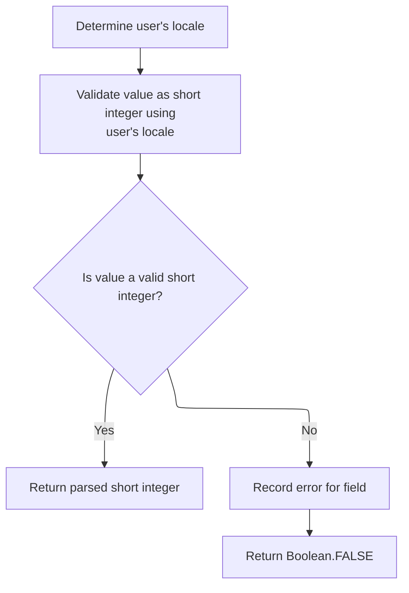
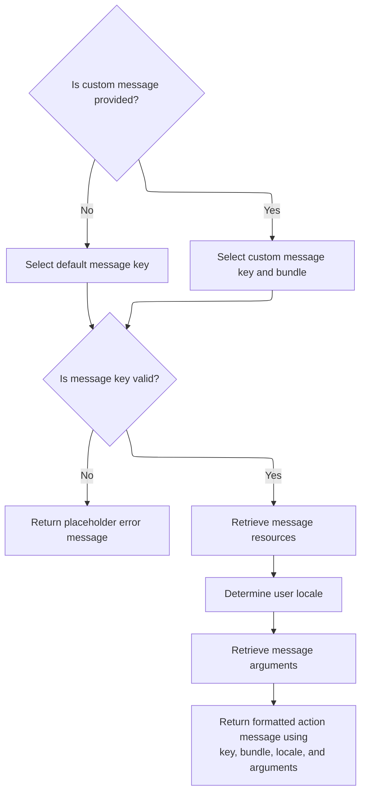
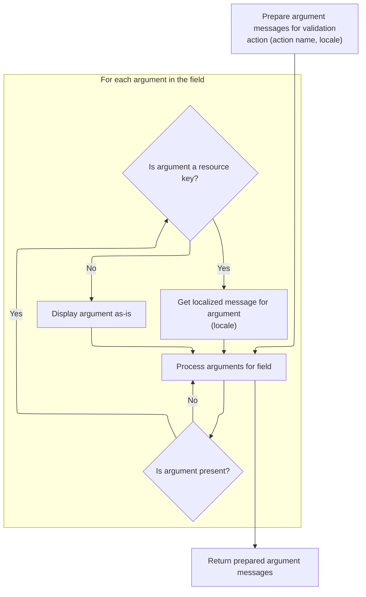
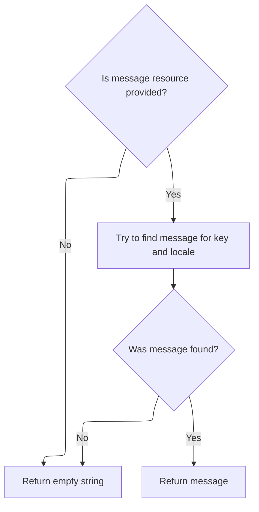
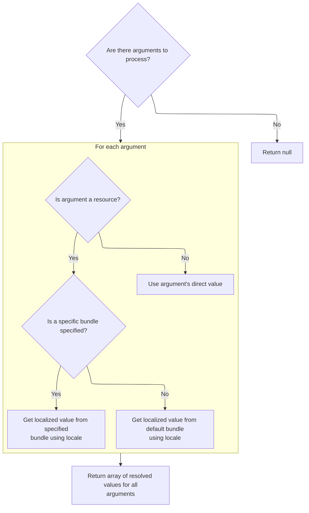

This document describes how user input is validated as a short integer, using the user's locale for parsing and error messages. The process extracts the value, checks if it is blank, and attempts to parse it. If validation fails, a localized error message is provided for the user interface.

# Validating Short Locale Input

<SwmSnippet path="/core/src/main/java/org/apache/struts/validator/FieldChecks.java" line="458">

---

In <SwmToken path="core/src/main/java/org/apache/struts/validator/FieldChecks.java" pos="458:7:7" line-data="    public static Object validateShortLocale(Object bean, ValidatorAction va,">`validateShortLocale`</SwmToken>, we try to extract the value from the bean using <SwmToken path="core/src/main/java/org/apache/struts/validator/FieldChecks.java" pos="465:5:5" line-data="            value = evaluateBean(bean, field);">`evaluateBean`</SwmToken>. If that fails, we immediately call <SwmToken path="core/src/main/java/org/apache/struts/validator/FieldChecks.java" pos="467:1:1" line-data="            processFailure(errors, field, validator.getFormName(), &quot;shortLocale&quot;, e);">`processFailure`</SwmToken> to log the error and add a message, then bail out with <SwmToken path="core/src/main/java/org/apache/struts/validator/FieldChecks.java" pos="468:3:5" line-data="            return Boolean.FALSE;">`Boolean.FALSE`</SwmToken>. This ensures any property access issues are surfaced to both logs and the UI right away.

```java
    public static Object validateShortLocale(Object bean, ValidatorAction va,
        Field field, ActionMessages errors, Validator validator,
        HttpServletRequest request) {
        Object result = null;
        String value = null;

        try {
            value = evaluateBean(bean, field);
        } catch (Exception e) {
            processFailure(errors, field, validator.getFormName(), "shortLocale", e);
            return Boolean.FALSE;
        }

        if (GenericValidator.isBlankOrNull(value)) {
            return Boolean.TRUE;
        }

```

---

</SwmSnippet>

## Handling Validation Failures

<SwmSnippet path="/core/src/main/java/org/apache/struts/validator/FieldChecks.java" line="1434">

---

In <SwmToken path="core/src/main/java/org/apache/struts/validator/FieldChecks.java" pos="1434:7:7" line-data="    private static void processFailure(ActionMessages errors, Field field,">`processFailure`</SwmToken>, we build a detailed error message using <SwmToken path="core/src/main/java/org/apache/struts/validator/FieldChecks.java" pos="1438:1:3" line-data="            sysmsgs.getMessage(&quot;validation.failed&quot;, validatorName,">`sysmsgs.getMessage`</SwmToken> to include context like validator name, field, form, and the exception. This message is logged for debugging. We need <SwmToken path="core/src/main/java/org/apache/struts/validator/Resources.java" pos="117:5:5" line-data="    public static MessageResources getMessageResources(">`MessageResources`</SwmToken> here to keep error messages consistent and localizable.

```java
    private static void processFailure(ActionMessages errors, Field field,
        String formName, String validatorName, Throwable t) {
        // Log the error
        String logErrorMsg =
            sysmsgs.getMessage("validation.failed", validatorName,
                field.getProperty(), formName, t.toString());

        log.error(logErrorMsg, t);

```

---

</SwmSnippet>

### Formatting Log/Error Messages

<SwmSnippet path="/core/src/main/java/org/apache/struts/util/MessageResources.java" line="355">

---

<SwmToken path="core/src/main/java/org/apache/struts/util/MessageResources.java" pos="355:5:5" line-data="    public String getMessage(Locale locale, String key, Object arg0,">`getMessage`</SwmToken> here just wraps the arguments into an array and passes them to the main message formatting logic. This keeps the API flexible for different numbers of arguments.

```java
    public String getMessage(Locale locale, String key, Object arg0,
        Object arg1, Object arg2) {
        return this.getMessage(locale, key, new Object[] { arg0, arg1, arg2 });
    }
```

---

</SwmSnippet>

### Message Formatting and Caching

```mermaid
%%{init: {"flowchart": {"defaultRenderer": "elk"}} }%%
flowchart TD
  node1["Request message for key and arguments,
with locale"] --> node2{"Is locale provided?"}
  click node1 openCode "core/src/main/java/org/apache/struts/util/MessageResources.java:324:326"
  node2 -->|"Yes"| node3["Use provided locale"]
  click node2 openCode "core/src/main/java/org/apache/struts/util/MessageResources.java:288:290"
  node2 -->|"No"| node4["Use default locale"]
  click node4 openCode "core/src/main/java/org/apache/struts/util/MessageResources.java:288:290"
  node3 --> node5["Check for cached message template"]
  node4 --> node5
  click node5 openCode "core/src/main/java/org/apache/struts/util/MessageResources.java:292:297"
  node5 --> node6{"Is template cached?"}
  click node6 openCode "core/src/main/java/org/apache/struts/util/MessageResources.java:296:297"
  node6 -->|"Yes"| node7["Use cached template"]
  click node7 openCode "core/src/main/java/org/apache/struts/util/MessageResources.java:296:297"
  node6 -->|"No"| node8["Retrieve template for key/locale"]
  click node8 openCode "core/src/main/java/org/apache/struts/util/MessageResources.java:299:300"
  node8 --> node9{"Is template found?"}
  click node9 openCode "core/src/main/java/org/apache/struts/util/MessageResources.java:301:303"
  node9 -->|"Yes"| node10["Cache and use template"]
  click node10 openCode "core/src/main/java/org/apache/struts/util/MessageResources.java:305:307"
  node9 -->|"No"| node11{"returnNull?"}
  click node11 openCode "core/src/main/java/org/apache/struts/util/MessageResources.java:302:303"
  node11 -->|"Yes"| node12["Return null"]
  click node12 openCode "core/src/main/java/org/apache/struts/util/MessageResources.java:302:302"
  node11 -->|"No"| node13["Return ???key/locale???"]
  click node13 openCode "core/src/main/java/org/apache/struts/util/MessageResources.java:302:303"
  node7 --> node14["Format message with arguments"]
  click node14 openCode "core/src/main/java/org/apache/struts/util/MessageResources.java:311:311"
  node10 --> node14
  node12 --> node15["Return value"]
  node13 --> node15["Return value"]
  node14 --> node15["Return value"]
  click node15 openCode "core/src/main/java/org/apache/struts/util/MessageResources.java:311:312"
classDef HeadingStyle fill:#777777,stroke:#333,stroke-width:2px;

%% Swimm:
%% %%{init: {"flowchart": {"defaultRenderer": "elk"}} }%%
%% flowchart TD
%%   node1["Request message for key and arguments,
%% with locale"] --> node2{"Is locale provided?"}
%%   click node1 openCode "<SwmPath>[core/…/util/MessageResources.java](core/src/main/java/org/apache/struts/util/MessageResources.java)</SwmPath>:324:326"
%%   node2 -->|"Yes"| node3["Use provided locale"]
%%   click node2 openCode "<SwmPath>[core/…/util/MessageResources.java](core/src/main/java/org/apache/struts/util/MessageResources.java)</SwmPath>:288:290"
%%   node2 -->|"No"| node4["Use default locale"]
%%   click node4 openCode "<SwmPath>[core/…/util/MessageResources.java](core/src/main/java/org/apache/struts/util/MessageResources.java)</SwmPath>:288:290"
%%   node3 --> node5["Check for cached message template"]
%%   node4 --> node5
%%   click node5 openCode "<SwmPath>[core/…/util/MessageResources.java](core/src/main/java/org/apache/struts/util/MessageResources.java)</SwmPath>:292:297"
%%   node5 --> node6{"Is template cached?"}
%%   click node6 openCode "<SwmPath>[core/…/util/MessageResources.java](core/src/main/java/org/apache/struts/util/MessageResources.java)</SwmPath>:296:297"
%%   node6 -->|"Yes"| node7["Use cached template"]
%%   click node7 openCode "<SwmPath>[core/…/util/MessageResources.java](core/src/main/java/org/apache/struts/util/MessageResources.java)</SwmPath>:296:297"
%%   node6 -->|"No"| node8["Retrieve template for key/locale"]
%%   click node8 openCode "<SwmPath>[core/…/util/MessageResources.java](core/src/main/java/org/apache/struts/util/MessageResources.java)</SwmPath>:299:300"
%%   node8 --> node9{"Is template found?"}
%%   click node9 openCode "<SwmPath>[core/…/util/MessageResources.java](core/src/main/java/org/apache/struts/util/MessageResources.java)</SwmPath>:301:303"
%%   node9 -->|"Yes"| node10["Cache and use template"]
%%   click node10 openCode "<SwmPath>[core/…/util/MessageResources.java](core/src/main/java/org/apache/struts/util/MessageResources.java)</SwmPath>:305:307"
%%   node9 -->|"No"| node11{"<SwmToken path="core/src/main/java/org/apache/struts/util/MessageResources.java" pos="302:3:3" line-data="                    return returnNull ? null : (&quot;???&quot; + formatKey + &quot;???&quot;);">`returnNull`</SwmToken>?"}
%%   click node11 openCode "<SwmPath>[core/…/util/MessageResources.java](core/src/main/java/org/apache/struts/util/MessageResources.java)</SwmPath>:302:303"
%%   node11 -->|"Yes"| node12["Return null"]
%%   click node12 openCode "<SwmPath>[core/…/util/MessageResources.java](core/src/main/java/org/apache/struts/util/MessageResources.java)</SwmPath>:302:302"
%%   node11 -->|"No"| node13["Return ???key/locale???"]
%%   click node13 openCode "<SwmPath>[core/…/util/MessageResources.java](core/src/main/java/org/apache/struts/util/MessageResources.java)</SwmPath>:302:303"
%%   node7 --> node14["Format message with arguments"]
%%   click node14 openCode "<SwmPath>[core/…/util/MessageResources.java](core/src/main/java/org/apache/struts/util/MessageResources.java)</SwmPath>:311:311"
%%   node10 --> node14
%%   node12 --> node15["Return value"]
%%   node13 --> node15["Return value"]
%%   node14 --> node15["Return value"]
%%   click node15 openCode "<SwmPath>[core/…/util/MessageResources.java](core/src/main/java/org/apache/struts/util/MessageResources.java)</SwmPath>:311:312"
%% classDef HeadingStyle fill:#777777,stroke:#333,stroke-width:2px;
```



<SwmSnippet path="/core/src/main/java/org/apache/struts/util/MessageResources.java" line="324">

---

<SwmToken path="core/src/main/java/org/apache/struts/util/MessageResources.java" pos="324:5:5" line-data="    public String getMessage(Locale locale, String key, Object arg0) {">`getMessage`</SwmToken> here does the heavy lifting: it checks for a cached <SwmToken path="core/src/main/java/org/apache/struts/util/MessageResources.java" pos="287:5:5" line-data="        // Cache MessageFormat instances as they are accessed">`MessageFormat`</SwmToken> for the locale/key, creates and caches one if missing, and formats the message with the given args. If the message isn't found, you get a placeholder or null, so missing keys are obvious. It also escapes the format string and defaults the locale if needed.

```java
    public String getMessage(Locale locale, String key, Object arg0) {
        return this.getMessage(locale, key, new Object[] { arg0 });
    }
```

---

</SwmSnippet>

<SwmSnippet path="/core/src/main/java/org/apache/struts/util/MessageResources.java" line="286">

---

<SwmToken path="core/src/main/java/org/apache/struts/util/MessageResources.java" pos="286:5:5" line-data="    public String getMessage(Locale locale, String key, Object[] args) {">`getMessage`</SwmToken> (with Object\[\] args) is where the actual formatting happens. It caches <SwmToken path="core/src/main/java/org/apache/struts/util/MessageResources.java" pos="287:5:5" line-data="        // Cache MessageFormat instances as they are accessed">`MessageFormat`</SwmToken> objects per locale/key for speed, escapes the format string, and falls back to placeholders if the message is missing. Null locales are swapped for a default, so you always get something back unless the key is totally missing.

```java
    public String getMessage(Locale locale, String key, Object[] args) {
        // Cache MessageFormat instances as they are accessed
        if (locale == null) {
            locale = defaultLocale;
        }

        MessageFormat format = null;
        String formatKey = messageKey(locale, key);

        synchronized (formats) {
            format = (MessageFormat) formats.get(formatKey);

            if (format == null) {
                String formatString = getMessage(locale, key);

                if (formatString == null) {
                    return returnNull ? null : ("???" + formatKey + "???");
                }

                format = new MessageFormat(escape(formatString));
                format.setLocale(locale);
                formats.put(formatKey, format);
            }
        }

        return format.format(args);
    }
```

---

</SwmSnippet>

### Adding User-Facing Error Messages

<SwmSnippet path="/core/src/main/java/org/apache/struts/validator/FieldChecks.java" line="1443">

---

We just got back from MessageResources.getMessage. Now, in <SwmToken path="core/src/main/java/org/apache/struts/validator/FieldChecks.java" pos="467:1:1" line-data="            processFailure(errors, field, validator.getFormName(), &quot;shortLocale&quot;, e);">`processFailure`</SwmToken>, we fetch a generic system error message (localized) and add it to the errors collection for the UI. This keeps technical details in the logs and gives users a simple error message.

```java
        // Add general "system error" message to show to the user
        String userErrorMsg = sysmsgs.getMessage("system.error");

        errors.add(field.getKey(), new ActionMessage(userErrorMsg, false));
    }
```

---

</SwmSnippet>

<SwmSnippet path="/core/src/main/java/org/apache/struts/util/MessageResources.java" line="196">

---

<SwmToken path="core/src/main/java/org/apache/struts/util/MessageResources.java" pos="196:5:10" line-data="    public String getMessage(String key) {">`getMessage(String key)`</SwmToken> is just a shortcut for fetching a message with no locale or arguments. It delegates to the main logic with nulls.

```java
    public String getMessage(String key) {
        return this.getMessage((Locale) null, key, null);
    }
```

---

</SwmSnippet>

## Locale Lookup for Validation



<SwmSnippet path="/core/src/main/java/org/apache/struts/validator/FieldChecks.java" line="475">

---

Just after coming back from <SwmToken path="core/src/main/java/org/apache/struts/validator/FieldChecks.java" pos="467:1:1" line-data="            processFailure(errors, field, validator.getFormName(), &quot;shortLocale&quot;, e);">`processFailure`</SwmToken>, <SwmToken path="core/src/main/java/org/apache/struts/validator/FieldChecks.java" pos="458:7:7" line-data="    public static Object validateShortLocale(Object bean, ValidatorAction va,">`validateShortLocale`</SwmToken> grabs the user's locale using <SwmToken path="core/src/main/java/org/apache/struts/validator/FieldChecks.java" pos="475:7:9" line-data="        Locale locale = RequestUtils.getUserLocale(request, null);">`RequestUtils.getUserLocale`</SwmToken>. This is needed for locale-aware parsing and error messages in the next steps.

```java
        Locale locale = RequestUtils.getUserLocale(request, null);

```

---

</SwmSnippet>

<SwmSnippet path="/core/src/main/java/org/apache/struts/util/RequestUtils.java" line="299">

---

<SwmToken path="core/src/main/java/org/apache/struts/util/RequestUtils.java" pos="299:7:7" line-data="    public static Locale getUserLocale(HttpServletRequest request, String locale) {">`getUserLocale`</SwmToken> checks the session for a Locale object using the given key (or a default), and if not found, falls back to the request's locale. It assumes the session attribute is a Locale and that the key is valid. This lets us respect user preferences or browser settings for localization.

```java
    public static Locale getUserLocale(HttpServletRequest request, String locale) {
        Locale userLocale = null;
        HttpSession session = request.getSession(false);

        if (locale == null) {
            locale = Globals.LOCALE_KEY;
        }

        // Only check session if sessions are enabled
        if (session != null) {
            userLocale = (Locale) session.getAttribute(locale);
        }

        if (userLocale == null) {
            // Returns Locale based on Accept-Language header or the server default
            userLocale = request.getLocale();
        }

        return userLocale;
    }
```

---

</SwmSnippet>

<SwmSnippet path="/core/src/main/java/org/apache/struts/validator/FieldChecks.java" line="477">

---

After getting the locale from <SwmToken path="core/src/main/java/org/apache/struts/validator/FieldChecks.java" pos="475:7:7" line-data="        Locale locale = RequestUtils.getUserLocale(request, null);">`RequestUtils`</SwmToken>, <SwmToken path="core/src/main/java/org/apache/struts/validator/FieldChecks.java" pos="458:7:7" line-data="    public static Object validateShortLocale(Object bean, ValidatorAction va,">`validateShortLocale`</SwmToken> tries to parse the value. If parsing fails (result is null), we add a localized error message using <SwmToken path="core/src/main/java/org/apache/struts/validator/FieldChecks.java" pos="481:1:3" line-data="                Resources.getActionMessage(validator, request, va, field));">`Resources.getActionMessage`</SwmToken> so the user knows what's wrong.

```java
        result = GenericTypeValidator.formatShort(value, locale);

        if (result == null) {
            errors.add(field.getKey(),
                Resources.getActionMessage(validator, request, va, field));
        }

        return (result == null) ? Boolean.FALSE : result;
    }
```

---

</SwmSnippet>

# Building the Action Message

```mermaid
%%{init: {"flowchart": {"defaultRenderer": "elk"}} }%%
flowchart TD
  node1["Check for custom message for field and
rule"]
  click node1 openCode "core/src/main/java/org/apache/struts/validator/Resources.java:365:367"
  node1 --> node2{"Custom message exists and is not a
resource?"}
  click node2 openCode "core/src/main/java/org/apache/struts/validator/Resources.java:369:371"
  node2 -->|"Yes"| node3["Return custom message as ActionMessage"]
  click node3 openCode "core/src/main/java/org/apache/struts/validator/Resources.java:370:371"
  node2 -->|"No"| node4["Resolving Message Arguments"]
  
  node4 --> node5{"Is message key missing or empty?"}
  click node5 openCode "core/src/main/java/org/apache/struts/validator/Resources.java:383:386"
  node5 -->|"Yes"| node6["Return error ActionMessage for missing
key"]
  click node6 openCode "core/src/main/java/org/apache/struts/validator/Resources.java:384:386"
  node5 -->|"No"| node7{"Is message bundle specified?"}
  
  node7 -->|"No"| node8["Return ActionMessage using key and
argument values"]
  click node8 openCode "core/src/main/java/org/apache/struts/validator/Resources.java:401:402"
  node7 -->|"Yes"| node9["Return ActionMessage using resolved
message and argument values"]
  click node9 openCode "core/src/main/java/org/apache/struts/validator/Resources.java:403:405"

classDef HeadingStyle fill:#777777,stroke:#333,stroke-width:2px;
click node4 goToHeading "Resolving Message Arguments"
node4:::HeadingStyle
click node7 goToHeading "Localizing Argument Values"
node7:::HeadingStyle

%% Swimm:
%% %%{init: {"flowchart": {"defaultRenderer": "elk"}} }%%
%% flowchart TD
%%   node1["Check for custom message for field and
%% rule"]
%%   click node1 openCode "<SwmPath>[core/…/validator/Resources.java](core/src/main/java/org/apache/struts/validator/Resources.java)</SwmPath>:365:367"
%%   node1 --> node2{"Custom message exists and is not a
%% resource?"}
%%   click node2 openCode "<SwmPath>[core/…/validator/Resources.java](core/src/main/java/org/apache/struts/validator/Resources.java)</SwmPath>:369:371"
%%   node2 -->|"Yes"| node3["Return custom message as <SwmToken path="core/src/main/java/org/apache/struts/validator/FieldChecks.java" pos="1446:14:14" line-data="        errors.add(field.getKey(), new ActionMessage(userErrorMsg, false));">`ActionMessage`</SwmToken>"]
%%   click node3 openCode "<SwmPath>[core/…/validator/Resources.java](core/src/main/java/org/apache/struts/validator/Resources.java)</SwmPath>:370:371"
%%   node2 -->|"No"| node4["Resolving Message Arguments"]
%%   
%%   node4 --> node5{"Is message key missing or empty?"}
%%   click node5 openCode "<SwmPath>[core/…/validator/Resources.java](core/src/main/java/org/apache/struts/validator/Resources.java)</SwmPath>:383:386"
%%   node5 -->|"Yes"| node6["Return error <SwmToken path="core/src/main/java/org/apache/struts/validator/FieldChecks.java" pos="1446:14:14" line-data="        errors.add(field.getKey(), new ActionMessage(userErrorMsg, false));">`ActionMessage`</SwmToken> for missing
%% key"]
%%   click node6 openCode "<SwmPath>[core/…/validator/Resources.java](core/src/main/java/org/apache/struts/validator/Resources.java)</SwmPath>:384:386"
%%   node5 -->|"No"| node7{"Is message bundle specified?"}
%%   
%%   node7 -->|"No"| node8["Return <SwmToken path="core/src/main/java/org/apache/struts/validator/FieldChecks.java" pos="1446:14:14" line-data="        errors.add(field.getKey(), new ActionMessage(userErrorMsg, false));">`ActionMessage`</SwmToken> using key and
%% argument values"]
%%   click node8 openCode "<SwmPath>[core/…/validator/Resources.java](core/src/main/java/org/apache/struts/validator/Resources.java)</SwmPath>:401:402"
%%   node7 -->|"Yes"| node9["Return <SwmToken path="core/src/main/java/org/apache/struts/validator/FieldChecks.java" pos="1446:14:14" line-data="        errors.add(field.getKey(), new ActionMessage(userErrorMsg, false));">`ActionMessage`</SwmToken> using resolved
%% message and argument values"]
%%   click node9 openCode "<SwmPath>[core/…/validator/Resources.java](core/src/main/java/org/apache/struts/validator/Resources.java)</SwmPath>:403:405"
%% 
%% classDef HeadingStyle fill:#777777,stroke:#333,stroke-width:2px;
%% click node4 goToHeading "Resolving Message Arguments"
%% node4:::HeadingStyle
%% click node7 goToHeading "Localizing Argument Values"
%% node7:::HeadingStyle
```



<SwmSnippet path="/core/src/main/java/org/apache/struts/validator/Resources.java" line="365">

---

In <SwmToken path="core/src/main/java/org/apache/struts/validator/Resources.java" pos="365:7:7" line-data="    public static ActionMessage getActionMessage(Validator validator,">`getActionMessage`</SwmToken>, we check if the field's message is a resource. If so, we need to fetch the actual string from the resource bundle using <SwmToken path="core/src/main/java/org/apache/struts/config/ConfigHelper.java" pos="56:4:4" line-data="public class ConfigHelper implements ConfigHelperInterface {">`ConfigHelper`</SwmToken>. If not, we just use the key as the message.

```java
    public static ActionMessage getActionMessage(Validator validator,
        HttpServletRequest request, ValidatorAction va, Field field) {
        Msg msg = field.getMessage(va.getName());

        if ((msg != null) && !msg.isResource()) {
            return new ActionMessage(msg.getKey(), false);
        }

```

---

</SwmSnippet>

## Fetching Localized Message String

<SwmSnippet path="/core/src/main/java/org/apache/struts/config/ConfigHelper.java" line="496">

---

In <SwmToken path="core/src/main/java/org/apache/struts/config/ConfigHelper.java" pos="496:5:5" line-data="    public String getMessage(String key) {">`getMessage`</SwmToken>, we grab the <SwmToken path="core/src/main/java/org/apache/struts/config/ConfigHelper.java" pos="497:1:1" line-data="        MessageResources resources = getMessageResources();">`MessageResources`</SwmToken> from the application context. If they're missing, we just return null—no point in trying to fetch a message if the resources aren't there.

```java
    public String getMessage(String key) {
        MessageResources resources = getMessageResources();

        if (resources == null) {
            return null;
        }

```

---

</SwmSnippet>

<SwmSnippet path="/core/src/main/java/org/apache/struts/config/ConfigHelper.java" line="169">

---

<SwmToken path="core/src/main/java/org/apache/struts/config/ConfigHelper.java" pos="169:5:5" line-data="    public MessageResources getMessageResources() {">`getMessageResources`</SwmToken> checks if the application context is set, then pulls <SwmToken path="core/src/main/java/org/apache/struts/config/ConfigHelper.java" pos="169:3:3" line-data="    public MessageResources getMessageResources() {">`MessageResources`</SwmToken> using <SwmToken path="core/src/main/java/org/apache/struts/config/ConfigHelper.java" pos="174:13:15" line-data="        return (MessageResources) this.application.getAttribute(Globals.MESSAGES_KEY);">`Globals.MESSAGES_KEY`</SwmToken>. If the attribute isn't there or isn't a <SwmToken path="core/src/main/java/org/apache/struts/config/ConfigHelper.java" pos="169:3:3" line-data="    public MessageResources getMessageResources() {">`MessageResources`</SwmToken>, you get null. It's all about finding the right resource bundle for the current module.

```java
    public MessageResources getMessageResources() {
        if (this.application == null) {
            return null;
        }

        return (MessageResources) this.application.getAttribute(Globals.MESSAGES_KEY);
    }
```

---

</SwmSnippet>

<SwmSnippet path="/core/src/main/java/org/apache/struts/config/ConfigHelper.java" line="503">

---

Just after getting <SwmToken path="core/src/main/java/org/apache/struts/validator/Resources.java" pos="117:5:5" line-data="    public static MessageResources getMessageResources(">`MessageResources`</SwmToken> in `ConfigHelper.getMessage`, we call <SwmToken path="core/src/main/java/org/apache/struts/config/ConfigHelper.java" pos="503:7:9" line-data="        return resources.getMessage(RequestUtils.getUserLocale(request, null),">`RequestUtils.getUserLocale`</SwmToken> to get the user's locale. This way, the message we fetch is in the right language for the user.

```java
        return resources.getMessage(RequestUtils.getUserLocale(request, null),
```

---

</SwmSnippet>

<SwmSnippet path="/core/src/main/java/org/apache/struts/config/ConfigHelper.java" line="503">

---

After getting the locale from <SwmToken path="core/src/main/java/org/apache/struts/config/ConfigHelper.java" pos="503:7:7" line-data="        return resources.getMessage(RequestUtils.getUserLocale(request, null),">`RequestUtils`</SwmToken> in `ConfigHelper.getMessage`, we use it with the key to fetch the actual message string from resources. The result is returned straight to the caller.

```java
        return resources.getMessage(RequestUtils.getUserLocale(request, null),
            key);
    }
```

---

</SwmSnippet>

<SwmSnippet path="/core/src/main/java/org/apache/struts/validator/Resources.java" line="249">

---

<SwmToken path="core/src/main/java/org/apache/struts/validator/Resources.java" pos="249:7:7" line-data="    public static String getMessage(HttpServletRequest request, String key) {">`getMessage`</SwmToken> in Resources grabs the <SwmToken path="core/src/main/java/org/apache/struts/validator/Resources.java" pos="250:1:1" line-data="        MessageResources messages = getMessageResources(request);">`MessageResources`</SwmToken> from the request, then gets the user's locale (again) and fetches the localized message string for the key.

```java
    public static String getMessage(HttpServletRequest request, String key) {
        MessageResources messages = getMessageResources(request);

        return getMessage(messages, RequestUtils.getUserLocale(request, null),
            key);
    }
```

---

</SwmSnippet>

## Resolving Message Keys and Bundles



<SwmSnippet path="/core/src/main/java/org/apache/struts/validator/Resources.java" line="373">

---

Just after coming back from <SwmToken path="core/src/main/java/org/apache/struts/config/ConfigHelper.java" pos="56:4:4" line-data="public class ConfigHelper implements ConfigHelperInterface {">`ConfigHelper`</SwmToken>, <SwmToken path="core/src/main/java/org/apache/struts/validator/FieldChecks.java" pos="481:1:3" line-data="                Resources.getActionMessage(validator, request, va, field));">`Resources.getActionMessage`</SwmToken> figures out which message key and bundle to use. If neither is set, we return a placeholder <SwmToken path="core/src/main/java/org/apache/struts/validator/Resources.java" pos="384:5:5" line-data="            return new ActionMessage(&quot;??? &quot; + va.getName() + &quot;.&quot;">`ActionMessage`</SwmToken> so missing keys are obvious. Otherwise, we fetch the right <SwmToken path="core/src/main/java/org/apache/struts/validator/Resources.java" pos="390:1:1" line-data="        MessageResources messages =">`MessageResources`</SwmToken> for the bundle.

```java
        String msgKey = null;
        String msgBundle = null;

        if (msg == null) {
            msgKey = va.getMsg();
        } else {
            msgKey = msg.getKey();
            msgBundle = msg.getBundle();
        }

        if ((msgKey == null) || (msgKey.length() == 0)) {
            return new ActionMessage("??? " + va.getName() + "."
                + field.getProperty() + " ???", false);
        }

        ServletContext application =
            (ServletContext) validator.getParameterValue(SERVLET_CONTEXT_PARAM);
        MessageResources messages =
            getMessageResources(application, request, msgBundle);
```

---

</SwmSnippet>

<SwmSnippet path="/core/src/main/java/org/apache/struts/validator/Resources.java" line="117">

---

<SwmToken path="core/src/main/java/org/apache/struts/validator/Resources.java" pos="117:7:7" line-data="    public static MessageResources getMessageResources(">`getMessageResources`</SwmToken> tries to find the right <SwmToken path="core/src/main/java/org/apache/struts/validator/Resources.java" pos="117:5:5" line-data="    public static MessageResources getMessageResources(">`MessageResources`</SwmToken> by first checking the request, then the application with a module prefix, and finally the application with just the bundle name. If nothing is found, it throws. This lets us support both module-specific and global resource bundles.

```java
    public static MessageResources getMessageResources(
        ServletContext application, HttpServletRequest request, String bundle) {
        if (bundle == null) {
            bundle = Globals.MESSAGES_KEY;
        }

        MessageResources resources =
            (MessageResources) request.getAttribute(bundle);

        if (resources == null) {
            ModuleConfig moduleConfig =
                ModuleUtils.getInstance().getModuleConfig(request, application);

            resources =
                (MessageResources) application.getAttribute(bundle
                    + moduleConfig.getPrefix());
        }

        if (resources == null) {
            resources = (MessageResources) application.getAttribute(bundle);
        }

        if (resources == null) {
            throw new NullPointerException(
                "No message resources found for bundle: " + bundle);
        }

        return resources;
    }
```

---

</SwmSnippet>

<SwmSnippet path="/core/src/main/java/org/apache/struts/validator/Resources.java" line="392">

---

After getting the right <SwmToken path="core/src/main/java/org/apache/struts/validator/Resources.java" pos="117:5:5" line-data="    public static MessageResources getMessageResources(">`MessageResources`</SwmToken> in Resources, we grab the user's locale again with <SwmToken path="core/src/main/java/org/apache/struts/validator/Resources.java" pos="392:7:7" line-data="        Locale locale = RequestUtils.getUserLocale(request, null);">`RequestUtils`</SwmToken>. This makes sure the message is localized for the user before we fetch it.

```java
        Locale locale = RequestUtils.getUserLocale(request, null);

```

---

</SwmSnippet>

<SwmSnippet path="/core/src/main/java/org/apache/struts/validator/Resources.java" line="394">

---

After getting the locale in Resources, we fetch the arguments for the message (if any) from the field. These are used to fill in placeholders in the message string.

```java
        Arg[] args = field.getArgs(va.getName());
```

---

</SwmSnippet>

## Resolving Message Arguments



<SwmSnippet path="/core/src/main/java/org/apache/struts/validator/Resources.java" line="420">

---

<SwmToken path="core/src/main/java/org/apache/struts/validator/Resources.java" pos="420:9:9" line-data="    public static String[] getArgs(String actionName,">`getArgs`</SwmToken> grabs up to four Arg objects from the field for the action, checks if each is a resource, and either fetches the localized message or uses the key directly. Only four args are supported, and it assumes the field has them set up.

```java
    public static String[] getArgs(String actionName,
        MessageResources messages, Locale locale, Field field) {
        String[] argMessages = new String[4];

        Arg[] args =
            new Arg[] {
                field.getArg(actionName, 0), field.getArg(actionName, 1),
                field.getArg(actionName, 2), field.getArg(actionName, 3)
            };

        for (int i = 0; i < args.length; i++) {
            if (args[i] == null) {
                continue;
            }

            if (args[i].isResource()) {
                argMessages[i] = getMessage(messages, locale, args[i].getKey());
            } else {
                argMessages[i] = args[i].getKey();
            }
        }

        return argMessages;
    }
```

---

</SwmSnippet>

## Fetching Argument Message Strings



<SwmSnippet path="/core/src/main/java/org/apache/struts/validator/Resources.java" line="231">

---

<SwmToken path="core/src/main/java/org/apache/struts/validator/Resources.java" pos="231:7:7" line-data="    public static String getMessage(MessageResources messages, Locale locale,">`getMessage`</SwmToken> in Resources checks if messages is null, then fetches the localized string for the key. If nothing is found, it returns an empty string.

```java
    public static String getMessage(MessageResources messages, Locale locale,
        String key) {
        String message = null;

        if (messages != null) {
            message = messages.getMessage(locale, key);
        }

        return (message == null) ? "" : message;
    }
```

---

</SwmSnippet>

<SwmSnippet path="/core/src/main/java/org/apache/struts/util/MessageResources.java" line="218">

---

<SwmToken path="core/src/main/java/org/apache/struts/util/MessageResources.java" pos="218:5:15" line-data="    public String getMessage(String key, Object arg0) {">`getMessage(String key, Object arg0)`</SwmToken> is just a shortcut for fetching a message with one argument and no locale. It delegates to the main logic.

```java
    public String getMessage(String key, Object arg0) {
        return this.getMessage((Locale) null, key, arg0);
    }
```

---

</SwmSnippet>

## Resolving Argument Values

<SwmSnippet path="/core/src/main/java/org/apache/struts/validator/Resources.java" line="395">

---

After getting the args in Resources, we resolve their actual values. If an arg is a resource and has a bundle, we fetch the right <SwmToken path="core/src/main/java/org/apache/struts/validator/Resources.java" pos="117:5:5" line-data="    public static MessageResources getMessageResources(">`MessageResources`</SwmToken> for it; otherwise, we use the default or just the key.

```java
        String[] argValues =
            getArgValues(application, request, messages, locale, args);

```

---

</SwmSnippet>

## Localizing Argument Values



<SwmSnippet path="/core/src/main/java/org/apache/struts/validator/Resources.java" line="455">

---

In <SwmToken path="core/src/main/java/org/apache/struts/validator/Resources.java" pos="455:9:9" line-data="    private static String[] getArgValues(ServletContext application,">`getArgValues`</SwmToken>, we loop through the args, and if one is a resource, we check if it has a bundle and fetch the right <SwmToken path="core/src/main/java/org/apache/struts/validator/Resources.java" pos="456:6:6" line-data="        HttpServletRequest request, MessageResources defaultMessages,">`MessageResources`</SwmToken>. Then we localize the argument value. If it's not a resource, we just use the key.

```java
    private static String[] getArgValues(ServletContext application,
        HttpServletRequest request, MessageResources defaultMessages,
        Locale locale, Arg[] args) {
        if ((args == null) || (args.length == 0)) {
            return null;
        }

        String[] values = new String[args.length];

        for (int i = 0; i < args.length; i++) {
            if (args[i] != null) {
                if (args[i].isResource()) {
                    MessageResources messages = defaultMessages;

                    if (args[i].getBundle() != null) {
                        messages =
                            getMessageResources(application, request,
                                args[i].getBundle());
                    }

```

---

</SwmSnippet>

<SwmSnippet path="/core/src/main/java/org/apache/struts/validator/Resources.java" line="475">

---

After resolving bundles in Resources, we call <SwmToken path="core/src/main/java/org/apache/struts/validator/Resources.java" pos="475:8:10" line-data="                    values[i] = messages.getMessage(locale, args[i].getKey());">`messages.getMessage`</SwmToken> for each resource argument to get the localized value. <SwmToken path="core/src/main/java/org/apache/struts/validator/Resources.java" pos="195:3:5" line-data="        // Non-resource variable">`Non-resource`</SwmToken> args just use their key. The final array is returned for use in the formatted message.

```java
                    values[i] = messages.getMessage(locale, args[i].getKey());
                } else {
                    values[i] = args[i].getKey();
                }
            }
        }

        return values;
    }
```

---

</SwmSnippet>

## Constructing the <SwmToken path="core/src/main/java/org/apache/struts/validator/FieldChecks.java" pos="1446:14:14" line-data="        errors.add(field.getKey(), new ActionMessage(userErrorMsg, false));">`ActionMessage`</SwmToken> with Localized Content

<SwmSnippet path="/core/src/main/java/org/apache/struts/validator/Resources.java" line="398">

---

Here, after getting the argument values from <SwmToken path="core/src/main/java/org/apache/struts/validator/Resources.java" pos="396:1:1" line-data="            getArgValues(application, request, messages, locale, args);">`getArgValues`</SwmToken>, we check if there's a message bundle. If not, we build the <SwmToken path="core/src/main/java/org/apache/struts/validator/Resources.java" pos="398:1:1" line-data="        ActionMessage actionMessage = null;">`ActionMessage`</SwmToken> using the key and args, so the UI can still show something even if localization fails. If a bundle is present, we call <SwmToken path="core/src/main/java/org/apache/struts/validator/Resources.java" pos="403:7:9" line-data="            String message = messages.getMessage(locale, msgKey, argValues);">`messages.getMessage`</SwmToken> with the locale and args to get the localized string, then wrap it in <SwmToken path="core/src/main/java/org/apache/struts/validator/Resources.java" pos="398:1:1" line-data="        ActionMessage actionMessage = null;">`ActionMessage`</SwmToken>. This is the last step in <SwmToken path="core/src/main/java/org/apache/struts/validator/FieldChecks.java" pos="481:1:3" line-data="                Resources.getActionMessage(validator, request, va, field));">`Resources.getActionMessage`</SwmToken>, and calling <SwmToken path="core/src/main/java/org/apache/struts/validator/Resources.java" pos="117:5:5" line-data="    public static MessageResources getMessageResources(">`MessageResources`</SwmToken> lets us inject the right language and argument values into the final message for the user.

```java
        ActionMessage actionMessage = null;

        if (msgBundle == null) {
            actionMessage = new ActionMessage(msgKey, argValues);
        } else {
            String message = messages.getMessage(locale, msgKey, argValues);

            actionMessage = new ActionMessage(message, false);
        }

        return actionMessage;
    }
```

---

</SwmSnippet>

&nbsp;

*This is an auto-generated document by Swimm 🌊 and has not yet been verified by a human*

<SwmMeta version="3.0.0" repo-id="Z2l0aHViJTNBJTNBc3RydXRzMSUzQSUzQVN3aW1tLURlbW8=" repo-name="struts1"><sup>Powered by [Swimm](https://app.swimm.io/)</sup></SwmMeta>
