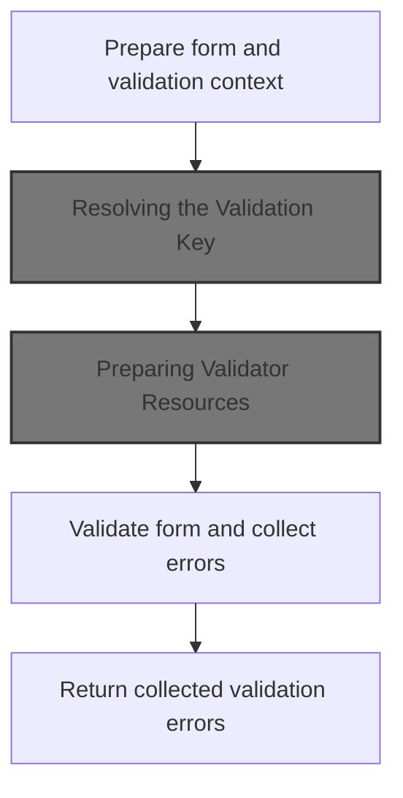
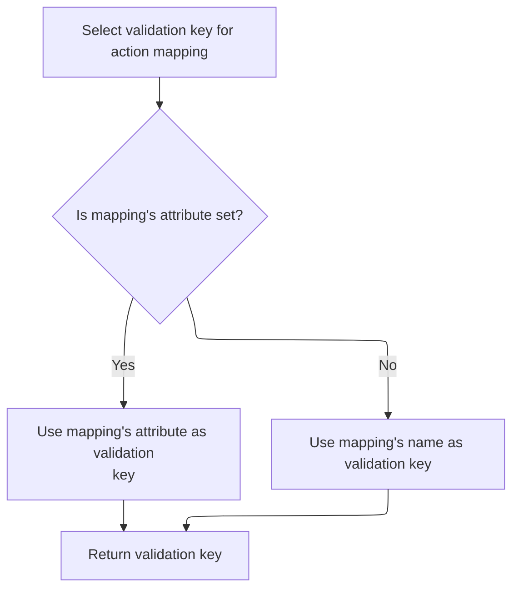
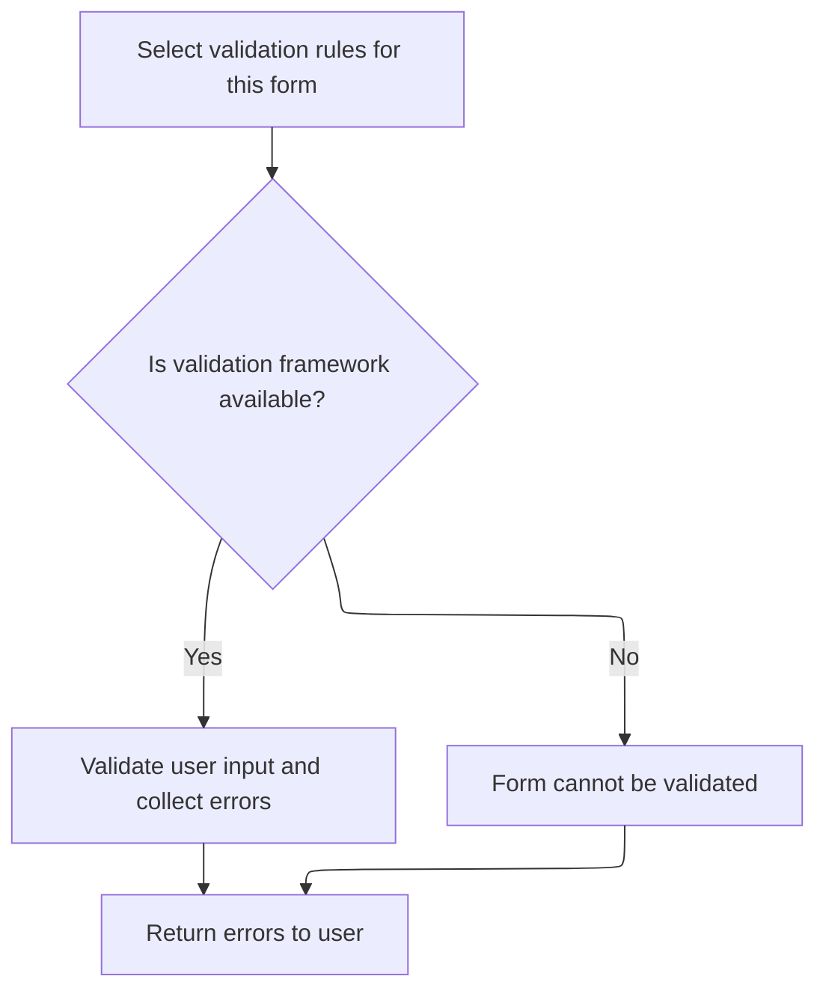

This document describes how user-submitted form data is validated to ensure it meets the application's requirements. Validation rules are selected based on the form and module, resources are prepared with localization, and any errors are collected and returned to the user for correction.

# Starting Validation and Gathering Context



<SwmSnippet path="/core/src/main/java/org/apache/struts/validator/DynaValidatorForm.java" line="106">

---

In <SwmToken path="core/src/main/java/org/apache/struts/validator/DynaValidatorForm.java" pos="106:5:5" line-data="    public ActionErrors validate(ActionMapping mapping,">`validate`</SwmToken>, we prep for validation by updating the page state and grabbing the servlet context and an empty errors object. Next, we call <SwmToken path="core/src/main/java/org/apache/struts/validator/DynaValidatorForm.java" pos="113:7:7" line-data="        String validationKey = getValidationKey(mapping, request);">`getValidationKey`</SwmToken> to figure out which validation rules to use for this request.

```java
    public ActionErrors validate(ActionMapping mapping,
        HttpServletRequest request) {
        this.setPageFromDynaProperty();

        ServletContext application = getServlet().getServletContext();
        ActionErrors errors = new ActionErrors();

        String validationKey = getValidationKey(mapping, request);

```

---

</SwmSnippet>

## Resolving the Validation Key



<SwmSnippet path="/core/src/main/java/org/apache/struts/validator/DynaValidatorForm.java" line="135">

---

<SwmToken path="core/src/main/java/org/apache/struts/validator/DynaValidatorForm.java" pos="135:5:5" line-data="    public String getValidationKey(ActionMapping mapping,">`getValidationKey`</SwmToken> just hands off to <SwmToken path="core/src/main/java/org/apache/struts/validator/DynaValidatorForm.java" pos="137:3:7" line-data="        return mapping.getAttribute();">`mapping.getAttribute()`</SwmToken>, letting the action mapping decide which key to use for validation. We need to check <SwmToken path="core/src/main/java/org/apache/struts/config/ActionConfig.java" pos="41:4:4" line-data="public class ActionConfig extends BaseConfig {">`ActionConfig`</SwmToken> next to see how the attribute is actually resolved.

```java
    public String getValidationKey(ActionMapping mapping,
        HttpServletRequest request) {
        return mapping.getAttribute();
    }
```

---

</SwmSnippet>

<SwmSnippet path="/core/src/main/java/org/apache/struts/config/ActionConfig.java" line="321">

---

<SwmToken path="core/src/main/java/org/apache/struts/config/ActionConfig.java" pos="321:5:7" line-data="    public String getAttribute() {">`getAttribute()`</SwmToken> checks if 'attribute' is set; if not, it uses 'name' as a fallback. This means the validation key can default to the action name if no specific attribute is configured.

```java
    public String getAttribute() {
        if (this.attribute == null) {
            return (this.name);
        } else {
            return (this.attribute);
        }
    }
```

---

</SwmSnippet>

## Initializing the Validator Instance

<SwmSnippet path="/core/src/main/java/org/apache/struts/validator/DynaValidatorForm.java" line="115">

---

Back in `DynaValidatorForm.validate`, after getting the validation key, we call <SwmToken path="core/src/main/java/org/apache/struts/validator/DynaValidatorForm.java" pos="116:1:3" line-data="            Resources.initValidator(validationKey, this, application, request,">`Resources.initValidator`</SwmToken> to set up a Validator instance with all the context and parameters needed for validation.

```java
        Validator validator =
            Resources.initValidator(validationKey, this, application, request,
                errors, page);

```

---

</SwmSnippet>

## Preparing Validator Resources

<SwmSnippet path="/core/src/main/java/org/apache/struts/validator/Resources.java" line="499">

---

In <SwmToken path="core/src/main/java/org/apache/struts/validator/Resources.java" pos="499:7:7" line-data="    public static Validator initValidator(String key, Object bean,">`initValidator`</SwmToken>, we fetch <SwmToken path="core/src/main/java/org/apache/struts/validator/Resources.java" pos="502:1:1" line-data="        ValidatorResources resources =">`ValidatorResources`</SwmToken> using the context and request. Next, we need to resolve which module's resources to use, so we call <SwmToken path="core/src/main/java/org/apache/struts/validator/Resources.java" pos="503:3:3" line-data="            Resources.getValidatorResources(application, request);">`getValidatorResources`</SwmToken>.

```java
    public static Validator initValidator(String key, Object bean,
        ServletContext application, HttpServletRequest request,
        ActionMessages errors, int page) {
        ValidatorResources resources =
            Resources.getValidatorResources(application, request);

```

---

</SwmSnippet>

### Locating Module-Specific Validation Rules

<SwmSnippet path="/core/src/main/java/org/apache/struts/validator/Resources.java" line="90">

---

<SwmToken path="core/src/main/java/org/apache/struts/validator/Resources.java" pos="90:7:7" line-data="    public static ValidatorResources getValidatorResources(">`getValidatorResources`</SwmToken> figures out which module is handling the request by grabbing the module prefix, then uses it to look up the right <SwmToken path="core/src/main/java/org/apache/struts/validator/Resources.java" pos="90:5:5" line-data="    public static ValidatorResources getValidatorResources(">`ValidatorResources`</SwmToken> from the context. We call <SwmToken path="core/src/main/java/org/apache/struts/validator/Resources.java" pos="93:1:1" line-data="            ModuleUtils.getInstance().getModuleConfig(request, application)">`ModuleUtils`</SwmToken> next to resolve the module config and prefix.

```java
    public static ValidatorResources getValidatorResources(
        ServletContext application, HttpServletRequest request) {
        String prefix =
            ModuleUtils.getInstance().getModuleConfig(request, application)
                       .getPrefix();

        return (ValidatorResources) application.getAttribute(ValidatorPlugIn.VALIDATOR_KEY
            + prefix);
    }
```

---

</SwmSnippet>

### Resolving Module Configuration

<SwmSnippet path="/core/src/main/java/org/apache/struts/util/ModuleUtils.java" line="130">

---

<SwmToken path="core/src/main/java/org/apache/struts/util/ModuleUtils.java" pos="117:7:13" line-data="            moduleConfig = this.getModuleConfig(request, context);">`getModuleConfig(request, context)`</SwmToken> tries to get the module config from the request first, and if it's missing, falls back to the context and updates the request for next time. We call the version with a prefix next to actually fetch the config from the context.

```java
    public ModuleConfig getModuleConfig(HttpServletRequest request,
        ServletContext context) {
        ModuleConfig moduleConfig = this.getModuleConfig(request);

        if (moduleConfig == null) {
            moduleConfig = this.getModuleConfig("", context);
            request.setAttribute(Globals.MODULE_KEY, moduleConfig);
        }

        return moduleConfig;
    }
```

---

</SwmSnippet>

<SwmSnippet path="/core/src/main/java/org/apache/struts/util/ModuleUtils.java" line="89">

---

<SwmToken path="core/src/main/java/org/apache/struts/util/ModuleUtils.java" pos="114:7:13" line-data="            moduleConfig = this.getModuleConfig(prefix, context);">`getModuleConfig(prefix, context)`</SwmToken> checks if the prefix is null or '/', and if so, returns the default module config; otherwise, it fetches the config for the given prefix. This lets the framework support multiple modules with separate configs.

```java
    public ModuleConfig getModuleConfig(String prefix, ServletContext context) {
        if ((prefix == null) || "/".equals(prefix)) {
            return (ModuleConfig) context.getAttribute(Globals.MODULE_KEY);
        } else {
            return (ModuleConfig) context.getAttribute(Globals.MODULE_KEY
                + prefix);
        }
    }
```

---

</SwmSnippet>

### Setting Up Locale and Validator Parameters

<SwmSnippet path="/core/src/main/java/org/apache/struts/validator/Resources.java" line="505">

---

Back in <SwmToken path="core/src/main/java/org/apache/struts/validator/DynaValidatorForm.java" pos="116:1:3" line-data="            Resources.initValidator(validationKey, this, application, request,">`Resources.initValidator`</SwmToken>, after getting <SwmToken path="core/src/main/java/org/apache/struts/validator/Resources.java" pos="90:5:5" line-data="    public static ValidatorResources getValidatorResources(">`ValidatorResources`</SwmToken>, we grab the user's locale using <SwmToken path="core/src/main/java/org/apache/struts/validator/Resources.java" pos="505:7:9" line-data="        Locale locale = RequestUtils.getUserLocale(request, null);">`RequestUtils.getUserLocale`</SwmToken> to make sure validation messages are localized.

```java
        Locale locale = RequestUtils.getUserLocale(request, null);

```

---

</SwmSnippet>

<SwmSnippet path="/core/src/main/java/org/apache/struts/util/RequestUtils.java" line="299">

---

<SwmToken path="core/src/main/java/org/apache/struts/util/RequestUtils.java" pos="299:7:7" line-data="    public static Locale getUserLocale(HttpServletRequest request, String locale) {">`getUserLocale`</SwmToken> checks the session for a Locale using a key (defaulting to <SwmToken path="core/src/main/java/org/apache/struts/util/RequestUtils.java" pos="304:5:7" line-data="            locale = Globals.LOCALE_KEY;">`Globals.LOCALE_KEY`</SwmToken>), and falls back to the request's locale if not found. This ensures we always have a locale for messages.

```java
    public static Locale getUserLocale(HttpServletRequest request, String locale) {
        Locale userLocale = null;
        HttpSession session = request.getSession(false);

        if (locale == null) {
            locale = Globals.LOCALE_KEY;
        }

        // Only check session if sessions are enabled
        if (session != null) {
            userLocale = (Locale) session.getAttribute(locale);
        }

        if (userLocale == null) {
            // Returns Locale based on Accept-Language header or the server default
            userLocale = request.getLocale();
        }

        return userLocale;
    }
```

---

</SwmSnippet>

<SwmSnippet path="/core/src/main/java/org/apache/struts/validator/Resources.java" line="507">

---

Back in <SwmPath>[core/…/validator/Resources.java](core/src/main/java/org/apache/struts/validator/Resources.java)</SwmPath>, after getting the locale, we finish setting up the Validator by passing in all the context and parameters it needs. The next step is to look at how parameters are managed, which leads us to `MultipartRequestWrapper.setParameter`.

```java
        Validator validator = new Validator(resources, key);

        validator.setUseContextClassLoader(true);

        validator.setPage(page);

        validator.setParameter(SERVLET_CONTEXT_PARAM, application);
        validator.setParameter(HTTP_SERVLET_REQUEST_PARAM, request);
        validator.setParameter(Validator.LOCALE_PARAM, locale);
        validator.setParameter(ACTION_MESSAGES_PARAM, errors);
        validator.setParameter(Validator.BEAN_PARAM, bean);

        return validator;
    }
```

---

</SwmSnippet>

<SwmSnippet path="/core/src/main/java/org/apache/struts/upload/MultipartRequestWrapper.java" line="54">

---

<SwmToken path="core/src/main/java/org/apache/struts/upload/MultipartRequestWrapper.java" pos="54:5:5" line-data="    public void setParameter(String name, String value) {">`setParameter`</SwmToken> appends a new value to the parameter's array instead of replacing it, so multiple values for the same parameter are preserved—useful for handling multi-value form fields.

```java
    public void setParameter(String name, String value) {
        String[] mValue = (String[]) parameters.get(name);

        if (mValue == null) {
            mValue = new String[0];
        }

        String[] newValue = new String[mValue.length + 1];

        System.arraycopy(mValue, 0, newValue, 0, mValue.length);
        newValue[mValue.length] = value;

        parameters.put(name, newValue);
    }
```

---

</SwmSnippet>

## Running Validation and Handling Results

<SwmSnippet path="/core/src/main/java/org/apache/struts/validator/DynaValidatorForm.java" line="119">

---

Back in `DynaValidatorForm.validate`, we run the validator and catch any exceptions, then return the errors collected. The next step is to see how this pattern is used in the base <SwmToken path="core/src/main/java/org/apache/struts/validator/ValidatorForm.java" pos="57:4:4" line-data="public class ValidatorForm extends ActionForm implements Serializable {">`ValidatorForm`</SwmToken>.

```java
        try {
            validatorResults = validator.validate();
        } catch (ValidatorException e) {
            log.error(e.getMessage(), e);
        }

        return errors;
    }
```

---

</SwmSnippet>

# Base Validation Logic in <SwmToken path="core/src/main/java/org/apache/struts/validator/ValidatorForm.java" pos="57:4:4" line-data="public class ValidatorForm extends ActionForm implements Serializable {">`ValidatorForm`</SwmToken>



<SwmSnippet path="/core/src/main/java/org/apache/struts/validator/ValidatorForm.java" line="104">

---

In `ValidatorForm.validate`, we set up for validation and fetch the validation key, just like in <SwmToken path="core/src/main/java/org/apache/struts/validator/DynaValidatorForm.java" pos="58:4:4" line-data="public class DynaValidatorForm extends DynaActionForm implements DynaBean,">`DynaValidatorForm`</SwmToken>. Next, we call <SwmToken path="core/src/main/java/org/apache/struts/validator/ValidatorForm.java" pos="108:7:7" line-data="        String validationKey = getValidationKey(mapping, request);">`getValidationKey`</SwmToken> to resolve which rules to use.

```java
    public ActionErrors validate(ActionMapping mapping,
        HttpServletRequest request) {
        
        ActionErrors errors = new ActionErrors();
        String validationKey = getValidationKey(mapping, request);

```

---

</SwmSnippet>

<SwmSnippet path="/core/src/main/java/org/apache/struts/validator/ValidatorForm.java" line="142">

---

<SwmToken path="core/src/main/java/org/apache/struts/validator/ValidatorForm.java" pos="142:5:5" line-data="    public String getValidationKey(ActionMapping mapping,">`getValidationKey`</SwmToken> in <SwmToken path="core/src/main/java/org/apache/struts/validator/ValidatorForm.java" pos="57:4:4" line-data="public class ValidatorForm extends ActionForm implements Serializable {">`ValidatorForm`</SwmToken> just returns <SwmToken path="core/src/main/java/org/apache/struts/validator/ValidatorForm.java" pos="144:3:7" line-data="        return mapping.getAttribute();">`mapping.getAttribute()`</SwmToken>, same as in <SwmToken path="core/src/main/java/org/apache/struts/validator/DynaValidatorForm.java" pos="58:4:4" line-data="public class DynaValidatorForm extends DynaActionForm implements DynaBean,">`DynaValidatorForm`</SwmToken>. We need to check <SwmToken path="core/src/main/java/org/apache/struts/config/ActionConfig.java" pos="41:4:4" line-data="public class ActionConfig extends BaseConfig {">`ActionConfig`</SwmToken> to see how the attribute is resolved.

```java
    public String getValidationKey(ActionMapping mapping,
        HttpServletRequest request) {
        return mapping.getAttribute();
    }
```

---

</SwmSnippet>

<SwmSnippet path="/core/src/main/java/org/apache/struts/validator/ValidatorForm.java" line="110">

---

Back in `ValidatorForm.validate`, after resolving the validation key, we grab the servlet context and set up the Validator instance using <SwmToken path="core/src/main/java/org/apache/struts/validator/ValidatorForm.java" pos="123:1:3" line-data="            Resources.initValidator(validationKey, this, application, request,">`Resources.initValidator`</SwmToken>, just like in <SwmToken path="core/src/main/java/org/apache/struts/validator/DynaValidatorForm.java" pos="58:4:4" line-data="public class DynaValidatorForm extends DynaActionForm implements DynaBean,">`DynaValidatorForm`</SwmToken>.

```java
        ServletContext application;
        try {
            application = getServlet().getServletContext();
        } catch (NullPointerException e) {
            IllegalStateException e2 = new IllegalStateException(
                    "Missing ActionServlet instance for bean '" +
                    mapping.getName() + 
                    "' (created outside of Struts?)");
        	e2.initCause(e);
        	throw e2;
        }
        
        Validator validator =
            Resources.initValidator(validationKey, this, application, request,
                errors, getPage());

```

---

</SwmSnippet>

<SwmSnippet path="/core/src/main/java/org/apache/struts/validator/ValidatorForm.java" line="126">

---

Back in `ValidatorForm.validate`, after setting up the Validator, we run the validation, log any exceptions, and return the errors—same pattern as <SwmToken path="core/src/main/java/org/apache/struts/validator/DynaValidatorForm.java" pos="58:4:4" line-data="public class DynaValidatorForm extends DynaActionForm implements DynaBean,">`DynaValidatorForm`</SwmToken>.

```java
        try {
            validatorResults = validator.validate();
        } catch (ValidatorException e) {
            log.error(e.getMessage(), e);
        }

        return errors;
    }
```

---

</SwmSnippet>

&nbsp;

*This is an auto-generated document by Swimm 🌊 and has not yet been verified by a human*

<SwmMeta version="3.0.0" repo-id="Z2l0aHViJTNBJTNBc3RydXRzMSUzQSUzQVN3aW1tLURlbW8=" repo-name="struts1"><sup>Powered by [Swimm](https://app.swimm.io/)</sup></SwmMeta>
