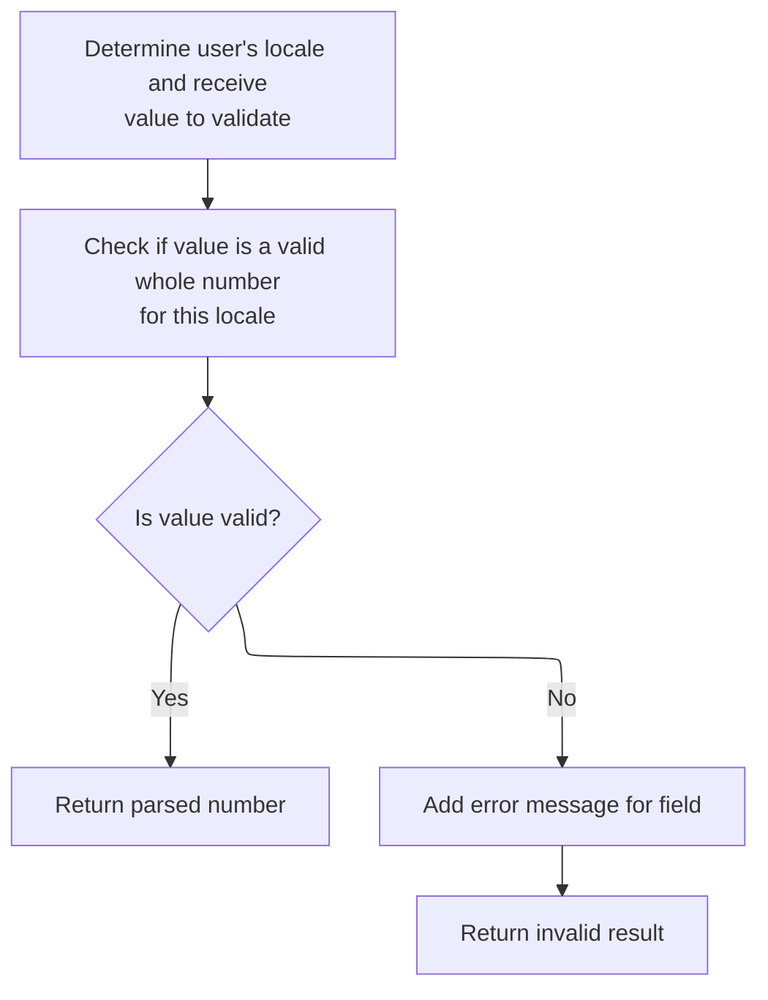
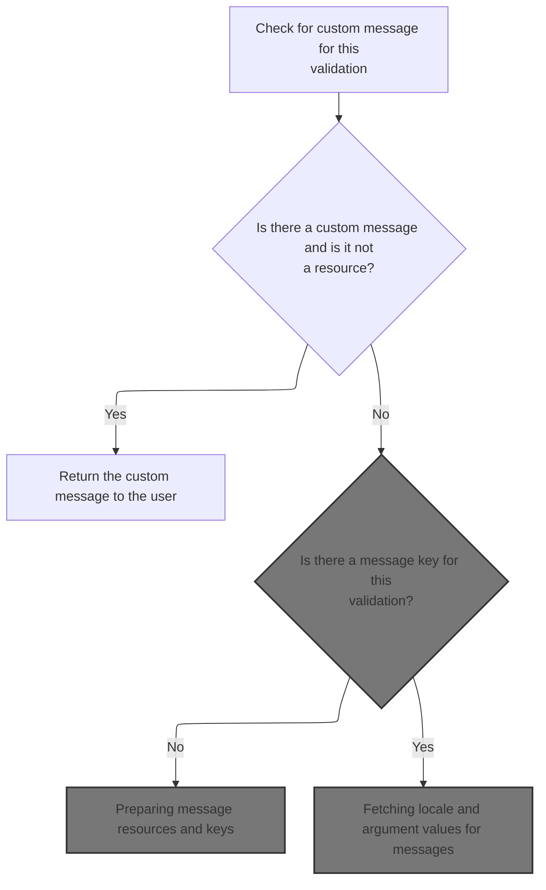

This document describes how user-submitted values are validated as whole numbers, using the user's locale to ensure correct interpretation of numeric formats. If the value is not valid, a localized error message is provided to guide the user.

# Validating locale-specific long values

<SwmSnippet path="/core/src/main/java/org/apache/struts/validator/FieldChecks.java" line="630">

---

In <SwmToken path="core/src/main/java/org/apache/struts/validator/FieldChecks.java" pos="630:7:7" line-data="    public static Object validateLongLocale(Object bean, ValidatorAction va,">`validateLongLocale`</SwmToken>, we grab the value from the bean using <SwmToken path="core/src/main/java/org/apache/struts/validator/FieldChecks.java" pos="637:5:5" line-data="            value = evaluateBean(bean, field);">`evaluateBean`</SwmToken>, handling any exceptions by logging an error and short-circuiting the validation. We then check if the value is blank or null and bail out early if so. The next step is to call <SwmToken path="core/src/main/java/org/apache/struts/validator/FieldChecks.java" pos="637:5:5" line-data="            value = evaluateBean(bean, field);">`evaluateBean`</SwmToken> because we need a consistent string representation of the bean's property for validation, regardless of its actual type.

```java
    public static Object validateLongLocale(Object bean, ValidatorAction va,
        Field field, ActionMessages errors, Validator validator,
        HttpServletRequest request) {
        Object result = null;
        String value = null;

        try {
            value = evaluateBean(bean, field);
        } catch (Exception e) {
            processFailure(errors, field, validator.getFormName(), "longLocale", e);
            return Boolean.FALSE;
        }

        if (GenericValidator.isBlankOrNull(value)) {
            return Boolean.TRUE;
        }

```

---

</SwmSnippet>

## Extracting string values from beans

<SwmSnippet path="/core/src/main/java/org/apache/struts/validator/FieldChecks.java" line="389">

---

<SwmToken path="core/src/main/java/org/apache/struts/validator/FieldChecks.java" pos="389:7:7" line-data="    private static String evaluateBean(Object bean, Field field) throws Exception {">`evaluateBean`</SwmToken> checks if the bean is already a String and returns it directly. If not, it calls <SwmToken path="core/src/main/java/org/apache/struts/validator/FieldChecks.java" pos="395:5:5" line-data="            value = getValueAsString(bean, field.getProperty());">`getValueAsString`</SwmToken> to extract and convert the property to a string, handling different types. We need <SwmToken path="core/src/main/java/org/apache/struts/validator/FieldChecks.java" pos="395:5:5" line-data="            value = getValueAsString(bean, field.getProperty());">`getValueAsString`</SwmToken> next because it deals with all the edge cases for property extraction and conversion.

```java
    private static String evaluateBean(Object bean, Field field) throws Exception {
        String value;

        if (isString(bean)) {
            value = (String) bean;
        } else {
            value = getValueAsString(bean, field.getProperty());
        }

        return value;
    }
```

---

</SwmSnippet>

<SwmSnippet path="/core/src/main/java/org/apache/struts/validator/FieldChecks.java" line="87">

---

<SwmToken path="core/src/main/java/org/apache/struts/validator/FieldChecks.java" pos="87:7:7" line-data="    private static String getValueAsString(Object bean, String property) ">`getValueAsString`</SwmToken> pulls the property value from the bean, returns null if it's missing, and handles String arrays and Collections by returning empty strings for empty cases. Everything else gets converted to a string. This avoids junk values like 'null' or default array/collection representations.

```java
    private static String getValueAsString(Object bean, String property) 
            throws Exception {
        
        Object value = PropertyUtils.getProperty(bean, property);
        if (value == null) {
            return null;
        }

        if (value instanceof String[]) {
            return ((String[]) value).length > 0 ? value.toString() : "";

        } else if (value instanceof Collection) {
            return ((Collection) value).isEmpty() ? "" : value.toString();

        } else {
            return value.toString();
        }
    }
```

---

</SwmSnippet>

## Determining user locale for validation



<SwmSnippet path="/core/src/main/java/org/apache/struts/validator/FieldChecks.java" line="647">

---

Back in <SwmToken path="core/src/main/java/org/apache/struts/validator/FieldChecks.java" pos="630:7:7" line-data="    public static Object validateLongLocale(Object bean, ValidatorAction va,">`validateLongLocale`</SwmToken>, after getting the value, we grab the user's locale using <SwmToken path="core/src/main/java/org/apache/struts/validator/FieldChecks.java" pos="647:7:9" line-data="        Locale locale = RequestUtils.getUserLocale(request, null);">`RequestUtils.getUserLocale`</SwmToken>. This is needed because number formats depend on locale, so we can't validate the input without knowing how the user expects numbers to look.

```java
        Locale locale = RequestUtils.getUserLocale(request, null);

```

---

</SwmSnippet>

<SwmSnippet path="/core/src/main/java/org/apache/struts/util/RequestUtils.java" line="299">

---

<SwmToken path="core/src/main/java/org/apache/struts/util/RequestUtils.java" pos="299:7:7" line-data="    public static Locale getUserLocale(HttpServletRequest request, String locale) {">`getUserLocale`</SwmToken> checks the session for a locale using <SwmToken path="core/src/main/java/org/apache/struts/util/RequestUtils.java" pos="304:5:7" line-data="            locale = Globals.LOCALE_KEY;">`Globals.LOCALE_KEY`</SwmToken>, and if it's not there, it falls back to the request's locale (from <SwmToken path="core/src/main/java/org/apache/struts/util/RequestUtils.java" pos="313:11:13" line-data="            // Returns Locale based on Accept-Language header or the server default">`Accept-Language`</SwmToken> or server default). This guarantees we always get a locale for validation.

```java
    public static Locale getUserLocale(HttpServletRequest request, String locale) {
        Locale userLocale = null;
        HttpSession session = request.getSession(false);

        if (locale == null) {
            locale = Globals.LOCALE_KEY;
        }

        // Only check session if sessions are enabled
        if (session != null) {
            userLocale = (Locale) session.getAttribute(locale);
        }

        if (userLocale == null) {
            // Returns Locale based on Accept-Language header or the server default
            userLocale = request.getLocale();
        }

        return userLocale;
    }
```

---

</SwmSnippet>

<SwmSnippet path="/core/src/main/java/org/apache/struts/validator/FieldChecks.java" line="649">

---

After getting the locale in <SwmToken path="core/src/main/java/org/apache/struts/validator/FieldChecks.java" pos="630:7:7" line-data="    public static Object validateLongLocale(Object bean, ValidatorAction va,">`validateLongLocale`</SwmToken>, we try to parse the value as a long using <SwmToken path="core/src/main/java/org/apache/struts/validator/FieldChecks.java" pos="649:5:7" line-data="        result = GenericTypeValidator.formatLong(value, locale);">`GenericTypeValidator.formatLong`</SwmToken>. If it fails, we add an error message using <SwmToken path="core/src/main/java/org/apache/struts/validator/FieldChecks.java" pos="653:1:3" line-data="                Resources.getActionMessage(validator, request, va, field));">`Resources.getActionMessage`</SwmToken>, which builds a localized message for the user.

```java
        result = GenericTypeValidator.formatLong(value, locale);

        if (result == null) {
            errors.add(field.getKey(),
                Resources.getActionMessage(validator, request, va, field));
        }

        return (result == null) ? Boolean.FALSE : result;
    }
```

---

</SwmSnippet>

# Building localized error messages



<SwmSnippet path="/core/src/main/java/org/apache/struts/validator/Resources.java" line="365">

---

In <SwmToken path="core/src/main/java/org/apache/struts/validator/Resources.java" pos="365:7:7" line-data="    public static ActionMessage getActionMessage(Validator validator,">`getActionMessage`</SwmToken>, we check if the field's message is a resource. If it is, we need to fetch the actual localized string, so we call ConfigHelper.getMessage to resolve the message key.

```java
    public static ActionMessage getActionMessage(Validator validator,
        HttpServletRequest request, ValidatorAction va, Field field) {
        Msg msg = field.getMessage(va.getName());

        if ((msg != null) && !msg.isResource()) {
            return new ActionMessage(msg.getKey(), false);
        }

```

---

</SwmSnippet>

## Resolving message keys to localized strings

<SwmSnippet path="/core/src/main/java/org/apache/struts/config/ConfigHelper.java" line="496">

---

In <SwmToken path="core/src/main/java/org/apache/struts/config/ConfigHelper.java" pos="496:5:5" line-data="    public String getMessage(String key) {">`getMessage`</SwmToken>, we grab the message resources and check for null. Then we use <SwmToken path="core/src/main/java/org/apache/struts/config/ConfigHelper.java" pos="503:7:9" line-data="        return resources.getMessage(RequestUtils.getUserLocale(request, null),">`RequestUtils.getUserLocale`</SwmToken> to make sure we fetch the message in the user's language. This keeps error messages localized.

```java
    public String getMessage(String key) {
        MessageResources resources = getMessageResources();

        if (resources == null) {
            return null;
        }

        return resources.getMessage(RequestUtils.getUserLocale(request, null),
```

---

</SwmSnippet>

<SwmSnippet path="/core/src/main/java/org/apache/struts/config/ConfigHelper.java" line="503">

---

After getting the locale from <SwmToken path="core/src/main/java/org/apache/struts/config/ConfigHelper.java" pos="503:7:7" line-data="        return resources.getMessage(RequestUtils.getUserLocale(request, null),">`RequestUtils`</SwmToken> in `ConfigHelper.getMessage`, we call <SwmToken path="core/src/main/java/org/apache/struts/config/ConfigHelper.java" pos="503:3:5" line-data="        return resources.getMessage(RequestUtils.getUserLocale(request, null),">`resources.getMessage`</SwmToken> with the locale and key to fetch the actual localized string. This is what gets shown to the user.

```java
        return resources.getMessage(RequestUtils.getUserLocale(request, null),
            key);
    }
```

---

</SwmSnippet>

<SwmSnippet path="/core/src/main/java/org/apache/struts/validator/Resources.java" line="249">

---

<SwmToken path="core/src/main/java/org/apache/struts/validator/Resources.java" pos="249:7:7" line-data="    public static String getMessage(HttpServletRequest request, String key) {">`getMessage`</SwmToken> grabs the message resources and then calls <SwmToken path="core/src/main/java/org/apache/struts/validator/Resources.java" pos="252:8:10" line-data="        return getMessage(messages, RequestUtils.getUserLocale(request, null),">`RequestUtils.getUserLocale`</SwmToken> to make sure we're using the right locale for this request. This keeps the message lookup accurate and up-to-date.

```java
    public static String getMessage(HttpServletRequest request, String key) {
        MessageResources messages = getMessageResources(request);

        return getMessage(messages, RequestUtils.getUserLocale(request, null),
            key);
    }
```

---

</SwmSnippet>

## Preparing message resources and keys

```mermaid
%%{init: {"flowchart": {"defaultRenderer": "elk"}} }%%
flowchart TD
  node1["Start: Determine which message to show
to the user"]
  click node1 openCode "core/src/main/java/org/apache/struts/validator/Resources.java:373:375"
  node1 --> node2{"Is a specific message object provided?"}
  click node2 openCode "core/src/main/java/org/apache/struts/validator/Resources.java:376:381"
  node2 -->|"No"| node3["Use validation action's message key"]
  click node3 openCode "core/src/main/java/org/apache/struts/validator/Resources.java:377:377"
  node2 -->|"Yes"| node4["Use provided message's key and bundle"]
  click node4 openCode "core/src/main/java/org/apache/struts/validator/Resources.java:379:380"
  node3 --> node5{"Is the message key missing or empty?"}
  click node5 openCode "core/src/main/java/org/apache/struts/validator/Resources.java:383:383"
  node4 --> node5
  node5 -->|"Yes"| node6[Show fallback message: '??? [action name].[field property] ???']
  click node6 openCode "core/src/main/java/org/apache/struts/validator/Resources.java:384:386"
  node5 -->|"No"| node7["Look up message using selected key and
bundle"]
  click node7 openCode "core/src/main/java/org/apache/struts/validator/Resources.java:390:391"

classDef HeadingStyle fill:#777777,stroke:#333,stroke-width:2px;

%% Swimm:
%% %%{init: {"flowchart": {"defaultRenderer": "elk"}} }%%
%% flowchart TD
%%   node1["Start: Determine which message to show
%% to the user"]
%%   click node1 openCode "<SwmPath>[core/…/validator/Resources.java](core/src/main/java/org/apache/struts/validator/Resources.java)</SwmPath>:373:375"
%%   node1 --> node2{"Is a specific message object provided?"}
%%   click node2 openCode "<SwmPath>[core/…/validator/Resources.java](core/src/main/java/org/apache/struts/validator/Resources.java)</SwmPath>:376:381"
%%   node2 -->|"No"| node3["Use validation action's message key"]
%%   click node3 openCode "<SwmPath>[core/…/validator/Resources.java](core/src/main/java/org/apache/struts/validator/Resources.java)</SwmPath>:377:377"
%%   node2 -->|"Yes"| node4["Use provided message's key and bundle"]
%%   click node4 openCode "<SwmPath>[core/…/validator/Resources.java](core/src/main/java/org/apache/struts/validator/Resources.java)</SwmPath>:379:380"
%%   node3 --> node5{"Is the message key missing or empty?"}
%%   click node5 openCode "<SwmPath>[core/…/validator/Resources.java](core/src/main/java/org/apache/struts/validator/Resources.java)</SwmPath>:383:383"
%%   node4 --> node5
%%   node5 -->|"Yes"| node6[Show fallback message: '??? [action name].[field property] ???']
%%   click node6 openCode "<SwmPath>[core/…/validator/Resources.java](core/src/main/java/org/apache/struts/validator/Resources.java)</SwmPath>:384:386"
%%   node5 -->|"No"| node7["Look up message using selected key and
%% bundle"]
%%   click node7 openCode "<SwmPath>[core/…/validator/Resources.java](core/src/main/java/org/apache/struts/validator/Resources.java)</SwmPath>:390:391"
%% 
%% classDef HeadingStyle fill:#777777,stroke:#333,stroke-width:2px;
```

<SwmSnippet path="/core/src/main/java/org/apache/struts/validator/Resources.java" line="373">

---

After getting the message key and bundle in <SwmToken path="core/src/main/java/org/apache/struts/validator/FieldChecks.java" pos="653:3:3" line-data="                Resources.getActionMessage(validator, request, va, field));">`getActionMessage`</SwmToken>, we call <SwmToken path="core/src/main/java/org/apache/struts/validator/Resources.java" pos="391:1:1" line-data="            getMessageResources(application, request, msgBundle);">`getMessageResources`</SwmToken> to fetch the actual resources for the bundle and module. This is needed to resolve the message key to a localized string.

```java
        String msgKey = null;
        String msgBundle = null;

        if (msg == null) {
            msgKey = va.getMsg();
        } else {
            msgKey = msg.getKey();
            msgBundle = msg.getBundle();
        }

        if ((msgKey == null) || (msgKey.length() == 0)) {
            return new ActionMessage("??? " + va.getName() + "."
                + field.getProperty() + " ???", false);
        }

        ServletContext application =
            (ServletContext) validator.getParameterValue(SERVLET_CONTEXT_PARAM);
        MessageResources messages =
            getMessageResources(application, request, msgBundle);
```

---

</SwmSnippet>

## Locating message resources for the current module

<SwmSnippet path="/core/src/main/java/org/apache/struts/validator/Resources.java" line="117">

---

<SwmToken path="core/src/main/java/org/apache/struts/validator/Resources.java" pos="117:7:7" line-data="    public static MessageResources getMessageResources(">`getMessageResources`</SwmToken> first checks the request for resources, then uses ModuleUtils.getModuleConfig to get the module prefix and tries the application context. If nothing's found, it falls back to the default bundle. This makes sure we get the right resources for the current module.

```java
    public static MessageResources getMessageResources(
        ServletContext application, HttpServletRequest request, String bundle) {
        if (bundle == null) {
            bundle = Globals.MESSAGES_KEY;
        }

        MessageResources resources =
            (MessageResources) request.getAttribute(bundle);

        if (resources == null) {
            ModuleConfig moduleConfig =
                ModuleUtils.getInstance().getModuleConfig(request, application);

            resources =
                (MessageResources) application.getAttribute(bundle
                    + moduleConfig.getPrefix());
        }

```

---

</SwmSnippet>

### Resolving module configuration for resource lookup

<SwmSnippet path="/core/src/main/java/org/apache/struts/util/ModuleUtils.java" line="130">

---

<SwmToken path="core/src/main/java/org/apache/struts/util/ModuleUtils.java" pos="130:5:5" line-data="    public ModuleConfig getModuleConfig(HttpServletRequest request,">`getModuleConfig`</SwmToken> tries to get the config from the request, and if it's missing, falls back to the context using an empty string as the module key. It then caches the result in the request. This guarantees we always have a module config for resource lookup.

```java
    public ModuleConfig getModuleConfig(HttpServletRequest request,
        ServletContext context) {
        ModuleConfig moduleConfig = this.getModuleConfig(request);

        if (moduleConfig == null) {
            moduleConfig = this.getModuleConfig("", context);
            request.setAttribute(Globals.MODULE_KEY, moduleConfig);
        }

        return moduleConfig;
    }
```

---

</SwmSnippet>

<SwmSnippet path="/core/src/main/java/org/apache/struts/util/ModuleUtils.java" line="89">

---

<SwmToken path="core/src/main/java/org/apache/struts/util/ModuleUtils.java" pos="89:5:5" line-data="    public ModuleConfig getModuleConfig(String prefix, ServletContext context) {">`getModuleConfig`</SwmToken> checks if the prefix is null or '/', and grabs the default module config. Otherwise, it uses <SwmToken path="core/src/main/java/org/apache/struts/util/ModuleUtils.java" pos="91:11:13" line-data="            return (ModuleConfig) context.getAttribute(Globals.MODULE_KEY);">`Globals.MODULE_KEY`</SwmToken> plus the prefix to get the config for a specific module. This lets us handle multiple module configs in the app.

```java
    public ModuleConfig getModuleConfig(String prefix, ServletContext context) {
        if ((prefix == null) || "/".equals(prefix)) {
            return (ModuleConfig) context.getAttribute(Globals.MODULE_KEY);
        } else {
            return (ModuleConfig) context.getAttribute(Globals.MODULE_KEY
                + prefix);
        }
    }
```

---

</SwmSnippet>

### Fallback to default message resources

<SwmSnippet path="/core/src/main/java/org/apache/struts/validator/Resources.java" line="135">

---

After trying module-specific and default bundle lookups in <SwmToken path="core/src/main/java/org/apache/struts/validator/Resources.java" pos="117:7:7" line-data="    public static MessageResources getMessageResources(">`getMessageResources`</SwmToken>, if nothing's found, we throw a <SwmToken path="core/src/main/java/org/apache/struts/validator/Resources.java" pos="140:5:5" line-data="            throw new NullPointerException(">`NullPointerException`</SwmToken>. This makes sure missing resources are caught early and don't lead to silent errors.

```java
        if (resources == null) {
            resources = (MessageResources) application.getAttribute(bundle);
        }

        if (resources == null) {
            throw new NullPointerException(
                "No message resources found for bundle: " + bundle);
        }

        return resources;
    }
```

---

</SwmSnippet>

## Fetching locale and argument values for messages

```mermaid
%%{init: {"flowchart": {"defaultRenderer": "elk"}} }%%
flowchart TD
    node1["Determine user's locale"]
    click node1 openCode "core/src/main/java/org/apache/struts/validator/Resources.java:392:392"
    node1 --> node2["Gather message arguments"]
    click node2 openCode "core/src/main/java/org/apache/struts/validator/Resources.java:394:394"
    node2 --> node3["Resolve argument values"]
    click node3 openCode "core/src/main/java/org/apache/struts/validator/Resources.java:395:395"
    
    subgraph loop1["For each argument in message"]
        node3 --> node8{"Is argument a resource reference?"}
        click node8 openCode "core/src/main/java/org/apache/struts/validator/Resources.java:465:466"
        node8 -->|"Yes"| node9["Get value from resource bundle"]
        click node9 openCode "core/src/main/java/org/apache/struts/validator/Resources.java:467:475"
        node8 -->|"No"| node10["Use literal value"]
        click node10 openCode "core/src/main/java/org/apache/struts/validator/Resources.java:477:478"
        node9 --> node11["Add value to argument list"]
        click node11 openCode "core/src/main/java/org/apache/struts/validator/Resources.java:475:478"
        node10 --> node11
    end
    node3 --> node4{"Is a specific message bundle provided?"}
    click node4 openCode "core/src/main/java/org/apache/struts/validator/Resources.java:400:403"
    node4 -->|"No"| node5["Create message using default template
and arguments"]
    click node5 openCode "core/src/main/java/org/apache/struts/validator/Resources.java:401:401"
    node4 -->|"Yes"| node6["Create message using specific bundle and
arguments"]
    click node6 openCode "core/src/main/java/org/apache/struts/validator/Resources.java:403:405"
    node5 --> node7["Return constructed message"]
    click node7 openCode "core/src/main/java/org/apache/struts/validator/Resources.java:408:409"
    node6 --> node7
classDef HeadingStyle fill:#777777,stroke:#333,stroke-width:2px;

%% Swimm:
%% %%{init: {"flowchart": {"defaultRenderer": "elk"}} }%%
%% flowchart TD
%%     node1["Determine user's locale"]
%%     click node1 openCode "<SwmPath>[core/…/validator/Resources.java](core/src/main/java/org/apache/struts/validator/Resources.java)</SwmPath>:392:392"
%%     node1 --> node2["Gather message arguments"]
%%     click node2 openCode "<SwmPath>[core/…/validator/Resources.java](core/src/main/java/org/apache/struts/validator/Resources.java)</SwmPath>:394:394"
%%     node2 --> node3["Resolve argument values"]
%%     click node3 openCode "<SwmPath>[core/…/validator/Resources.java](core/src/main/java/org/apache/struts/validator/Resources.java)</SwmPath>:395:395"
%%     
%%     subgraph loop1["For each argument in message"]
%%         node3 --> node8{"Is argument a resource reference?"}
%%         click node8 openCode "<SwmPath>[core/…/validator/Resources.java](core/src/main/java/org/apache/struts/validator/Resources.java)</SwmPath>:465:466"
%%         node8 -->|"Yes"| node9["Get value from resource bundle"]
%%         click node9 openCode "<SwmPath>[core/…/validator/Resources.java](core/src/main/java/org/apache/struts/validator/Resources.java)</SwmPath>:467:475"
%%         node8 -->|"No"| node10["Use literal value"]
%%         click node10 openCode "<SwmPath>[core/…/validator/Resources.java](core/src/main/java/org/apache/struts/validator/Resources.java)</SwmPath>:477:478"
%%         node9 --> node11["Add value to argument list"]
%%         click node11 openCode "<SwmPath>[core/…/validator/Resources.java](core/src/main/java/org/apache/struts/validator/Resources.java)</SwmPath>:475:478"
%%         node10 --> node11
%%     end
%%     node3 --> node4{"Is a specific message bundle provided?"}
%%     click node4 openCode "<SwmPath>[core/…/validator/Resources.java](core/src/main/java/org/apache/struts/validator/Resources.java)</SwmPath>:400:403"
%%     node4 -->|"No"| node5["Create message using default template
%% and arguments"]
%%     click node5 openCode "<SwmPath>[core/…/validator/Resources.java](core/src/main/java/org/apache/struts/validator/Resources.java)</SwmPath>:401:401"
%%     node4 -->|"Yes"| node6["Create message using specific bundle and
%% arguments"]
%%     click node6 openCode "<SwmPath>[core/…/validator/Resources.java](core/src/main/java/org/apache/struts/validator/Resources.java)</SwmPath>:403:405"
%%     node5 --> node7["Return constructed message"]
%%     click node7 openCode "<SwmPath>[core/…/validator/Resources.java](core/src/main/java/org/apache/struts/validator/Resources.java)</SwmPath>:408:409"
%%     node6 --> node7
%% classDef HeadingStyle fill:#777777,stroke:#333,stroke-width:2px;
```



<SwmSnippet path="/core/src/main/java/org/apache/struts/validator/Resources.java" line="392">

---

After getting message resources in <SwmToken path="core/src/main/java/org/apache/struts/validator/FieldChecks.java" pos="653:3:3" line-data="                Resources.getActionMessage(validator, request, va, field));">`getActionMessage`</SwmToken>, we fetch the locale again using <SwmToken path="core/src/main/java/org/apache/struts/validator/Resources.java" pos="392:7:9" line-data="        Locale locale = RequestUtils.getUserLocale(request, null);">`RequestUtils.getUserLocale`</SwmToken>. This is needed to make sure argument values are localized with the latest locale info.

```java
        Locale locale = RequestUtils.getUserLocale(request, null);

```

---

</SwmSnippet>

<SwmSnippet path="/core/src/main/java/org/apache/struts/validator/Resources.java" line="394">

---

After getting the locale in <SwmToken path="core/src/main/java/org/apache/struts/validator/FieldChecks.java" pos="653:3:3" line-data="                Resources.getActionMessage(validator, request, va, field));">`getActionMessage`</SwmToken>, we grab up to four argument objects from the field and call <SwmToken path="core/src/main/java/org/apache/struts/validator/Resources.java" pos="394:11:11" line-data="        Arg[] args = field.getArgs(va.getName());">`getArgs`</SwmToken> to localize them. This is needed for proper message formatting.

```java
        Arg[] args = field.getArgs(va.getName());
```

---

</SwmSnippet>

<SwmSnippet path="/core/src/main/java/org/apache/struts/validator/Resources.java" line="420">

---

<SwmToken path="core/src/main/java/org/apache/struts/validator/Resources.java" pos="420:9:9" line-data="    public static String[] getArgs(String actionName,">`getArgs`</SwmToken> grabs up to four arguments from the field, checks if each is a resource, and fetches the localized message or uses the key directly. This keeps error messages consistent and simple.

```java
    public static String[] getArgs(String actionName,
        MessageResources messages, Locale locale, Field field) {
        String[] argMessages = new String[4];

        Arg[] args =
            new Arg[] {
                field.getArg(actionName, 0), field.getArg(actionName, 1),
                field.getArg(actionName, 2), field.getArg(actionName, 3)
            };

        for (int i = 0; i < args.length; i++) {
            if (args[i] == null) {
                continue;
            }

            if (args[i].isResource()) {
                argMessages[i] = getMessage(messages, locale, args[i].getKey());
            } else {
                argMessages[i] = args[i].getKey();
            }
        }
```

---

</SwmSnippet>

<SwmSnippet path="/core/src/main/java/org/apache/struts/validator/Resources.java" line="395">

---

After getting argument keys in <SwmToken path="core/src/main/java/org/apache/struts/validator/FieldChecks.java" pos="653:3:3" line-data="                Resources.getActionMessage(validator, request, va, field));">`getActionMessage`</SwmToken>, we call <SwmToken path="core/src/main/java/org/apache/struts/validator/Resources.java" pos="396:1:1" line-data="            getArgValues(application, request, messages, locale, args);">`getArgValues`</SwmToken> to resolve the actual values, handling bundles and localization for each argument. This makes sure the message arguments are properly localized.

```java
        String[] argValues =
            getArgValues(application, request, messages, locale, args);

```

---

</SwmSnippet>

<SwmSnippet path="/core/src/main/java/org/apache/struts/validator/Resources.java" line="455">

---

<SwmToken path="core/src/main/java/org/apache/struts/validator/Resources.java" pos="455:9:9" line-data="    private static String[] getArgValues(ServletContext application,">`getArgValues`</SwmToken> loops through the arguments, checks if each is a resource, and fetches the localized value from the specified bundle if present. Otherwise, it uses the default bundle. This lets arguments be localized from different sources.

```java
    private static String[] getArgValues(ServletContext application,
        HttpServletRequest request, MessageResources defaultMessages,
        Locale locale, Arg[] args) {
        if ((args == null) || (args.length == 0)) {
            return null;
        }

        String[] values = new String[args.length];

        for (int i = 0; i < args.length; i++) {
            if (args[i] != null) {
                if (args[i].isResource()) {
                    MessageResources messages = defaultMessages;

                    if (args[i].getBundle() != null) {
                        messages =
                            getMessageResources(application, request,
                                args[i].getBundle());
                    }

                    values[i] = messages.getMessage(locale, args[i].getKey());
                } else {
                    values[i] = args[i].getKey();
                }
            }
        }

        return values;
    }
```

---

</SwmSnippet>

<SwmSnippet path="/core/src/main/java/org/apache/struts/validator/Resources.java" line="398">

---

After resolving argument values in <SwmToken path="core/src/main/java/org/apache/struts/validator/FieldChecks.java" pos="653:3:3" line-data="                Resources.getActionMessage(validator, request, va, field));">`getActionMessage`</SwmToken>, we create the <SwmToken path="core/src/main/java/org/apache/struts/validator/Resources.java" pos="398:1:1" line-data="        ActionMessage actionMessage = null;">`ActionMessage`</SwmToken> either with the key and values or with a formatted message from the bundle. This lets us handle both default and custom bundles for error messages.

```java
        ActionMessage actionMessage = null;

        if (msgBundle == null) {
            actionMessage = new ActionMessage(msgKey, argValues);
        } else {
            String message = messages.getMessage(locale, msgKey, argValues);

            actionMessage = new ActionMessage(message, false);
        }

        return actionMessage;
    }
```

---

</SwmSnippet>

&nbsp;

*This is an auto-generated document by Swimm 🌊 and has not yet been verified by a human*

<SwmMeta version="3.0.0" repo-id="Z2l0aHViJTNBJTNBc3RydXRzMSUzQSUzQVN3aW1tLURlbW8=" repo-name="struts1"><sup>Powered by [Swimm](https://app.swimm.io/)</sup></SwmMeta>
