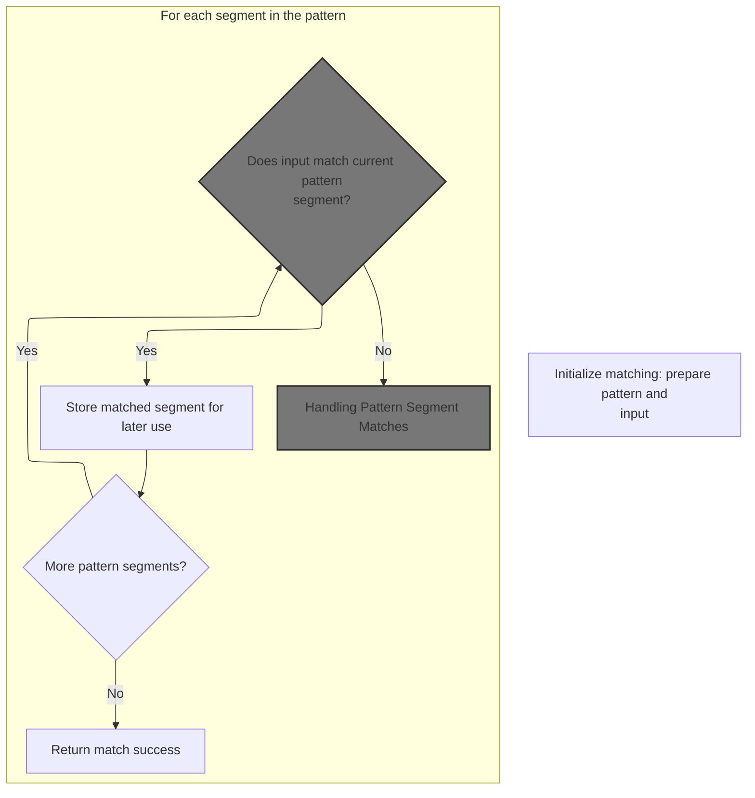
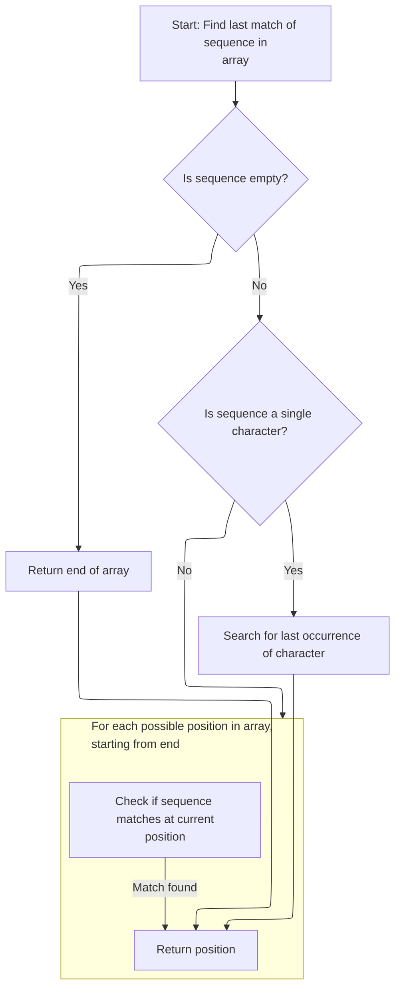
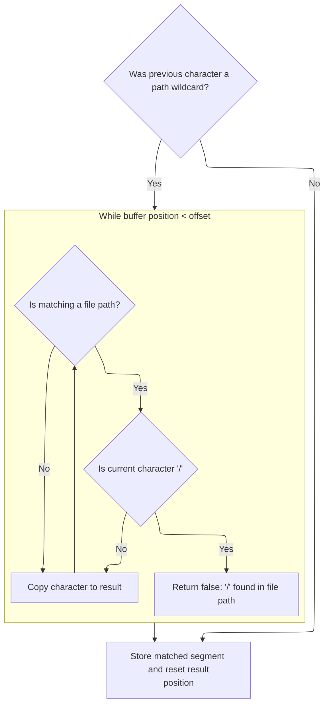
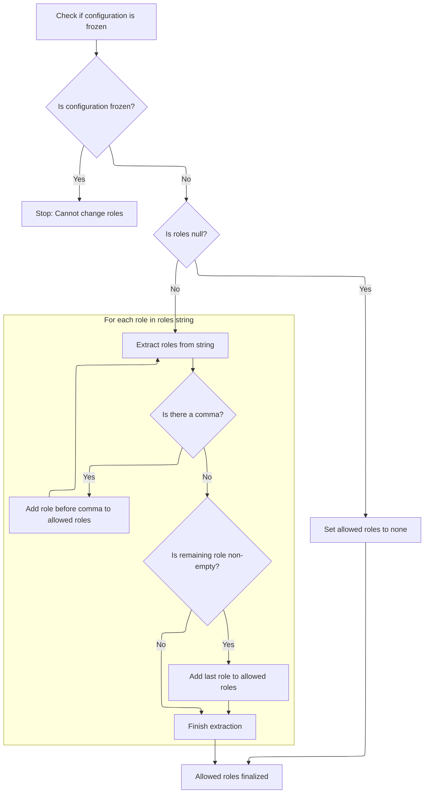

This document describes how a path is matched against wildcard patterns to enable dynamic routing and configuration. The path is compared to available patterns, variables are extracted from matches, and a configuration is generated and finalized with these variables.

# Where is this flow used?

This flow is used multiple times in the codebase as represented in the following diagram:

(Note - these are only some of the entry points of this flow)

```mermaid
graph TD;
      dde35d78060f1afca84b5e9dedc002fc37669b07142e9d5a1f656107cc900aa0(core/…/action/ActionServlet.java::ActionServlet.doGet) --> 294cd284fa406b4fe4f160157c73b79eaa7835613a545efd883ce1f14dd1ca7e(core/…/action/ActionServlet.java::ActionServlet.process)

294cd284fa406b4fe4f160157c73b79eaa7835613a545efd883ce1f14dd1ca7e(core/…/action/ActionServlet.java::ActionServlet.process) --> 8021481ad2e61cbffbd4896e05edd9e89db84071d125277e9a801c0e7ae658c3(core/…/action/ActionServlet.java::ActionServlet.getRequestProcessor)

294cd284fa406b4fe4f160157c73b79eaa7835613a545efd883ce1f14dd1ca7e(core/…/action/ActionServlet.java::ActionServlet.process) --> 1f3af44bfff9bae4b8af237be5302e37d202c99867273a09e77b9f6144dee63a(core/…/action/RequestProcessor.java::RequestProcessor.process)

8021481ad2e61cbffbd4896e05edd9e89db84071d125277e9a801c0e7ae658c3(core/…/action/ActionServlet.java::ActionServlet.getRequestProcessor) --> b2f59f4493e68c30a2337ffecc4fad8d1689fba0a6112201541d9b6d2026e962(core/…/action/ActionServlet.java::ActionServlet.init)

b2f59f4493e68c30a2337ffecc4fad8d1689fba0a6112201541d9b6d2026e962(core/…/action/ActionServlet.java::ActionServlet.init) --> cfcf3460ab594a484429c06cefc93c0462d46ff715ba3343ca651bd4c0411fea(core/…/action/ActionServlet.java::ActionServlet.initModuleActions)

b2f59f4493e68c30a2337ffecc4fad8d1689fba0a6112201541d9b6d2026e962(core/…/action/ActionServlet.java::ActionServlet.init) --> 65beff19e283dcc9f10a2d5b921efb59af07ff7f298d2ae532cae422039f99ba(core/…/action/ActionServlet.java::ActionServlet.initModulePlugIns)

b2f59f4493e68c30a2337ffecc4fad8d1689fba0a6112201541d9b6d2026e962(core/…/action/ActionServlet.java::ActionServlet.init) --> ea102a57045624818ae6d3884269c35a739052b363683a643b89d72d74ac6979(core/…/action/ActionServlet.java::ActionServlet.initModuleFormBeans)

cfcf3460ab594a484429c06cefc93c0462d46ff715ba3343ca651bd4c0411fea(core/…/action/ActionServlet.java::ActionServlet.initModuleActions) --> beebc7012d8bac444c7c390e03e63a2de7a18c2d6f2a62c60738f0e5add65a82(core/…/action/ActionServlet.java::ActionServlet.processActionConfigExtension)

beebc7012d8bac444c7c390e03e63a2de7a18c2d6f2a62c60738f0e5add65a82(core/…/action/ActionServlet.java::ActionServlet.processActionConfigExtension) --> 02127436f839446eebf4a672a4b943b4d1f112ae65ccf86b7dc4bc6a96e51cc9(core/…/action/ActionServlet.java::ActionServlet.processActionConfigClass)

beebc7012d8bac444c7c390e03e63a2de7a18c2d6f2a62c60738f0e5add65a82(core/…/action/ActionServlet.java::ActionServlet.processActionConfigExtension) --> e65d7274df6c676abd8caea3833f06a0cf7c56d9ae1f25d936e0b45f327d8ea8(core/…/config/ActionConfig.java::ActionConfig.processExtends)

02127436f839446eebf4a672a4b943b4d1f112ae65ccf86b7dc4bc6a96e51cc9(core/…/action/ActionServlet.java::ActionServlet.processActionConfigClass) --> fa78b50162eda7e9128ab5ab88c15d66232dbc66a0d2e6a80ae36433dfae3aa3(core/…/impl/ModuleConfigImpl.java::ModuleConfigImpl.findActionConfig)

fa78b50162eda7e9128ab5ab88c15d66232dbc66a0d2e6a80ae36433dfae3aa3(core/…/impl/ModuleConfigImpl.java::ModuleConfigImpl.findActionConfig) --> d78ceed0aaabdc0c62a1b715cc4813e2d01bf58432647d03afde6bce74ecfe4b(core/…/config/ActionConfigMatcher.java::ActionConfigMatcher.match)

e65d7274df6c676abd8caea3833f06a0cf7c56d9ae1f25d936e0b45f327d8ea8(core/…/config/ActionConfig.java::ActionConfig.processExtends) --> fa78b50162eda7e9128ab5ab88c15d66232dbc66a0d2e6a80ae36433dfae3aa3(core/…/impl/ModuleConfigImpl.java::ModuleConfigImpl.findActionConfig)

e65d7274df6c676abd8caea3833f06a0cf7c56d9ae1f25d936e0b45f327d8ea8(core/…/config/ActionConfig.java::ActionConfig.processExtends) --> 4371df41897571b238630b3feb297f9fa5bca4ab4d8a0ea463a699180282e94b(core/…/config/ActionConfig.java::ActionConfig.inheritFrom)

e65d7274df6c676abd8caea3833f06a0cf7c56d9ae1f25d936e0b45f327d8ea8(core/…/config/ActionConfig.java::ActionConfig.processExtends) --> e65d7274df6c676abd8caea3833f06a0cf7c56d9ae1f25d936e0b45f327d8ea8(core/…/config/ActionConfig.java::ActionConfig.processExtends)

e65d7274df6c676abd8caea3833f06a0cf7c56d9ae1f25d936e0b45f327d8ea8(core/…/config/ActionConfig.java::ActionConfig.processExtends) --> f669f02376a4d95250878ad41ca350bb2fda151b9e46d06d8995fee59357585c(core/…/config/ActionConfig.java::ActionConfig.checkCircularInheritance)

4371df41897571b238630b3feb297f9fa5bca4ab4d8a0ea463a699180282e94b(core/…/config/ActionConfig.java::ActionConfig.inheritFrom) --> 293db98b4b79a198cf4c7aa11d34e58ccdc48c490f500a7a12e560f033a66cee(core/…/config/ActionConfig.java::ActionConfig.inheritForwards)

4371df41897571b238630b3feb297f9fa5bca4ab4d8a0ea463a699180282e94b(core/…/config/ActionConfig.java::ActionConfig.inheritFrom) --> a24eff67b32fc35842310f0beb8ff0d9d3f92987eb8e18346754b1ec2cc6dd1a(core/…/config/ActionConfig.java::ActionConfig.inheritExceptionHandlers)

293db98b4b79a198cf4c7aa11d34e58ccdc48c490f500a7a12e560f033a66cee(core/…/config/ActionConfig.java::ActionConfig.inheritForwards) --> e65d7274df6c676abd8caea3833f06a0cf7c56d9ae1f25d936e0b45f327d8ea8(core/…/config/ActionConfig.java::ActionConfig.processExtends)

a24eff67b32fc35842310f0beb8ff0d9d3f92987eb8e18346754b1ec2cc6dd1a(core/…/config/ActionConfig.java::ActionConfig.inheritExceptionHandlers) --> e65d7274df6c676abd8caea3833f06a0cf7c56d9ae1f25d936e0b45f327d8ea8(core/…/config/ActionConfig.java::ActionConfig.processExtends)

f669f02376a4d95250878ad41ca350bb2fda151b9e46d06d8995fee59357585c(core/…/config/ActionConfig.java::ActionConfig.checkCircularInheritance) --> fa78b50162eda7e9128ab5ab88c15d66232dbc66a0d2e6a80ae36433dfae3aa3(core/…/impl/ModuleConfigImpl.java::ModuleConfigImpl.findActionConfig)

65beff19e283dcc9f10a2d5b921efb59af07ff7f298d2ae532cae422039f99ba(core/…/action/ActionServlet.java::ActionServlet.initModulePlugIns) --> b2f59f4493e68c30a2337ffecc4fad8d1689fba0a6112201541d9b6d2026e962(core/…/action/ActionServlet.java::ActionServlet.init)

ea102a57045624818ae6d3884269c35a739052b363683a643b89d72d74ac6979(core/…/action/ActionServlet.java::ActionServlet.initModuleFormBeans) --> 9e0380d4f7afb0671936f74d25617a1bb415c1ae1caf68c78f12f70e5206bcb6(core/…/action/ActionServlet.java::ActionServlet.processFormBeanExtension)

9e0380d4f7afb0671936f74d25617a1bb415c1ae1caf68c78f12f70e5206bcb6(core/…/action/ActionServlet.java::ActionServlet.processFormBeanExtension) --> 990a49a237f841175c6402951d282586d1ded787da3a7042301491030f002d5c(core/…/config/FormBeanConfig.java::FormBeanConfig.processExtends)

990a49a237f841175c6402951d282586d1ded787da3a7042301491030f002d5c(core/…/config/FormBeanConfig.java::FormBeanConfig.processExtends) --> e65d7274df6c676abd8caea3833f06a0cf7c56d9ae1f25d936e0b45f327d8ea8(core/…/config/ActionConfig.java::ActionConfig.processExtends)

1f3af44bfff9bae4b8af237be5302e37d202c99867273a09e77b9f6144dee63a(core/…/action/RequestProcessor.java::RequestProcessor.process) --> 0c9cb49bdb040eed76901f56d000ab5c3effd22be46871f3be143581c6349085(core/…/action/RequestProcessor.java::RequestProcessor.processMapping)

0c9cb49bdb040eed76901f56d000ab5c3effd22be46871f3be143581c6349085(core/…/action/RequestProcessor.java::RequestProcessor.processMapping) --> fa78b50162eda7e9128ab5ab88c15d66232dbc66a0d2e6a80ae36433dfae3aa3(core/…/impl/ModuleConfigImpl.java::ModuleConfigImpl.findActionConfig)

ec52fb7c28a6afaae4fd5937965ca776c6c12441d8a10e0b92b387b05c5c5cf5(core/…/action/ActionServlet.java::ActionServlet.doPost) --> 294cd284fa406b4fe4f160157c73b79eaa7835613a545efd883ce1f14dd1ca7e(core/…/action/ActionServlet.java::ActionServlet.process)

2a2f9513cbb02a07a418db6710bfd4000d7fe6d6588bf97ea3d57de50a8872e6(taglib/…/logic/NestedIterateTag.java::NestedIterateTag.doStartTag) --> b19d992fdd880149cdcce47b903a13c2e50663f2dd3b95cd63794022ff0cd409(taglib/…/nested/NestedPropertyHelper.java::NestedPropertyHelper.setNestedProperties)

2a2f9513cbb02a07a418db6710bfd4000d7fe6d6588bf97ea3d57de50a8872e6(taglib/…/logic/NestedIterateTag.java::NestedIterateTag.doStartTag) --> 577cd8d0b4648ce702b6e860ceb39ce500241d645348e12c9c3535d95c2b9a7b(taglib/…/nested/NestedPropertyHelper.java::NestedPropertyHelper.getAdjustedProperty)

b19d992fdd880149cdcce47b903a13c2e50663f2dd3b95cd63794022ff0cd409(taglib/…/nested/NestedPropertyHelper.java::NestedPropertyHelper.setNestedProperties) --> 577cd8d0b4648ce702b6e860ceb39ce500241d645348e12c9c3535d95c2b9a7b(taglib/…/nested/NestedPropertyHelper.java::NestedPropertyHelper.getAdjustedProperty)

577cd8d0b4648ce702b6e860ceb39ce500241d645348e12c9c3535d95c2b9a7b(taglib/…/nested/NestedPropertyHelper.java::NestedPropertyHelper.getAdjustedProperty) --> fbb7afed920e3a830ac08c7049b5c862bb260de328a35d7e793438ce064353ca(taglib/…/nested/NestedPropertyHelper.java::NestedPropertyHelper.calculateRelativeProperty)

fbb7afed920e3a830ac08c7049b5c862bb260de328a35d7e793438ce064353ca(taglib/…/nested/NestedPropertyHelper.java::NestedPropertyHelper.calculateRelativeProperty) --> 3f30bf537d7dc73652c0d273e504564165f608062343362feb8f138175431c8c(core/…/validwhen/ValidWhenLexer.java::ValidWhenLexer.nextToken)

3f30bf537d7dc73652c0d273e504564165f608062343362feb8f138175431c8c(core/…/validwhen/ValidWhenLexer.java::ValidWhenLexer.nextToken) --> ef91a1a19b4659b6b735b95470b22e4f8f9dd8e13f89df2f1a804b7dfea70dd0(core/…/validwhen/ValidWhenLexer.java::ValidWhenLexer.mWS)

3f30bf537d7dc73652c0d273e504564165f608062343362feb8f138175431c8c(core/…/validwhen/ValidWhenLexer.java::ValidWhenLexer.nextToken) --> 7da170a3504cb2e433260f293fdbbf304c499c9c20ede71811463723eb282dd1(core/…/validwhen/ValidWhenLexer.java::ValidWhenLexer.mDECIMAL_LITERAL)

3f30bf537d7dc73652c0d273e504564165f608062343362feb8f138175431c8c(core/…/validwhen/ValidWhenLexer.java::ValidWhenLexer.nextToken) --> 3d1de05461d9471adcd4882b8c3d3cb7a0c73135d698d9f446a2814524b6dcf7(core/…/validwhen/ValidWhenLexer.java::ValidWhenLexer.mSTRING_LITERAL)

3f30bf537d7dc73652c0d273e504564165f608062343362feb8f138175431c8c(core/…/validwhen/ValidWhenLexer.java::ValidWhenLexer.nextToken) --> d4df5a893bb7031adff645dda84b8ce98273d791652222eec4f01f8efca860b5(core/…/validwhen/ValidWhenLexer.java::ValidWhenLexer.mLBRACKET)

3f30bf537d7dc73652c0d273e504564165f608062343362feb8f138175431c8c(core/…/validwhen/ValidWhenLexer.java::ValidWhenLexer.nextToken) --> 6904ac578dabda8b1cbd44e8cf22d3270850f15e4eb358067158ed321bd8b284(core/…/validwhen/ValidWhenLexer.java::ValidWhenLexer.mRBRACKET)

3f30bf537d7dc73652c0d273e504564165f608062343362feb8f138175431c8c(core/…/validwhen/ValidWhenLexer.java::ValidWhenLexer.nextToken) --> 3e8bb29d4670c543bf499e26c878de2411299fa48924dfc659c6fa9263b86de3(core/…/validwhen/ValidWhenLexer.java::ValidWhenLexer.mLPAREN)

3f30bf537d7dc73652c0d273e504564165f608062343362feb8f138175431c8c(core/…/validwhen/ValidWhenLexer.java::ValidWhenLexer.nextToken) --> e8e004624b74d273975f8c1b8174c76046d4ab04aa21fb01ed33d4442c517e0c(core/…/validwhen/ValidWhenLexer.java::ValidWhenLexer.mRPAREN)

3f30bf537d7dc73652c0d273e504564165f608062343362feb8f138175431c8c(core/…/validwhen/ValidWhenLexer.java::ValidWhenLexer.nextToken) --> 90d8102908e0b10ff3d8bcd2187a0b18c46ce4edce2aff30662098e58df6c829(core/…/validwhen/ValidWhenLexer.java::ValidWhenLexer.mTHIS)

3f30bf537d7dc73652c0d273e504564165f608062343362feb8f138175431c8c(core/…/validwhen/ValidWhenLexer.java::ValidWhenLexer.nextToken) --> 09ec7835b8e03b9c915616803d9c18c6389de06037b5f72950a1e45ccd9b33a7(core/…/validwhen/ValidWhenLexer.java::ValidWhenLexer.mIDENTIFIER)

3f30bf537d7dc73652c0d273e504564165f608062343362feb8f138175431c8c(core/…/validwhen/ValidWhenLexer.java::ValidWhenLexer.nextToken) --> 64731b4cb6b9d56960b0a4f6aa84c780906858f4f1b67692c734c3aed4e17697(core/…/validwhen/ValidWhenLexer.java::ValidWhenLexer.mEQUALSIGN)

3f30bf537d7dc73652c0d273e504564165f608062343362feb8f138175431c8c(core/…/validwhen/ValidWhenLexer.java::ValidWhenLexer.nextToken) --> 1fe56c9e2b26da4b0f1b8da9b134b8fa0c2cee44c5a97ed30484d8e784782f13(core/…/validwhen/ValidWhenLexer.java::ValidWhenLexer.mNOTEQUALSIGN)

3f30bf537d7dc73652c0d273e504564165f608062343362feb8f138175431c8c(core/…/validwhen/ValidWhenLexer.java::ValidWhenLexer.nextToken) --> 7cf68d3bda6bd78003f9d7b757182a445092432fab26a2b35346cfe39b919366(core/…/validwhen/ValidWhenLexer.java::ValidWhenLexer.mLESSTHANSIGN)

3f30bf537d7dc73652c0d273e504564165f608062343362feb8f138175431c8c(core/…/validwhen/ValidWhenLexer.java::ValidWhenLexer.nextToken) --> a56cd4e8d0f961c7d4bf7c2cb6f3ca9fd43325edd9820d258b1154345ca11523(core/…/validwhen/ValidWhenLexer.java::ValidWhenLexer.mGREATERTHANSIGN)

3f30bf537d7dc73652c0d273e504564165f608062343362feb8f138175431c8c(core/…/validwhen/ValidWhenLexer.java::ValidWhenLexer.nextToken) --> 4af7ecf29172e27c31a81a93b1bba0f6cb9a31a135689b1dde371ccb8d1bde80(core/…/validwhen/ValidWhenLexer.java::ValidWhenLexer.mLESSEQUALSIGN)

3f30bf537d7dc73652c0d273e504564165f608062343362feb8f138175431c8c(core/…/validwhen/ValidWhenLexer.java::ValidWhenLexer.nextToken) --> 7b1f7b65d7fda31a4db5ec84c28032426d6e575dc6d24ff4e9042ad60087d86d(core/…/validwhen/ValidWhenLexer.java::ValidWhenLexer.mGREATEREQUALSIGN)

ef91a1a19b4659b6b735b95470b22e4f8f9dd8e13f89df2f1a804b7dfea70dd0(core/…/validwhen/ValidWhenLexer.java::ValidWhenLexer.mWS) --> d78ceed0aaabdc0c62a1b715cc4813e2d01bf58432647d03afde6bce74ecfe4b(core/…/config/ActionConfigMatcher.java::ActionConfigMatcher.match)

7da170a3504cb2e433260f293fdbbf304c499c9c20ede71811463723eb282dd1(core/…/validwhen/ValidWhenLexer.java::ValidWhenLexer.mDECIMAL_LITERAL) --> d78ceed0aaabdc0c62a1b715cc4813e2d01bf58432647d03afde6bce74ecfe4b(core/…/config/ActionConfigMatcher.java::ActionConfigMatcher.match)

3d1de05461d9471adcd4882b8c3d3cb7a0c73135d698d9f446a2814524b6dcf7(core/…/validwhen/ValidWhenLexer.java::ValidWhenLexer.mSTRING_LITERAL) --> d78ceed0aaabdc0c62a1b715cc4813e2d01bf58432647d03afde6bce74ecfe4b(core/…/config/ActionConfigMatcher.java::ActionConfigMatcher.match)

d4df5a893bb7031adff645dda84b8ce98273d791652222eec4f01f8efca860b5(core/…/validwhen/ValidWhenLexer.java::ValidWhenLexer.mLBRACKET) --> d78ceed0aaabdc0c62a1b715cc4813e2d01bf58432647d03afde6bce74ecfe4b(core/…/config/ActionConfigMatcher.java::ActionConfigMatcher.match)

6904ac578dabda8b1cbd44e8cf22d3270850f15e4eb358067158ed321bd8b284(core/…/validwhen/ValidWhenLexer.java::ValidWhenLexer.mRBRACKET) --> d78ceed0aaabdc0c62a1b715cc4813e2d01bf58432647d03afde6bce74ecfe4b(core/…/config/ActionConfigMatcher.java::ActionConfigMatcher.match)

3e8bb29d4670c543bf499e26c878de2411299fa48924dfc659c6fa9263b86de3(core/…/validwhen/ValidWhenLexer.java::ValidWhenLexer.mLPAREN) --> d78ceed0aaabdc0c62a1b715cc4813e2d01bf58432647d03afde6bce74ecfe4b(core/…/config/ActionConfigMatcher.java::ActionConfigMatcher.match)

e8e004624b74d273975f8c1b8174c76046d4ab04aa21fb01ed33d4442c517e0c(core/…/validwhen/ValidWhenLexer.java::ValidWhenLexer.mRPAREN) --> d78ceed0aaabdc0c62a1b715cc4813e2d01bf58432647d03afde6bce74ecfe4b(core/…/config/ActionConfigMatcher.java::ActionConfigMatcher.match)

90d8102908e0b10ff3d8bcd2187a0b18c46ce4edce2aff30662098e58df6c829(core/…/validwhen/ValidWhenLexer.java::ValidWhenLexer.mTHIS) --> d78ceed0aaabdc0c62a1b715cc4813e2d01bf58432647d03afde6bce74ecfe4b(core/…/config/ActionConfigMatcher.java::ActionConfigMatcher.match)

09ec7835b8e03b9c915616803d9c18c6389de06037b5f72950a1e45ccd9b33a7(core/…/validwhen/ValidWhenLexer.java::ValidWhenLexer.mIDENTIFIER) --> d78ceed0aaabdc0c62a1b715cc4813e2d01bf58432647d03afde6bce74ecfe4b(core/…/config/ActionConfigMatcher.java::ActionConfigMatcher.match)

64731b4cb6b9d56960b0a4f6aa84c780906858f4f1b67692c734c3aed4e17697(core/…/validwhen/ValidWhenLexer.java::ValidWhenLexer.mEQUALSIGN) --> d78ceed0aaabdc0c62a1b715cc4813e2d01bf58432647d03afde6bce74ecfe4b(core/…/config/ActionConfigMatcher.java::ActionConfigMatcher.match)

1fe56c9e2b26da4b0f1b8da9b134b8fa0c2cee44c5a97ed30484d8e784782f13(core/…/validwhen/ValidWhenLexer.java::ValidWhenLexer.mNOTEQUALSIGN) --> d78ceed0aaabdc0c62a1b715cc4813e2d01bf58432647d03afde6bce74ecfe4b(core/…/config/ActionConfigMatcher.java::ActionConfigMatcher.match)

7cf68d3bda6bd78003f9d7b757182a445092432fab26a2b35346cfe39b919366(core/…/validwhen/ValidWhenLexer.java::ValidWhenLexer.mLESSTHANSIGN) --> d78ceed0aaabdc0c62a1b715cc4813e2d01bf58432647d03afde6bce74ecfe4b(core/…/config/ActionConfigMatcher.java::ActionConfigMatcher.match)

a56cd4e8d0f961c7d4bf7c2cb6f3ca9fd43325edd9820d258b1154345ca11523(core/…/validwhen/ValidWhenLexer.java::ValidWhenLexer.mGREATERTHANSIGN) --> d78ceed0aaabdc0c62a1b715cc4813e2d01bf58432647d03afde6bce74ecfe4b(core/…/config/ActionConfigMatcher.java::ActionConfigMatcher.match)

4af7ecf29172e27c31a81a93b1bba0f6cb9a31a135689b1dde371ccb8d1bde80(core/…/validwhen/ValidWhenLexer.java::ValidWhenLexer.mLESSEQUALSIGN) --> d78ceed0aaabdc0c62a1b715cc4813e2d01bf58432647d03afde6bce74ecfe4b(core/…/config/ActionConfigMatcher.java::ActionConfigMatcher.match)

7b1f7b65d7fda31a4db5ec84c28032426d6e575dc6d24ff4e9042ad60087d86d(core/…/validwhen/ValidWhenLexer.java::ValidWhenLexer.mGREATEREQUALSIGN) --> d78ceed0aaabdc0c62a1b715cc4813e2d01bf58432647d03afde6bce74ecfe4b(core/…/config/ActionConfigMatcher.java::ActionConfigMatcher.match)

2b2b21443b50fff2d167e05f9a396a8acffed93630620f6578e0d575ee4d457c(taglib/…/html/NestedOptionsTag.java::NestedOptionsTag.doStartTag) --> b19d992fdd880149cdcce47b903a13c2e50663f2dd3b95cd63794022ff0cd409(taglib/…/nested/NestedPropertyHelper.java::NestedPropertyHelper.setNestedProperties)

2b2b21443b50fff2d167e05f9a396a8acffed93630620f6578e0d575ee4d457c(taglib/…/html/NestedOptionsTag.java::NestedOptionsTag.doStartTag) --> 577cd8d0b4648ce702b6e860ceb39ce500241d645348e12c9c3535d95c2b9a7b(taglib/…/nested/NestedPropertyHelper.java::NestedPropertyHelper.getAdjustedProperty)

f42b5fa1bea56d8ff671c6affb9d85867c0cd9c866b2e87d4e79e1160c4ffca1(tiles/…/tiles/RedeployableActionServlet.java::RedeployableActionServlet.getRequestProcessor) --> 8021481ad2e61cbffbd4896e05edd9e89db84071d125277e9a801c0e7ae658c3(core/…/action/ActionServlet.java::ActionServlet.getRequestProcessor)


classDef mainFlowStyle color:#000000,fill:#7CB9F4
classDef rootsStyle color:#000000,fill:#00FFF4
classDef Style1 color:#000000,fill:#00FFAA
classDef Style2 color:#000000,fill:#FFFF00
classDef Style3 color:#000000,fill:#AA7CB9

%% Swimm:
%% graph TD;
%%       dde35d78060f1afca84b5e9dedc002fc37669b07142e9d5a1f656107cc900aa0(<SwmPath>[core/…/action/ActionServlet.java](core/src/main/java/org/apache/struts/action/ActionServlet.java)</SwmPath>::ActionServlet.doGet) --> 294cd284fa406b4fe4f160157c73b79eaa7835613a545efd883ce1f14dd1ca7e(<SwmPath>[core/…/action/ActionServlet.java](core/src/main/java/org/apache/struts/action/ActionServlet.java)</SwmPath>::ActionServlet.process)
%% 
%% 294cd284fa406b4fe4f160157c73b79eaa7835613a545efd883ce1f14dd1ca7e(<SwmPath>[core/…/action/ActionServlet.java](core/src/main/java/org/apache/struts/action/ActionServlet.java)</SwmPath>::ActionServlet.process) --> 8021481ad2e61cbffbd4896e05edd9e89db84071d125277e9a801c0e7ae658c3(<SwmPath>[core/…/action/ActionServlet.java](core/src/main/java/org/apache/struts/action/ActionServlet.java)</SwmPath>::ActionServlet.getRequestProcessor)
%% 
%% 294cd284fa406b4fe4f160157c73b79eaa7835613a545efd883ce1f14dd1ca7e(<SwmPath>[core/…/action/ActionServlet.java](core/src/main/java/org/apache/struts/action/ActionServlet.java)</SwmPath>::ActionServlet.process) --> 1f3af44bfff9bae4b8af237be5302e37d202c99867273a09e77b9f6144dee63a(<SwmPath>[core/…/action/RequestProcessor.java](core/src/main/java/org/apache/struts/action/RequestProcessor.java)</SwmPath>::RequestProcessor.process)
%% 
%% 8021481ad2e61cbffbd4896e05edd9e89db84071d125277e9a801c0e7ae658c3(<SwmPath>[core/…/action/ActionServlet.java](core/src/main/java/org/apache/struts/action/ActionServlet.java)</SwmPath>::ActionServlet.getRequestProcessor) --> b2f59f4493e68c30a2337ffecc4fad8d1689fba0a6112201541d9b6d2026e962(<SwmPath>[core/…/action/ActionServlet.java](core/src/main/java/org/apache/struts/action/ActionServlet.java)</SwmPath>::ActionServlet.init)
%% 
%% b2f59f4493e68c30a2337ffecc4fad8d1689fba0a6112201541d9b6d2026e962(<SwmPath>[core/…/action/ActionServlet.java](core/src/main/java/org/apache/struts/action/ActionServlet.java)</SwmPath>::ActionServlet.init) --> cfcf3460ab594a484429c06cefc93c0462d46ff715ba3343ca651bd4c0411fea(<SwmPath>[core/…/action/ActionServlet.java](core/src/main/java/org/apache/struts/action/ActionServlet.java)</SwmPath>::ActionServlet.initModuleActions)
%% 
%% b2f59f4493e68c30a2337ffecc4fad8d1689fba0a6112201541d9b6d2026e962(<SwmPath>[core/…/action/ActionServlet.java](core/src/main/java/org/apache/struts/action/ActionServlet.java)</SwmPath>::ActionServlet.init) --> 65beff19e283dcc9f10a2d5b921efb59af07ff7f298d2ae532cae422039f99ba(<SwmPath>[core/…/action/ActionServlet.java](core/src/main/java/org/apache/struts/action/ActionServlet.java)</SwmPath>::ActionServlet.initModulePlugIns)
%% 
%% b2f59f4493e68c30a2337ffecc4fad8d1689fba0a6112201541d9b6d2026e962(<SwmPath>[core/…/action/ActionServlet.java](core/src/main/java/org/apache/struts/action/ActionServlet.java)</SwmPath>::ActionServlet.init) --> ea102a57045624818ae6d3884269c35a739052b363683a643b89d72d74ac6979(<SwmPath>[core/…/action/ActionServlet.java](core/src/main/java/org/apache/struts/action/ActionServlet.java)</SwmPath>::ActionServlet.initModuleFormBeans)
%% 
%% cfcf3460ab594a484429c06cefc93c0462d46ff715ba3343ca651bd4c0411fea(<SwmPath>[core/…/action/ActionServlet.java](core/src/main/java/org/apache/struts/action/ActionServlet.java)</SwmPath>::ActionServlet.initModuleActions) --> beebc7012d8bac444c7c390e03e63a2de7a18c2d6f2a62c60738f0e5add65a82(<SwmPath>[core/…/action/ActionServlet.java](core/src/main/java/org/apache/struts/action/ActionServlet.java)</SwmPath>::ActionServlet.processActionConfigExtension)
%% 
%% beebc7012d8bac444c7c390e03e63a2de7a18c2d6f2a62c60738f0e5add65a82(<SwmPath>[core/…/action/ActionServlet.java](core/src/main/java/org/apache/struts/action/ActionServlet.java)</SwmPath>::ActionServlet.processActionConfigExtension) --> 02127436f839446eebf4a672a4b943b4d1f112ae65ccf86b7dc4bc6a96e51cc9(<SwmPath>[core/…/action/ActionServlet.java](core/src/main/java/org/apache/struts/action/ActionServlet.java)</SwmPath>::ActionServlet.processActionConfigClass)
%% 
%% beebc7012d8bac444c7c390e03e63a2de7a18c2d6f2a62c60738f0e5add65a82(<SwmPath>[core/…/action/ActionServlet.java](core/src/main/java/org/apache/struts/action/ActionServlet.java)</SwmPath>::ActionServlet.processActionConfigExtension) --> e65d7274df6c676abd8caea3833f06a0cf7c56d9ae1f25d936e0b45f327d8ea8(<SwmPath>[core/…/config/ActionConfig.java](core/src/main/java/org/apache/struts/config/ActionConfig.java)</SwmPath>::ActionConfig.processExtends)
%% 
%% 02127436f839446eebf4a672a4b943b4d1f112ae65ccf86b7dc4bc6a96e51cc9(<SwmPath>[core/…/action/ActionServlet.java](core/src/main/java/org/apache/struts/action/ActionServlet.java)</SwmPath>::ActionServlet.processActionConfigClass) --> fa78b50162eda7e9128ab5ab88c15d66232dbc66a0d2e6a80ae36433dfae3aa3(<SwmPath>[core/…/impl/ModuleConfigImpl.java](core/src/main/java/org/apache/struts/config/impl/ModuleConfigImpl.java)</SwmPath>::ModuleConfigImpl.findActionConfig)
%% 
%% fa78b50162eda7e9128ab5ab88c15d66232dbc66a0d2e6a80ae36433dfae3aa3(<SwmPath>[core/…/impl/ModuleConfigImpl.java](core/src/main/java/org/apache/struts/config/impl/ModuleConfigImpl.java)</SwmPath>::ModuleConfigImpl.findActionConfig) --> d78ceed0aaabdc0c62a1b715cc4813e2d01bf58432647d03afde6bce74ecfe4b(<SwmPath>[core/…/config/ActionConfigMatcher.java](core/src/main/java/org/apache/struts/config/ActionConfigMatcher.java)</SwmPath>::ActionConfigMatcher.match)
%% 
%% e65d7274df6c676abd8caea3833f06a0cf7c56d9ae1f25d936e0b45f327d8ea8(<SwmPath>[core/…/config/ActionConfig.java](core/src/main/java/org/apache/struts/config/ActionConfig.java)</SwmPath>::ActionConfig.processExtends) --> fa78b50162eda7e9128ab5ab88c15d66232dbc66a0d2e6a80ae36433dfae3aa3(<SwmPath>[core/…/impl/ModuleConfigImpl.java](core/src/main/java/org/apache/struts/config/impl/ModuleConfigImpl.java)</SwmPath>::ModuleConfigImpl.findActionConfig)
%% 
%% e65d7274df6c676abd8caea3833f06a0cf7c56d9ae1f25d936e0b45f327d8ea8(<SwmPath>[core/…/config/ActionConfig.java](core/src/main/java/org/apache/struts/config/ActionConfig.java)</SwmPath>::ActionConfig.processExtends) --> 4371df41897571b238630b3feb297f9fa5bca4ab4d8a0ea463a699180282e94b(<SwmPath>[core/…/config/ActionConfig.java](core/src/main/java/org/apache/struts/config/ActionConfig.java)</SwmPath>::ActionConfig.inheritFrom)
%% 
%% e65d7274df6c676abd8caea3833f06a0cf7c56d9ae1f25d936e0b45f327d8ea8(<SwmPath>[core/…/config/ActionConfig.java](core/src/main/java/org/apache/struts/config/ActionConfig.java)</SwmPath>::ActionConfig.processExtends) --> e65d7274df6c676abd8caea3833f06a0cf7c56d9ae1f25d936e0b45f327d8ea8(<SwmPath>[core/…/config/ActionConfig.java](core/src/main/java/org/apache/struts/config/ActionConfig.java)</SwmPath>::ActionConfig.processExtends)
%% 
%% e65d7274df6c676abd8caea3833f06a0cf7c56d9ae1f25d936e0b45f327d8ea8(<SwmPath>[core/…/config/ActionConfig.java](core/src/main/java/org/apache/struts/config/ActionConfig.java)</SwmPath>::ActionConfig.processExtends) --> f669f02376a4d95250878ad41ca350bb2fda151b9e46d06d8995fee59357585c(<SwmPath>[core/…/config/ActionConfig.java](core/src/main/java/org/apache/struts/config/ActionConfig.java)</SwmPath>::ActionConfig.checkCircularInheritance)
%% 
%% 4371df41897571b238630b3feb297f9fa5bca4ab4d8a0ea463a699180282e94b(<SwmPath>[core/…/config/ActionConfig.java](core/src/main/java/org/apache/struts/config/ActionConfig.java)</SwmPath>::ActionConfig.inheritFrom) --> 293db98b4b79a198cf4c7aa11d34e58ccdc48c490f500a7a12e560f033a66cee(<SwmPath>[core/…/config/ActionConfig.java](core/src/main/java/org/apache/struts/config/ActionConfig.java)</SwmPath>::ActionConfig.inheritForwards)
%% 
%% 4371df41897571b238630b3feb297f9fa5bca4ab4d8a0ea463a699180282e94b(<SwmPath>[core/…/config/ActionConfig.java](core/src/main/java/org/apache/struts/config/ActionConfig.java)</SwmPath>::ActionConfig.inheritFrom) --> a24eff67b32fc35842310f0beb8ff0d9d3f92987eb8e18346754b1ec2cc6dd1a(<SwmPath>[core/…/config/ActionConfig.java](core/src/main/java/org/apache/struts/config/ActionConfig.java)</SwmPath>::ActionConfig.inheritExceptionHandlers)
%% 
%% 293db98b4b79a198cf4c7aa11d34e58ccdc48c490f500a7a12e560f033a66cee(<SwmPath>[core/…/config/ActionConfig.java](core/src/main/java/org/apache/struts/config/ActionConfig.java)</SwmPath>::ActionConfig.inheritForwards) --> e65d7274df6c676abd8caea3833f06a0cf7c56d9ae1f25d936e0b45f327d8ea8(<SwmPath>[core/…/config/ActionConfig.java](core/src/main/java/org/apache/struts/config/ActionConfig.java)</SwmPath>::ActionConfig.processExtends)
%% 
%% a24eff67b32fc35842310f0beb8ff0d9d3f92987eb8e18346754b1ec2cc6dd1a(<SwmPath>[core/…/config/ActionConfig.java](core/src/main/java/org/apache/struts/config/ActionConfig.java)</SwmPath>::ActionConfig.inheritExceptionHandlers) --> e65d7274df6c676abd8caea3833f06a0cf7c56d9ae1f25d936e0b45f327d8ea8(<SwmPath>[core/…/config/ActionConfig.java](core/src/main/java/org/apache/struts/config/ActionConfig.java)</SwmPath>::ActionConfig.processExtends)
%% 
%% f669f02376a4d95250878ad41ca350bb2fda151b9e46d06d8995fee59357585c(<SwmPath>[core/…/config/ActionConfig.java](core/src/main/java/org/apache/struts/config/ActionConfig.java)</SwmPath>::ActionConfig.checkCircularInheritance) --> fa78b50162eda7e9128ab5ab88c15d66232dbc66a0d2e6a80ae36433dfae3aa3(<SwmPath>[core/…/impl/ModuleConfigImpl.java](core/src/main/java/org/apache/struts/config/impl/ModuleConfigImpl.java)</SwmPath>::ModuleConfigImpl.findActionConfig)
%% 
%% 65beff19e283dcc9f10a2d5b921efb59af07ff7f298d2ae532cae422039f99ba(<SwmPath>[core/…/action/ActionServlet.java](core/src/main/java/org/apache/struts/action/ActionServlet.java)</SwmPath>::ActionServlet.initModulePlugIns) --> b2f59f4493e68c30a2337ffecc4fad8d1689fba0a6112201541d9b6d2026e962(<SwmPath>[core/…/action/ActionServlet.java](core/src/main/java/org/apache/struts/action/ActionServlet.java)</SwmPath>::ActionServlet.init)
%% 
%% ea102a57045624818ae6d3884269c35a739052b363683a643b89d72d74ac6979(<SwmPath>[core/…/action/ActionServlet.java](core/src/main/java/org/apache/struts/action/ActionServlet.java)</SwmPath>::ActionServlet.initModuleFormBeans) --> 9e0380d4f7afb0671936f74d25617a1bb415c1ae1caf68c78f12f70e5206bcb6(<SwmPath>[core/…/action/ActionServlet.java](core/src/main/java/org/apache/struts/action/ActionServlet.java)</SwmPath>::ActionServlet.processFormBeanExtension)
%% 
%% 9e0380d4f7afb0671936f74d25617a1bb415c1ae1caf68c78f12f70e5206bcb6(<SwmPath>[core/…/action/ActionServlet.java](core/src/main/java/org/apache/struts/action/ActionServlet.java)</SwmPath>::ActionServlet.processFormBeanExtension) --> 990a49a237f841175c6402951d282586d1ded787da3a7042301491030f002d5c(<SwmPath>[core/…/config/FormBeanConfig.java](core/src/main/java/org/apache/struts/config/FormBeanConfig.java)</SwmPath>::FormBeanConfig.processExtends)
%% 
%% 990a49a237f841175c6402951d282586d1ded787da3a7042301491030f002d5c(<SwmPath>[core/…/config/FormBeanConfig.java](core/src/main/java/org/apache/struts/config/FormBeanConfig.java)</SwmPath>::FormBeanConfig.processExtends) --> e65d7274df6c676abd8caea3833f06a0cf7c56d9ae1f25d936e0b45f327d8ea8(<SwmPath>[core/…/config/ActionConfig.java](core/src/main/java/org/apache/struts/config/ActionConfig.java)</SwmPath>::ActionConfig.processExtends)
%% 
%% 1f3af44bfff9bae4b8af237be5302e37d202c99867273a09e77b9f6144dee63a(<SwmPath>[core/…/action/RequestProcessor.java](core/src/main/java/org/apache/struts/action/RequestProcessor.java)</SwmPath>::RequestProcessor.process) --> 0c9cb49bdb040eed76901f56d000ab5c3effd22be46871f3be143581c6349085(<SwmPath>[core/…/action/RequestProcessor.java](core/src/main/java/org/apache/struts/action/RequestProcessor.java)</SwmPath>::RequestProcessor.processMapping)
%% 
%% 0c9cb49bdb040eed76901f56d000ab5c3effd22be46871f3be143581c6349085(<SwmPath>[core/…/action/RequestProcessor.java](core/src/main/java/org/apache/struts/action/RequestProcessor.java)</SwmPath>::RequestProcessor.processMapping) --> fa78b50162eda7e9128ab5ab88c15d66232dbc66a0d2e6a80ae36433dfae3aa3(<SwmPath>[core/…/impl/ModuleConfigImpl.java](core/src/main/java/org/apache/struts/config/impl/ModuleConfigImpl.java)</SwmPath>::ModuleConfigImpl.findActionConfig)
%% 
%% ec52fb7c28a6afaae4fd5937965ca776c6c12441d8a10e0b92b387b05c5c5cf5(<SwmPath>[core/…/action/ActionServlet.java](core/src/main/java/org/apache/struts/action/ActionServlet.java)</SwmPath>::ActionServlet.doPost) --> 294cd284fa406b4fe4f160157c73b79eaa7835613a545efd883ce1f14dd1ca7e(<SwmPath>[core/…/action/ActionServlet.java](core/src/main/java/org/apache/struts/action/ActionServlet.java)</SwmPath>::ActionServlet.process)
%% 
%% 2a2f9513cbb02a07a418db6710bfd4000d7fe6d6588bf97ea3d57de50a8872e6(<SwmPath>[taglib/…/logic/NestedIterateTag.java](taglib/src/main/java/org/apache/struts/taglib/nested/logic/NestedIterateTag.java)</SwmPath>::NestedIterateTag.doStartTag) --> b19d992fdd880149cdcce47b903a13c2e50663f2dd3b95cd63794022ff0cd409(<SwmPath>[taglib/…/nested/NestedPropertyHelper.java](taglib/src/main/java/org/apache/struts/taglib/nested/NestedPropertyHelper.java)</SwmPath>::NestedPropertyHelper.setNestedProperties)
%% 
%% 2a2f9513cbb02a07a418db6710bfd4000d7fe6d6588bf97ea3d57de50a8872e6(<SwmPath>[taglib/…/logic/NestedIterateTag.java](taglib/src/main/java/org/apache/struts/taglib/nested/logic/NestedIterateTag.java)</SwmPath>::NestedIterateTag.doStartTag) --> 577cd8d0b4648ce702b6e860ceb39ce500241d645348e12c9c3535d95c2b9a7b(<SwmPath>[taglib/…/nested/NestedPropertyHelper.java](taglib/src/main/java/org/apache/struts/taglib/nested/NestedPropertyHelper.java)</SwmPath>::NestedPropertyHelper.getAdjustedProperty)
%% 
%% b19d992fdd880149cdcce47b903a13c2e50663f2dd3b95cd63794022ff0cd409(<SwmPath>[taglib/…/nested/NestedPropertyHelper.java](taglib/src/main/java/org/apache/struts/taglib/nested/NestedPropertyHelper.java)</SwmPath>::NestedPropertyHelper.setNestedProperties) --> 577cd8d0b4648ce702b6e860ceb39ce500241d645348e12c9c3535d95c2b9a7b(<SwmPath>[taglib/…/nested/NestedPropertyHelper.java](taglib/src/main/java/org/apache/struts/taglib/nested/NestedPropertyHelper.java)</SwmPath>::NestedPropertyHelper.getAdjustedProperty)
%% 
%% 577cd8d0b4648ce702b6e860ceb39ce500241d645348e12c9c3535d95c2b9a7b(<SwmPath>[taglib/…/nested/NestedPropertyHelper.java](taglib/src/main/java/org/apache/struts/taglib/nested/NestedPropertyHelper.java)</SwmPath>::NestedPropertyHelper.getAdjustedProperty) --> fbb7afed920e3a830ac08c7049b5c862bb260de328a35d7e793438ce064353ca(<SwmPath>[taglib/…/nested/NestedPropertyHelper.java](taglib/src/main/java/org/apache/struts/taglib/nested/NestedPropertyHelper.java)</SwmPath>::NestedPropertyHelper.calculateRelativeProperty)
%% 
%% fbb7afed920e3a830ac08c7049b5c862bb260de328a35d7e793438ce064353ca(<SwmPath>[taglib/…/nested/NestedPropertyHelper.java](taglib/src/main/java/org/apache/struts/taglib/nested/NestedPropertyHelper.java)</SwmPath>::NestedPropertyHelper.calculateRelativeProperty) --> 3f30bf537d7dc73652c0d273e504564165f608062343362feb8f138175431c8c(<SwmPath>[core/…/validwhen/ValidWhenLexer.java](core/src/main/java/org/apache/struts/validator/validwhen/ValidWhenLexer.java)</SwmPath>::ValidWhenLexer.nextToken)
%% 
%% 3f30bf537d7dc73652c0d273e504564165f608062343362feb8f138175431c8c(<SwmPath>[core/…/validwhen/ValidWhenLexer.java](core/src/main/java/org/apache/struts/validator/validwhen/ValidWhenLexer.java)</SwmPath>::ValidWhenLexer.nextToken) --> ef91a1a19b4659b6b735b95470b22e4f8f9dd8e13f89df2f1a804b7dfea70dd0(<SwmPath>[core/…/validwhen/ValidWhenLexer.java](core/src/main/java/org/apache/struts/validator/validwhen/ValidWhenLexer.java)</SwmPath>::ValidWhenLexer.mWS)
%% 
%% 3f30bf537d7dc73652c0d273e504564165f608062343362feb8f138175431c8c(<SwmPath>[core/…/validwhen/ValidWhenLexer.java](core/src/main/java/org/apache/struts/validator/validwhen/ValidWhenLexer.java)</SwmPath>::ValidWhenLexer.nextToken) --> 7da170a3504cb2e433260f293fdbbf304c499c9c20ede71811463723eb282dd1(<SwmPath>[core/…/validwhen/ValidWhenLexer.java](core/src/main/java/org/apache/struts/validator/validwhen/ValidWhenLexer.java)</SwmPath>::ValidWhenLexer.mDECIMAL_LITERAL)
%% 
%% 3f30bf537d7dc73652c0d273e504564165f608062343362feb8f138175431c8c(<SwmPath>[core/…/validwhen/ValidWhenLexer.java](core/src/main/java/org/apache/struts/validator/validwhen/ValidWhenLexer.java)</SwmPath>::ValidWhenLexer.nextToken) --> 3d1de05461d9471adcd4882b8c3d3cb7a0c73135d698d9f446a2814524b6dcf7(<SwmPath>[core/…/validwhen/ValidWhenLexer.java](core/src/main/java/org/apache/struts/validator/validwhen/ValidWhenLexer.java)</SwmPath>::ValidWhenLexer.mSTRING_LITERAL)
%% 
%% 3f30bf537d7dc73652c0d273e504564165f608062343362feb8f138175431c8c(<SwmPath>[core/…/validwhen/ValidWhenLexer.java](core/src/main/java/org/apache/struts/validator/validwhen/ValidWhenLexer.java)</SwmPath>::ValidWhenLexer.nextToken) --> d4df5a893bb7031adff645dda84b8ce98273d791652222eec4f01f8efca860b5(<SwmPath>[core/…/validwhen/ValidWhenLexer.java](core/src/main/java/org/apache/struts/validator/validwhen/ValidWhenLexer.java)</SwmPath>::ValidWhenLexer.mLBRACKET)
%% 
%% 3f30bf537d7dc73652c0d273e504564165f608062343362feb8f138175431c8c(<SwmPath>[core/…/validwhen/ValidWhenLexer.java](core/src/main/java/org/apache/struts/validator/validwhen/ValidWhenLexer.java)</SwmPath>::ValidWhenLexer.nextToken) --> 6904ac578dabda8b1cbd44e8cf22d3270850f15e4eb358067158ed321bd8b284(<SwmPath>[core/…/validwhen/ValidWhenLexer.java](core/src/main/java/org/apache/struts/validator/validwhen/ValidWhenLexer.java)</SwmPath>::ValidWhenLexer.mRBRACKET)
%% 
%% 3f30bf537d7dc73652c0d273e504564165f608062343362feb8f138175431c8c(<SwmPath>[core/…/validwhen/ValidWhenLexer.java](core/src/main/java/org/apache/struts/validator/validwhen/ValidWhenLexer.java)</SwmPath>::ValidWhenLexer.nextToken) --> 3e8bb29d4670c543bf499e26c878de2411299fa48924dfc659c6fa9263b86de3(<SwmPath>[core/…/validwhen/ValidWhenLexer.java](core/src/main/java/org/apache/struts/validator/validwhen/ValidWhenLexer.java)</SwmPath>::ValidWhenLexer.mLPAREN)
%% 
%% 3f30bf537d7dc73652c0d273e504564165f608062343362feb8f138175431c8c(<SwmPath>[core/…/validwhen/ValidWhenLexer.java](core/src/main/java/org/apache/struts/validator/validwhen/ValidWhenLexer.java)</SwmPath>::ValidWhenLexer.nextToken) --> e8e004624b74d273975f8c1b8174c76046d4ab04aa21fb01ed33d4442c517e0c(<SwmPath>[core/…/validwhen/ValidWhenLexer.java](core/src/main/java/org/apache/struts/validator/validwhen/ValidWhenLexer.java)</SwmPath>::ValidWhenLexer.mRPAREN)
%% 
%% 3f30bf537d7dc73652c0d273e504564165f608062343362feb8f138175431c8c(<SwmPath>[core/…/validwhen/ValidWhenLexer.java](core/src/main/java/org/apache/struts/validator/validwhen/ValidWhenLexer.java)</SwmPath>::ValidWhenLexer.nextToken) --> 90d8102908e0b10ff3d8bcd2187a0b18c46ce4edce2aff30662098e58df6c829(<SwmPath>[core/…/validwhen/ValidWhenLexer.java](core/src/main/java/org/apache/struts/validator/validwhen/ValidWhenLexer.java)</SwmPath>::ValidWhenLexer.mTHIS)
%% 
%% 3f30bf537d7dc73652c0d273e504564165f608062343362feb8f138175431c8c(<SwmPath>[core/…/validwhen/ValidWhenLexer.java](core/src/main/java/org/apache/struts/validator/validwhen/ValidWhenLexer.java)</SwmPath>::ValidWhenLexer.nextToken) --> 09ec7835b8e03b9c915616803d9c18c6389de06037b5f72950a1e45ccd9b33a7(<SwmPath>[core/…/validwhen/ValidWhenLexer.java](core/src/main/java/org/apache/struts/validator/validwhen/ValidWhenLexer.java)</SwmPath>::ValidWhenLexer.mIDENTIFIER)
%% 
%% 3f30bf537d7dc73652c0d273e504564165f608062343362feb8f138175431c8c(<SwmPath>[core/…/validwhen/ValidWhenLexer.java](core/src/main/java/org/apache/struts/validator/validwhen/ValidWhenLexer.java)</SwmPath>::ValidWhenLexer.nextToken) --> 64731b4cb6b9d56960b0a4f6aa84c780906858f4f1b67692c734c3aed4e17697(<SwmPath>[core/…/validwhen/ValidWhenLexer.java](core/src/main/java/org/apache/struts/validator/validwhen/ValidWhenLexer.java)</SwmPath>::ValidWhenLexer.mEQUALSIGN)
%% 
%% 3f30bf537d7dc73652c0d273e504564165f608062343362feb8f138175431c8c(<SwmPath>[core/…/validwhen/ValidWhenLexer.java](core/src/main/java/org/apache/struts/validator/validwhen/ValidWhenLexer.java)</SwmPath>::ValidWhenLexer.nextToken) --> 1fe56c9e2b26da4b0f1b8da9b134b8fa0c2cee44c5a97ed30484d8e784782f13(<SwmPath>[core/…/validwhen/ValidWhenLexer.java](core/src/main/java/org/apache/struts/validator/validwhen/ValidWhenLexer.java)</SwmPath>::ValidWhenLexer.mNOTEQUALSIGN)
%% 
%% 3f30bf537d7dc73652c0d273e504564165f608062343362feb8f138175431c8c(<SwmPath>[core/…/validwhen/ValidWhenLexer.java](core/src/main/java/org/apache/struts/validator/validwhen/ValidWhenLexer.java)</SwmPath>::ValidWhenLexer.nextToken) --> 7cf68d3bda6bd78003f9d7b757182a445092432fab26a2b35346cfe39b919366(<SwmPath>[core/…/validwhen/ValidWhenLexer.java](core/src/main/java/org/apache/struts/validator/validwhen/ValidWhenLexer.java)</SwmPath>::ValidWhenLexer.mLESSTHANSIGN)
%% 
%% 3f30bf537d7dc73652c0d273e504564165f608062343362feb8f138175431c8c(<SwmPath>[core/…/validwhen/ValidWhenLexer.java](core/src/main/java/org/apache/struts/validator/validwhen/ValidWhenLexer.java)</SwmPath>::ValidWhenLexer.nextToken) --> a56cd4e8d0f961c7d4bf7c2cb6f3ca9fd43325edd9820d258b1154345ca11523(<SwmPath>[core/…/validwhen/ValidWhenLexer.java](core/src/main/java/org/apache/struts/validator/validwhen/ValidWhenLexer.java)</SwmPath>::ValidWhenLexer.mGREATERTHANSIGN)
%% 
%% 3f30bf537d7dc73652c0d273e504564165f608062343362feb8f138175431c8c(<SwmPath>[core/…/validwhen/ValidWhenLexer.java](core/src/main/java/org/apache/struts/validator/validwhen/ValidWhenLexer.java)</SwmPath>::ValidWhenLexer.nextToken) --> 4af7ecf29172e27c31a81a93b1bba0f6cb9a31a135689b1dde371ccb8d1bde80(<SwmPath>[core/…/validwhen/ValidWhenLexer.java](core/src/main/java/org/apache/struts/validator/validwhen/ValidWhenLexer.java)</SwmPath>::ValidWhenLexer.mLESSEQUALSIGN)
%% 
%% 3f30bf537d7dc73652c0d273e504564165f608062343362feb8f138175431c8c(<SwmPath>[core/…/validwhen/ValidWhenLexer.java](core/src/main/java/org/apache/struts/validator/validwhen/ValidWhenLexer.java)</SwmPath>::ValidWhenLexer.nextToken) --> 7b1f7b65d7fda31a4db5ec84c28032426d6e575dc6d24ff4e9042ad60087d86d(<SwmPath>[core/…/validwhen/ValidWhenLexer.java](core/src/main/java/org/apache/struts/validator/validwhen/ValidWhenLexer.java)</SwmPath>::ValidWhenLexer.mGREATEREQUALSIGN)
%% 
%% ef91a1a19b4659b6b735b95470b22e4f8f9dd8e13f89df2f1a804b7dfea70dd0(<SwmPath>[core/…/validwhen/ValidWhenLexer.java](core/src/main/java/org/apache/struts/validator/validwhen/ValidWhenLexer.java)</SwmPath>::ValidWhenLexer.mWS) --> d78ceed0aaabdc0c62a1b715cc4813e2d01bf58432647d03afde6bce74ecfe4b(<SwmPath>[core/…/config/ActionConfigMatcher.java](core/src/main/java/org/apache/struts/config/ActionConfigMatcher.java)</SwmPath>::ActionConfigMatcher.match)
%% 
%% 7da170a3504cb2e433260f293fdbbf304c499c9c20ede71811463723eb282dd1(<SwmPath>[core/…/validwhen/ValidWhenLexer.java](core/src/main/java/org/apache/struts/validator/validwhen/ValidWhenLexer.java)</SwmPath>::ValidWhenLexer.mDECIMAL_LITERAL) --> d78ceed0aaabdc0c62a1b715cc4813e2d01bf58432647d03afde6bce74ecfe4b(<SwmPath>[core/…/config/ActionConfigMatcher.java](core/src/main/java/org/apache/struts/config/ActionConfigMatcher.java)</SwmPath>::ActionConfigMatcher.match)
%% 
%% 3d1de05461d9471adcd4882b8c3d3cb7a0c73135d698d9f446a2814524b6dcf7(<SwmPath>[core/…/validwhen/ValidWhenLexer.java](core/src/main/java/org/apache/struts/validator/validwhen/ValidWhenLexer.java)</SwmPath>::ValidWhenLexer.mSTRING_LITERAL) --> d78ceed0aaabdc0c62a1b715cc4813e2d01bf58432647d03afde6bce74ecfe4b(<SwmPath>[core/…/config/ActionConfigMatcher.java](core/src/main/java/org/apache/struts/config/ActionConfigMatcher.java)</SwmPath>::ActionConfigMatcher.match)
%% 
%% d4df5a893bb7031adff645dda84b8ce98273d791652222eec4f01f8efca860b5(<SwmPath>[core/…/validwhen/ValidWhenLexer.java](core/src/main/java/org/apache/struts/validator/validwhen/ValidWhenLexer.java)</SwmPath>::ValidWhenLexer.mLBRACKET) --> d78ceed0aaabdc0c62a1b715cc4813e2d01bf58432647d03afde6bce74ecfe4b(<SwmPath>[core/…/config/ActionConfigMatcher.java](core/src/main/java/org/apache/struts/config/ActionConfigMatcher.java)</SwmPath>::ActionConfigMatcher.match)
%% 
%% 6904ac578dabda8b1cbd44e8cf22d3270850f15e4eb358067158ed321bd8b284(<SwmPath>[core/…/validwhen/ValidWhenLexer.java](core/src/main/java/org/apache/struts/validator/validwhen/ValidWhenLexer.java)</SwmPath>::ValidWhenLexer.mRBRACKET) --> d78ceed0aaabdc0c62a1b715cc4813e2d01bf58432647d03afde6bce74ecfe4b(<SwmPath>[core/…/config/ActionConfigMatcher.java](core/src/main/java/org/apache/struts/config/ActionConfigMatcher.java)</SwmPath>::ActionConfigMatcher.match)
%% 
%% 3e8bb29d4670c543bf499e26c878de2411299fa48924dfc659c6fa9263b86de3(<SwmPath>[core/…/validwhen/ValidWhenLexer.java](core/src/main/java/org/apache/struts/validator/validwhen/ValidWhenLexer.java)</SwmPath>::ValidWhenLexer.mLPAREN) --> d78ceed0aaabdc0c62a1b715cc4813e2d01bf58432647d03afde6bce74ecfe4b(<SwmPath>[core/…/config/ActionConfigMatcher.java](core/src/main/java/org/apache/struts/config/ActionConfigMatcher.java)</SwmPath>::ActionConfigMatcher.match)
%% 
%% e8e004624b74d273975f8c1b8174c76046d4ab04aa21fb01ed33d4442c517e0c(<SwmPath>[core/…/validwhen/ValidWhenLexer.java](core/src/main/java/org/apache/struts/validator/validwhen/ValidWhenLexer.java)</SwmPath>::ValidWhenLexer.mRPAREN) --> d78ceed0aaabdc0c62a1b715cc4813e2d01bf58432647d03afde6bce74ecfe4b(<SwmPath>[core/…/config/ActionConfigMatcher.java](core/src/main/java/org/apache/struts/config/ActionConfigMatcher.java)</SwmPath>::ActionConfigMatcher.match)
%% 
%% 90d8102908e0b10ff3d8bcd2187a0b18c46ce4edce2aff30662098e58df6c829(<SwmPath>[core/…/validwhen/ValidWhenLexer.java](core/src/main/java/org/apache/struts/validator/validwhen/ValidWhenLexer.java)</SwmPath>::ValidWhenLexer.mTHIS) --> d78ceed0aaabdc0c62a1b715cc4813e2d01bf58432647d03afde6bce74ecfe4b(<SwmPath>[core/…/config/ActionConfigMatcher.java](core/src/main/java/org/apache/struts/config/ActionConfigMatcher.java)</SwmPath>::ActionConfigMatcher.match)
%% 
%% 09ec7835b8e03b9c915616803d9c18c6389de06037b5f72950a1e45ccd9b33a7(<SwmPath>[core/…/validwhen/ValidWhenLexer.java](core/src/main/java/org/apache/struts/validator/validwhen/ValidWhenLexer.java)</SwmPath>::ValidWhenLexer.mIDENTIFIER) --> d78ceed0aaabdc0c62a1b715cc4813e2d01bf58432647d03afde6bce74ecfe4b(<SwmPath>[core/…/config/ActionConfigMatcher.java](core/src/main/java/org/apache/struts/config/ActionConfigMatcher.java)</SwmPath>::ActionConfigMatcher.match)
%% 
%% 64731b4cb6b9d56960b0a4f6aa84c780906858f4f1b67692c734c3aed4e17697(<SwmPath>[core/…/validwhen/ValidWhenLexer.java](core/src/main/java/org/apache/struts/validator/validwhen/ValidWhenLexer.java)</SwmPath>::ValidWhenLexer.mEQUALSIGN) --> d78ceed0aaabdc0c62a1b715cc4813e2d01bf58432647d03afde6bce74ecfe4b(<SwmPath>[core/…/config/ActionConfigMatcher.java](core/src/main/java/org/apache/struts/config/ActionConfigMatcher.java)</SwmPath>::ActionConfigMatcher.match)
%% 
%% 1fe56c9e2b26da4b0f1b8da9b134b8fa0c2cee44c5a97ed30484d8e784782f13(<SwmPath>[core/…/validwhen/ValidWhenLexer.java](core/src/main/java/org/apache/struts/validator/validwhen/ValidWhenLexer.java)</SwmPath>::ValidWhenLexer.mNOTEQUALSIGN) --> d78ceed0aaabdc0c62a1b715cc4813e2d01bf58432647d03afde6bce74ecfe4b(<SwmPath>[core/…/config/ActionConfigMatcher.java](core/src/main/java/org/apache/struts/config/ActionConfigMatcher.java)</SwmPath>::ActionConfigMatcher.match)
%% 
%% 7cf68d3bda6bd78003f9d7b757182a445092432fab26a2b35346cfe39b919366(<SwmPath>[core/…/validwhen/ValidWhenLexer.java](core/src/main/java/org/apache/struts/validator/validwhen/ValidWhenLexer.java)</SwmPath>::ValidWhenLexer.mLESSTHANSIGN) --> d78ceed0aaabdc0c62a1b715cc4813e2d01bf58432647d03afde6bce74ecfe4b(<SwmPath>[core/…/config/ActionConfigMatcher.java](core/src/main/java/org/apache/struts/config/ActionConfigMatcher.java)</SwmPath>::ActionConfigMatcher.match)
%% 
%% a56cd4e8d0f961c7d4bf7c2cb6f3ca9fd43325edd9820d258b1154345ca11523(<SwmPath>[core/…/validwhen/ValidWhenLexer.java](core/src/main/java/org/apache/struts/validator/validwhen/ValidWhenLexer.java)</SwmPath>::ValidWhenLexer.mGREATERTHANSIGN) --> d78ceed0aaabdc0c62a1b715cc4813e2d01bf58432647d03afde6bce74ecfe4b(<SwmPath>[core/…/config/ActionConfigMatcher.java](core/src/main/java/org/apache/struts/config/ActionConfigMatcher.java)</SwmPath>::ActionConfigMatcher.match)
%% 
%% 4af7ecf29172e27c31a81a93b1bba0f6cb9a31a135689b1dde371ccb8d1bde80(<SwmPath>[core/…/validwhen/ValidWhenLexer.java](core/src/main/java/org/apache/struts/validator/validwhen/ValidWhenLexer.java)</SwmPath>::ValidWhenLexer.mLESSEQUALSIGN) --> d78ceed0aaabdc0c62a1b715cc4813e2d01bf58432647d03afde6bce74ecfe4b(<SwmPath>[core/…/config/ActionConfigMatcher.java](core/src/main/java/org/apache/struts/config/ActionConfigMatcher.java)</SwmPath>::ActionConfigMatcher.match)
%% 
%% 7b1f7b65d7fda31a4db5ec84c28032426d6e575dc6d24ff4e9042ad60087d86d(<SwmPath>[core/…/validwhen/ValidWhenLexer.java](core/src/main/java/org/apache/struts/validator/validwhen/ValidWhenLexer.java)</SwmPath>::ValidWhenLexer.mGREATEREQUALSIGN) --> d78ceed0aaabdc0c62a1b715cc4813e2d01bf58432647d03afde6bce74ecfe4b(<SwmPath>[core/…/config/ActionConfigMatcher.java](core/src/main/java/org/apache/struts/config/ActionConfigMatcher.java)</SwmPath>::ActionConfigMatcher.match)
%% 
%% 2b2b21443b50fff2d167e05f9a396a8acffed93630620f6578e0d575ee4d457c(<SwmPath>[taglib/…/html/NestedOptionsTag.java](taglib/src/main/java/org/apache/struts/taglib/nested/html/NestedOptionsTag.java)</SwmPath>::NestedOptionsTag.doStartTag) --> b19d992fdd880149cdcce47b903a13c2e50663f2dd3b95cd63794022ff0cd409(<SwmPath>[taglib/…/nested/NestedPropertyHelper.java](taglib/src/main/java/org/apache/struts/taglib/nested/NestedPropertyHelper.java)</SwmPath>::NestedPropertyHelper.setNestedProperties)
%% 
%% 2b2b21443b50fff2d167e05f9a396a8acffed93630620f6578e0d575ee4d457c(<SwmPath>[taglib/…/html/NestedOptionsTag.java](taglib/src/main/java/org/apache/struts/taglib/nested/html/NestedOptionsTag.java)</SwmPath>::NestedOptionsTag.doStartTag) --> 577cd8d0b4648ce702b6e860ceb39ce500241d645348e12c9c3535d95c2b9a7b(<SwmPath>[taglib/…/nested/NestedPropertyHelper.java](taglib/src/main/java/org/apache/struts/taglib/nested/NestedPropertyHelper.java)</SwmPath>::NestedPropertyHelper.getAdjustedProperty)
%% 
%% f42b5fa1bea56d8ff671c6affb9d85867c0cd9c866b2e87d4e79e1160c4ffca1(<SwmPath>[tiles/…/tiles/RedeployableActionServlet.java](tiles/src/main/java/org/apache/struts/tiles/RedeployableActionServlet.java)</SwmPath>::RedeployableActionServlet.getRequestProcessor) --> 8021481ad2e61cbffbd4896e05edd9e89db84071d125277e9a801c0e7ae658c3(<SwmPath>[core/…/action/ActionServlet.java](core/src/main/java/org/apache/struts/action/ActionServlet.java)</SwmPath>::ActionServlet.getRequestProcessor)
%% 
%% 
%% classDef mainFlowStyle color:#000000,fill:#7CB9F4
%% classDef rootsStyle color:#000000,fill:#00FFF4
%% classDef Style1 color:#000000,fill:#00FFAA
%% classDef Style2 color:#000000,fill:#FFFF00
%% classDef Style3 color:#000000,fill:#AA7CB9
```

# Matching Paths Against Wildcard Patterns

<SwmSnippet path="/core/src/main/java/org/apache/struts/config/ActionConfigMatcher.java" line="101">

---

In <SwmToken path="core/src/main/java/org/apache/struts/config/ActionConfigMatcher.java" pos="101:5:5" line-data="    public ActionConfig match(String path) {">`match`</SwmToken>, we loop through compiled path patterns and strip the leading slash from the input path if present. This is needed because the matching logic expects paths without a slash. We then use <SwmToken path="core/src/main/java/org/apache/struts/config/ActionConfigMatcher.java" pos="27:10:10" line-data="import org.apache.struts.util.WildcardHelper;">`WildcardHelper`</SwmToken> to check if the path fits any pattern, storing matched variables for later config conversion.

```java
    public ActionConfig match(String path) {
        ActionConfig config = null;

        if (compiledPaths.size() > 0) {
            if (log.isDebugEnabled()) {
                log.debug("Attempting to match '" + path
                    + "' to a wildcard pattern");
            }

            if ((path.length() > 0) && (path.charAt(0) == '/')) {
                path = path.substring(1);
            }

            Mapping m;
            HashMap vars = new HashMap();

            for (Iterator i = compiledPaths.iterator(); i.hasNext();) {
                m = (Mapping) i.next();

                if (wildcard.match(vars, path, m.getPattern())) {
                    if (log.isDebugEnabled()) {
                        log.debug("Path matches pattern '"
                            + m.getActionConfig().getPath() + "'");
                    }

```

---

</SwmSnippet>

## Wildcard Pattern Matching Engine



<SwmSnippet path="/core/src/main/java/org/apache/struts/util/WildcardHelper.java" line="159">

---

In <SwmToken path="core/src/main/java/org/apache/struts/util/WildcardHelper.java" pos="159:5:5" line-data="    public boolean match(Map map, String data, int[] expr) {">`match`</SwmToken>, we process the expr array (with MATCH\_\* constants) to match segments of the input string, storing each matched part in the map with incrementing keys. This lets us capture groups for later use, and the approach is more direct than regex.

```java
    public boolean match(Map map, String data, int[] expr) {
        if (map == null) {
            throw new NullPointerException("No map provided");
        }

        if (data == null) {
            throw new NullPointerException("No data provided");
        }

        if (expr == null) {
            throw new NullPointerException("No pattern expression provided");
        }

        char[] buff = data.toCharArray();

        // Allocate the result buffer
        char[] rslt = new char[expr.length + buff.length];

        // The previous and current position of the expression character
        // (MATCH_*)
        int charpos = 0;

        // The position in the expression, input, translation and result arrays
        int exprpos = 0;
        int buffpos = 0;
        int rsltpos = 0;
        int offset = -1;

        // The matching count
        int mcount = 0;

        // We want the complete data be in {0}
        map.put(Integer.toString(mcount), data);

        // First check for MATCH_BEGIN
        boolean matchBegin = false;

        if (expr[charpos] == MATCH_BEGIN) {
            matchBegin = true;
            exprpos = ++charpos;
        }

        // Search the fist expression character (except MATCH_BEGIN - already
        // skipped)
        while (expr[charpos] >= 0) {
            charpos++;
        }
```

---

</SwmSnippet>

<SwmSnippet path="/core/src/main/java/org/apache/struts/util/WildcardHelper.java" line="207">

---

Here we scan the expr array to find the next MATCH\_\* token, setting up for the main matching loop. This prepares the positions needed for the next step, where we actually compare segments of the pattern to the input string.

```java
        // The expression charater (MATCH_*)
        int exprchr = expr[charpos];

        while (true) {
            // Check if the data in the expression array before the current
            // expression character matches the data in the input buffer
            if (matchBegin) {
                if (!matchArray(expr, exprpos, charpos, buff, buffpos)) {
                    return (false);
                }

                matchBegin = false;
            } else {
                offset = indexOfArray(expr, exprpos, charpos, buff, buffpos);

                if (offset < 0) {
                    return (false);
                }
            }

            // Check for MATCH_BEGIN
            if (matchBegin) {
                if (offset != 0) {
                    return (false);
                }

                matchBegin = false;
            }

            // Advance buffpos
            buffpos += (charpos - exprpos);

            // Check for END's
            if (exprchr == MATCH_END) {
                if (rsltpos > 0) {
                    map.put(Integer.toString(++mcount),
                        new String(rslt, 0, rsltpos));
                }

                // Don't care about rest of input buffer
                return (true);
            } else if (exprchr == MATCH_THEEND) {
                if (rsltpos > 0) {
                    map.put(Integer.toString(++mcount),
                        new String(rslt, 0, rsltpos));
                }

                // Check that we reach buffer's end
                return (buffpos == buff.length);
            }

            // Search the next expression character
            exprpos = ++charpos;

            while (expr[charpos] >= 0) {
                charpos++;
            }
```

---

</SwmSnippet>

<SwmSnippet path="/core/src/main/java/org/apache/struts/util/WildcardHelper.java" line="265">

---

This chunk grabs the current MATCH\_\* token from the expr array and sets up the loop to start matching pattern segments against the input string. We need to call <SwmToken path="core/src/main/java/org/apache/struts/util/WildcardHelper.java" pos="272:3:3" line-data="                ? indexOfArray(expr, exprpos, charpos, buff, buffpos)">`indexOfArray`</SwmToken> next to locate where the pattern segment appears in the input, so we can handle wildcards and continue matching.

```java
            int prevchr = exprchr;

            exprchr = expr[charpos];

            // We have here prevchr == * or **.
            offset =
                (prevchr == MATCH_FILE)
                ? indexOfArray(expr, exprpos, charpos, buff, buffpos)
```

---

</SwmSnippet>

### Finding Pattern Segments in Input

```mermaid
%%{init: {"flowchart": {"defaultRenderer": "elk"}} }%%
flowchart TD
    node1["Validate search range"] --> node2{"Is range valid?"}
    click node1 openCode "core/src/main/java/org/apache/struts/util/WildcardHelper.java:319:321"
    click node2 openCode "core/src/main/java/org/apache/struts/util/WildcardHelper.java:319:321"
    node2 -->|"No"| node3["Stop: Invalid input"]
    click node3 openCode "core/src/main/java/org/apache/struts/util/WildcardHelper.java:320:321"
    node2 -->|"Yes"| node4{"Is sequence to match empty?"}
    click node4 openCode "core/src/main/java/org/apache/struts/util/WildcardHelper.java:324:326"
    node4 -->|"Yes"| node5["Return end of character array"]
    click node5 openCode "core/src/main/java/org/apache/struts/util/WildcardHelper.java:325:326"
    node4 -->|"No"| node6{"Is sequence length 1?"}
    click node6 openCode "core/src/main/java/org/apache/struts/util/WildcardHelper.java:329:335"
    node6 -->|"Yes"| node7["Find single character in array"]
    click node7 openCode "core/src/main/java/org/apache/struts/util/WildcardHelper.java:331:335"
    node7 --> node8["Return position if found"]
    click node8 openCode "core/src/main/java/org/apache/struts/util/WildcardHelper.java:333:334"
    node7 -->|"Not found"| node13["Return not found"]
    click node13 openCode "core/src/main/java/org/apache/struts/util/WildcardHelper.java:335:335"
    node6 -->|"No"| node9["Search for sequence in array"]
    click node9 openCode "core/src/main/java/org/apache/struts/util/WildcardHelper.java:338:358"
    
    subgraph loop1["For each possible position in character
array"]
      node9 --> node10{"Does sequence match here?"}
      click node10 openCode "core/src/main/java/org/apache/struts/util/WildcardHelper.java:344:354"
      node10 -->|"Yes"| node11["Return current position"]
      click node11 openCode "core/src/main/java/org/apache/struts/util/WildcardHelper.java:348:349"
      node10 -->|"No"| node12["Try next position"]
      click node12 openCode "core/src/main/java/org/apache/struts/util/WildcardHelper.java:357:358"
      node12 --> node10
      node12 -->|"End reached"| node14["Return not found"]
      click node14 openCode "core/src/main/java/org/apache/struts/util/WildcardHelper.java:358:358"
    end
classDef HeadingStyle fill:#777777,stroke:#333,stroke-width:2px;

%% Swimm:
%% %%{init: {"flowchart": {"defaultRenderer": "elk"}} }%%
%% flowchart TD
%%     node1["Validate search range"] --> node2{"Is range valid?"}
%%     click node1 openCode "<SwmPath>[core/…/util/WildcardHelper.java](core/src/main/java/org/apache/struts/util/WildcardHelper.java)</SwmPath>:319:321"
%%     click node2 openCode "<SwmPath>[core/…/util/WildcardHelper.java](core/src/main/java/org/apache/struts/util/WildcardHelper.java)</SwmPath>:319:321"
%%     node2 -->|"No"| node3["Stop: Invalid input"]
%%     click node3 openCode "<SwmPath>[core/…/util/WildcardHelper.java](core/src/main/java/org/apache/struts/util/WildcardHelper.java)</SwmPath>:320:321"
%%     node2 -->|"Yes"| node4{"Is sequence to match empty?"}
%%     click node4 openCode "<SwmPath>[core/…/util/WildcardHelper.java](core/src/main/java/org/apache/struts/util/WildcardHelper.java)</SwmPath>:324:326"
%%     node4 -->|"Yes"| node5["Return end of character array"]
%%     click node5 openCode "<SwmPath>[core/…/util/WildcardHelper.java](core/src/main/java/org/apache/struts/util/WildcardHelper.java)</SwmPath>:325:326"
%%     node4 -->|"No"| node6{"Is sequence length 1?"}
%%     click node6 openCode "<SwmPath>[core/…/util/WildcardHelper.java](core/src/main/java/org/apache/struts/util/WildcardHelper.java)</SwmPath>:329:335"
%%     node6 -->|"Yes"| node7["Find single character in array"]
%%     click node7 openCode "<SwmPath>[core/…/util/WildcardHelper.java](core/src/main/java/org/apache/struts/util/WildcardHelper.java)</SwmPath>:331:335"
%%     node7 --> node8["Return position if found"]
%%     click node8 openCode "<SwmPath>[core/…/util/WildcardHelper.java](core/src/main/java/org/apache/struts/util/WildcardHelper.java)</SwmPath>:333:334"
%%     node7 -->|"Not found"| node13["Return not found"]
%%     click node13 openCode "<SwmPath>[core/…/util/WildcardHelper.java](core/src/main/java/org/apache/struts/util/WildcardHelper.java)</SwmPath>:335:335"
%%     node6 -->|"No"| node9["Search for sequence in array"]
%%     click node9 openCode "<SwmPath>[core/…/util/WildcardHelper.java](core/src/main/java/org/apache/struts/util/WildcardHelper.java)</SwmPath>:338:358"
%%     
%%     subgraph loop1["For each possible position in character
%% array"]
%%       node9 --> node10{"Does sequence match here?"}
%%       click node10 openCode "<SwmPath>[core/…/util/WildcardHelper.java](core/src/main/java/org/apache/struts/util/WildcardHelper.java)</SwmPath>:344:354"
%%       node10 -->|"Yes"| node11["Return current position"]
%%       click node11 openCode "<SwmPath>[core/…/util/WildcardHelper.java](core/src/main/java/org/apache/struts/util/WildcardHelper.java)</SwmPath>:348:349"
%%       node10 -->|"No"| node12["Try next position"]
%%       click node12 openCode "<SwmPath>[core/…/util/WildcardHelper.java](core/src/main/java/org/apache/struts/util/WildcardHelper.java)</SwmPath>:357:358"
%%       node12 --> node10
%%       node12 -->|"End reached"| node14["Return not found"]
%%       click node14 openCode "<SwmPath>[core/…/util/WildcardHelper.java](core/src/main/java/org/apache/struts/util/WildcardHelper.java)</SwmPath>:358:358"
%%     end
%% classDef HeadingStyle fill:#777777,stroke:#333,stroke-width:2px;
```



<SwmSnippet path="/core/src/main/java/org/apache/struts/util/WildcardHelper.java" line="316">

---

In <SwmToken path="core/src/main/java/org/apache/struts/util/WildcardHelper.java" pos="316:5:5" line-data="    protected int indexOfArray(int[] r, int rpos, int rend, char[] d,">`indexOfArray`</SwmToken>, we search for a segment of the pattern (int array) inside the input (char array), handling <SwmToken path="core/src/main/java/org/apache/struts/config/ActionConfig.java" pos="1079:8:10" line-data="     * none, a zero-length array is returned. &lt;/p&gt;">`zero-length`</SwmToken> matches and single-character matches specially. This lets the wildcard matcher locate where pattern segments start in the input.

```java
    protected int indexOfArray(int[] r, int rpos, int rend, char[] d,
        int dpos) {
        // Check if pos and len are legal
        if (rend < rpos) {
            throw new IllegalArgumentException("rend < rpos");
        }

        // If we need to match a zero length string return current dpos
        if (rend == rpos) {
            return (d.length); //?? dpos?
        }

        // If we need to match a 1 char length string do it simply
        if ((rend - rpos) == 1) {
            // Search for the specified character
            for (int x = dpos; x < d.length; x++) {
                if (r[rpos] == d[x]) {
                    return (x);
                }
            }
```

---

</SwmSnippet>

<SwmSnippet path="/core/src/main/java/org/apache/struts/util/WildcardHelper.java" line="338">

---

After running the main matching loop, we either return the position where the pattern segment matches in the input or -1 if no match is found. This result is used by the wildcard matcher to decide if the pattern fits the input at this point.

```java
        // Main string matching loop. It gets executed if the characters to
        // match are less then the characters left in the d buffer
        while (((dpos + rend) - rpos) <= d.length) {
            // Set current startpoint in d
            int y = dpos;

            // Check every character in d for equity. If the string is matched
            // return dpos
            for (int x = rpos; x <= rend; x++) {
                if (x == rend) {
                    return (dpos);
                }

                if (r[x] != d[y++]) {
                    break;
                }
            }

            // Increase dpos to search for the same string at next offset
            dpos++;
        }
```

---

</SwmSnippet>

### Handling Pattern Segment Matches

<SwmSnippet path="/core/src/main/java/org/apache/struts/util/WildcardHelper.java" line="273">

---

We just got the offset from WildcardHelper.indexOfArray. If the offset is negative, the match fails and we return false. Otherwise, we keep processing the next pattern segment, possibly calling WildcardHelper.lastIndexOfArray if needed for backward searches.

```java
                : lastIndexOfArray(expr, exprpos, charpos, buff, buffpos);

            if (offset < 0) {
                return (false);
            }

```

---

</SwmSnippet>

### Backward Pattern Segment Search



<SwmSnippet path="/core/src/main/java/org/apache/struts/util/WildcardHelper.java" line="380">

---

In <SwmToken path="core/src/main/java/org/apache/struts/util/WildcardHelper.java" pos="380:5:5" line-data="    protected int lastIndexOfArray(int[] r, int rpos, int rend, char[] d,">`lastIndexOfArray`</SwmToken>, we search backwards for the last occurrence of a pattern segment (int array) in the input (char array), handling <SwmToken path="core/src/main/java/org/apache/struts/config/ActionConfig.java" pos="1079:8:10" line-data="     * none, a zero-length array is returned. &lt;/p&gt;">`zero-length`</SwmToken> matches and single-character matches. The inclusive rend parameter means we match up to and including that index.

```java
    protected int lastIndexOfArray(int[] r, int rpos, int rend, char[] d,
        int dpos) {
        // Check if pos and len are legal
        if (rend < rpos) {
            throw new IllegalArgumentException("rend < rpos");
        }

        // If we need to match a zero length string return current dpos
        if (rend == rpos) {
            return (d.length); //?? dpos?
        }

        // If we need to match a 1 char length string do it simply
        if ((rend - rpos) == 1) {
            // Search for the specified character
            for (int x = d.length - 1; x > dpos; x--) {
                if (r[rpos] == d[x]) {
                    return (x);
                }
            }
```

---

</SwmSnippet>

<SwmSnippet path="/core/src/main/java/org/apache/struts/util/WildcardHelper.java" line="402">

---

After the backward search, we return the index where the pattern segment last matches in the input, or -1 if not found. This lets the wildcard matcher handle patterns that need to match from the end.

```java
        // Main string matching loop. It gets executed if the characters to
        // match are less then the characters left in the d buffer
        int l = d.length - (rend - rpos);

        while (l >= dpos) {
            // Set current startpoint in d
            int y = l;

            // Check every character in d for equity. If the string is matched
            // return dpos
            for (int x = rpos; x <= rend; x++) {
                if (x == rend) {
                    return (l);
                }

                if (r[x] != d[y++]) {
                    break;
                }
            }

            // Decrease l to search for the same string at next offset
            l--;
        }
```

---

</SwmSnippet>

### Copying Matched Segments for Substitution



<SwmSnippet path="/core/src/main/java/org/apache/struts/util/WildcardHelper.java" line="279">

---

We just got the offset from WildcardHelper.lastIndexOfArray. Now, if the previous token was <SwmToken path="core/src/main/java/org/apache/struts/util/WildcardHelper.java" pos="281:8:8" line-data="            if (prevchr == MATCH_PATH) {">`MATCH_PATH`</SwmToken>, we copy the matched segment from the input buffer into the result buffer for later substitution.

```java
            // Copy the data from the source buffer into the result buffer
            // to substitute the expression character
            if (prevchr == MATCH_PATH) {
                while (buffpos < offset) {
                    rslt[rsltpos++] = buff[buffpos++];
                }
```

---

</SwmSnippet>

<SwmSnippet path="/core/src/main/java/org/apache/struts/util/WildcardHelper.java" line="286">

---

Here we handle <SwmToken path="core/src/main/java/org/apache/struts/util/WildcardHelper.java" pos="271:6:6" line-data="                (prevchr == MATCH_FILE)">`MATCH_FILE`</SwmToken> tokens by copying matched segments from the input buffer, but skip slashes. If a slash is found, we bail out with false, since <SwmToken path="core/src/main/java/org/apache/struts/util/WildcardHelper.java" pos="271:6:6" line-data="                (prevchr == MATCH_FILE)">`MATCH_FILE`</SwmToken> shouldn't match directory separators.

```java
                // Matching file, don't copy '/'
                while (buffpos < offset) {
                    if (buff[buffpos] == '/') {
                        return (false);
                    }

                    rslt[rsltpos++] = buff[buffpos++];
                }
```

---

</SwmSnippet>

<SwmSnippet path="/core/src/main/java/org/apache/struts/util/WildcardHelper.java" line="296">

---

After matching, we store the matched segment in the map with the next numeric key, reset the result buffer, and keep going. This lets us build up all matched groups for later use in config substitution.

```java
            map.put(Integer.toString(++mcount), new String(rslt, 0, rsltpos));
            rsltpos = 0;
        }
    }
```

---

</SwmSnippet>

## Converting Matched Configurations

<SwmSnippet path="/core/src/main/java/org/apache/struts/config/ActionConfigMatcher.java" line="126">

---

Back in ActionConfigMatcher.match, after a successful wildcard match, we call <SwmToken path="core/src/main/java/org/apache/struts/config/ActionConfigMatcher.java" pos="128:1:1" line-data="                	    convertActionConfig(path,">`convertActionConfig`</SwmToken> to build a new <SwmToken path="core/src/main/java/org/apache/struts/config/ActionConfigMatcher.java" pos="129:2:2" line-data="                		    (ActionConfig) m.getActionConfig(), vars);">`ActionConfig`</SwmToken> using the matched variables. If recursive substitution is detected, we catch the exception and log a warning.

```java
                    try {
                	config =
                	    convertActionConfig(path,
                		    (ActionConfig) m.getActionConfig(), vars);
                    } catch (IllegalStateException e) {
                	log.warn("Path matches pattern '"
                		+ m.getActionConfig().getPath() + "' but is "
                		+ "incompatible with the matching config due "
                		+ "to recursive substitution: "
                		+ path);
                	config = null;
                    }
                }
            }
        }

        return config;
    }
```

---

</SwmSnippet>

# Building a New <SwmToken path="core/src/main/java/org/apache/struts/config/ActionConfigMatcher.java" pos="101:3:3" line-data="    public ActionConfig match(String path) {">`ActionConfig`</SwmToken> with Substituted Values

<SwmSnippet path="/core/src/main/java/org/apache/struts/config/ActionConfigMatcher.java" line="157">

---

In <SwmToken path="core/src/main/java/org/apache/struts/config/ActionConfigMatcher.java" pos="157:5:5" line-data="    protected ActionConfig convertActionConfig(String path, ActionConfig orig,">`convertActionConfig`</SwmToken>, we clone the original <SwmToken path="core/src/main/java/org/apache/struts/config/ActionConfigMatcher.java" pos="157:3:3" line-data="    protected ActionConfig convertActionConfig(String path, ActionConfig orig,">`ActionConfig`</SwmToken> and start substituting matched variables into its fields. We call <SwmToken path="core/src/main/java/org/apache/struts/config/ActionConfigMatcher.java" pos="170:5:5" line-data="        config.setName(convertParam(orig.getName(), vars));">`convertParam`</SwmToken> next to handle placeholder replacement in the name, so the new config reflects the matched values.

```java
    protected ActionConfig convertActionConfig(String path, ActionConfig orig,
        Map vars) {
        ActionConfig config = null;

        try {
            config = (ActionConfig) BeanUtils.cloneBean(orig);
        } catch (Exception ex) {
            log.warn("Unable to clone action config, recommend not using "
                + "wildcards", ex);

            return null;
        }

        config.setName(convertParam(orig.getName(), vars));
```

---

</SwmSnippet>

<SwmSnippet path="/core/src/main/java/org/apache/struts/config/ActionConfigMatcher.java" line="258">

---

<SwmToken path="core/src/main/java/org/apache/struts/config/ActionConfigMatcher.java" pos="258:5:5" line-data="    protected String convertParam(String val, Map vars) {">`convertParam`</SwmToken> replaces placeholders like '{x}' in the input string with values from the vars map. If a value contains its own placeholder, we throw an exception to avoid recursion.

```java
    protected String convertParam(String val, Map vars) {
        if (val == null) {
            return null;
        } else if (val.indexOf("{") == -1) {
            return val;
        }

        Map.Entry entry;
        StringBuffer key = new StringBuffer("{0}");
        StringBuffer ret = new StringBuffer(val);
        String keyStr;
        int x;

        for (Iterator i = vars.entrySet().iterator(); i.hasNext();) {
            entry = (Map.Entry) i.next();
            key.setCharAt(1, ((String) entry.getKey()).charAt(0));
            keyStr = key.toString();
            
            // STR-3169
            // Prevent an infinite loop by retaining the placeholders
            // that contain itself in the substitution value
            if (((String) entry.getValue()).contains(keyStr)) {
        	throw new IllegalStateException();
            }
            
            // Replace all instances of the placeholder
            while ((x = ret.toString().indexOf(keyStr)) > -1) {
                ret.replace(x, x + 3, (String) entry.getValue());
            }
        }
```

---

</SwmSnippet>

<SwmSnippet path="/core/src/main/java/org/apache/struts/config/ActionConfigMatcher.java" line="170">

---

After <SwmToken path="core/src/main/java/org/apache/struts/config/ActionConfigMatcher.java" pos="170:5:5" line-data="        config.setName(convertParam(orig.getName(), vars));">`convertParam`</SwmToken> returns the substituted name, we call ActionConfig.setName to update the config. This ensures the new <SwmToken path="core/src/main/java/org/apache/struts/config/ActionConfigMatcher.java" pos="101:3:3" line-data="    public ActionConfig match(String path) {">`ActionConfig`</SwmToken> uses the matched value for its name.

```java
        config.setName(convertParam(orig.getName(), vars));

```

---

</SwmSnippet>

<SwmSnippet path="/core/src/main/java/org/apache/struts/config/ActionConfig.java" line="517">

---

<SwmToken path="core/src/main/java/org/apache/struts/config/ActionConfig.java" pos="517:5:5" line-data="    public void setName(String name) {">`setName`</SwmToken> updates the config's name unless the configuration is frozen. If it's frozen, we throw an exception to keep things immutable.

```java
    public void setName(String name) {
        if (configured) {
            throw new IllegalStateException("Configuration is frozen");
        }

        this.name = name;
    }
```

---

</SwmSnippet>

<SwmSnippet path="/core/src/main/java/org/apache/struts/config/ActionConfigMatcher.java" line="172">

---

After setting the name, we check and fix the path format, then call ActionConfig.setPath to update the config. This keeps the path consistent for routing.

```java
        if ((path.length() == 0) || (path.charAt(0) != '/')) {
            path = "/" + path;
        }

        config.setPath(path);
```

---

</SwmSnippet>

<SwmSnippet path="/core/src/main/java/org/apache/struts/config/ActionConfig.java" line="565">

---

<SwmToken path="core/src/main/java/org/apache/struts/config/ActionConfig.java" pos="565:5:5" line-data="    public void setPath(String path) {">`setPath`</SwmToken> updates the config's path unless the configuration is frozen. If it's frozen, we throw an exception to keep routing stable.

```java
    public void setPath(String path) {
        if (configured) {
            throw new IllegalStateException("Configuration is frozen");
        }

        this.path = path;
    }
```

---

</SwmSnippet>

<SwmSnippet path="/core/src/main/java/org/apache/struts/config/ActionConfigMatcher.java" line="177">

---

After setting the path, we call <SwmToken path="core/src/main/java/org/apache/struts/config/ActionConfigMatcher.java" pos="177:5:5" line-data="        config.setType(convertParam(orig.getType(), vars));">`convertParam`</SwmToken> again to substitute variables in the type field, so the config reflects the matched values for type.

```java
        config.setType(convertParam(orig.getType(), vars));
```

---

</SwmSnippet>

<SwmSnippet path="/core/src/main/java/org/apache/struts/config/ActionConfigMatcher.java" line="177">

---

After <SwmToken path="core/src/main/java/org/apache/struts/config/ActionConfigMatcher.java" pos="177:5:5" line-data="        config.setType(convertParam(orig.getType(), vars));">`convertParam`</SwmToken> returns the substituted type, we call ActionConfig.setType to update the config. This ensures the new <SwmToken path="core/src/main/java/org/apache/struts/config/ActionConfigMatcher.java" pos="101:3:3" line-data="    public ActionConfig match(String path) {">`ActionConfig`</SwmToken> uses the matched value for its type.

```java
        config.setType(convertParam(orig.getType(), vars));
```

---

</SwmSnippet>

<SwmSnippet path="/core/src/main/java/org/apache/struts/config/ActionConfig.java" line="788">

---

<SwmToken path="core/src/main/java/org/apache/struts/config/ActionConfig.java" pos="788:5:5" line-data="    public void setType(String type) {">`setType`</SwmToken> updates the config's type unless the configuration is frozen. If it's frozen, we throw an exception to keep action handling consistent.

```java
    public void setType(String type) {
        if (configured) {
            throw new IllegalStateException("Configuration is frozen");
        }

        this.type = type;
    }
```

---

</SwmSnippet>

<SwmSnippet path="/core/src/main/java/org/apache/struts/config/ActionConfigMatcher.java" line="178">

---

After setting the type, we call <SwmToken path="core/src/main/java/org/apache/struts/config/ActionConfigMatcher.java" pos="178:5:5" line-data="        config.setRoles(convertParam(orig.getRoles(), vars));">`convertParam`</SwmToken> again to substitute variables in the roles field, so the config reflects the matched values for roles.

```java
        config.setRoles(convertParam(orig.getRoles(), vars));
```

---

</SwmSnippet>

<SwmSnippet path="/core/src/main/java/org/apache/struts/config/ActionConfigMatcher.java" line="178">

---

After <SwmToken path="core/src/main/java/org/apache/struts/config/ActionConfigMatcher.java" pos="178:5:5" line-data="        config.setRoles(convertParam(orig.getRoles(), vars));">`convertParam`</SwmToken> returns the substituted roles, we call ActionConfig.setRoles to update the config. This ensures the new <SwmToken path="core/src/main/java/org/apache/struts/config/ActionConfigMatcher.java" pos="101:3:3" line-data="    public ActionConfig match(String path) {">`ActionConfig`</SwmToken> uses the matched value for its roles.

```java
        config.setRoles(convertParam(orig.getRoles(), vars));
```

---

</SwmSnippet>

## Parsing and Setting Roles



<SwmSnippet path="/core/src/main/java/org/apache/struts/config/ActionConfig.java" line="597">

---

<SwmToken path="core/src/main/java/org/apache/struts/config/ActionConfig.java" pos="597:5:5" line-data="    public void setRoles(String roles) {">`setRoles`</SwmToken> updates the roles field and splits the string into an array of role names, trimming whitespace. If the config is frozen, we throw an exception to keep roles immutable.

```java
    public void setRoles(String roles) {
        if (configured) {
            throw new IllegalStateException("Configuration is frozen");
        }

        this.roles = roles;

        if (roles == null) {
            roleNames = new String[0];

            return;
        }

        ArrayList list = new ArrayList();

        while (true) {
            int comma = roles.indexOf(',');

            if (comma < 0) {
                break;
            }

            list.add(roles.substring(0, comma).trim());
            roles = roles.substring(comma + 1);
        }
```

---

</SwmSnippet>

<SwmSnippet path="/core/src/main/java/org/apache/struts/config/ActionConfig.java" line="623">

---

After parsing, we trim the last role and add it if not empty, then convert the list to an array for <SwmToken path="core/src/main/java/org/apache/struts/config/ActionConfig.java" pos="629:1:1" line-data="        roleNames = (String[]) list.toArray(new String[list.size()]);">`roleNames`</SwmToken>. This gives us a clean array of roles for permission checks.

```java
        roles = roles.trim();

        if (roles.length() > 0) {
            list.add(roles);
        }

        roleNames = (String[]) list.toArray(new String[list.size()]);
    }
```

---

</SwmSnippet>

## Setting Parameters and Attributes

```mermaid
%%{init: {"flowchart": {"defaultRenderer": "elk"}} }%%
flowchart TD
    node1["Start: Prepare new action configuration"]
    click node1 openCode "core/src/main/java/org/apache/struts/config/ActionConfigMatcher.java:179:226"
    node1 --> node2["Transform and copy all main properties
using variable substitution"]
    click node2 openCode "core/src/main/java/org/apache/struts/config/ActionConfigMatcher.java:179:188"
    node2 --> node3["Replace additional properties with
variable substitution"]
    click node3 openCode "core/src/main/java/org/apache/struts/config/ActionConfigMatcher.java:215:215"
    node3 --> node4["Process forward configurations"]
    click node4 openCode "core/src/main/java/org/apache/struts/config/ActionConfigMatcher.java:190:213"

    subgraph loop1["For each forward configuration"]
        node4 --> node5["Clone forward config"]
        click node5 openCode "core/src/main/java/org/apache/struts/config/ActionConfigMatcher.java:195:195"
        node5 --> node6{"Cloning successful?"}
        click node6 openCode "core/src/main/java/org/apache/struts/config/ActionConfigMatcher.java:196:200"
        node6 -->|"No"| node7["Abort and return null"]
        click node7 openCode "core/src/main/java/org/apache/struts/config/ActionConfigMatcher.java:199:200"
        node6 -->|"Yes"| node8["Transform and add forward config
(variable substitution)"]
        click node8 openCode "core/src/main/java/org/apache/struts/config/ActionConfigMatcher.java:201:212"
        node8 --> node4
    end
    node4 --> node9["Process exception configurations"]
    click node9 openCode "core/src/main/java/org/apache/struts/config/ActionConfigMatcher.java:217:221"

    subgraph loop2["For each exception configuration"]
        node9 --> node10["Add exception config"]
        click node10 openCode "core/src/main/java/org/apache/struts/config/ActionConfigMatcher.java:220:220"
    end
    node9 --> node11["Freeze and return new configuration"]
    click node11 openCode "core/src/main/java/org/apache/struts/config/ActionConfigMatcher.java:223:225"

classDef HeadingStyle fill:#777777,stroke:#333,stroke-width:2px;

%% Swimm:
%% %%{init: {"flowchart": {"defaultRenderer": "elk"}} }%%
%% flowchart TD
%%     node1["Start: Prepare new action configuration"]
%%     click node1 openCode "<SwmPath>[core/…/config/ActionConfigMatcher.java](core/src/main/java/org/apache/struts/config/ActionConfigMatcher.java)</SwmPath>:179:226"
%%     node1 --> node2["Transform and copy all main properties
%% using variable substitution"]
%%     click node2 openCode "<SwmPath>[core/…/config/ActionConfigMatcher.java](core/src/main/java/org/apache/struts/config/ActionConfigMatcher.java)</SwmPath>:179:188"
%%     node2 --> node3["Replace additional properties with
%% variable substitution"]
%%     click node3 openCode "<SwmPath>[core/…/config/ActionConfigMatcher.java](core/src/main/java/org/apache/struts/config/ActionConfigMatcher.java)</SwmPath>:215:215"
%%     node3 --> node4["Process forward configurations"]
%%     click node4 openCode "<SwmPath>[core/…/config/ActionConfigMatcher.java](core/src/main/java/org/apache/struts/config/ActionConfigMatcher.java)</SwmPath>:190:213"
%% 
%%     subgraph loop1["For each forward configuration"]
%%         node4 --> node5["Clone forward config"]
%%         click node5 openCode "<SwmPath>[core/…/config/ActionConfigMatcher.java](core/src/main/java/org/apache/struts/config/ActionConfigMatcher.java)</SwmPath>:195:195"
%%         node5 --> node6{"Cloning successful?"}
%%         click node6 openCode "<SwmPath>[core/…/config/ActionConfigMatcher.java](core/src/main/java/org/apache/struts/config/ActionConfigMatcher.java)</SwmPath>:196:200"
%%         node6 -->|"No"| node7["Abort and return null"]
%%         click node7 openCode "<SwmPath>[core/…/config/ActionConfigMatcher.java](core/src/main/java/org/apache/struts/config/ActionConfigMatcher.java)</SwmPath>:199:200"
%%         node6 -->|"Yes"| node8["Transform and add forward config
%% (variable substitution)"]
%%         click node8 openCode "<SwmPath>[core/…/config/ActionConfigMatcher.java](core/src/main/java/org/apache/struts/config/ActionConfigMatcher.java)</SwmPath>:201:212"
%%         node8 --> node4
%%     end
%%     node4 --> node9["Process exception configurations"]
%%     click node9 openCode "<SwmPath>[core/…/config/ActionConfigMatcher.java](core/src/main/java/org/apache/struts/config/ActionConfigMatcher.java)</SwmPath>:217:221"
%% 
%%     subgraph loop2["For each exception configuration"]
%%         node9 --> node10["Add exception config"]
%%         click node10 openCode "<SwmPath>[core/…/config/ActionConfigMatcher.java](core/src/main/java/org/apache/struts/config/ActionConfigMatcher.java)</SwmPath>:220:220"
%%     end
%%     node9 --> node11["Freeze and return new configuration"]
%%     click node11 openCode "<SwmPath>[core/…/config/ActionConfigMatcher.java](core/src/main/java/org/apache/struts/config/ActionConfigMatcher.java)</SwmPath>:223:225"
%% 
%% classDef HeadingStyle fill:#777777,stroke:#333,stroke-width:2px;
```



<SwmSnippet path="/core/src/main/java/org/apache/struts/config/ActionConfigMatcher.java" line="179">

---

After setting roles, we call <SwmToken path="core/src/main/java/org/apache/struts/config/ActionConfigMatcher.java" pos="179:5:5" line-data="        config.setParameter(convertParam(orig.getParameter(), vars));">`convertParam`</SwmToken> again to substitute variables in the parameter field, so the config reflects the matched values for parameters.

```java
        config.setParameter(convertParam(orig.getParameter(), vars));
```

---

</SwmSnippet>

<SwmSnippet path="/core/src/main/java/org/apache/struts/config/ActionConfigMatcher.java" line="179">

---

After <SwmToken path="core/src/main/java/org/apache/struts/config/ActionConfigMatcher.java" pos="179:5:5" line-data="        config.setParameter(convertParam(orig.getParameter(), vars));">`convertParam`</SwmToken> returns the substituted parameter, we call ActionConfig.setParameter to update the config. This ensures the new <SwmToken path="core/src/main/java/org/apache/struts/config/ActionConfigMatcher.java" pos="101:3:3" line-data="    public ActionConfig match(String path) {">`ActionConfig`</SwmToken> uses the matched value for its parameter.

```java
        config.setParameter(convertParam(orig.getParameter(), vars));
```

---

</SwmSnippet>

<SwmSnippet path="/core/src/main/java/org/apache/struts/config/ActionConfig.java" line="541">

---

<SwmToken path="core/src/main/java/org/apache/struts/config/ActionConfig.java" pos="541:5:5" line-data="    public void setParameter(String parameter) {">`setParameter`</SwmToken> updates the config's parameter unless the configuration is frozen. If it's frozen, we throw an exception to keep action handling consistent.

```java
    public void setParameter(String parameter) {
        if (configured) {
            throw new IllegalStateException("Configuration is frozen");
        }

        this.parameter = parameter;
    }
```

---

</SwmSnippet>

<SwmSnippet path="/core/src/main/java/org/apache/struts/config/ActionConfigMatcher.java" line="180">

---

After setting the parameter, we call <SwmToken path="core/src/main/java/org/apache/struts/config/ActionConfigMatcher.java" pos="180:5:5" line-data="        config.setAttribute(convertParam(orig.getAttribute(), vars));">`convertParam`</SwmToken> again to substitute variables in the attribute field, so the config reflects the matched values for attributes.

```java
        config.setAttribute(convertParam(orig.getAttribute(), vars));
```

---

</SwmSnippet>

<SwmSnippet path="/core/src/main/java/org/apache/struts/config/ActionConfigMatcher.java" line="180">

---

We just got the substituted attribute value from ActionConfigMatcher.convertParam. Now we call ActionConfig.setAttribute to update the config, so the attribute field uses the matched variables. This keeps the config dynamic and relevant to the matched path.

```java
        config.setAttribute(convertParam(orig.getAttribute(), vars));
```

---

</SwmSnippet>

<SwmSnippet path="/core/src/main/java/org/apache/struts/config/ActionConfig.java" line="337">

---

SetAttribute checks if the config is frozen using the 'configured' flag. If it's frozen, it throws an exception, so you can't change the attribute after finalizing the config. This keeps things locked down once setup is done.

```java
    public void setAttribute(String attribute) {
        if (configured) {
            throw new IllegalStateException("Configuration is frozen");
        }

        this.attribute = attribute;
    }
```

---

</SwmSnippet>

<SwmSnippet path="/core/src/main/java/org/apache/struts/config/ActionConfigMatcher.java" line="181">

---

After updating the attribute, we call ActionConfigMatcher.convertParam for the forward field. This lets us substitute any matched variables, so the forward value is specific to the matched path.

```java
        config.setForward(convertParam(orig.getForward(), vars));
```

---

</SwmSnippet>

<SwmSnippet path="/core/src/main/java/org/apache/struts/config/ActionConfigMatcher.java" line="181">

---

We just got the substituted forward value from <SwmToken path="core/src/main/java/org/apache/struts/config/ActionConfigMatcher.java" pos="181:5:5" line-data="        config.setForward(convertParam(orig.getForward(), vars));">`convertParam`</SwmToken>. Now we call ActionConfig.setForward to update the config, so the forward field is set with the matched variables.

```java
        config.setForward(convertParam(orig.getForward(), vars));
```

---

</SwmSnippet>

<SwmSnippet path="/core/src/main/java/org/apache/struts/config/ActionConfig.java" line="419">

---

SetForward checks the 'configured' flag and throws if the config is frozen. So you can't change the forward value after setup, which keeps routing locked down.

```java
    public void setForward(String forward) {
        if (configured) {
            throw new IllegalStateException("Configuration is frozen");
        }

        this.forward = forward;
    }
```

---

</SwmSnippet>

<SwmSnippet path="/core/src/main/java/org/apache/struts/config/ActionConfigMatcher.java" line="182">

---

After updating forward, we call ActionConfigMatcher.convertParam for the include field. This lets us substitute matched variables, so the include value is tailored to the matched path.

```java
        config.setInclude(convertParam(orig.getInclude(), vars));
```

---

</SwmSnippet>

<SwmSnippet path="/core/src/main/java/org/apache/struts/config/ActionConfigMatcher.java" line="182">

---

We just got the substituted include value from <SwmToken path="core/src/main/java/org/apache/struts/config/ActionConfigMatcher.java" pos="182:5:5" line-data="        config.setInclude(convertParam(orig.getInclude(), vars));">`convertParam`</SwmToken>. Now we call ActionConfig.setInclude to update the config, so the include field is set with the matched variables.

```java
        config.setInclude(convertParam(orig.getInclude(), vars));
```

---

</SwmSnippet>

<SwmSnippet path="/core/src/main/java/org/apache/struts/config/ActionConfig.java" line="446">

---

SetInclude checks the 'configured' flag and throws if the config is frozen. So you can't change the include value after setup, which keeps things locked down.

```java
    public void setInclude(String include) {
        if (configured) {
            throw new IllegalStateException("Configuration is frozen");
        }

        this.include = include;
    }
```

---

</SwmSnippet>

<SwmSnippet path="/core/src/main/java/org/apache/struts/config/ActionConfigMatcher.java" line="183">

---

After updating include, we call ActionConfigMatcher.convertParam for the input field. This lets us substitute matched variables, so the input value is tailored to the matched path.

```java
        config.setInput(convertParam(orig.getInput(), vars));
```

---

</SwmSnippet>

<SwmSnippet path="/core/src/main/java/org/apache/struts/config/ActionConfigMatcher.java" line="183">

---

We just got the substituted input value from <SwmToken path="core/src/main/java/org/apache/struts/config/ActionConfigMatcher.java" pos="183:5:5" line-data="        config.setInput(convertParam(orig.getInput(), vars));">`convertParam`</SwmToken>. Now we call ActionConfig.setInput to update the config, so the input field is set with the matched variables.

```java
        config.setInput(convertParam(orig.getInput(), vars));
```

---

</SwmSnippet>

<SwmSnippet path="/core/src/main/java/org/apache/struts/config/ActionConfig.java" line="473">

---

SetInput checks the 'configured' flag and throws if the config is frozen. So you can't change the input value after setup, which keeps things locked down.

```java
    public void setInput(String input) {
        if (configured) {
            throw new IllegalStateException("Configuration is frozen");
        }

        this.input = input;
    }
```

---

</SwmSnippet>

<SwmSnippet path="/core/src/main/java/org/apache/struts/config/ActionConfigMatcher.java" line="184">

---

After updating input, we call ActionConfigMatcher.convertParam for the catalog field. This lets us substitute matched variables, so the catalog value is tailored to the matched path.

```java
        config.setCatalog(convertParam(orig.getCatalog(), vars));
```

---

</SwmSnippet>

<SwmSnippet path="/core/src/main/java/org/apache/struts/config/ActionConfigMatcher.java" line="184">

---

We just got the substituted catalog value from <SwmToken path="core/src/main/java/org/apache/struts/config/ActionConfigMatcher.java" pos="184:5:5" line-data="        config.setCatalog(convertParam(orig.getCatalog(), vars));">`convertParam`</SwmToken>. Now we call ActionConfig.setCatalog to update the config, so the catalog field is set with the matched variables.

```java
        config.setCatalog(convertParam(orig.getCatalog(), vars));
```

---

</SwmSnippet>

<SwmSnippet path="/core/src/main/java/org/apache/struts/config/ActionConfig.java" line="882">

---

SetCatalog checks the 'configured' flag and throws if the config is frozen. So you can't change the catalog value after setup, which keeps things locked down.

```java
    public void setCatalog(String catalog) {
        if (configured) {
            throw new IllegalStateException("Configuration is frozen");
        }

        this.catalog = catalog;
    }
```

---

</SwmSnippet>

<SwmSnippet path="/core/src/main/java/org/apache/struts/config/ActionConfigMatcher.java" line="185">

---

After updating catalog, we call ActionConfigMatcher.convertParam for the command field. This lets us substitute matched variables, so the command value is tailored to the matched path.

```java
        config.setCommand(convertParam(orig.getCommand(), vars));
```

---

</SwmSnippet>

<SwmSnippet path="/core/src/main/java/org/apache/struts/config/ActionConfigMatcher.java" line="185">

---

We just got the substituted command value from <SwmToken path="core/src/main/java/org/apache/struts/config/ActionConfigMatcher.java" pos="185:5:5" line-data="        config.setCommand(convertParam(orig.getCommand(), vars));">`convertParam`</SwmToken>. Now we call ActionConfig.setCommand to update the config, so the command field is set with the matched variables.

```java
        config.setCommand(convertParam(orig.getCommand(), vars));
```

---

</SwmSnippet>

<SwmSnippet path="/core/src/main/java/org/apache/struts/config/ActionConfig.java" line="864">

---

SetCommand checks the 'configured' flag and throws if the config is frozen. So you can't change the command value after setup, which keeps things locked down.

```java
    public void setCommand(String command) {
        if (configured) {
            throw new IllegalStateException("Configuration is frozen");
        }

        this.command = command;
    }
```

---

</SwmSnippet>

<SwmSnippet path="/core/src/main/java/org/apache/struts/config/ActionConfigMatcher.java" line="186">

---

After updating command, we call ActionConfigMatcher.convertParam for the <SwmToken path="core/src/main/java/org/apache/struts/config/ActionConfig.java" pos="499:9:9" line-data="    public void setMultipartClass(String multipartClass) {">`multipartClass`</SwmToken> field. This lets us substitute matched variables, so the <SwmToken path="core/src/main/java/org/apache/struts/config/ActionConfig.java" pos="499:9:9" line-data="    public void setMultipartClass(String multipartClass) {">`multipartClass`</SwmToken> value is tailored to the matched path.

```java
        config.setMultipartClass(convertParam(orig.getMultipartClass(), vars));
```

---

</SwmSnippet>

<SwmSnippet path="/core/src/main/java/org/apache/struts/config/ActionConfigMatcher.java" line="186">

---

We just got the substituted <SwmToken path="core/src/main/java/org/apache/struts/config/ActionConfig.java" pos="499:9:9" line-data="    public void setMultipartClass(String multipartClass) {">`multipartClass`</SwmToken> value from <SwmToken path="core/src/main/java/org/apache/struts/config/ActionConfigMatcher.java" pos="186:5:5" line-data="        config.setMultipartClass(convertParam(orig.getMultipartClass(), vars));">`convertParam`</SwmToken>. Now we call ActionConfig.setMultipartClass to update the config, so the <SwmToken path="core/src/main/java/org/apache/struts/config/ActionConfig.java" pos="499:9:9" line-data="    public void setMultipartClass(String multipartClass) {">`multipartClass`</SwmToken> field is set with the matched variables.

```java
        config.setMultipartClass(convertParam(orig.getMultipartClass(), vars));
```

---

</SwmSnippet>

<SwmSnippet path="/core/src/main/java/org/apache/struts/config/ActionConfig.java" line="499">

---

SetMultipartClass checks the 'configured' flag and throws if the config is frozen. So you can't change the <SwmToken path="core/src/main/java/org/apache/struts/config/ActionConfig.java" pos="499:9:9" line-data="    public void setMultipartClass(String multipartClass) {">`multipartClass`</SwmToken> value after setup, which keeps things locked down.

```java
    public void setMultipartClass(String multipartClass) {
        if (configured) {
            throw new IllegalStateException("Configuration is frozen");
        }

        this.multipartClass = multipartClass;
    }
```

---

</SwmSnippet>

<SwmSnippet path="/core/src/main/java/org/apache/struts/config/ActionConfigMatcher.java" line="187">

---

After updating <SwmToken path="core/src/main/java/org/apache/struts/config/ActionConfig.java" pos="499:9:9" line-data="    public void setMultipartClass(String multipartClass) {">`multipartClass`</SwmToken>, we call ActionConfigMatcher.convertParam for the prefix field. This lets us substitute matched variables, so the prefix value is tailored to the matched path.

```java
        config.setPrefix(convertParam(orig.getPrefix(), vars));
```

---

</SwmSnippet>

<SwmSnippet path="/core/src/main/java/org/apache/struts/config/ActionConfigMatcher.java" line="187">

---

We just got the substituted prefix value from <SwmToken path="core/src/main/java/org/apache/struts/config/ActionConfigMatcher.java" pos="187:5:5" line-data="        config.setPrefix(convertParam(orig.getPrefix(), vars));">`convertParam`</SwmToken>. Now we call ActionConfig.setPrefix to update the config, so the prefix field is set with the matched variables.

```java
        config.setPrefix(convertParam(orig.getPrefix(), vars));
```

---

</SwmSnippet>

<SwmSnippet path="/core/src/main/java/org/apache/struts/config/ActionConfig.java" line="585">

---

SetPrefix checks the 'configured' flag and throws if the config is frozen. So you can't change the prefix value after setup, which keeps things locked down.

```java
    public void setPrefix(String prefix) {
        if (configured) {
            throw new IllegalStateException("Configuration is frozen");
        }

        this.prefix = prefix;
    }
```

---

</SwmSnippet>

<SwmSnippet path="/core/src/main/java/org/apache/struts/config/ActionConfigMatcher.java" line="188">

---

After updating prefix, we call ActionConfigMatcher.convertParam for the suffix field. This lets us substitute matched variables, so the suffix value is tailored to the matched path.

```java
        config.setSuffix(convertParam(orig.getSuffix(), vars));
```

---

</SwmSnippet>

<SwmSnippet path="/core/src/main/java/org/apache/struts/config/ActionConfigMatcher.java" line="188">

---

We just got the substituted suffix value from <SwmToken path="core/src/main/java/org/apache/struts/config/ActionConfigMatcher.java" pos="188:5:5" line-data="        config.setSuffix(convertParam(orig.getSuffix(), vars));">`convertParam`</SwmToken>. Now we call ActionConfig.setSuffix to update the config, so the suffix field is set with the matched variables.

```java
        config.setSuffix(convertParam(orig.getSuffix(), vars));

```

---

</SwmSnippet>

<SwmSnippet path="/core/src/main/java/org/apache/struts/config/ActionConfig.java" line="776">

---

SetSuffix checks the 'configured' flag and throws if the config is frozen. So you can't change the suffix value after setup, which keeps things locked down.

```java
    public void setSuffix(String suffix) {
        if (configured) {
            throw new IllegalStateException("Configuration is frozen");
        }

        this.suffix = suffix;
    }
```

---

</SwmSnippet>

<SwmSnippet path="/core/src/main/java/org/apache/struts/config/ActionConfigMatcher.java" line="190">

---

After updating suffix, we loop through <SwmToken path="core/src/main/java/org/apache/struts/config/ActionConfigMatcher.java" pos="190:1:1" line-data="        ForwardConfig[] fConfigs = orig.findForwardConfigs();">`ForwardConfig`</SwmToken> objects, clone them, and substitute matched variables. This makes each forward config reflect the matched path.

```java
        ForwardConfig[] fConfigs = orig.findForwardConfigs();
        ForwardConfig cfg;

        for (int x = 0; x < fConfigs.length; x++) {
            try {
                cfg = (ActionForward) BeanUtils.cloneBean(fConfigs[x]);
            } catch (Exception ex) {
                log.warn("Unable to clone action config, recommend not using "
                        + "wildcards", ex);
                return null;
            }
            cfg.setName(fConfigs[x].getName());
            cfg.setPath(convertParam(fConfigs[x].getPath(), vars));
```

---

</SwmSnippet>

<SwmSnippet path="/core/src/main/java/org/apache/struts/config/ActionConfigMatcher.java" line="202">

---

We just got the substituted path value from <SwmToken path="core/src/main/java/org/apache/struts/config/ActionConfigMatcher.java" pos="202:5:5" line-data="            cfg.setPath(convertParam(fConfigs[x].getPath(), vars));">`convertParam`</SwmToken>. Now we call ExceptionConfig.setPath to update the <SwmToken path="core/src/main/java/org/apache/struts/config/ActionConfigMatcher.java" pos="190:1:1" line-data="        ForwardConfig[] fConfigs = orig.findForwardConfigs();">`ForwardConfig`</SwmToken>, so the path field is set with the matched variables.

```java
            cfg.setPath(convertParam(fConfigs[x].getPath(), vars));
```

---

</SwmSnippet>

<SwmSnippet path="/core/src/main/java/org/apache/struts/config/ExceptionConfig.java" line="141">

---

SetPath checks the 'configured' flag and throws if the config is frozen. So you can't change the path value after setup, which keeps things locked down.

```java
    public void setPath(String path) {
        if (configured) {
            throw new IllegalStateException("Configuration is frozen");
        }

        this.path = path;
    }
```

---

</SwmSnippet>

<SwmSnippet path="/core/src/main/java/org/apache/struts/config/ActionConfigMatcher.java" line="203">

---

After setting the path, we call ForwardConfig.setRedirect to update the redirect flag, so navigation is set up for the matched path.

```java
            cfg.setRedirect(fConfigs[x].getRedirect());
```

---

</SwmSnippet>

<SwmSnippet path="/core/src/main/java/org/apache/struts/config/ForwardConfig.java" line="222">

---

SetRedirect checks the 'configured' flag and throws if the config is frozen. So you can't change the redirect flag after setup, which keeps navigation locked down.

```java
    public void setRedirect(boolean redirect) {
        if (configured) {
            throw new IllegalStateException("Configuration is frozen");
        }

        this.redirect = redirect;
    }
```

---

</SwmSnippet>

<SwmSnippet path="/core/src/main/java/org/apache/struts/config/ActionConfigMatcher.java" line="204">

---

After setting redirect, we call ActionConfigMatcher.convertParam for the command field in <SwmToken path="core/src/main/java/org/apache/struts/config/ActionConfigMatcher.java" pos="190:1:1" line-data="        ForwardConfig[] fConfigs = orig.findForwardConfigs();">`ForwardConfig`</SwmToken>. This lets us substitute matched variables, so the command value is tailored to the matched path.

```java
            cfg.setCommand(convertParam(fConfigs[x].getCommand(), vars));
```

---

</SwmSnippet>

<SwmSnippet path="/core/src/main/java/org/apache/struts/config/ActionConfigMatcher.java" line="204">

---

We just got the substituted command value from <SwmToken path="core/src/main/java/org/apache/struts/config/ActionConfigMatcher.java" pos="204:5:5" line-data="            cfg.setCommand(convertParam(fConfigs[x].getCommand(), vars));">`convertParam`</SwmToken>. Now we call ActionConfig.setCommand to update <SwmToken path="core/src/main/java/org/apache/struts/config/ActionConfigMatcher.java" pos="190:1:1" line-data="        ForwardConfig[] fConfigs = orig.findForwardConfigs();">`ForwardConfig`</SwmToken>, so the command field is set with the matched variables.

```java
            cfg.setCommand(convertParam(fConfigs[x].getCommand(), vars));
```

---

</SwmSnippet>

<SwmSnippet path="/core/src/main/java/org/apache/struts/config/ActionConfigMatcher.java" line="205">

---

After updating command, we call ActionConfigMatcher.convertParam for the catalog field in <SwmToken path="core/src/main/java/org/apache/struts/config/ActionConfigMatcher.java" pos="190:1:1" line-data="        ForwardConfig[] fConfigs = orig.findForwardConfigs();">`ForwardConfig`</SwmToken>. This lets us substitute matched variables, so the catalog value is tailored to the matched path.

```java
            cfg.setCatalog(convertParam(fConfigs[x].getCatalog(), vars));
```

---

</SwmSnippet>

<SwmSnippet path="/core/src/main/java/org/apache/struts/config/ActionConfigMatcher.java" line="205">

---

We just got the substituted catalog value from <SwmToken path="core/src/main/java/org/apache/struts/config/ActionConfigMatcher.java" pos="205:5:5" line-data="            cfg.setCatalog(convertParam(fConfigs[x].getCatalog(), vars));">`convertParam`</SwmToken>. Now we call ActionConfig.setCatalog to update <SwmToken path="core/src/main/java/org/apache/struts/config/ActionConfigMatcher.java" pos="190:1:1" line-data="        ForwardConfig[] fConfigs = orig.findForwardConfigs();">`ForwardConfig`</SwmToken>, so the catalog field is set with the matched variables.

```java
            cfg.setCatalog(convertParam(fConfigs[x].getCatalog(), vars));
```

---

</SwmSnippet>

<SwmSnippet path="/core/src/main/java/org/apache/struts/config/ActionConfigMatcher.java" line="206">

---

After updating catalog, we call ActionConfigMatcher.convertParam for the module field in <SwmToken path="core/src/main/java/org/apache/struts/config/ActionConfigMatcher.java" pos="190:1:1" line-data="        ForwardConfig[] fConfigs = orig.findForwardConfigs();">`ForwardConfig`</SwmToken>. This lets us substitute matched variables, so the module value is tailored to the matched path.

```java
            cfg.setModule(convertParam(fConfigs[x].getModule(), vars));
```

---

</SwmSnippet>

<SwmSnippet path="/core/src/main/java/org/apache/struts/config/ActionConfigMatcher.java" line="206">

---

We just got the substituted module value from <SwmToken path="core/src/main/java/org/apache/struts/config/ActionConfigMatcher.java" pos="206:5:5" line-data="            cfg.setModule(convertParam(fConfigs[x].getModule(), vars));">`convertParam`</SwmToken>. Now we call ForwardConfig.setModule to update <SwmToken path="core/src/main/java/org/apache/struts/config/ActionConfigMatcher.java" pos="190:1:1" line-data="        ForwardConfig[] fConfigs = orig.findForwardConfigs();">`ForwardConfig`</SwmToken>, so the module field is set with the matched variables.

```java
            cfg.setModule(convertParam(fConfigs[x].getModule(), vars));

```

---

</SwmSnippet>

<SwmSnippet path="/core/src/main/java/org/apache/struts/config/ForwardConfig.java" line="210">

---

SetModule checks the 'configured' flag and throws if the config is frozen. So you can't change the module value after setup, which keeps navigation locked down.

```java
    public void setModule(String module) {
        if (configured) {
            throw new IllegalStateException("Configuration is frozen");
        }

        this.module = module;
    }
```

---

</SwmSnippet>

<SwmSnippet path="/core/src/main/java/org/apache/struts/config/ActionConfigMatcher.java" line="208">

---

After setting module, we call ActionConfigMatcher.replaceProperties to update <SwmToken path="core/src/main/java/org/apache/struts/config/ActionConfigMatcher.java" pos="190:1:1" line-data="        ForwardConfig[] fConfigs = orig.findForwardConfigs();">`ForwardConfig`</SwmToken> properties. This lets us substitute matched variables in property values, so they're tailored to the matched path.

```java
            replaceProperties(fConfigs[x].getProperties(), cfg.getProperties(),
                vars);

```

---

</SwmSnippet>

<SwmSnippet path="/core/src/main/java/org/apache/struts/config/ActionConfigMatcher.java" line="238">

---

ReplaceProperties loops through the original properties, uses <SwmToken path="core/src/main/java/org/apache/struts/config/ActionConfigMatcher.java" pos="244:1:1" line-data="                convertParam((String) entry.getValue(), vars));">`convertParam`</SwmToken> to substitute matched variables in each value, and overwrites the target properties. This keeps all property values in sync with the matched path.

```java
    protected void replaceProperties(Properties orig, Properties props, Map vars) {
        Map.Entry entry = null;

        for (Iterator i = orig.entrySet().iterator(); i.hasNext();) {
            entry = (Map.Entry) i.next();
            props.setProperty((String) entry.getKey(),
                convertParam((String) entry.getValue(), vars));
        }
    }
```

---

</SwmSnippet>

<SwmSnippet path="/core/src/main/java/org/apache/struts/config/ActionConfigMatcher.java" line="211">

---

We just returned from ActionConfigMatcher.replaceProperties. Now, we call <SwmToken path="core/src/main/java/org/apache/struts/config/ActionConfigMatcher.java" pos="211:1:3" line-data="            config.removeForwardConfig(fConfigs[x]);">`config.removeForwardConfig`</SwmToken> to drop the old <SwmToken path="core/src/main/java/org/apache/struts/config/ActionConfigMatcher.java" pos="190:1:1" line-data="        ForwardConfig[] fConfigs = orig.findForwardConfigs();">`ForwardConfig`</SwmToken> before adding the updated one. This is needed because we're about to insert a version with substituted variables, so we have to clear out the original to avoid stale or duplicate entries.

```java
            config.removeForwardConfig(fConfigs[x]);
```

---

</SwmSnippet>

<SwmSnippet path="/core/src/main/java/org/apache/struts/config/ActionConfig.java" line="1355">

---

RemoveForwardConfig checks if the config is frozen and throws if so. It then removes the <SwmToken path="core/src/main/java/org/apache/struts/config/ActionConfig.java" pos="1355:7:7" line-data="    public void removeForwardConfig(ForwardConfig config) {">`ForwardConfig`</SwmToken> from the forwards map using the config's name as the key, so removal is always by name, not by object reference.

```java
    public void removeForwardConfig(ForwardConfig config) {
        if (configured) {
            throw new IllegalStateException("Configuration is frozen");
        }

        forwards.remove(config.getName());
    }
```

---

</SwmSnippet>

<SwmSnippet path="/core/src/main/java/org/apache/struts/config/ActionConfigMatcher.java" line="212">

---

We just returned from <SwmToken path="core/src/main/java/org/apache/struts/config/ActionConfigMatcher.java" pos="211:3:3" line-data="            config.removeForwardConfig(fConfigs[x]);">`removeForwardConfig`</SwmToken>. Now, we call <SwmToken path="core/src/main/java/org/apache/struts/config/ActionConfigMatcher.java" pos="212:3:3" line-data="            config.addForwardConfig(cfg);">`addForwardConfig`</SwmToken> to insert the updated <SwmToken path="core/src/main/java/org/apache/struts/config/ActionConfigMatcher.java" pos="190:1:1" line-data="        ForwardConfig[] fConfigs = orig.findForwardConfigs();">`ForwardConfig`</SwmToken> with substituted variables. This keeps the config's forwards map in sync with the matched path in ActionConfigMatcher.convertActionConfig.

```java
            config.addForwardConfig(cfg);
        }

```

---

</SwmSnippet>

<SwmSnippet path="/core/src/main/java/org/apache/struts/config/ActionConfig.java" line="1059">

---

AddForwardConfig throws if the config is frozen, then adds the <SwmToken path="core/src/main/java/org/apache/struts/config/ActionConfig.java" pos="1059:7:7" line-data="    public void addForwardConfig(ForwardConfig config) {">`ForwardConfig`</SwmToken> to the forwards map using its name as the key. If there's already a <SwmToken path="core/src/main/java/org/apache/struts/config/ActionConfig.java" pos="1059:7:7" line-data="    public void addForwardConfig(ForwardConfig config) {">`ForwardConfig`</SwmToken> with that name, it's replaced.

```java
    public void addForwardConfig(ForwardConfig config) {
        if (configured) {
            throw new IllegalStateException("Configuration is frozen");
        }

        forwards.put(config.getName(), config);
    }
```

---

</SwmSnippet>

<SwmSnippet path="/core/src/main/java/org/apache/struts/config/ActionConfigMatcher.java" line="215">

---

After adding the updated ForwardConfigs, we call <SwmToken path="core/src/main/java/org/apache/struts/config/ActionConfigMatcher.java" pos="215:1:1" line-data="        replaceProperties(orig.getProperties(), config.getProperties(), vars);">`replaceProperties`</SwmToken> to substitute matched variables in the <SwmToken path="core/src/main/java/org/apache/struts/config/ActionConfigMatcher.java" pos="101:3:3" line-data="    public ActionConfig match(String path) {">`ActionConfig`</SwmToken>'s properties map. This keeps all property values in sync with the matched path in ActionConfigMatcher.convertActionConfig.

```java
        replaceProperties(orig.getProperties(), config.getProperties(), vars);

```

---

</SwmSnippet>

<SwmSnippet path="/core/src/main/java/org/apache/struts/config/ActionConfigMatcher.java" line="217">

---

After <SwmToken path="core/src/main/java/org/apache/struts/config/ActionConfigMatcher.java" pos="208:1:1" line-data="            replaceProperties(fConfigs[x].getProperties(), cfg.getProperties(),">`replaceProperties`</SwmToken>, we grab the ExceptionConfigs from the original and add them to the new config. In ActionConfigMatcher.convertActionConfig, these aren't substituted, just copied, so error handling stays the same.

```java
        ExceptionConfig[] exConfigs = orig.findExceptionConfigs();

        for (int x = 0; x < exConfigs.length; x++) {
            config.addExceptionConfig(exConfigs[x]);
        }
```

---

</SwmSnippet>

<SwmSnippet path="/core/src/main/java/org/apache/struts/config/ActionConfigMatcher.java" line="223">

---

Finally we freeze the config to lock it down, then return it. After this, no more changes are allowed, so the <SwmToken path="core/src/main/java/org/apache/struts/config/ActionConfigMatcher.java" pos="101:3:3" line-data="    public ActionConfig match(String path) {">`ActionConfig`</SwmToken> is ready for use.

```java
        config.freeze();

        return config;
    }
```

---

</SwmSnippet>

&nbsp;

*This is an auto-generated document by Swimm 🌊 and has not yet been verified by a human*

<SwmMeta version="3.0.0" repo-id="Z2l0aHViJTNBJTNBc3RydXRzMSUzQSUzQVN3aW1tLURlbW8=" repo-name="struts1"><sup>Powered by [Swimm](https://app.swimm.io/)</sup></SwmMeta>
